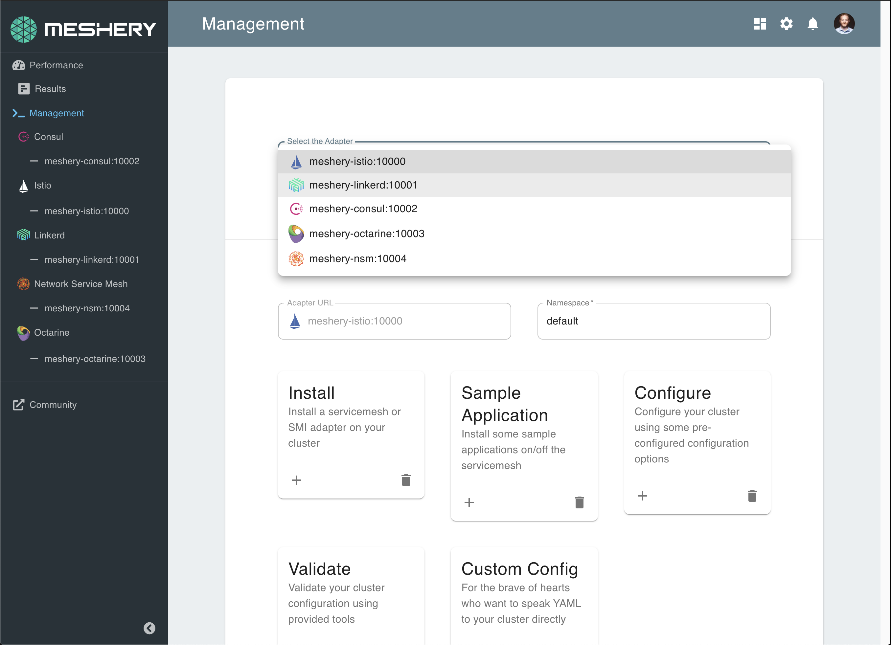

# <a name="contributing">Contributing Overview</a>

Please do! Thanks for your help in improving the project! :balloon:

---

<h3> See the complete set of contributor guides at https://docs.meshery.io/project/contributing</h3>

---

All contributors are welcome. Not sure where to start? Please see the [newcomers welcome guide](https://docs.google.com/document/d/17OPtDE_rdnPQxmk2Kauhm3GwXF1R5dZ3Cj8qZLKdo5E/edit) for how, where, and why to contribute. This project is community-built and welcomes collaboration. Contributors are expected to adhere to our [Code of Conduct](CODE_OF_CONDUCT.md).

All set to contribute? Grab an open issue with the [help-wanted label](../../labels/help%20wanted) and jump in. Join our [Slack channel](http://slack.layer5.io) and engage in conversation. Create a [new issue](/../../issues/new/choose) if needed. All [pull requests](/../../pulls) should ideally reference an open [issue](/../../issues). Include keywords in your pull request descriptions, as well as commit messages, to [automatically close related issues in GitHub](https://help.github.com/en/github/managing-your-work-on-github/closing-issues-using-keywords).

**Sections**

- <a name="contributing">General Contribution Flow</a>
  - <a href="#commit-signing">Developer Certificate of Origin</a>
- Meshery Contribution Flow
  - <a href="#contributing-docs">Meshery Documentation</a>
  - <a href="#contributing-meshery">Meshery Backend</a>
    - <a href="#adapter">Writing a Meshery Adapter</a>
  - <a href="#contributing-ui">Meshery UI</a>
    Relevant coding style guidelines are the Go Code Review Comments and the Formatting and style section of Peter Bourgon's Go: Best Practices for Production Environments.
  - <a href="#contributing-mesheryctl">Mesheryctl Documentation</a>
    - <a href="https://docs.google.com/spreadsheets/d/1q63sIGAuCnIeDs8PeM-0BAkNj8BBgPUXhLbe1Y-318o/edit#gid=0">Command Reference and Tracker</a>

# <a name="contributing">General Contribution Flow</a>

To contribute to Meshery, please follow the fork-and-pull request workflow described [here](docs/CONTRIBUTING-gitflow.md).

## <a name="commit-signing">Signing-off on Commits (Developer Certificate of Origin)</a>

To contribute to this project, you must agree to the Developer Certificate of
Origin (DCO) for each commit you make. The DCO is a simple statement that you,
as a contributor, have the legal right to make the contribution.

See the [DCO](https://developercertificate.org) file for the full text of what you must agree to
and how it works [here](https://github.com/probot/dco#how-it-works).
To signify that you agree to the DCO for contributions, you simply add a line to each of your
git commit messages:

```
Signed-off-by: Jane Smith <jane.smith@example.com>
```

In most cases, you can add this signoff to your commit automatically with the
`-s` or `--signoff` flag to `git commit`. You must use your real name and a reachable email
address (sorry, no pseudonyms or anonymous contributions). An example of signing off on a commit:

```
$ commit -s -m “my commit message w/signoff”
```

To ensure all your commits are signed, you may choose to add this alias to your global `.gitconfig`:

_~/.gitconfig_

```
[alias]
  amend = commit -s --amend
  cm = commit -s -m
  commit = commit -s
```

Or you may configure your IDE, for example, Visual Studio Code to automatically sign-off commits for you:

<a href="https://user-images.githubusercontent.com/7570704/64490167-98906400-d25a-11e9-8b8a-5f465b854d49.png" ><a>

## <a name="contributing-docs">Documentation Contribution Flow</a>

Please contribute! Meshery documentation uses GitHub Pages to host the docs site. Learn more about [Meshery's documentation framework](https://docs.google.com/document/d/17guuaxb0xsfutBCzyj2CT6OZiFnMu9w4PzoILXhRXSo/edit?usp=sharing). The process of contributing follows this flow:

1. Create a fork, if you have not already, by following the steps described [here](docs/CONTRIBUTING-gitflow.md)
1. In the local copy of your fork, navigate to the docs folder.
   `cd docs`
1. Create and checkout a new branch to make changes within
   `git checkout -b <my-changes>`
1. Edit/add documentation.
   `vi <specific page>.md`
1. Run site locally to preview changes.
   `make docs`

- **Note:** _From the Makefile, this command is actually running `$ bundle exec jekyll serve --drafts --livereload --config _config_dev.yml`. If this command causes errors try running the server without Livereload with this command: `$ bundle exec jekyll serve --drafts --config _config_dev.yml`. Just keep in mind you will have to manually restart the server to reflect any changes made without Livereload. There are two Jekyll configuration, `jekyll serve` for developing locally and `jekyll build` when you need to generate the site artefacts for production._

1. Commit, [sign-off](#commit-signing), and push changes to your remote branch.
   `git push origin <my-changes>`
1. Open a pull request (in your web browser) against our main repo: https://github.com/meshery/meshery.

## <a name="contributing-meshery">Meshery Contribution Flow</a>

Meshery is written in `Go` (Golang) and leverages Go Modules. UI is built on React and Next.js. To make building and packaging easier a `Makefile` is included in the main repository folder.

Relevant coding style guidelines are the [Go Code Review Comments](https://code.google.com/p/go-wiki/wiki/CodeReviewComments) and the _Formatting and style_ section of Peter Bourgon's [Go: Best
Practices for Production Environments](https://peter.bourgon.org/go-in-production/#formatting-and-style).

**Please note**: All `make` commands should be run in a terminal from within the Meshery's main folder.

### Prerequisites for building Meshery in your development environment:

1. `Go` version 1.15+ installed if you want to build and/or make changes to the existing code.
1. `GOPATH` environment variable should be configured appropriately
1. `npm` and `node` should be installed on your machine, preferably the latest versions.
1. Fork this repository (`git clone https://github.com/meshery/meshery.git`), clone your forked version of Meshery to your local, preferably outside `GOPATH`.
1. `golangci-lint` should be installed if you want to test Go code, for MacOS and linux users.

#### Build and run Meshery Server

Before you can access the Meshery UI, you need to install the UI dependencies,

```sh
make ui-setup
```

and then build and export the UI

```sh
make ui
```

To build & run Meshery Server, run the following command:

```sh
make server
```

Any time changes are made to the Go code, you will have to stop the server and run the above command again.
Once the Meshery server is up and running, you should be able to access Meshery on your `localhost` on port `9081` at `http://localhost:9081`.

To access the [Meshery UI Development Server](#ui-development-server) on port `3000`, you will need to select your **Cloud Provider** by navigating to `localhost:9081` after running the Meshery server.

**Please note**: When running `make server` on the macOS platform, some may face errors with the crypto module in Go. This is caused due to invalid C headers in Clang installed with XCode platform tools. Replacing Clang with gcc by adding `export CC=gcc` to .bashrc / .zshrc should fix the issue. More information on the issue can be found [here](https://github.com/golang/go/issues/30072)

#### Tests

Users can now test their code changes on their local machine against the CI checks implemented through golang-ci lint.

To test code changes on your local machine, run the following command:

```
make golangci-run
```

#### Building Docker image

To build a Docker image of Meshery, please ensure you have `Docker` installed to be able to build the image. Now, run the following command to build the Docker image:

```sh
make docker
```

#### <a name="adapter">Writing a Meshery Adapter</a>

Meshery uses adapters to provision and interact with different service meshes. Follow these instructions to create a new adapter or modify and existing adapter.

1. Get the proto buf spec file from Meshery repo:
   `wget https://raw.githubusercontent.com/meshery/meshery/master/server/meshes/meshops.proto`
1. Generate code
   1. Using Go as an example, do the following:
      - adding GOPATH to PATH: `export PATH=$PATH:$GOPATH/bin`
      - install grpc: `go get -u google.golang.org/grpc`
      - install protoc plugin for go: `go get -u github.com/golang/protobuf/protoc-gen-go`
      - Generate Go code: `protoc -I meshes/ meshes/meshops.proto --go_out=plugins=grpc:./meshes/`
   1. For other languages, please refer to gRPC.io for language-specific guides.
1. Implement the service methods and expose the gRPC server on a port of your choice (e.g. 10000).

_Tip:_ The [Meshery adapter for Istio](https://github.com/meshery/meshery-istio) is a good reference adapter to use as an example of a Meshery adapter written in Go.

#### <a name="meshery-istio">Running Meshery Adapter (Meshery-Istio)</a>

**Meshery-Istio** is a pre-written example of Meshery Adapter written in Go. Follow these instructions to run meshery-istio to avoid errors related to Meshery Adapters

1. Fork [Meshery-Istio](https://github.com/meshery/meshery-istio)
2. Clone your fork locally
3. Run this command from the root directory of **meshery-istio**
   ```sh
   make run
   ```
4. Try connecting to port 10000 as Meshery Adapter URL

## <a name="contributing-ui">UI Contribution Flow</a>

Meshery is written in `Go` (Golang) and leverages Go Modules. UI is built on React, Billboard.js and Next.js. To make building and packaging easier a `Makefile` is included in the main repository folder.



### Install UI dependencies

To install/update the UI dependencies:

```
make setup-ui-libs
```

### Build and export UI

To build and export the UI code:

```
make build-ui
```

Now that the UI code is built, Meshery UI will be available at `http://localhost:9081`.
Any time changes are made to the UI code, the above code will have to run to rebuild the UI.

### UI Development Server

If you want to work on the UI, it will be a good idea to use the included UI development server. You can run the UI development server by running the following command:

```
make run-ui-dev
```

Once you have the server configured, and running successfully on the default port `http://localhost:9081`, you may proceed to access the Meshery UI at `http://localhost:3000`.
Any UI changes made now will automatically be recompiled and served in the browser.

### Running Meshery from IDE

If you want to run Meshery from IDE like Goland, VSCode. set below environment variable

```
PROVIDER_BASE_URLS="https://meshery.layer5.io"
PORT=9081
DEBUG=true
ADAPTER_URLS=localhost:10000 localhost:10001 localhost:10002 localhost:10003 localhost:10004 localhost:10005 localhost:10006 localhost:10007 localhost:10008 localhost:10009
```

go tool argument

```shell
-tags draft
```

### UI Lint Rules

We are using ES-Lint to maintain code quality & consistency in our UI Code. To make sure your PR passes all the UI & ES-Lint Tests, please see below :

- Remember to run `make ui-lint` & `make ui-provider-lint` if you are making changes in Meshery-UI & Provider-UI respectively.
- The above commands will only fix some basic indenting rules. You will have to manually check your code to ensure there are no duplications, un-used variables or un-declared constants.
- We will soon be adding Pre-Commit Hooks to make sure you get to know your errors before you commit the code.
- In case you are unable to fix your lint errors, ping us on our [Slack](http://slack.layer5.io).

## <a name="contributing-mesheryctl">Mesheryctl Documentation</a>

### mesheryctl

`mesheryctl` is the CLI client for Meshery.

### Contributing

Please refer the [Meshery Contributing Guidelines](https://docs.meshery.io/project/contributing/contributing-cli) for setting up your development environment and the [mesheryctl Command Reference and Tracker](https://docs.google.com/spreadsheets/d/1q63sIGAuCnIeDs8PeM-0BAkNj8BBgPUXhLbe1Y-318o/edit#gid=0) for current status of `mesheryctl`.

For a quick introduction to `mesheryctl`, checkout [Beginner's guide to contributing to Meshery and mesheryctl](https://youtu.be/hh_kFLZx3G4).

### Building and running `mesheryctl`

The [`/mesheryctl`](https://github.com/meshery/meshery/tree/master/mesheryctl) folder contains the complete code for `mesheryctl`.

`mesheryctl` is written in Golang or the Go Programming Language. For development use Go version 1.15+.

After making changes, run `make` in the `mesheryctl` folder to build the binary. You can then use the binary by, say, `./mesheryctl system start`.

### `mesheryctl` command reference

- See user-facing, documentation of the `mesheryctl` commands is available in the [Meshery Docs](https://docs.meshery.io/reference/mesheryctl).
- See contributor-facing design spec for [Meshery CLI Commands and Documentation](https://docs.google.com/document/d/1xRlFpElRmybJ3WacgPKXgCSiQ2poJl3iCCV1dAalf0k/edit#heading=h.5fucij4hc5wt) for a complete reference of `mesheryctl`.

### General guidelines and resources

`mesheryctl` might be the interface that the users first have with Meshery. As such, `mesheryctl` needs to provide a great UX.

The following principles should be taken in mind while designing `mesheryctl` commands-

1. Provide user experiences that are familiar.
2. Make the commands and their behavior intuitive.
3. Avoid long commands with chained series of flags.
4. Design with automated testing in mind, e.g. provide possibility to specify output format as json (-o json) for easy inspection of command response.

Part of delivering a great user experience is providing intuitive interfaces. In the case of `mesheryctl`, we should take inspiration from and deliver similar user experiences as popular CLIs do in this ecosystem, like `kubectl` and `docker`. Here is relevant `kubectl` information to reference - [Kubectl SIG CLI Community Meeting Minutes](https://docs.google.com/document/u/2/d/1r0YElcXt6G5mOWxwZiXgGu_X6he3F--wKwg-9UBc29I/edit#), [contributing to kubectl](https://github.com/kubernetes/community/blob/master/sig-cli/CONTRIBUTING.md), [code](https://github.com/kubernetes/kubernetes/tree/master/pkg/kubectl/cmd/config).

`mesheryctl` uses the [Cobra](https://github.com/spf13/cobra) framework. A good first-step towards contributing to `mesheryctl` would be to familiarise yourself with the [Cobra concepts](https://github.com/spf13/cobra#concepts).

For manipulating config files, `mesheryctl` uses [Viper](https://github.com/spf13/viper).

A central `struct` is maintained in the `mesheryctl/internal/cli/root/config/config.go` file. These are updated and should be used for getting the Meshery configuration.

For logs, `mesheryctl` uses [Logrus](https://github.com/sirupsen/logrus). Going through the docs and understanding the different [log-levels](https://github.com/sirupsen/logrus#level-logging) will help a lot.

`mesheryctl` uses [golangci-lint](https://github.com/golangci/golangci-lint). Refer it for lint checks.

All contributors are invited to review [pull requests](https://github.com/meshery/meshery/pulls) on `mesheryctl` as on other Layer5 projects.

# <a name="maintaining"> Reviews</a>

All contributors are invited to review pull requests. See this short video on [how to review a pull request](https://www.youtube.com/watch?v=isLfo7jfE6g&feature=youtu.be).

# New to Git?

Resources: https://lab.github.com and https://try.github.com/

### License

This repository and site are available as open-source under the terms of the [Apache 2.0 License](https://opensource.org/licenses/Apache-2.0).
