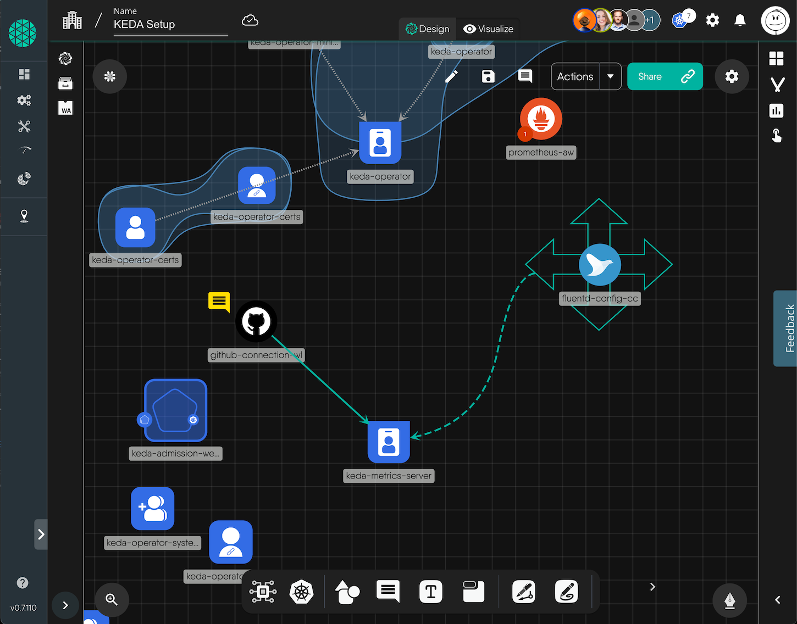
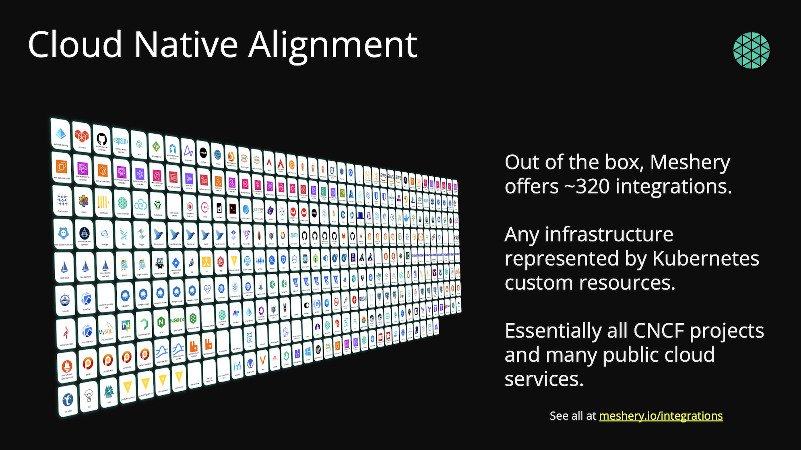
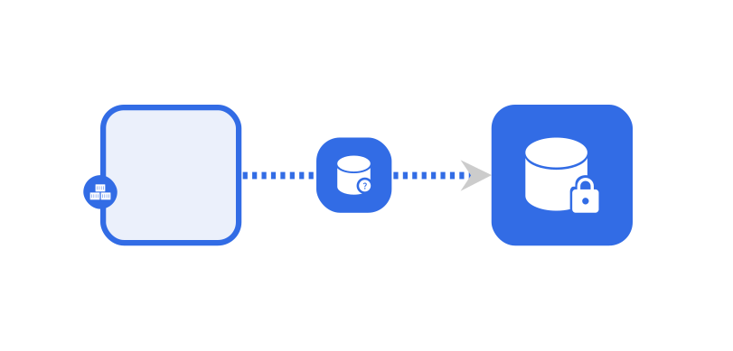
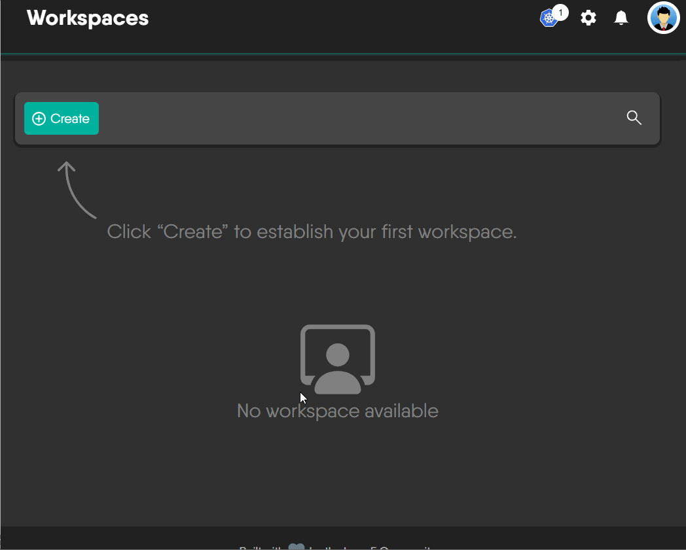
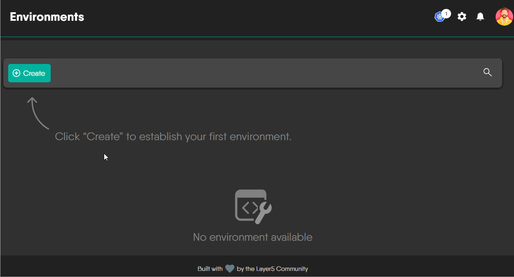
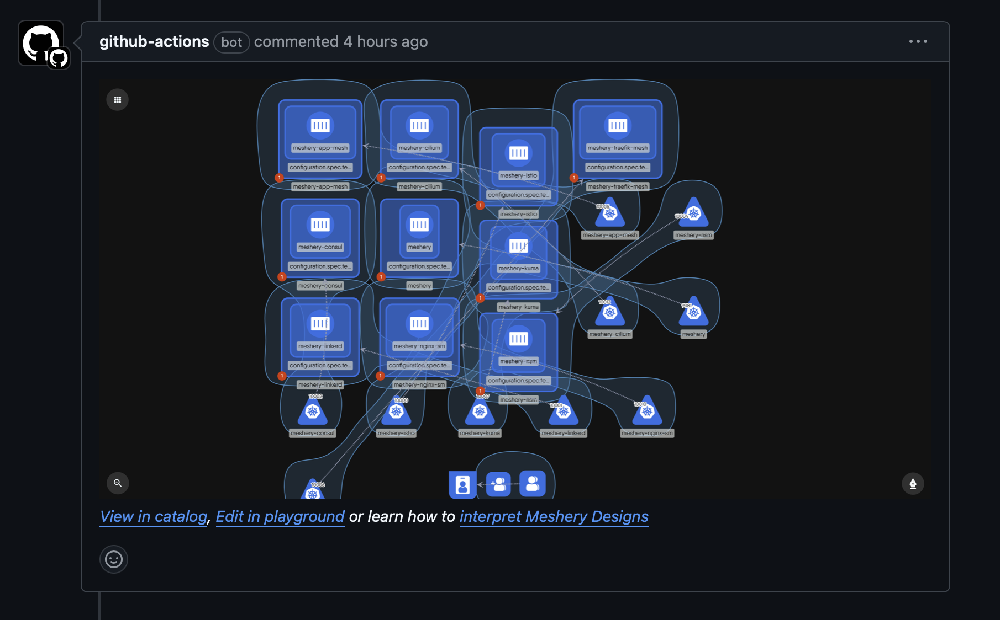
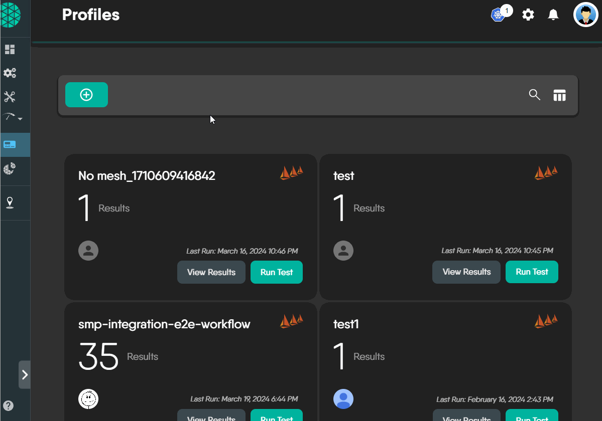
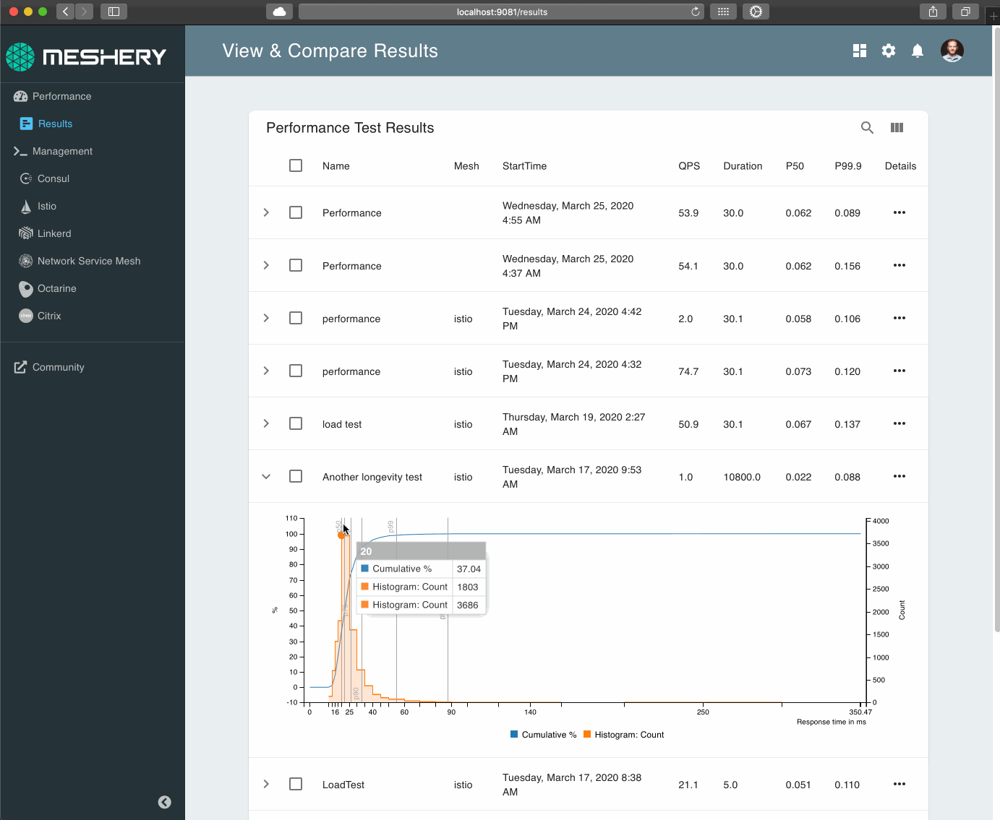

<a href="https://meshery.io"><picture>
 <source media="(prefers-color-scheme: dark)" srcset="https://raw.githubusercontent.com/meshery/meshery/master/.github/assets/images/readme/meshery-logo-light-text-side.svg">
 <source media="(prefers-color-scheme: light)" srcset="https://raw.githubusercontent.com/meshery/meshery/master/.github/assets/images/readme/meshery-logo-dark-text-side.svg">
</picture></a>  

  

  

<!--   
  -->

<h5>
<i>If you like Meshery, please <a href="https://github.com/meshery/meshery/stargazers">★</a> this repository to show your support! 🤩</i>
</h5>

MESHERY IS A CLOUD NATIVE COMPUTING FOUNDATION PROJECT

 

A self-service engineering platform, <a href="https://meshery.io">Meshery</a>, is the open source, cloud native manager that enables the design and management of all Kubernetes-based infrastructure and applications (multi-cloud). Among other features,  As an extensible platform, Meshery offers visual and collaborative GitOps, freeing you from the chains of YAML while managing Kubernetes multi-cluster deployments.

 

 
 
<i>Example extension. See other <a href="https://meshery.io/extensions">Meshery Extensions</a>.</i>

  Try Meshery in your browser using the <a href="https://play.meshery.io">Cloud Native Playground</a> (<a href="https://www.youtube.com/watch?v=034nVaQUyME&list=PL3A-A6hPO2IO_yzN83wSJJUNQActzCJvO&index=9">teaser video</a>)

 
<!--
- [Functionality](#functionality)
  - [Meshery Architecture](#meshery-architecture)
  - [Join the Meshery community!](#join-the-meshery-community)
  - [Contributing](#contributing)
    - [Stargazers](#stargazers)
    - [License](#license)
-->
<!-- 
&nbsp;

<a href="https://meshery.io"><picture>
  <source media="(prefers-color-scheme: dark)" srcset="https://raw.githubusercontent.com/meshery/meshery/master/.github/assets/images/readme/meshery-logo-light-text-side.svg">
  <source media="(prefers-color-scheme: light)" srcset="https://raw.githubusercontent.com/meshery/meshery/master/.github/assets/images/readme/meshery-logo-dark-text-side.svg">
  
  </picture></a> 
<a href="https://meshery.io">
<h3 style="margin:auto;">  
  <a href="https://docs.google.com/presentation/d/14kxjwYSJ_FyE3K_6CDEd6oq2kqwn0OSE8RDJ4H-KlKU/edit?usp=sharing">
<i>Project Overview Presentation</i>
</a>
     
</h3> -->

&nbsp;

# Functionality

## Infrastructure Lifecycle Management

Meshery manages the configuration, deployment, and operation of your Cloud services and Kubernetes clusters while supporting hundreds of different types of cloud native infrastructure integrations. Meshery supports [300+ integrations](https//meshery.io/integrations).

<!--

  -->

Find infrastructure configuration patterns in Meshery's <a href="https://meshery.io/catalog">catalog of curated design templates</a> filled with configuration best practices.

## Multiple Kubernetes Clusters and Multiple Clouds

 

Meshery provides a single pane of glass to manage multiple Kubernetes clusters across any infrastructure, including various cloud providers. Meshery enables consistent configuration, operation, and observability across your entire Kubernetes landscape.

<h4>Dry-run your deployments</h4>

Meshery leverages Kubernetes' built-in dry-run capabilities to allow you to simulate deployments without actually applying the changes to your cluster. This enables you to:

- Validate configurations: Ensure your deployment specifications (e.g., YAML manifests, Helm charts, Meshery Designs) are syntactically correct and will be accepted by the Kubernetes API server.   
- Identify potential issues: Detect errors in your configurations, such as invalid resource definitions, missing fields, or API version mismatches, before they impact your live environment.
- Preview changes: Understand the objects that Kubernetes would create or modify during a real deployment.
- Integrate with CI/CD: Incorporate dry-run as a step in your continuous integration and continuous delivery pipelines to automate pre-deployment checks and prevent faulty deployments.

By providing this dry-run functionality, Meshery helps you increase the reliability and stability of your Kubernetes deployments by catching potential problems early in the development and deployment process.
<!-- 
Assess your cloud native infrastructure configuration against deployment and operational best practices with Meshery's configuration validator. Manage your workloads with confidence. Check your Kubernetes configuration for anti-patterns and avoid common pitfalls. -->

### Visually and collaboratively manage your infrastructure

Using a GitOps-centric approach, visually and collaboratively design and manage your infrastructure and microservices. Meshery intelligently infers the manner in which each resource [interrelates](https://docs.meshery.io/concepts/logical/relationships) with each other. Meshery supports a broad variety of built-in relationships between components, which you can use to create your own custom relationships.

<h4>Context-Aware Policies For Applications</h4>

Leverage built-in relationships to enforce configuration best practices consistently from code to Kubernetes. Customize Configure your infrastructure with confidence without needing to know or write Open Policy Agent's Rego query language.

## Workspaces: Your team's Google Drive for cloud native projects

Workspaces let you organize your work and serve as the central point of collaboration for you and your teams and point of access control to Environments and their resources.

<h4>Manage your connections with Environments</h4>

<a href="https://docs.meshery.io/concepts/logical/environments">Environments</a>  make it easier for you to manage, share, and work with a collection of resources as a group, instead of dealing with all your Connections and Credentials on an individual basis.

<h4>See changes to your infra before you merge</h4>

Get snapshots of your infrastructure directly in your PRs. Preview your deployment, view changes pull request-to-pull request and get infrastructure snapshots within your PRs by connecting Kanvas to your GitHub repositories.

<!-- <h3>Operate with configuration best practices</h3>
  

Assess your configurations against deployment and operational best practices with Meshery's configuration validator.

  

<h3>Control all of your infrastructure with mesheryctl</h3>
  

Whether managing multiple Meshery deployments, importing designs, discoverying Kubernetes clusters, do so with ease using Meshery CLI in your terminal.

   -->

## Platform Engineering with Meshery's Extension Points

Extend Meshery as your self-service engineering platform by taking advantage of its [vast set of extensibility features](https://docs.meshery.io/extensibility), including gRPC adapters, hot-loadable Reactjs packages and Golang plugins, subscriptions on NATS topics, consumable _and_ extendable API interfaces via REST and GraphQL.The great number of extension points in Meshery make it ideal as the foundation of your internal developer platform.

<h4>Access the Cloud Native Patterns for Kubernetes</h4>

Design and manage all of your cloud native infrastructure using the design configurator in Meshery or start from a template using the patterns from the <a href="https://meshery.io/catalog">catalog</a>.

Meshery offers robust capabilities for managing multiple tenants within a shared Kubernetes infrastructure. Meshery provides the tools and integrations necessary to create a secure, isolated, and manageable multi-tenant environments, allowing multiple teams or organizations with granular control over their role-based access controls.

Meshery's "multi-player" functionality refers to its collaborative features that enable multiple users to interact with and manage cloud native infrastructure simultaneously. This is primarily facilitated through Kanvas, a Meshery extension visual designer and management interface.

## Performance Management

Meshery offers load generation and performance characterization to help you assess and optimize the performance of your applications and infrastructure.

Create and reuse performance profiles for consistent characterization of the configuration of your infrastructure in context of how it performs.

<h4> Manage the performance of your infrastructure and its workloads</h4>

Baseline and track your cloud native performance from release to release.

- Use performance profiles to track the historical performance of your workloads.
- Track your application performance from version to version.
- Understand behavioral differences between cloud native network functions.
- Compare performance across infrastructure deployments.

<h4>Load Generation and Microservice Performance Characteristization</h4>

<picture align="left">
  <source media="(prefers-color-scheme: dark)" srcset="https://raw.githubusercontent.com/layer5io/layer5/master/src/assets/images/service-mesh-performance/stacked/smp-light-text.svg"  width="18%" align="left" style="margin-left:10px;" />
  
</picture>

- **Multiple Load Generators:** Meshery supports various load generators, including Fortio, Wrk2, and Nighthawk, allowing users to choose the tool that best suits your needs.
- **Configurable Performance Profiles:** Meshery provides a highly configurable set of load profiles with tunable facets, enabling users to generate TCP, gRPC, and HTTP load. You can customize parameters such as duration, concurrent threads, concurrent generators, and load generator type. 
- **Statistical Analysis:** Meshery performs statistical analysis on the results of performance tests, presenting data in the form of histograms with latency buckets. Understand the distribution of response times and identify potential bottlenecks.
- **Comparison of Test Results:** Meshery enables you to compare the difference in request performance (latency and throughput) between independent performance tests. Save your load test configurations as Performance Profiles, making it easy to rerun tests with the same settings and track performance variations over time.
- **Kubernetes Cluster and Workload Metrics:** - Meshery connects to one or more Prometheus servers to gather both cluster and application metrics. Meshery also integrates with Grafana, allowing you to import your existing dashboards and visualize performance data.

In an effort to produce infrastructure agnostic tooling, Meshery uses the <a href="https://smp-spec.io">Cloud Native Performance</a> specification as a common format to capture and measure your infrastructure's performance against a universal cloud native performance index. Meshery participates in advancing cloud native infrastructure adoption through the standardization of APIs. Meshery enables you to measure the value provided by Docker, Kubernetes, or other cloud native infrastructure in the context of the overhead incurred.

<!-- 

SCREENSHOT / GIF NEEDED HERE

-->

<h2>Get Started with Meshery</h2>

<!--  -->
<h3>Using `mesheryctl`</h3>

Meshery runs as a set of containers inside or outside of your Kubernetes clusters.

<pre>curl -L https://meshery.io/install | bash -</pre>

Use the <a href="https://docs.meshery.io/installation/quick-start">quick start</a> guide.

  
<strong>See all supported platforms</strong>

See the [getting started](https://meshery.io/#getting-started) section to quickly deploy Meshery on any of these supported platforms:

| Platform                                                                                                                                                                                                                             | Supported?  |
| ------------------------------------------------------------------------------------------------------------------------------------------------------------------------------------------------------------------------------------ | :---------: |
|  [Docker](https://docs.meshery.io/installation/docker)                                                           |      ✔️      |
| &nbsp;&nbsp;&nbsp;  [Docker - Docker App](https://docs.meshery.io/installation/docker)                           |      ✔️      |
| &nbsp;&nbsp;&nbsp;  [Docker - Docker Extension](https://docs.meshery.io/installation/docker/docker-extensiongit) |      ✔️      |
|  [Kubernetes](https://docs.meshery.io/installation/kubernetes)                                               |      ✔️      |
| &nbsp;&nbsp;&nbsp;  [Kubernetes - AKS](https://docs.meshery.io/installation/kubernetes/aks)                         |      ✔️      |
| &nbsp;&nbsp;&nbsp;  [Kubernetes - Docker Desktop](https://docs.meshery.io/installation#mac-or-linux)             |      ✔️      |
| &nbsp;&nbsp;&nbsp;  [Kubernetes - EKS](https://docs.meshery.io/installation/kubernetes/eks)                         |      ✔️      |
| &nbsp;&nbsp;&nbsp;  [Kubernetes - GKE](https://docs.meshery.io/installation/kubernetes/gke)                         |      ✔️      |
| &nbsp;&nbsp;&nbsp;  [Kubernetes - Helm](https://docs.meshery.io/installation/kubernetes/helm)                      |      ✔️      |
| &nbsp;&nbsp;&nbsp;  [Kubernetes - kind](https://docs.meshery.io/installation/kubernetes/kind)                      |      ✔️      |
| &nbsp;&nbsp;&nbsp;  [Kubernetes - Minikube](https://docs.meshery.io/installation/kubernetes/minikube)          |      ✔️      |
| &nbsp;&nbsp;&nbsp;  [Kubernetes - OpenShift](https://docs.meshery.io/installation/kubernetes)                      |      ✔️      |
| &nbsp;&nbsp;&nbsp;  [Kubernetes - Rancher](https://docs.meshery.io/installation/kubernetes)                      |      ✔️      |
|  [Linux](https://docs.meshery.io/installation#mac-or-linux)                                                       |      ✔️      |
|  [Mac](https://docs.meshery.io/installation#mac-or-linux)                                                         |      ✔️      |
| &nbsp;&nbsp;&nbsp;  [Mac - Homebrew](https://docs.meshery.io/installation#mac-or-linux)                        |      ✔️      |
|  [Windows](https://docs.meshery.io/installation#windows)                                                           |      ✔️      |
| &nbsp;&nbsp;&nbsp;  [Scoop](https://docs.meshery.io/installation#windows)                                                                                                                                                             |      ✔️      |
| &nbsp;&nbsp;&nbsp;  [WSL2](https://docs.meshery.io/installation/platforms/windows#wsl2)                            |      ✔️      |
|  Raspberry Pi                                                                                              | In Progress |

[Meshery documentation](https://docs.meshery.io/installation) offers thorough installation guides for your platform of choice.
 

&nbsp;

&nbsp;

## Join the Meshery community

Our projects are community-built and welcome collaboration. 👍 Be sure to see the <a href="https://layer5.io/community/newcomers">Contributor Journey Map</a> and <a href="https://meshery.io/community#handbook">Community Handbook</a> for a tour of resources available to you and the <a href="https://layer5.io/community/handbook/repository-overview">Repository Overview</a> for a cursory description of repository by technology and programming language. Jump into community <a href="https://slack.meshery.io">Slack</a> or <a href="https://meshery.io/community#discussion-forums">discussion forum</a> to participate.

<h3>Find your MeshMate</h3>

MeshMates are experienced Layer5 community members, who will help you learn your way around, discover live projects, and expand your community network. Connect with a Meshmate today!

Learn more about the <a href="https://meshery.io/community#meshmates">MeshMates</a> program.  

  

✔️ <em><strong>Join</strong></em> any or all of the weekly meetings on <a href="https://meshery.io/calendar">community calendar</a>. 
✔️ <em><strong>Watch</strong></em> community <a href="https://www.youtube.com/@mesheryio?sub_confirmation=1">meeting recordings</a>. 
✔️ <em><strong>Fill-in</strong></em> a <a href="https://meshery.io/newcomers">member form</a> and gain access to community resources.
 
✔️ <em><strong>Discuss</strong></em> in the <a href="https://meshery.io/community#discussion-forums">community forum</a>. 
✔️ <em><strong>Explore more</strong></em> in the <a href="https://meshery.io/community#handbook">community handbook</a>. 

  

<a href="https://slack.meshery.io">
<picture>
  <source media="(prefers-color-scheme: dark)" srcset="https://raw.githubusercontent.com/meshery/meshery/master/.github/assets/images/readme/slack.svg"  width="110px" />
  <source media="(prefers-color-scheme: light)" srcset="https://raw.githubusercontent.com/meshery/meshery/master/.github/assets/images/readme/slack.svg" width="110px" />
  
</picture>
</a>

  

&nbsp;&nbsp;&nbsp;&nbsp; <i>Not sure where to start?</i> Grab an open issue with the <a href="https://github.com/issues?q=is%3Aopen%20is%3Aissue%20archived%3Afalse%20(org%3Alayer5io%20OR%20org%3Ameshery%20OR%20org%3Alayer5labs%20OR%20org%3Aservice-mesh-performance%20OR%20org%3Aservice-mesh-patterns%20OR%20org%3Ameshery-extensions)%20label%3A%22help%20wanted%22%20">help-wanted label</a>.

  

&nbsp;

## Contributing

Please do! We're a warm and welcoming community of open source contributors. Please join. All types of contributions are welcome. Be sure to read the [Contributor Guides](https://docs.meshery.io/project/contributing) for a tour of resources available to you and how to get started.

<!--  -->

&nbsp;

### Stargazers

  <i>If you like Meshery, please <a href="../../stargazers">★</a> star this repository to show your support! 🤩</i>
  

### License

This repository and site are available as open-source under the terms of the [Apache 2.0 License](https://opensource.org/licenses/Apache-2.0).

<!--### Community

See an <a href="https://layer5.io/community/handbook/repository-overview">overview of repositories</a> and projects by tech stack in the <a href="https://meshery.io/community#handbook/">Community Handbook</a>.

## See Meshery in Action

- [DockerCon 2020](https://docker.events.cube365.net/docker/dockercon/content/Videos/63TCCNpzDC7Xxnm8b) | ([video](https://www.youtube.com/watch?v=5BrbbKZOctw&list=PL3A-A6hPO2IN_HSU0pSfijBboiHggs5mC&index=4&t=0s), [deck](https://calcotestudios.com/talks/decks/slides-dockercon-2020-service-meshing-with-docker-desktop-and-webassembly.html))
- [Deploying Linkerd with Meshery](https://youtu.be/MXQV-i-Hkf8)
- [KubeCon EU 2019](https://kccnceu19.sched.com/event/MPf7/service-meshes-at-what-cost-lee-calcote-layer5-girish-ranganathan-solarwinds?iframe=no&w=100%&sidebar=yes&bg=no) | ([video](https://www.youtube.com/watch?v=LxP-yHrKL4M&list=PLYjO73_1efChX9NuRaU7WocTbgrfvCoPE), [deck](https://calcotestudios.com/talks/decks/slides-kubecon-eu-2019-service-meshes-at-what-cost.html))
- Istio Founders Meetup @ KubeCon EU 2019 | [deck](https://calcotestudios.com/talks/decks/slides-istio-meetup-kubecon-eu-2019-istio-at-scale-large-and-small.html)
- [Cloud Native Rejekts EU 2019](https://cfp.cloud-native.rejekts.io/cloud-native-rejekts-eu-2019/speaker/GZQTEM/) | [deck](https://calcotestudios.com/talks/decks/slides-cloud-native-rejekts-2019-evaluating-service-meshes.html)
- [DockerCon 2019 Open Source Summit](https://dockercon19.smarteventscloud.com/connect/sessionDetail.ww?SESSION_ID=309149&tclass=popup#.XJxH-TOcbjI.twitter) | [deck](https://calcotestudios.com/talks/decks/slides-dockercon-2019-establishing-an-open-source-office.html), [video](https://www.docker.com/dockercon/2019-videos?watch=open-source-summit-service-mesh)
- [Container World 2019](https://tmt.knect365.com/container-world/speakers/lee-calcote) | [deck](https://calcotestudios.com/talks/decks/slides-container-world-2019-service-meshes-but-at-what-cost.html)
- [Service Mesh Day](https://servicemeshday.com/schedule.html) | [deck](https://docs.google.com/presentation/d/1HwG03okX3DHgGKbma4PL-MO7Xr9zDrjQgd05PRi9i8E/edit?usp=sharing), [video](https://youtu.be/CFj1O_uyhhs)
- [Innotech San Antonio](https://innotechsanantonio2019.sched.com/event/Lmlb/the-enterprise-path-to-service-mesh-architectures?iframe=no&w=100%&sidebar=yes&bg=no) | [deck](https://calcotestudios.com/talks/decks/slides-innotech-san-antonio-2019-the-enterprise-path-to-service-mesh.html)
- [CNCF Networking WG](https://github.com/cncf/wg-networking) | [deck](https://www.slideshare.net/leecalcote/benchmarking-service-meshes-cncf-networking-wg-141938576), [video](https://www.youtube.com/watch?v=2_JwCc-kLMA&list=PLYjO73_1efChX9NuRaU7WocTbgrfvCoPE)
-->
