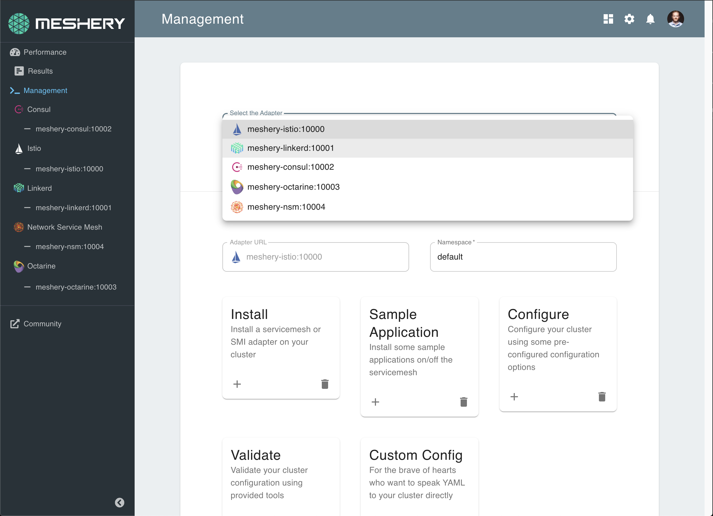

  

<i>If you’re using Meshery or if you like the project, please <a href="https://github.com/layer5io/meshery/stargazers">★</a> star this repository to show your support! 🤩</i>

[Meshery](https://meshery.io) is the multi-service mesh management plane offering lifecycle, configuration and performance management of service meshes and their workloads.

## Run Meshery

See [getting started](https://meshery.io/#getting-started) to quickly deploy Meshery on any of these supported platforms: 

| Platform | Supported? |
| --- | :---: |
| [Docker](https://meshery.layer5.io/docs/installation/docker) | ✔️ |
| - [Docker - Docker App](https://meshery.layer5.io/docs/installation/docker) | ✔️ |
| [Kubernetes](https://meshery.layer5.io/docs/installation/kubernetes) | ✔️ |
| - [Kubernetes - AKS](https://meshery.layer5.io/docs/installation/aks) | ✔️ |
| - [Kubernetes - Docker Desktop](https://meshery.layer5.io/docs/installation#mac-or-linux) | ✔️ |
| - [Kubernetes - EKS](https://meshery.layer5.io/docs/installation/eks) | ✔️ |
| - [Kubernetes - GKE](https://meshery.layer5.io/docs/installation/gke) | ✔️ |
| - [Kubernetes - Helm](https://meshery.layer5.io/docs/installation/kubernetes#helm) | ✔️ |
| - [Kubernetes - kind](https://meshery.layer5.io/docs/installation/kind) | ✔️ |
| - [Kubernetes - Minikube](https://meshery.layer5.io/docs/installation/minikube) | ✔️ |
| - Kubernetes - OpenShift | In Progress |
| [Linux](https://meshery.layer5.io/docs/installation#mac-or-linux) | ✔️ |
| [Mac](https://meshery.layer5.io/docs/installation#mac-or-linux) | ✔️ |
| - [Mac - Homebrew](https://meshery.layer5.io/docs/installation#mac-or-linux) | ✔️ |
| [Windows](https://meshery.layer5.io/docs/installation#windows) | ✔️ |
| - [Scoop](https://meshery.layer5.io/docs/installation#windows) | ✔️ |
| - [WSL2](https://meshery.layer5.io/docs/installation/wsl2) | ✔️ |
| Raspberry Pi | In Progress |

[Meshery documentation](https://meshery.layer5.io/docs/installation) offers full installation procedures for your platform of choice.

## Supported Service Meshes

  

    
Service mesh adapters provision, configure, and manage their respective service meshes.
      <table class="adapters">
        <thead style="display:none;">
          <th>Status</th>
          <th>Adapter</th>
        </thead>
        <tbody>
        <tr>
          <td rowspan="7" class="stable-adapters">stable</td>
        </tr>
        <tr>
          <td><a href="https://github.com/layer5io/meshery-istio">
             Meshery adapter for Istio</a> 
          </td>
        </tr>
        <tr>
          <td><a href="https://github.com/layer5io/meshery-linkerd">
             Meshery adapter for Linkerd</a> 
          </td>
        </tr>
        <tr>
          <td><a href="https://github.com/layer5io/meshery-consul">
             Meshery adapter for Consul</a>
          </td>
        </tr>
        <tr>
          <td><a href="https://github.com/layer5io/meshery-octarine">
            Meshery adapter for Octarine</a> 
          </td>
        </tr>
        <tr>
          <td><a href="https://github.com/layer5io/meshery-nsm">
            Meshery adapter for Network Service Mesh</a>
          </td>
        </tr>
        <tr><td class="stable-adapters"></td></tr>
        <tr>
          <td rowspan="2" class="beta-adapters">beta</td>
          <td><a href="https://github.com/layer5io/meshery-cpx">
            Meshery adapter for Citrix CPX</a>
          </td>
        </tr>
        <tr><td class="beta-adapters"></td></tr>
        <tr>
          <td rowspan="6" class="alpha-adapters">alpha</td>
        </tr>
        <tr>
          <td><a href="https://github.com/layer5io/meshery-maesh">
            Meshery adapter for Maesh</a>
          </td>
        </tr>
         <tr>
          <td><a href="https://github.com/layer5io/meshery-tanzu-sm">
            Meshery adapter for Tanzu SM</a>
          </td>
        </tr>
        <tr>
          <td><a href="https://github.com/layer5io/meshery-app-mesh">
            Meshery adapter for App Mesh </a>
          </td>
        </tr>
        <tr>
          <td><a href="https://github.com/layer5io/meshery-kuma">
            Meshery adapter for Kuma</a>
          </td>
        </tr><tr>
        </tr>
        <tr><td class="alpha-adapters"></td></tr>
        </tbody>
    </table>
  

## <a name="functionality">Functionality</a>

<h3>Service Mesh Lifecycle Management</h3>
Meshery manages the provisioning, configuration and operation your service mesh. While supporting different types of service meshes, Meshery also offers a simple way to explore each service mesh and compare them using bundled sample applications.

Interoperate multiple service meshes with service mesh adapters provision, configure, and manage their respective service meshes. Meshery is an implementation of Service Mesh Interface (SMI).
    

<h3>Service Mesh Configuration Management</h3>

Assess your service mesh configuration against deployment and operational best practices with Meshery's configuration validator.

Onboard your workload onto the service mesh with confidence. Check your service mesh configuration for anti-patterns and avoid common pitfalls.
    

<h3>Service Performance Management</h3>

Meshery is the service-mesh-neutral utility for uniformly managing the performance of services and the meshes that run them. As an implementation of the Service Mesh Performance Specification ([SMPS](https://layer5.io/performance)), Meshery enables you to measure the value provided by a service mesh in context of the overhead incurred.
  

&nbsp;

## Meshery Architecture
You may deploy Meshery internal to your cluster or external to your cluster.

Learn more about <a href="https://meshery.layer5.io/docs/architecture">Meshery's architecture</a>.

&nbsp;

## Join the service mesh community!

Our projects are community-built and welcome collaboration. 👍 Be sure to see the <a href="https://docs.google.com/document/d/17OPtDE_rdnPQxmk2Kauhm3GwXF1R5dZ3Cj8qZLKdo5E/edit">Layer5 Community Welcome Guide</a> for a tour of resources available to you and jump into our <a href="http://slack.layer5.io">Slack</a>!

<h3>Find your MeshMate</h3>

MeshMates are experienced Layer5 community members, who will help you learn your way around, discover live projects and expand your community network. 
Become a <b>Meshtee</b> today!

Find out more on the <a href="https://layer5.io/community#meshmate">Layer5 community</a>.  
    

✔️ <em><strong>Join</strong></em> any or all of the weekly meetings on <a href="https://calendar.google.com/calendar/b/1?cid=bGF5ZXI1LmlvX2VoMmFhOWRwZjFnNDBlbHZvYzc2MmpucGhzQGdyb3VwLmNhbGVuZGFyLmdvb2dsZS5jb20">community calendar</a>. 
✔️ <em><strong>Watch</strong></em> community <a href="https://www.youtube.com/playlist?list=PL3A-A6hPO2IMPPqVjuzgqNU5xwnFFn3n0">meeting recordings</a>. 
✔️ <em><strong>Access</strong></em> the <a href="https://drive.google.com/drive/u/4/folders/0ABH8aabN4WAKUk9PVA">community drive</a>. 

<i>Not sure where to start?</i> Grab an open issue with the <a href="https://github.com/issues?utf8=✓&q=is%3Aopen+is%3Aissue+archived%3Afalse+org%3Alayer5io+label%3A%22help+wanted%22+">help-wanted label</a>.

&nbsp;

<h2>Service Mesh Standards</h2>

In an effort to produce service mesh agnostic tooling, Meshery uses the [service mesh performance specification](https://layer5.io/performance) as a common format to capture and measure your mesh's performance against a universal service mesh performance index. As a partner of VMware's Multi-Vendor Service Mesh Interoperation (Hamlet) and Service Mesh Interface (SMI), Meshery participates in advancing service mesh adoption through standardization of APIs.

&nbsp;

## Contributing (yes!)
We're a warm and welcoming community of open source contributors. Please join. All types of contribution are welcome. Be sure to read the <a href="https://docs.google.com/document/d/17OPtDE_rdnPQxmk2Kauhm3GwXF1R5dZ3Cj8qZLKdo5E/edit">Meshery Contributors Welcome Guide</a> for a tour of resources available to you and how to get started.

- [General Contributing](CONTRIBUTING.md/#contributing)
- [Write an adapter](CONTRIBUTING.md/#adapter)
- [Build the project](CONTRIBUTING.md/#building)

&nbsp;

## See Meshery in Action
- [DockerCon 2020](https://docker.events.cube365.net/docker/dockercon/content/Videos/63TCCNpzDC7Xxnm8b) | ([video](https://www.youtube.com/watch?v=5BrbbKZOctw&list=PL3A-A6hPO2IN_HSU0pSfijBboiHggs5mC&index=4&t=0s), [deck](https://calcotestudios.com/talks/decks/slides-dockercon-2020-service-meshing-with-docker-desktop-and-webassembly.html))
- [Deploying Linkerd with Meshery](https://youtu.be/MXQV-i-Hkf8)
- [KubeCon EU 2019](https://kccnceu19.sched.com/event/MPf7/service-meshes-at-what-cost-lee-calcote-layer5-girish-ranganathan-solarwinds?iframe=no&w=100%&sidebar=yes&bg=no) | ([video](https://www.youtube.com/watch?v=LxP-yHrKL4M&list=PLYjO73_1efChX9NuRaU7WocTbgrfvCoPE), [deck](https://calcotestudios.com/talks/decks/slides-kubecon-eu-2019-service-meshes-at-what-cost.html))
- Istio Founders Meetup @ KubeCon EU 2019 | [deck](https://calcotestudios.com/talks/decks/slides-istio-meetup-kubecon-eu-2019-istio-at-scale-large-and-small.html)
- [Cloud Native Rejekts EU 2019](https://cfp.cloud-native.rejekts.io/cloud-native-rejekts-eu-2019/speaker/GZQTEM/) | [deck](https://calcotestudios.com/talks/decks/slides-cloud-native-rejekts-2019-evaluating-service-meshes.html)
- [DockerCon 2019 Open Source Summit](https://dockercon19.smarteventscloud.com/connect/sessionDetail.ww?SESSION_ID=309149&tclass=popup#.XJxH-TOcbjI.twitter) | [deck](https://calcotestudios.com/talks/decks/slides-dockercon-2019-establishing-an-open-source-office.html), [video](https://www.docker.com/dockercon/2019-videos?watch=open-source-summit-service-mesh)
- [Container World 2019](https://tmt.knect365.com/container-world/speakers/lee-calcote) | [deck](https://calcotestudios.com/talks/decks/slides-container-world-2019-service-meshes-but-at-what-cost.html)
- [Service Mesh Day](https://servicemeshday.com/schedule/) | [deck](https://docs.google.com/presentation/d/1HwG03okX3DHgGKbma4PL-MO7Xr9zDrjQgd05PRi9i8E/edit?usp=sharing), [video](https://youtu.be/CFj1O_uyhhs)
- [Innotech San Antonio](https://innotechsanantonio2019.sched.com/event/Lmlb/the-enterprise-path-to-service-mesh-architectures?iframe=no&w=100%&sidebar=yes&bg=no) | [deck](https://calcotestudios.com/talks/decks/slides-innotech-san-antonio-2019-the-enterprise-path-to-service-mesh.html)
- [CNCF Networking WG](https://github.com/cncf/wg-networking) | [deck](https://www.slideshare.net/leecalcote/benchmarking-service-meshes-cncf-networking-wg-141938576), [video](https://www.youtube.com/watch?v=2_JwCc-kLMA&list=PLYjO73_1efChX9NuRaU7WocTbgrfvCoPE)

### Stargazers

  <i>If you’re using Meshery or if you like the project, please <a href="../../stargazers">★</a> star this repository to show your support! 🤩</i>

### License

This repository and site are available as open source under the terms of the [Apache 2.0 License](https://opensource.org/licenses/Apache-2.0).

### About Layer5

**Community First**

The <a href="https://layer5.io">Layer5</a> community represents the largest collection of service mesh projects and their maintainers in the world.

**Open Source First**

Our projects establish industry standards and enable service developers, owners, and operators with repeatable patterns and best practices for managing all aspects of distributed services. Our shared commitment to the open source spirit push the Layer5 community and its projects forward.

