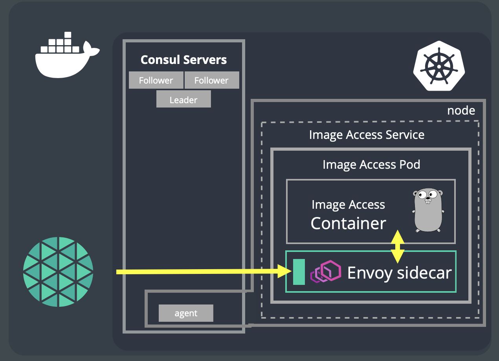
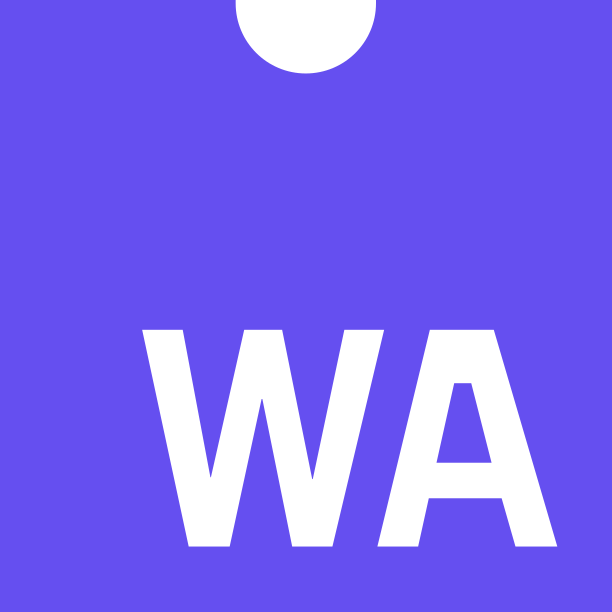

  

<h5>
<i>If you’re using Meshery or if you like the project, please <a href="https://github.com/layer5io/meshery/stargazers">★</a> this repository to show your support! 🤩</i>
</h5>

[Meshery](https://meshery.io) is the multi-service mesh management plane offering lifecycle, configuration, and performance management of service meshes and their workloads.

<h2>Run Meshery</h2>

Meshery runs as a set of containers inside or outside of your Kubernetes cluster.

  
<strong>See all Supported Platforms</strong>

See the [getting started](https://meshery.io/#getting-started) section to quickly deploy Meshery on any of these supported platforms:

| Platform                                                                                                                                                                                                                        | Supported?  |
| ------------------------------------------------------------------------------------------------------------------------------------------------------------------------------------------------------------------------------- | :---------: |
|  [Docker](https://docs.meshery.io/installation/platforms/docker)                                            |     ✔️      |
| &nbsp;&nbsp;&nbsp;  [Docker - Docker App](https://docs.meshery.io/installation/platforms/docker)            |     ✔️      |
|  [Kubernetes](https://docs.meshery.io/installation/platforms/kubernetes)                                |     ✔️      |
| &nbsp;&nbsp;&nbsp;  [Kubernetes - AKS](https://docs.meshery.io/installation/platforms/aks)                     |     ✔️      |
| &nbsp;&nbsp;&nbsp;  [Kubernetes - Docker Desktop](https://docs.meshery.io/installation#mac-or-linux)        |     ✔️      |
| &nbsp;&nbsp;&nbsp;  [Kubernetes - EKS](https://docs.meshery.io/installation/platforms/eks)                     |     ✔️      |
| &nbsp;&nbsp;&nbsp;  [Kubernetes - GKE](https://docs.meshery.io/installation/platforms/gke)                     |     ✔️      |
| &nbsp;&nbsp;&nbsp;  [Kubernetes - Helm](https://docs.meshery.io/installation/platforms/kubernetes#using-helm) |     ✔️      |
| &nbsp;&nbsp;&nbsp;  [Kubernetes - kind](https://docs.meshery.io/installation/platforms/kind)                  |     ✔️      |
| &nbsp;&nbsp;&nbsp;  [Kubernetes - Minikube](https://docs.meshery.io/installation/platforms/minikube)      |     ✔️      |
| &nbsp;&nbsp;&nbsp;  Kubernetes - OpenShift                                                               | In Progress |
|  [Linux](https://docs.meshery.io/installation#mac-or-linux)                                                  |     ✔️      |
|  [Mac](https://docs.meshery.io/installation#mac-or-linux)                                                    |     ✔️      |
| &nbsp;&nbsp;&nbsp;  [Mac - Homebrew](https://docs.meshery.io/installation#mac-or-linux)                   |     ✔️      |
|  [Windows](https://docs.meshery.io/installation#windows)                                                      |     ✔️      |
| &nbsp;&nbsp;&nbsp; [Scoop](https://docs.meshery.io/installation#windows)                                                                                                                                                        |     ✔️      |
| &nbsp;&nbsp;&nbsp;  [WSL2](https://docs.meshery.io/installation/platforms/windows#wsl2)                       |     ✔️      |
|  Raspberry Pi                                                                                         | In Progress |

[Meshery documentation](https://docs.meshery.io/installation) offers thorough installation guides for your platform of choice.

 

 
<h2>Supported Service Meshes</h2>

Meshery supports 10 diffferent service meshes.

  
<strong>See all Support Service Meshes</strong>

  

    
Service mesh adapters provision, configure, and manage their respective service meshes.
      <table class="adapters">
        <thead style="display:none;">
          <th>Status</th>
          <th>Adapter</th>
        </thead>
        <tbody>
        <tr>
          <td rowspan="9" class="stable-adapters">stable</td>
        </tr>
        <tr>
          <td><a href="https://github.com/layer5io/meshery-istio">
             Meshery adapter for Istio</a>
          </td>
        </tr>
        <tr>
          <td><a href="https://github.com/layer5io/meshery-linkerd">
             Meshery adapter for Linkerd</a>
          </td>
        </tr>
        <tr>
          <td><a href="https://github.com/layer5io/meshery-consul">
             Meshery adapter for Consul</a>
          </td>
        </tr>
        <tr>
          <td><a href="https://github.com/layer5io/meshery-octarine">
            Meshery adapter for Octarine</a>
          </td>
        </tr>
        <tr>
          <td><a href="https://github.com/layer5io/meshery-nsm">
            Meshery adapter for Network Service Mesh</a>
          </td>
        </tr>
         <tr>
           <td><a href="https://github.com/layer5io/meshery-kuma">
             Meshery adapter for Kuma</a>
           </td>
        </tr>
          <tr>
          <td><a href="https://github.com/layer5io/meshery-osm">
            Meshery adapter for Open Service Mesh</a>
          </td>
        </tr>
        <tr><td colspan="2" class="stable-adapters"></td></tr>
        <tr>
          <td rowspan="5" class="beta-adapters">beta</td>
        </tr>
         <tr>
          <td><a href="https://github.com/layer5io/meshery-cpx">
            Meshery adapter for Citrix CPX</a>
          </td>
        </tr>
        <tr>
          <td><a href="https://github.com/layer5io/meshery-traefik-mesh">
            Meshery adapter for Traefik Mesh</a>
          </td>
        </tr>
           <tr>
          <td><a href="https://github.com/meshery/meshery-nginx-sm">
            Meshery adapter for NGINX Service Mesh</a>
          </td>
        </tr>
        <tr><td colspan="2" class="beta-adapters"></td></tr>
        <tr>
          <td rowspan="3" class="alpha-adapters">alpha</td>
        </tr>
        <tr>
          <td><a href="https://github.com/meshery/meshery-tanzu-sm">
            Meshery adapter for Tanzu SM</a>
          </td>
        </tr>
        <tr>
          <td><a href="https://github.com/meshery/meshery-app-mesh">
            Meshery adapter for App Mesh</a>
          </td>
        </tr>
        <tr><td colspan="2" class="alpha-adapters"></td></tr>
        </tbody>
    </table>
  

 

## Overview

  <a href="https://docs.google.com/presentation/d/14kxjwYSJ_FyE3K_6CDEd6oq2kqwn0OSE8RDJ4H-KlKU/edit?usp=sharing"><i>Project Overview Presentation</i></a>

## <a name="functionality">Functionality</a>

<h3>Service Mesh Lifecycle Management</h3>
Meshery manages the provisioning, configuration and operation your service mesh. While supporting different types of service meshes, Meshery also offers a simple way to explore each service mesh and compare them using bundled sample applications.

Interoperate multiple service meshes with service mesh adapters provision, configure, and manage their respective service meshes. Meshery is an implementation of the Service Mesh Interface (SMI).
    

     
<h3>Service Mesh Configuration Management</h3>

Assess your service mesh configuration against deployment and operational best practices with Meshery's configuration validator.
Onboard your workload onto the service mesh with confidence. Check your service mesh configuration for anti-patterns and avoid common pitfalls.
    

<h3>Adhering to Service Mesh Standards</h3>

In an effort to produce service mesh agnostic tooling, Meshery uses the [service mesh performance](https://smp-spec.io) as a common format to capture and measure your mesh's performance against a universal service mesh performance index. As a partner of VMware's Multi-Vendor Service Mesh Interoperation (Hamlet) and Service Mesh Interface (SMI), Meshery participates in advancing service mesh adoption through the standardization of APIs.

<!--  -->
<h4>Standardized Service Performance Management</h4>

Meshery is the service-mesh-neutral utility for uniformly managing the performance of services and the meshes that run them. As an implementation of the Service Mesh Performance ([SMP](https://layer5.io/performance)), Meshery enables you to measure the value provided by a service mesh in the context of the overhead incurred.
  

<h4>Conforming to Service Mesh Interface (SMI)</h4>

Meshery provides tooling to validate any service mesh that claims to implement and conform to SMI specifications. Working in accordance with the [SMI Conformance project](https://layer5.io/projects/service-mesh-interface-conformance), it essentially provides:

✔︎ Defines compliant behavior. 
✔︎ Produces compatibility matrix.  
✔︎ Ensures provenance of results.  
✔︎ Runs a set of conformance tests.  
✔︎ Built into the participating service mesh’s release pipeline.  
✔︎ Provides [Learn Layer5](https://github.com/layer5io/learn-layer5) sample application used for validating test assertions.  
    

<h3> Manage data plane intelligence with WebAssembly filters </h3>
Dynamically load and manage your own WebAssembly filters in Envoy-based service meshes. 
 
See <a href="https://github.com/layer5io/image-hub">Image Hub</a>.
  

    

&nbsp;

## Meshery Architecture

You may deploy Meshery internal to your cluster or external to your cluster.

Learn more about <a href="https://docs.meshery.io/architecture">Meshery's architecture</a>.

&nbsp;

## Join the service mesh community!

Our projects are community-built and welcome collaboration. 👍 Be sure to see the <a href="https://docs.google.com/document/d/17OPtDE_rdnPQxmk2Kauhm3GwXF1R5dZ3Cj8qZLKdo5E/edit">Layer5 Community Welcome Guide</a> for a tour of resources available to you and see the <a href="https://docs.google.com/document/d/1brtiJhdzal_O6NBZU_JQXiBff2InNtmgL_G1JgAiZtk/edit?usp=sharing">Layer5 Repository Overview</a> for a cursory description of repository by technology and programming language. Jump into community <a href="http://slack.layer5.io">Slack</a> to engage!

<h3>Find your MeshMate</h3>

MeshMates are experienced Layer5 community members, who will help you learn your way around, discover live projects, and expand your community network.
Become a <b>Meshtee</b> today!

Find out more on the <a href="https://layer5.io/community#meshmate">Layer5 community</a>.  
    

✔️ <em><strong>Join</strong></em> any or all of the weekly meetings on <a href="https://calendar.google.com/calendar/b/1?cid=bGF5ZXI1LmlvX2VoMmFhOWRwZjFnNDBlbHZvYzc2MmpucGhzQGdyb3VwLmNhbGVuZGFyLmdvb2dsZS5jb20">community calendar</a>. 
✔️ <em><strong>Watch</strong></em> community <a href="https://www.youtube.com/playlist?list=PL3A-A6hPO2IMPPqVjuzgqNU5xwnFFn3n0">meeting recordings</a>. 
✔️ <em><strong>Access</strong></em> the <a href="https://drive.google.com/drive/u/4/folders/0ABH8aabN4WAKUk9PVA">Community Drive</a> by completing a community <a href="https://layer5.io/newcomer">Member Form</a>. 
✔️ <em><strong>Discuss</strong></em> in the <a href="https://discuss.layer5.io">Community Forum</a>. 

<i>Not sure where to start?</i> Grab an open issue with the <a href="https://github.com/issues?q=is%3Aopen+is%3Aissue+archived%3Afalse+org%3Alayer5io+org%3Ameshery+org%3Aservice-mesh-performance+org%3Aservice-mesh-patterns+label%3A%22help+wanted%22+">help-wanted label</a>.

&nbsp;

## Contributing (please do!)

We're a warm and welcoming community of open source contributors. Please join. All types of contributions are welcome. Be sure to read the <a href="https://docs.google.com/document/d/17OPtDE_rdnPQxmk2Kauhm3GwXF1R5dZ3Cj8qZLKdo5E/edit">Meshery Contributors Welcome Guide</a> for a tour of resources available to you and how to get started.

See all [Contributor Guides](https://docs.meshery.io/project/contributing) in Meshery Docs.

&nbsp;

## See Meshery in Action

- [DockerCon 2020](https://docker.events.cube365.net/docker/dockercon/content/Videos/63TCCNpzDC7Xxnm8b) | ([video](https://www.youtube.com/watch?v=5BrbbKZOctw&list=PL3A-A6hPO2IN_HSU0pSfijBboiHggs5mC&index=4&t=0s), [deck](https://calcotestudios.com/talks/decks/slides-dockercon-2020-service-meshing-with-docker-desktop-and-webassembly.html))
- [Deploying Linkerd with Meshery](https://youtu.be/MXQV-i-Hkf8)
- [KubeCon EU 2019](https://kccnceu19.sched.com/event/MPf7/service-meshes-at-what-cost-lee-calcote-layer5-girish-ranganathan-solarwinds?iframe=no&w=100%&sidebar=yes&bg=no) | ([video](https://www.youtube.com/watch?v=LxP-yHrKL4M&list=PLYjO73_1efChX9NuRaU7WocTbgrfvCoPE), [deck](https://calcotestudios.com/talks/decks/slides-kubecon-eu-2019-service-meshes-at-what-cost.html))
- Istio Founders Meetup @ KubeCon EU 2019 | [deck](https://calcotestudios.com/talks/decks/slides-istio-meetup-kubecon-eu-2019-istio-at-scale-large-and-small.html)
- [Cloud Native Rejekts EU 2019](https://cfp.cloud-native.rejekts.io/cloud-native-rejekts-eu-2019/speaker/GZQTEM/) | [deck](https://calcotestudios.com/talks/decks/slides-cloud-native-rejekts-2019-evaluating-service-meshes.html)
- [DockerCon 2019 Open Source Summit](https://dockercon19.smarteventscloud.com/connect/sessionDetail.ww?SESSION_ID=309149&tclass=popup#.XJxH-TOcbjI.twitter) | [deck](https://calcotestudios.com/talks/decks/slides-dockercon-2019-establishing-an-open-source-office.html), [video](https://www.docker.com/dockercon/2019-videos?watch=open-source-summit-service-mesh)
- [Container World 2019](https://tmt.knect365.com/container-world/speakers/lee-calcote) | [deck](https://calcotestudios.com/talks/decks/slides-container-world-2019-service-meshes-but-at-what-cost.html)
- [Service Mesh Day](https://servicemeshday.com/schedule.html) | [deck](https://docs.google.com/presentation/d/1HwG03okX3DHgGKbma4PL-MO7Xr9zDrjQgd05PRi9i8E/edit?usp=sharing), [video](https://youtu.be/CFj1O_uyhhs)
- [Innotech San Antonio](https://innotechsanantonio2019.sched.com/event/Lmlb/the-enterprise-path-to-service-mesh-architectures?iframe=no&w=100%&sidebar=yes&bg=no) | [deck](https://calcotestudios.com/talks/decks/slides-innotech-san-antonio-2019-the-enterprise-path-to-service-mesh.html)
- [CNCF Networking WG](https://github.com/cncf/wg-networking) | [deck](https://www.slideshare.net/leecalcote/benchmarking-service-meshes-cncf-networking-wg-141938576), [video](https://www.youtube.com/watch?v=2_JwCc-kLMA&list=PLYjO73_1efChX9NuRaU7WocTbgrfvCoPE)

### Stargazers

  <i>If you’re using Meshery or if you like the project, please <a href="../../stargazers">★</a> star this repository to show your support! 🤩</i>

### License

This repository and site are available as open-source under the terms of the [Apache 2.0 License](https://opensource.org/licenses/Apache-2.0).

### About Layer5

**Community First**

The <a href="https://layer5.io">Layer5</a> community represents the largest collection of service mesh projects and their maintainers in the world.

**Open Source First**

Our projects establish industry standards and enable service developers, owners, and operators with repeatable patterns and best practices for managing all aspects of distributed services. Our shared commitment to the open-source spirit push the Layer5 community and its projects forward.

