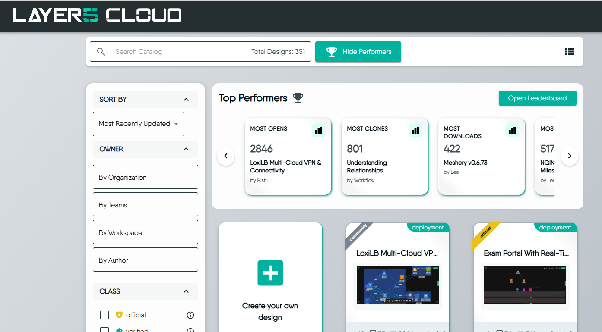
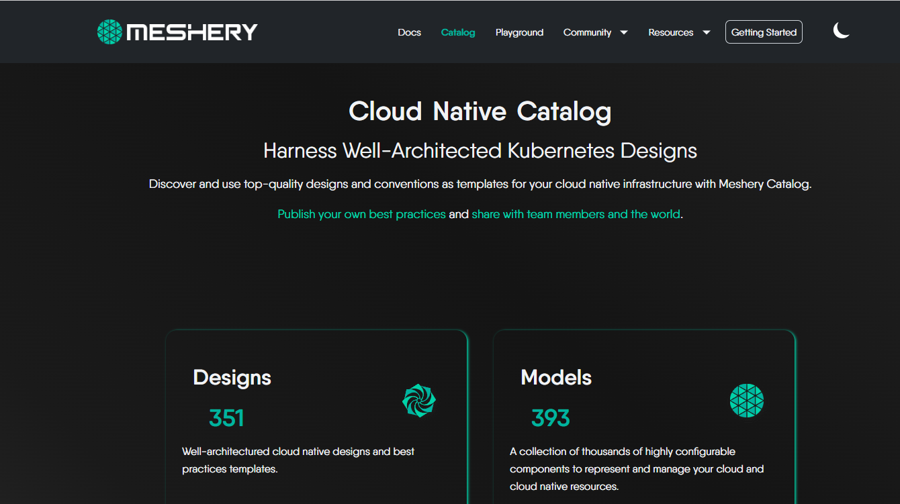
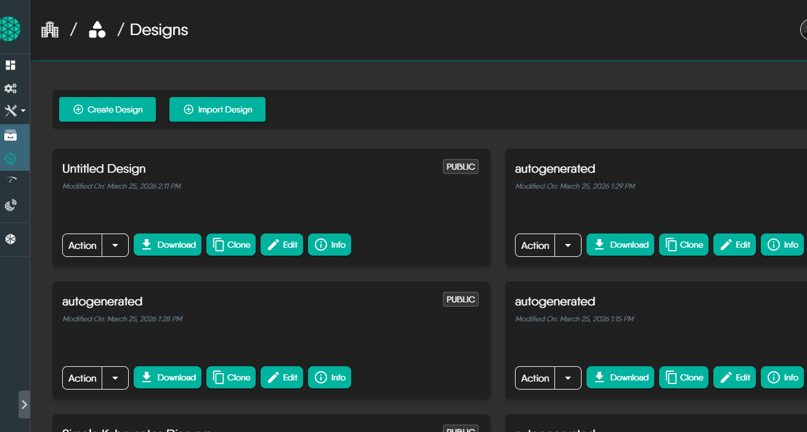
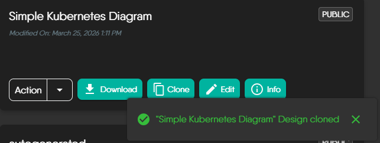
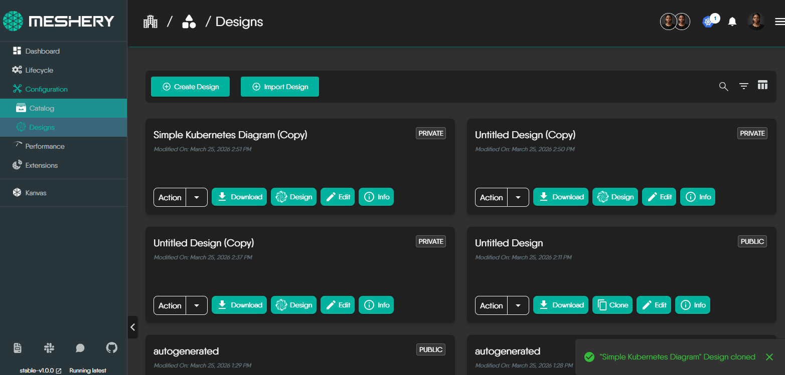

# Getting Started: Creating a Design from a Template

Meshery provides a rich catalog of pre‑built design templates to help you accelerate your cloud‑native workflows. Cloning a template allows you to instantly reuse best‑practice configurations and adapt them to your environment. This guide walks you through the full process of selecting, cloning, and accessing a design template.

## Prerequisites

- Access to a running Meshery instance.
- Basic familiarity with the Meshery UI.

---

## Step 1: Open the Meshery Catalog

1. Log in to your Meshery instance.
2. From the left navigation menu, select **Catalog**.

The catalog displays a wide range of ready‑to‑use templates, organized by categories, tags, and use cases.

---

## Step 2: Select and Clone a Template

### 1. Browse Templates  
Use filters, tags, or the search bar to explore available templates.

### 2. View Template Details  
Click on a template to open its detail page.

### 3. Clone the Template  
Click **Clone** (or **Use Template**) to create a copy of the design in your workspace.

### 4. Confirm Cloning  
Meshery will display a confirmation dialog. Review the information and confirm.

---

## Step 3: Access Your Cloned Design

Once cloning is complete:

1. Navigate to your **Designs** or **Workspace** section.
2. Locate the newly cloned design.
3. Open it to begin customizing, deploying, or integrating it with your environment.

---

## Troubleshooting

### Template Not Appearing  
If you don’t see your cloned design immediately, refresh the page or check your active workspace.

### Need Help?  
Visit the [Meshery Community](https://layer5.io/community) to ask questions, get support, or connect with maintainers and contributors.
