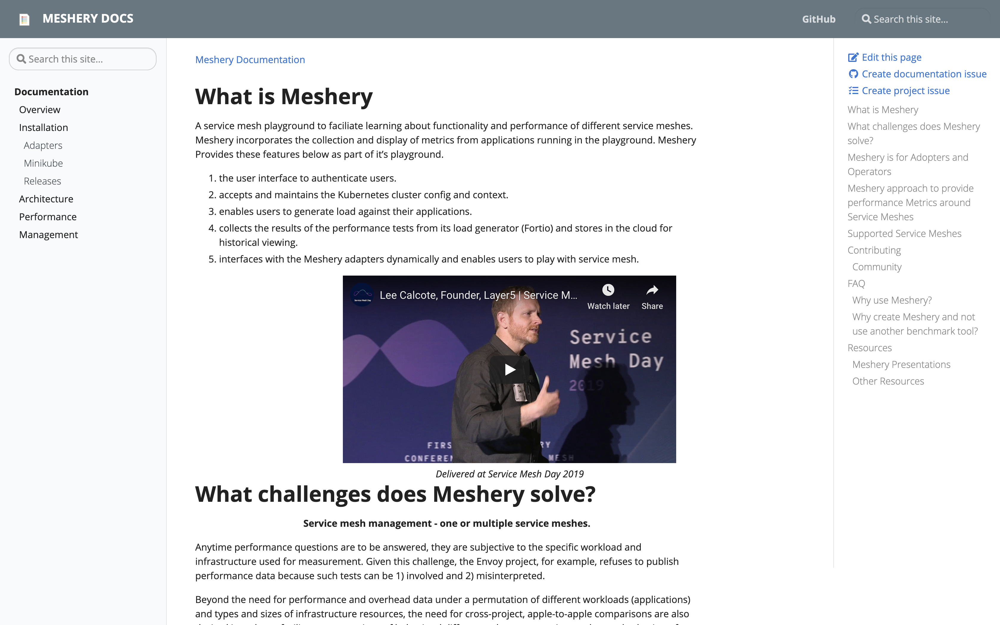

# Meshery Docs


_Check out the [Meshery Docs](https://docs.meshery.io/)!_
Detailed documentation on contributing to Meshery docs is available here - [https://docs.meshery.io/project/contributing/contributing-docs](https://docs.meshery.io/project/contributing/contributing-docs).

## Contributing to the Meshery Documentation

Before contributing, please review the [Documentation Contribution Flow](https://github.com/meshery/meshery/blob/master/CONTRIBUTING.md#documentation-contribution-flow). In the following steps you will set up your development environment, fork and clone the repository, run the site locally, and finally commit, sign-off, and push any changes made for review.

### 1. Set up your development environment

- _The Meshery Docs site is built using Jekyll - a simple static site generator! You can learn more about Jekyll and setting up your development environment in the [Jekyll Docs](https://jekyllrb.com/docs/)._

- First [install Ruby](https://jekyllrb.com/docs/installation/), then install Jekyll and Bundler.

**Note:** Windows users can run Jekyll by following the [Windows Installation Guide](https://jekyllrb.com/docs/installation/windows/) and also installing Ruby Version Manager [RVM](https://rvm.io). RVM is a command-line tool which allows you to work with multiple Ruby environments on your local machine. Alternatively, if you're running Windows 10 version 1903 Build 18362 or higher, you can upgrade to Windows Subsystem for Linux [WSL](https://docs.microsoft.com/en-us/windows/wsl/install-win10) and run Jekyll in Linux instead.

Alternatively, if you are running Windows 10, you may install the Windows Subsystem for Linux:

- [WSL1](https://docs.microsoft.com/en-us/windows/wsl/install-win10) for Windows build version 1607 or higher.

### 2. Get the code

- Fork and then clone the [Meshery repository](https://github.com/meshery/meshery)
  ```bash
  $ git clone https://github.com/YOUR-USERNAME/meshery
  ```
- Change to the docs directory
  ```bash
  $ cd docs
  ```
- Install any Ruby dependencies
  ```bash
  $ bundle install
  ```

### 3. Serve the site

- Serve the code locally
  ```bash
  $ make docs
  ```
  _Note: From the Makefile, this command is actually running `$ bundle exec jekyll serve --drafts --livereload`. There are two Jekyll configuration, `jekyll serve` for developing locally and `jekyll build` when you need to generate the site artifacts for production._

### 4. Create a Pull Request

- After making changes, don't forget to commit with the sign-off flag (-s)!
  ```bash
  $ git commit -s -m “my commit message w/signoff”
  ```
- Once all changes have been committed, push the changes.
  ```bash
  $ git push origin <branch-name>
  ```
- Then on Github, navigate to the [Meshery repository](https://github.com/meshery/meshery) and create a pull request from your recently pushed changes!

---

- _See the [Meshery Documentation Google Doc](https://docs.google.com/document/d/17guuaxb0xsfutBCzyj2CT6OZiFnMu9w4PzoILXhRXSo/edit) for additional reference._
- Theme - https://github.com/vsoch/docsy-jekyll

