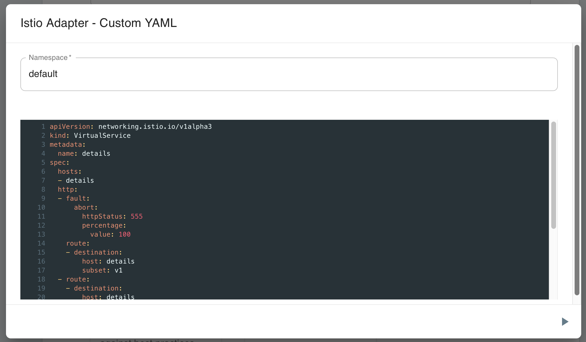





## Features

1. {{page.mesh_name}} Lifecycle Management
1. Workload Lifecycle Management
   1. Using Service Mesh Standards
      1. Service Mesh Performance (SMP)
         1. Prometheus and Grafana connections
      1. Service Mesh Interface (SMI)
1. Configuration Analysis, Patterns, and Best Practices
   1. Custom Service Mesh Configuration

### Lifecycle management

The {{page.name}} can install {{page.version}} of the {{page.title}} service mesh. The SMI adapter for Istio can also be installed using Meshery.

### Install {{ page.mesh_name }}

In Meshery's UI, choose the Meshery Adapter for {{ page.mesh_name }}.

Click on (+) and choose the {{page.version}} of the {{page.mesh_name}} service mesh.

### Workload Management

The ({{page.name}}) includes a handful of sample applications. Use Meshery to deploy any of these sample applications:

- [Bookinfo]({{ site.baseurl }}/guides/sample-apps#bookinfo)
   - Follow this [tutorial workshop](https://github.com/layer5io/istio-service-mesh-workshop/blob/master/lab-2/README.md) to set up and deploy the BookInfo sample app on Istio using Meshery.

- [Httpbin]({{ site.baseurl }}/guides/sample-apps#httpbin)
    - Httpbin is a simple HTTP request and response service.

- [Hipster]({{ site.baseurl }}/guides/sample-apps#hipster)
    - Hipster Shop Application is a web-based, e-commerce demo application from the Google Cloud Platform.

## Using Service Mesh Standards

### Complying with Service Mesh Interface (SMI)

Meshery allows you to analyze the compliance status and functional capabilities of your service mesh. This allows you to compare high-level functional differences between service meshes and verify whether your service mesh is conformant with the SMI specification.

Learn more about the SMI specification and [Meshery's conformance test suite]({{ site.baseurl }}/functionality/service-mesh-interface).

### Managing Service Mesh Performance (SMP)

### Prometheus and Grafana connections

The {{page.name}} will connect to Istio's Prometheus and Grafana instances running in the control plane (typically found in the `istio-system` namespace). You can also connect Meshery to Prometheus and Grafana instances not running in the service mesh's control plane.
## Configuration Analysis, Patterns, and Best Practices

### Configuration best practices

The {{page.name}} will parse all of Istio's configuration and compare the running configuration of the service mesh against known best practices for an {{page.title}} deployment.

### Custom service mesh configuration

Meshery allows you to paste (or type in) any Kubernetes manifest that you would like to have applied to the cluster. This configuraiton may be new VirtualServices or new DestinationRules or other.

<a href="#" class="lightbox" id="istio-custom">
  
</a>

### Suggested Topics

- Examine [Meshery's architecture]({{ site.baseurl }}/architecture) and how adapters fit in as a component.
- Learn more about [Meshery Adapters]({{ site.baseurl }}/architecture/adapters).
