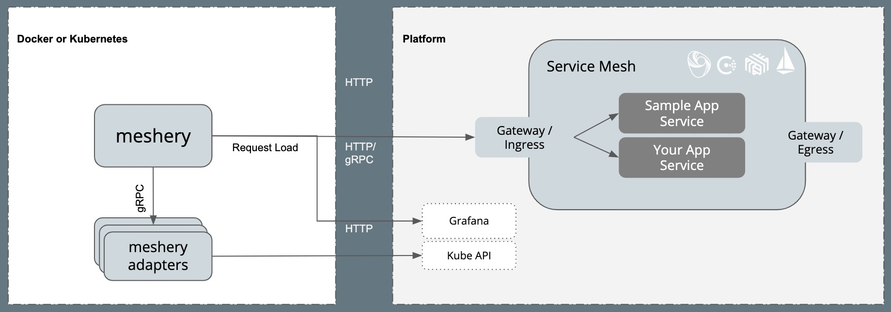
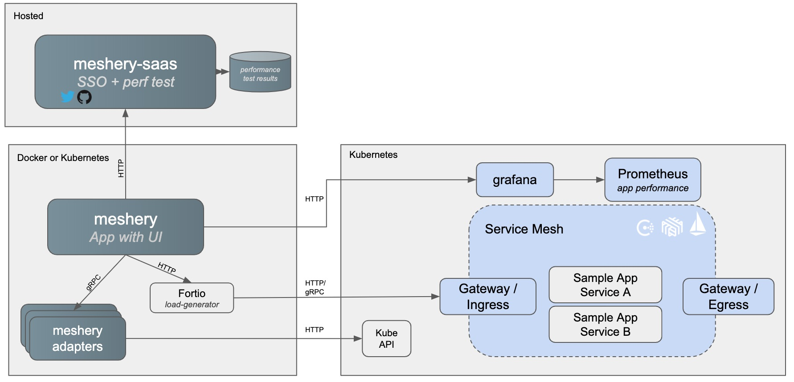

## Table of contents
{: .no_toc .text-delta }

1. TOC
{:toc}

---
### Diagram

### Value provided by meshery cloud

### Network Ports (that Meshery uses and needs)
- Meshery (thru docker-compose) needs port 9081
- Meshery Istio adapter port 10000
- Linkerd adapter port 10001
### Adapters (what they are, what purpose they serve
* Istio
* Linkerd
* Octarine
* Consul Connect
