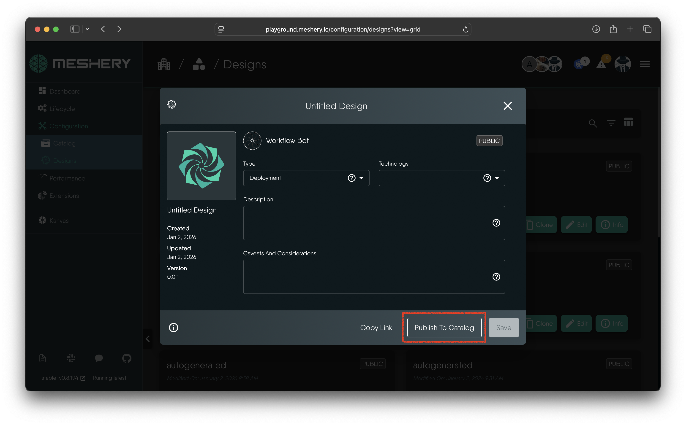

[Meshery Catalog](https://meshery.io/catalog) functions much like a cloud marketplace, providing a user-friendly interface for browsing, discovering, and sharing configurations and patterns for cloud native infrastructure. With Meshery Catalog, you can easily find and deploy Kubernetes-based infrastructure and tools, making it easy to streamline your cloud native development and operations processes. A Catolog is based on the Meshery's [Catalog Schema](https://github.com/meshery/schemas/blob/98560345814e4be036d9f0020759faf3202ec2e4/schemas/constructs/v1alpha1/catalog_data.json) with defined attributes.

## A collection of design templates

Meshery Catalog functions much like a cloud marketplace, providing a user-friendly interface for browsing, discovering, and sharing configurations and patterns for cloud native infrastructure. With Meshery Catalog, you can easily find and deploy Kubernetes-based infrastructure and tools, making it easy to streamline your cloud native development and operations processes.

It also supports a collaborative environment, where DevOps engineers can share their experiences, feedback, and best practices with others in the community. Import cloud native patterns published by others into your Meshery Server. Benefit from and build upon each pattern by incorporating your own tips and tricks, then publish and share with the community at-large. This facilitates knowledge-sharing and helps to build a strong ecosystem of cloud native infrastructure experts.

### Prerequisites for Publishing to Catalog

To publish designs to the Meshery Catalog, ensure:
1. **Meshery Server** is running and accessible.
2. **Authentication**: You are logged in with a valid Meshery Cloud / Remote Provider account (via `mesheryctl system login` or through the UI).
3. **Valid Design**: Your design has been validated against [Meshery Schemas](https://github.com/meshery/schemas) (either an Annotation-only visual design or a Deployable infrastructure design).

---

### Step-by-Step: Publishing a Design via Meshery UI

1. **Navigate to Designs**: In your browser, open Meshery UI and go to **Designs** (e.g., `http://localhost:9081/configuration/designs` or [Meshery Playground](https://playground.meshery.io/configuration/designs)).
2. **Open Design Info**: Locate the design card you want to publish, click the **Action menu** (or **Info** icon), and select **Edit Info**.
3. **Fill in Required Metadata**:
   - **Design Name**: Provide a clear, human-readable name.
   - **Description**: Explain the architecture pattern, key components, and intended use case.
   - **Category / Type**: Select the primary domain (e.g., *Deployment*, *Observability*, *Security*, *Resiliency*, *Architecture Diagram*).
   - **Technology Tags**: Add tags for the integrated tools (e.g., `Kubernetes`, `Istio`, `AWS`, `Helm`, `ArgoCD`).
   - **Caveats & Considerations**: List any prerequisites, required secrets, environment parameters, or operational caveats.
4. **Submit for Review**: Click **Publish to Catalog**. Your request is submitted to workspace administrators and maintainers for review.

<a href="./images/publish-to-catalog-screenshot.png" class="lightbox-image">
</a>
<figure>
  <figcaption>Figure: Workflow to publish a design in catalog</figcaption>
</figure>

---

### Catalog Review & Publishing Lifecycle

The catalog publishing pipeline follows a structured approval and distribution lifecycle:

```
┌─────────────────┐       Submit        ┌─────────────────┐       Review        ┌─────────────────┐
│ Design Author   ├────────────────────►│ Workspace Admin ├────────────────────►│ Schema Validation │
│ (Meshery UI)    │   Publish Request   │ & Maintainers   │      Approve        │ & Compatibility │
└─────────────────┘                     └─────────────────┘                     └────────┬────────┘
                                                                                         │
                                        ┌─────────────────┐       Trigger                │
                                        │ Meshery.io Site │◄─────────────────────────────┘
                                        │ Catalog Live    │    GitHub Publishing Action
                                        └─────────────────┘
```

1. **Request to Publish**: The author submits a publish request with all required metadata and compatibility details.
2. **Review by Admin / Maintainer**: Workspace owners and catalog maintainers review the submission for quality, schema conformance, and descriptive clarity. They may approve, deny, or leave feedback requesting modifications.
3. **Automated Schema Validation**: Upon approval, the design data undergoes automated schema validation against the Meshery Catalog specification.
4. **GitHub Workflow & Site Ingestion**: Once approved and validated, an automated GitHub Actions workflow ingests the design artifact and publishes it to the public [Meshery.io Catalog](https://meshery.io/catalog).
5. **Ongoing Maintenance & Updates**:
   - Authors and workspace owners retain permission to update, re-publish, or unpublish their designs at any time.
   - If updates are pushed to a published design, a new version is validated and published.


### FAQ
<details>
    <summary>
<h6>Question: Why are images invisible for some designs in the Meshery Catalog?</h6>
</summary>
<p><strong>Answer:</strong> In certain instances, the images of published designs in <a href="https://meshery.io/catalog">Meshery Catalog</a> may not be visible due to bandwidth issues. This can occur when there are network constraints affecting the retrieval of image data. However, rest assured that the design information and other relevant details are still accessible.</p>
</details>

{}
If you have any questions or need assistance, reach out on the [discussion forum](https://discuss.meshery.io/).
{}