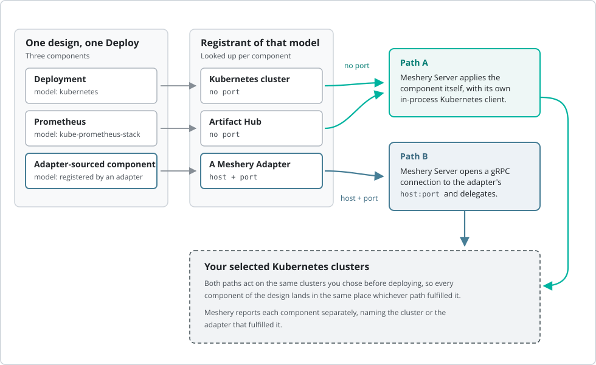

When you press **Deploy** on a [Design](), Meshery Server does not hand the design to a single system and wait. It walks the design one [Component]() at a time and decides, for each component independently, *who* is going to apply it. Some components Meshery Server applies itself. Others it delegates to a [Meshery Adapter](). A single design routinely does both in the same deployment.

This page describes how that routing decision is made, so that the deployment results you see in Meshery are predictable rather than surprising.

## Every model carries a registrant

Each component in a design belongs to a [Model](), and every model in the [Registry]() records the **registrant** that put it there. A registrant is the [Connection]() that sourced a model's entities and registered them with Meshery Server. There is no such thing as a model without a registrant: registration *is* how a model enters the registry.

Registrants come in two flavors, and the difference is the whole story:

- **Registrants that are only a source of definitions.** They tell Meshery what a component *is*, and nothing more. A connected Kubernetes cluster is one - when you connect a cluster, Meshery reads that cluster's API and registers a `kubernetes` model with the cluster itself as the registrant. Artifact Hub and GitHub are two more; most of Meshery's built-in models are generated from them. Meshery itself is a registrant for the models it ships, such as its shapes and icon sets.
- **Registrants that are also a management endpoint.** A deployed Meshery Adapter registers its own models with Meshery Server and, in doing so, tells the server where to reach it on the network. The adapter is both the source of the definitions and a service that can act on them.

{}
In Meshery UI, open **Settings → Registry** and choose the **Registrants** view to browse each registrant and the models it registered. From the command line, [`mesheryctl model view`]() prints a model's `registrant` block.
{}

## Fulfillment is resolved per component, not per design

A design has no single "target system". Meshery resolves fulfillment **per component**: for each component in the design, it looks up the model that component belongs to, reads that model's registrant, and treats that registrant as the component's host for this deployment.

Only semantic components take part in this. The non-semantic components in a design - text, shapes, arrows and other annotations - are set aside before fulfillment begins and are never sent anywhere. See [Components]() for the distinction.

The consequence is worth stating plainly: **a design whose components come from different registrants fans out across different fulfillment paths within one deployment.** Nothing about the design itself, the workspace, or the environment changes this. The registrant of each component's model decides, and it decides one component at a time.

## The two fulfillment paths

Having resolved a component's registrant, Meshery Server asks one question of it: does this registrant advertise a network endpoint - a host *and* a port - that Meshery Server can call?

### Path A - Meshery Server applies the component itself

If the registrant advertises no port, there is nothing to delegate to. Meshery Server applies the component directly, using its own in-process Kubernetes client, against every Kubernetes cluster you selected for the deployment. Clusters are processed concurrently.

This is the path taken by components from Kubernetes-sourced models, from Artifact Hub-sourced and GitHub-sourced models, and from the models Meshery ships itself - in other words, by the large majority of components in the registry.

### Path B - Meshery Server delegates to an adapter

If the registrant advertises a host and a port, Meshery Server opens a gRPC connection to that address and asks the adapter to provision the component, passing along the same Kubernetes clusters you selected. The adapter does the work and reports back. Meshery Server never applies that component itself.

This is the path taken by components from models that a running [Meshery Adapter]() registered. It is how an adapter contributes depth of control for a particular technology: the adapter, not the server, decides what "deploy this" means for its own components.

## One design, both paths

<figure>
  <figcaption>Figure: Fulfillment is resolved per component, so one design can use both paths at once</figcaption>
</figure>

Consider a design with three components:

| Component | Model | Registrant | Fulfilled by |
| :-- | :-- | :-- | :-- |
| `Deployment` | `kubernetes` | the connected Kubernetes cluster | Meshery Server, in-process (Path A) |
| `Prometheus` | `kube-prometheus-stack` | Artifact Hub | Meshery Server, in-process (Path A) |
| an adapter-sourced component | a model registered by a deployed adapter | that adapter | the adapter, over gRPC (Path B) |

Pressing Deploy once sends the first two components through Meshery Server's own Kubernetes client and the third to the adapter, in the same deployment. Both paths act on the same clusters you selected, so every component still lands in the same place. What differs is who put it there.

Note that the mix is a property of your *registry*, not of your design. The design records which components it contains; it does not record who will fulfill them. Move the same design to a Meshery Server whose registry was populated differently and the same components can be fulfilled differently, without a character of the design changing.

This also means a component's fulfiller has to still be there. A model registered by an adapter keeps that adapter as its registrant even after the adapter stops running, so deploying such a component asks Meshery Server to reach an address that no longer answers. That component fails, and the deployment summary names the adapter address it could not reach.

## What this means when you deploy

**Deployment order still holds across paths.** A component that declares a dependency on another component is deployed only once that component has been deployed; everything else is deployed concurrently. A dependency names another component of the same design by its name, and Meshery does not treat it differently because the two components are fulfilled by different paths. Before anything is deployed, Meshery rejects a design whose dependencies name a component the design does not contain, name a component whose name is shared by more than one component, or form a cycle.

**Failure is scoped to a dependency chain, not to a path.** A component whose declared dependency failed to deploy is not dispatched to either path, and is reported as withheld, naming the dependency that failed. What counts here is whether the dependency itself was applied - not whether everything around it went perfectly. Withholding propagates along the chain: whatever depended on the withheld component is withheld in turn. Components that declared no dependency on the failed component are deployed as usual, whichever path fulfills them.

When you deploy to several clusters at once, a component that fails on any one of them is treated as failed outright, so its dependents are withheld on every cluster rather than only on the one where it failed. This is deliberate: a component is held back on the clusters where its dependency did come up, in exchange for never applying a component against a cluster where the thing it depends on is absent.

**Dependencies such as CRDs and operators are a separate, registrant-specific behavior.** The optional **Include Dependencies** setting asks Meshery to install what a component needs before applying it - and what Meshery is able to install depends on the registrant, because only some sources carry that information. Artifact Hub-sourced models carry a Helm chart Meshery can install; plain Kubernetes YAML carries nothing of the sort, so nothing is installed on your behalf. Installing these is deliberately best-effort - what a component needs is often already in the cluster - so the component is applied whether or not the install succeeded, and a failure to install them withholds nothing that depends on that component. The failure is still reported against the component in the deployment summary, next to the outcome of applying the component itself. See [Auto-Deployment of CRDs and Operators]().

**Results are reported per component.** A deployment summary names the component, its model, and where it was fulfilled - the cluster, for Path A, or the adapter's address, for Path B. When one component of a design fails, the summary tells you which path it was on. A component that was withheld appears in the summary too, naming the dependency that kept it from being deployed. You get a summary whenever the deployment actually ran, and an adapter that does not answer does not stop it from running - that component is reported as failed in the summary, as above. What does stop it is configuration Meshery cannot act on at all: credentials that do not yield a working connection to a cluster, or a registrant whose recorded address is not a usable address. Then you get an error describing the problem instead of a per-component summary.

**Undeploy uses exactly the same routing, in reverse.** Each component is resolved to its registrant the same way and returned to the same fulfiller, with the dependency order inverted so that dependents are removed before what they depend on. Withholding inverts along with it: if a component cannot be removed, whatever it depends on is left in place rather than pulled out from under it. This is the same conservative choice as on deploy, and it has a consequence worth knowing before you rely on it - a removal that fails partway leaves part of the design still running. The summary names what was held back and which failure held it back.

**A dry run does not exercise the adapter path.** Dry runs are performed against the Kubernetes API server of each selected cluster, for every component. This makes a dry run a check of your Kubernetes objects, not a rehearsal of an adapter's behavior.

## Related reading

- [Designs]() - the deployable unit
- [Registry]() - registrants, entities, and how models are registered
- [Models]() - the unit of packaging that carries the registrant
- [Adapters]() - what adapters are and how they register
- [Infrastructure Management overview]() - the stages a deployment passes through
