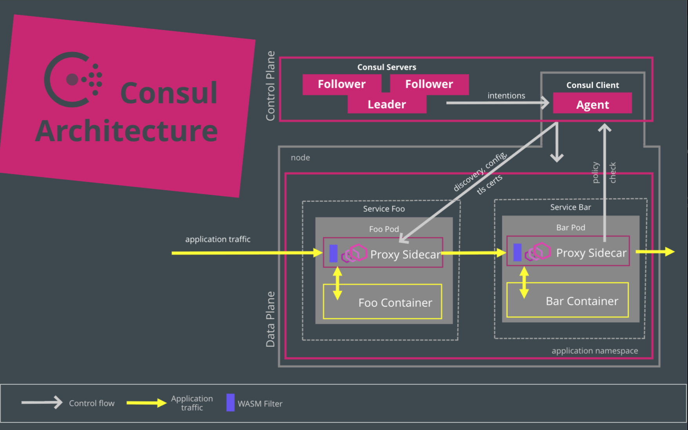


Adapters share a common Day 1 / Day 2 model: they install infrastructure with the project's own Helm charts, Kubernetes manifests, and/or CLI (with fallback), and they apply ongoing configuration by deploying Meshery Designs through Meshery Server's registry of registrants. That behavior, and related FAQs, is documented on the [Adapters]() page. This page covers only what is specific to Consul.


### Features

1. Lifecycle management of Consul
1. Lifecycle management of sample applications
1. Performance management of Consul and its workloads
   - Prometheus and Grafana integration
1. Configuration management and best practices of Consul
1. Custom configuration

### Lifecycle management of Consul

The Meshery Adapter for Consul can install **v1.8.4** and later of Consul on a connected Kubernetes cluster.

This adapter installs the Consul control plane with the official HashiCorp Consul Helm chart (`hashicorp/consul`). Sample applications and custom configuration are applied as Kubernetes manifests. A Helm-rendered Consul demo snapshot is also available as manifests under the adapter's config templates.

To install Consul from Meshery's UI, choose the Meshery Adapter for Consul, click **(+)**, and select a supported Consul version.

See [Adapters]() for the shared installation methods, fallback order, and how subsequent configuration is applied through Designs.

### Sample Applications

Meshery supports the deployment of a variety of sample applications on Meshery Adapter for Consul. Use Meshery to deploy any of these sample applications.

- httpbin
  - Httpbin is a simple HTTP request and response service.
- Bookinfo
  - The sample BookInfo application displays information about a book, similar to a single catalog entry of an online book store.
- Image Hub
  - Image Hub is a sample application written to run on Consul for exploring WebAssembly modules used as Envoy filters.

### Performance management of Consul and its workloads

#### Prometheus and Grafana integration

The Meshery Adapter for Consul will connect to Prometheus and Grafana instances running in the control plane (typically found in a separate namespace) or other instances to which Meshery has network reachability.

### Custom configuration

You can paste (or type in) any Kubernetes manifest and have this adapter apply or delete it in the requested namespace. Use this for Consul-related resources, sample-app changes, or other cluster configuration Meshery can reach.

### Architecture

### Suggested Topics

- Examine [Meshery's architecture]() and how adapters fit in as a component.
- Learn more about [Meshery Adapters](), including [Day 1 installation](#day-1-installing-infrastructure), [Day 2 configuration through Designs](#day-2-ongoing-configuration-through-designs), and [adapter FAQs](#adapter-faqs).
