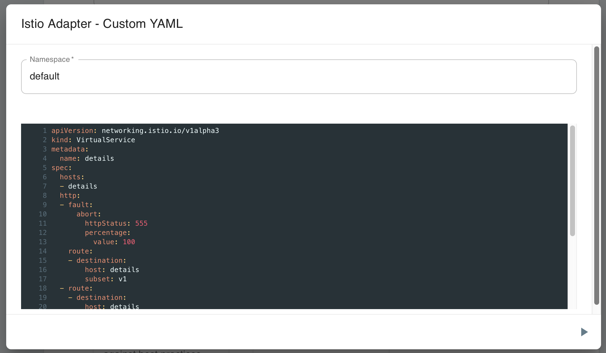


Adapters share a common Day 1 / Day 2 model: they install infrastructure with the project's own Helm charts, Kubernetes manifests, and/or CLI (with fallback), and they apply ongoing configuration by deploying Meshery Designs through Meshery Server's registry of registrants. That behavior, and related FAQs, is documented on the [Adapters]() page. This page covers only what is specific to Istio.


## Features

1. Istio Lifecycle Management
1. Workload Lifecycle Management
1. Cloud Native Performance (SMP)
   1. Prometheus and Grafana connections
1. Configuration Analysis, Patterns, and Best Practices
   1. Custom Configuration

### Lifecycle management of Istio

The Meshery Adapter for Istio can install **v1.6.0** and later of Istio on a connected Kubernetes cluster.

This adapter prefers Istio's own Helm charts from the selected release (`base`, `istio-discovery`, and gateway charts according to profile). Supported profiles are `demo`, `default`, and `minimal`. If Helm installation does not succeed, or if the adapter is told to use the binary installer, it falls back to `istioctl` (`istioctl install` / `istioctl x uninstall --purge`).

To install Istio from Meshery's UI, choose the Meshery Adapter for Istio, click **(+)**, select a supported Istio version and profile, and install.

See [Adapters]() for the shared installation methods, fallback order, and how subsequent configuration is applied through Designs.

### Workload Management

The Meshery Adapter for Istio includes a handful of sample applications. Use Meshery to deploy any of these sample applications:

- Bookinfo
  - The sample BookInfo application displays information about a book, similar to a single catalog entry of an online book store.
- Httpbin
  - Httpbin is a simple HTTP request and response service.
- Online Boutique
  - Online Boutique Application is a web-based, e-commerce demo application from the Google Cloud Platform.
- Image Hub
  - Image Hub is a sample application written to run on Consul for exploring WebAssembly modules used as Envoy filters.

## Using Cloud Native Standards

Meshery's powerful performance management functionality is accomplished through implementation of [Cloud Native Performance](https://smp-spec.io). Meshery enables operators to deploy WebAssembly filters to Envoy-based data planes. Meshery facilitates learning about functionality and performance of infrastructure and workloads and incorporates the collection and display of metrics from applications using Prometheus and Grafana integrations.

### Design Patterns and Meshery Models

### Prometheus and Grafana connections

The Meshery Adapter for Istio allows you to quickly deploy (or remove) an Istio add-ons. Meshery will deploy the Prometheus and Grafana add-ons (including Jaeger and Kiali) into Istio's control plane (typically the `istio-system` namespace). You can also connect Meshery to Prometheus, Grafana instances not running in the control plane.

If you already have existing Prometheus or Grafana deployments in your cluster, MeshSync will discover them and attempt to automatically register them for use.

## Configuration Management

Meshery Adapter for Istio provides configuration analysis, Istio policy templates, automatic sidecar injection, and custom resource apply. After Istio is installed, follow-on changes go through [Meshery Designs](#day-2-ongoing-configuration-through-designs) and the operations below.

### Configuration best practices

On demand, the Meshery Adapter for Istio will parse all of Istio's configuration and compare the running configuration of the infrastructure against known best practices for an Istio deployment.

### Policies and sidecar injection

This adapter can apply bundled Istio policy manifests (deny-all, strict mTLS, mutual mTLS, and disable mTLS) and can label namespaces with `istio-injection=enabled` for automatic sidecar injection.

### Custom infrastructure configuration

Meshery allows you to apply configuration to your infrastructure deployment. You can paste (or type in) any Kubernetes manifest that you would like to have applied to your infrastructure, in fact, you can apply any configuration that you would like to your Kubernetes cluster. This configuration may be VirtualServices, DestinationRules or any other custom Istio resource.

Add-on resources can be applied **or** deleted using this custom configuration operation.

### Suggested Topics

- Examine [Meshery's architecture]() and how adapters fit in as a component.
- Learn more about [Meshery Adapters](), including [Day 1 installation](#day-1-installing-infrastructure), [Day 2 configuration through Designs](#day-2-ongoing-configuration-through-designs), and [adapter FAQs](#adapter-faqs).
