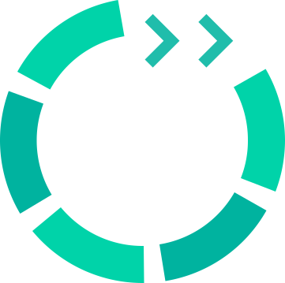

#  kubectl MeshSync Snapshot

A `kubectl` plugin for performing an ad hoc collection of resource information from a Kubernetes cluster and sending the cluster resources details to a Meshery Server. `kubectl meshsync snapshot` is a native kubectl plugin for conveniently synchronizing the state of your cluster with Meshery Server.

## About Meshery Extensions

[Meshery Extensions](https://meshery.io/extensions) are plugins or add-ons that enhance the functionality of the Meshery platform beyond its core capabilities. Meshery supports different types of extensions ([docs]()):

- [Adapters](): Adapters allow Meshery to interface with the different cloud native infrastructure.
- [Load Generators](): for performance characterization and benchmarking
- [Integrations](): model-based support for a broad variety of design and orchestration of cloud and cloud native platforms, tools, and technologies.
- [Providers](): for connecting to different cloud providers and infrastructure platforms
- [UI Plugins](): Meshery UI has a number of extension points that allow users to customize their experience with third-party plugins.
