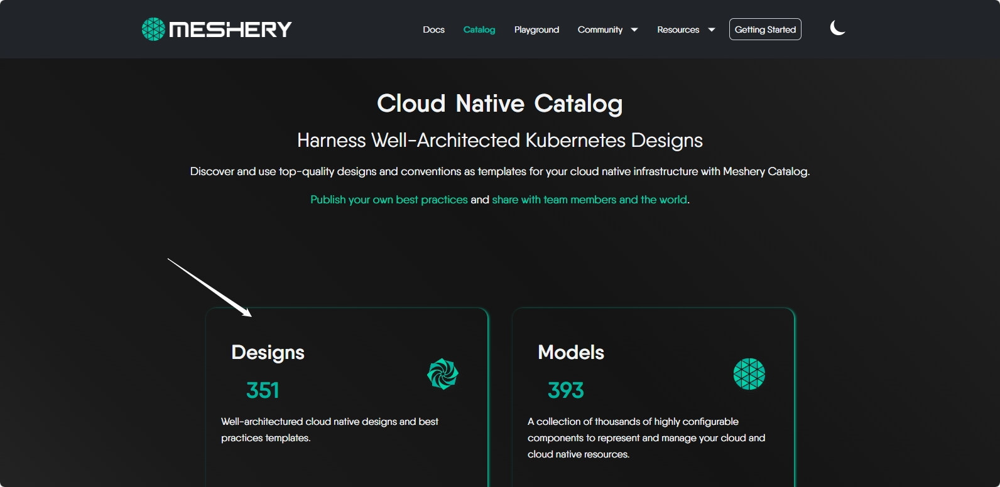
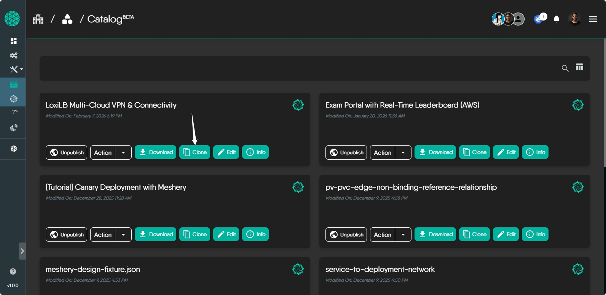
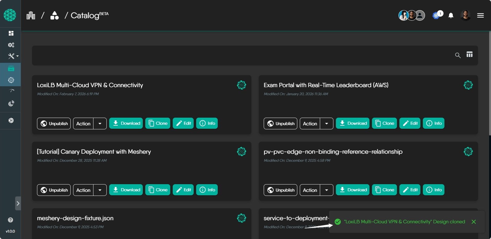

---
title: Creating a Design from a Meshery Catalog Template
description: Learn how to clone a design from Meshery Catalog templates
categories: [configuration]
suggested_reading: false
aliases:
- /guides/getting-started-creating-a-design-from-template
---

Meshery Catalog offers a collection of ready-to-use design templates. You can clone any template to use as a starting point for your own infrastructure designs.

## Steps to Clone a Design from Template

### Step 1: Accessing the Meshery Catalog

1. **Login**: Log in to your Meshery instance.
2. **Navigate to Catalog**: Click on the **Catalog** section in the left navigation menu.

### Step 2: Exploring and Cloning a Template

1. **Browse Templates**: Explore available templates by category, tag, or search keyword.
2. **Select Template**: Click on a template card to view its details.
3. **Clone Template**: Click the **Clone** button on the template card or detail page.

4. **Customize Settings** (if available): Configure any parameters based on your requirements, if prompted.
5. **Confirm Cloning**: Review and confirm the cloning dialog.

### Step 3: Accessing the Cloned Design

1. **Navigate to My Designs**: Once cloning completes, go to your **Designs** section.
2. **Edit and Deploy**: Open the cloned design to customize it further or deploy it to your infrastructure.

## Additional Resources

- Join the [Meshery community](https://layer5.io/community) for help and discussion.
- See [Working with Designs](/guides/configuration-management/working-with-designs/) for more on managing designs in Meshery.
