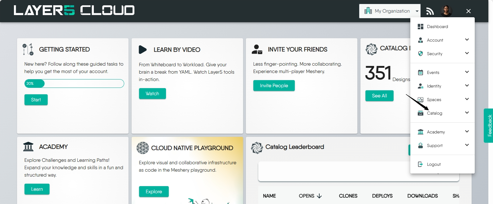
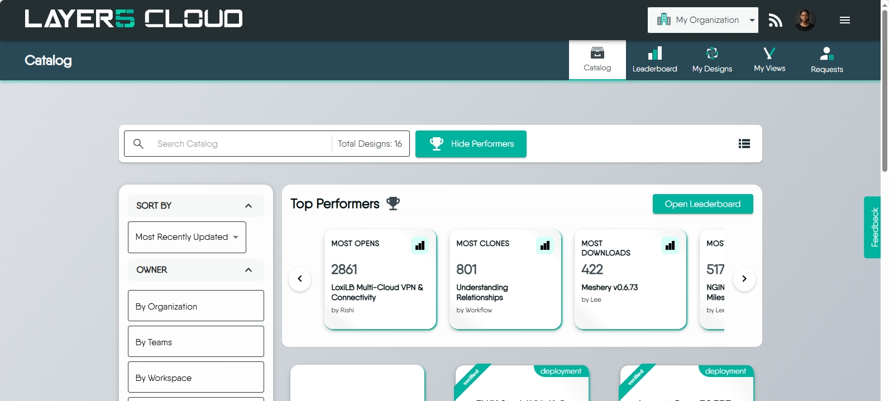
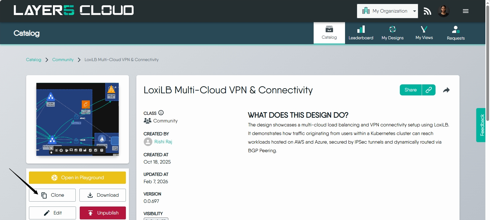
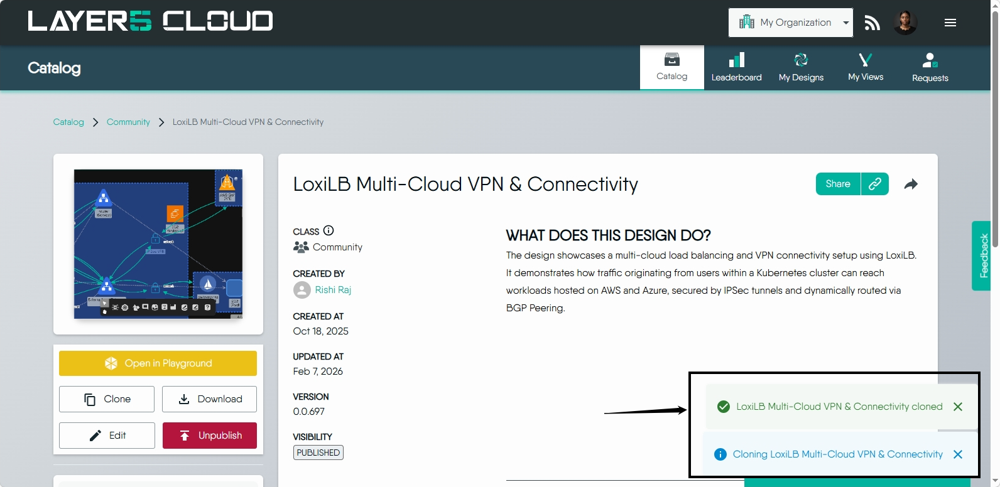
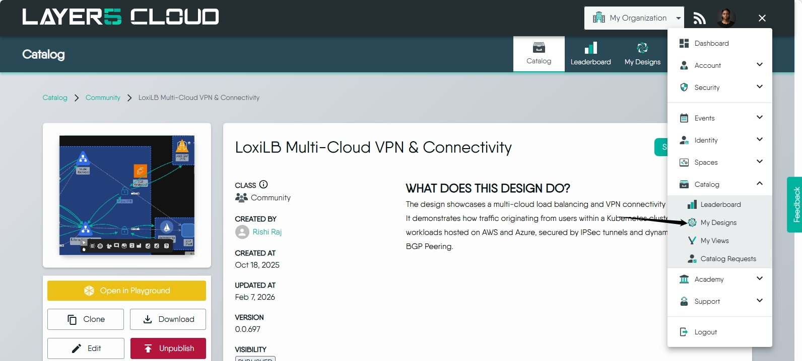
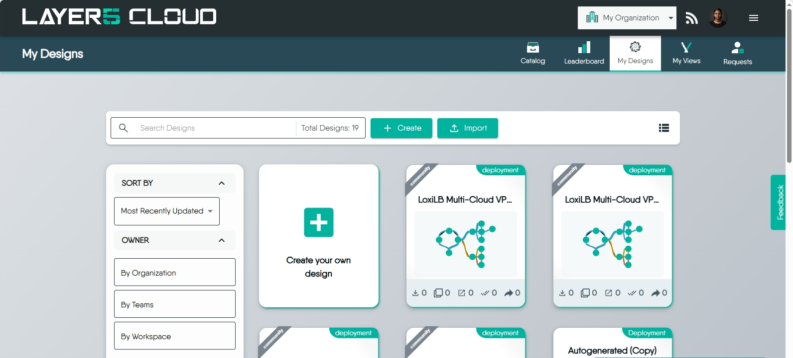

{}
Learn more about <a href='/concepts/logical/designs'>what a Meshery Design</a> is and how it fits into Meshery's approach to cloud native management.
{}

## Ways to create a Meshery Design

You can create a Meshery design in two ways:

---

# From scratch

1. Click on the **Design** tab to start creating a new design.
2. In the left panel, click **Components** and browse the type of component you want to add.
3. Drag and drop the components onto the canvas.
4. Click and drag from one component to another to create connections between components. You can customize the connections by adding labels or adjusting their properties.
5. Once you're satisfied with your design, click the **Save** button on the toolbar. Your design will be saved as **Untitled design** by default. You can give your design a name to help identify and manage it later.

---

# From a template

Meshery provides a rich catalog of pre‑built design templates to help you accelerate your cloud‑native workflows. Cloning a template allows you to instantly reuse best‑practice configurations and adapt them to your environment. This section walks you through the full process of selecting, cloning, and accessing a design template.

## Step 1: Open the Meshery Catalog

1. Log in to your Meshery instance (e.g., Meshery Cloud).
2. In the **top‑right corner**, click the **menu icon** (three horizontal lines).
3. From the menu, select **Catalog**.

The catalog displays a wide range of ready‑to‑use templates, organized by categories, tags, and use cases.

---

## Step 2: Select and Clone a Template

### 1. Browse Templates  
Use filters, tags, or the search bar to explore available templates.

### 2. View Template Details  
Click on a template to open its detail page.

### 3. Clone the Template  
Click **Clone** (or **Use Template**) to create a copy of the design in your workspace.

### 4. Confirm Cloning  
Meshery will display a confirmation dialog. Review the information and confirm.

---

## Step 3: Access Your Cloned Design

Once cloning is complete:

1. Click the **menu icon** in the top‑right corner.
2. Select **Catalog**.
3. Click the **dropdown arrow** next to **Catalog** to expand additional options.
4. Choose **My Designs**.
5. Locate your newly cloned design and open it to begin customizing, deploying, or integrating it with your environment.

---

## Troubleshooting

### Template Not Appearing  
If you don’t see your cloned design immediately, refresh the page or check your active workspace.

{}
Learn more about <a href='/concepts/logical/patterns'>what a Meshery Pattern</a> is and how it fits into Meshery's approach to cloud native management.
{}
