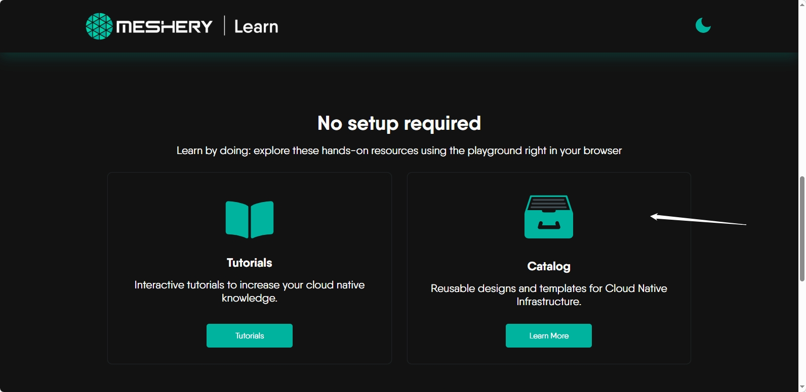
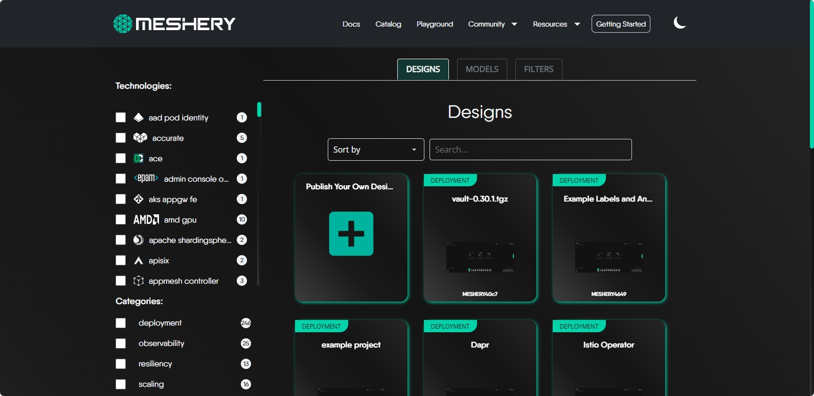
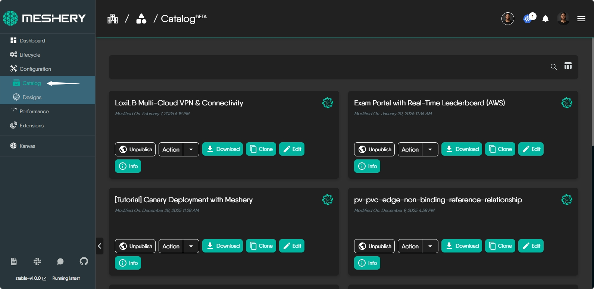
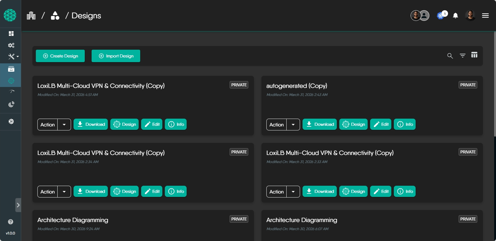

{}
Learn more about <a href='/concepts/logical/designs'>what a Meshery Design</a> is and how it fits into Meshery's approach to cloud native management.
{}

## Ways to create a Meshery Design

You can create a Meshery design in two ways:

---

# From scratch

1. Click on the **Designs** tab in the left navigation to start creating a new design.
2. In the left panel, click **Components** and browse the type of component you want to add.
3. Drag and drop the components onto the canvas.
4. Click and drag from one component to another to create connections between components. You can customize the connections by adding labels or adjusting their properties.
5. Once you're satisfied with your design, click the **Save** button on the toolbar. Your design will be saved as **Untitled design** by default. You can give your design a name to help identify and manage it later.

---

# From a template

Meshery provides a rich catalog of pre‑built design templates to help you accelerate your cloud‑native workflows. You can either **import published designs** or **clone templates** from the Meshery Catalog. This section walks you through both options.

---

## Step 1: Open the Meshery Playground

Navigate to:

**https://play.meshery.io**

You will first see the Meshery landing page.

Scroll to the **Choose Your Playground** section and click the **Catalog** card.

This opens the actual Meshery UI.

---

## Step 2: Open the Catalog

Inside the Meshery UI:

1. In the **left sidebar**, click **Catalog**.
2. Browse the available templates.

---

## Step 3: View Template Details

Click any template to open its detail page.

---

## Importing published designs

Meshery also allows you to import published designs directly into your workspace.  
This is useful when you want to reuse community‑shared configurations or build on an existing design.

To import a published design:

1. In the left navigation panel, click **Designs**.
2. Select a published design from the list to load it onto your canvas.
3. If you already have a design you want to extend, click the **Import** icon in the toolbar.
4. In the import modal:
   - Choose the design type.
   - Select the upload method (**file upload** or **URL import**).
   - Enter a name for the imported design.
   - Upload the file or paste the URL.
5. Click **Import** to add the design to your canvas.

---

## Step 4: Clone a Template

Click **Clone** on the template detail page.

A confirmation popup will appear.

Confirm to clone the design into your workspace.

---

## Step 5: Access Your Cloned Design

Once cloning is complete:

1. In the **left sidebar**, click **Designs**.
2. Select **My Designs**.
3. Locate your newly cloned design.
4. Click it to open the design on the canvas.

You can now customize, deploy, or integrate the design with your environment.

---

## Troubleshooting

### Template Not Appearing  
If you don’t see your cloned design immediately, refresh the page or check your active workspace.

{}
Learn more about <a href='/concepts/logical/patterns'>what a Meshery Pattern</a> is and how it fits into Meshery's approach to cloud native management.
{}
