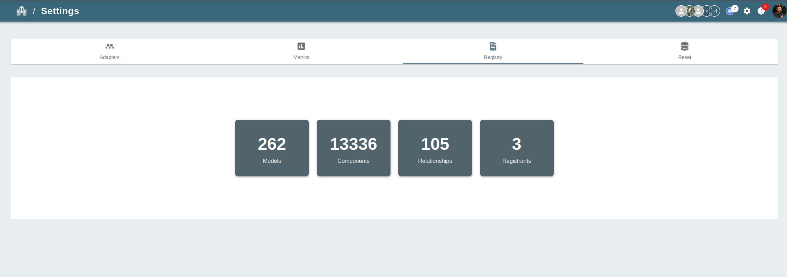
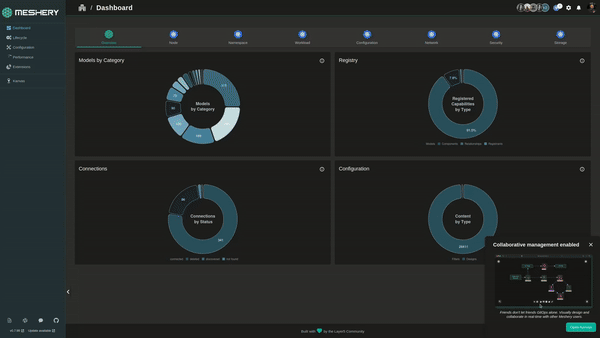

Export existing Meshery [Models]() or your custom infrastructure crd imported as [Models]() in Meshery. The platform supports a variety of application definition formats, and you can export designs using either the Meshery CLI or the Meshery UI.

## Export Models Using Meshery CLI

**Step 1: Install Meshery CLI**

Before you can use the Meshery CLI to export a [Model](), you must first install it. You can install Meshery CLI by [following the instructions]().

**Step 2: Export the Model**

Model can be exported in 2 format and OCI or Compress file. These files contain different [components](), [relationships]() files and a model file. The files can be exported in either yaml or json by default it is exported as yaml.

<pre class="codeblock-pre">

mesheryctl model export [model-name] 

</pre>

Different file type and output type can be set using flags `-o` for oci and tar and `-t` for json or yaml. A location can also be specified using the -l flag where user needs to export the model

**Example :**

<pre class="codeblock-pre">

mesheryctl model export istio-base -o oci

</pre>

<pre class="codeblock-pre">

mesheryctl model export istio-base -o oci -t json

</pre>

**Note:** A `--discard-components --discard-relationships` flag is present to skip [component]() and [relationships]() generation in the export only the model is exported without any components and relationships.

## Export Models Using Meshery UI

**Step 1: Access the Meshery UI**

To Export a model into Meshery using the Meshery UI, you must first [install Meshery]()

**Step 2: Navigate to Registry under Settings Page**

Once you have accessed the Meshery UI, navigate to the Registry under Settings. This page can be accessed by clicking on the Settings on the top right on setting icon and then selecting "Registry" and then choose model.

**Step 3: Upload the Models**

On the Registry page, you can export your model by select Model in registry page. If no specific version the latest version is downloaded and if the specific version of model is selected then on clicking the `Export` button the model is exported as an OCI.

This Meshery model will include components, relationships.

Once the Meshery model has been exported, you can export your model anytime back using `Import` on UI and then visualize in Meshery, operate and observe your components that are geneated from the crd. You can also use Meshery to deploy your Meshery Model in form of a design to any of your connected kubernetes clusters. For more information, see [connections]()
