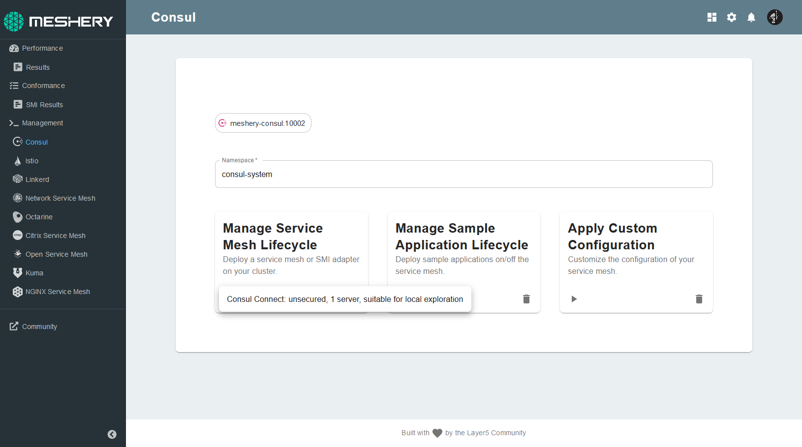
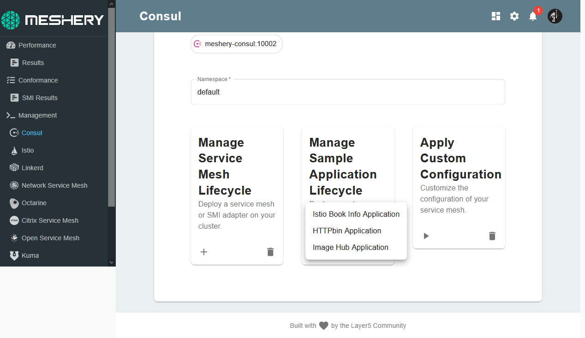
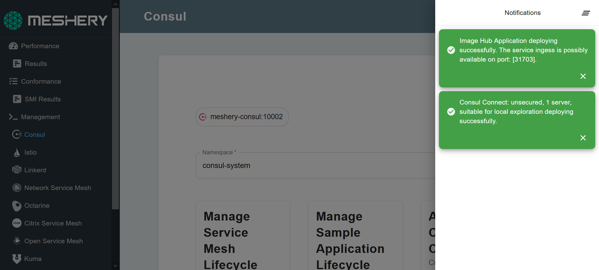
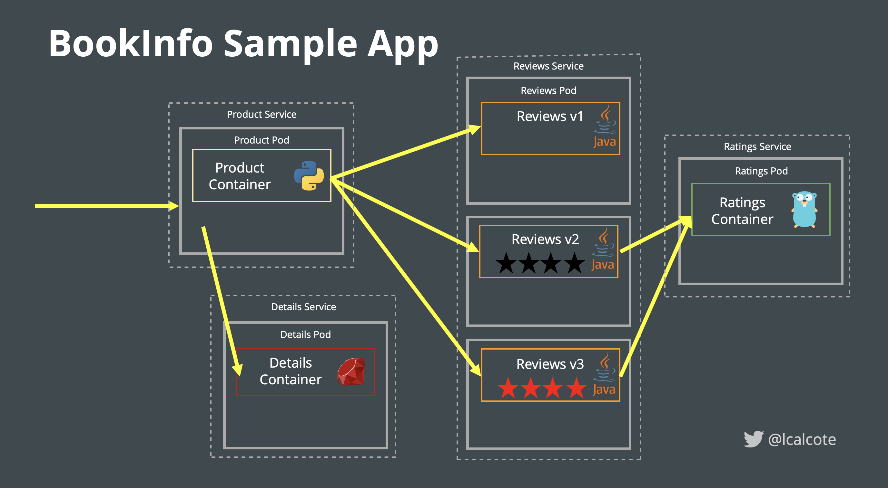
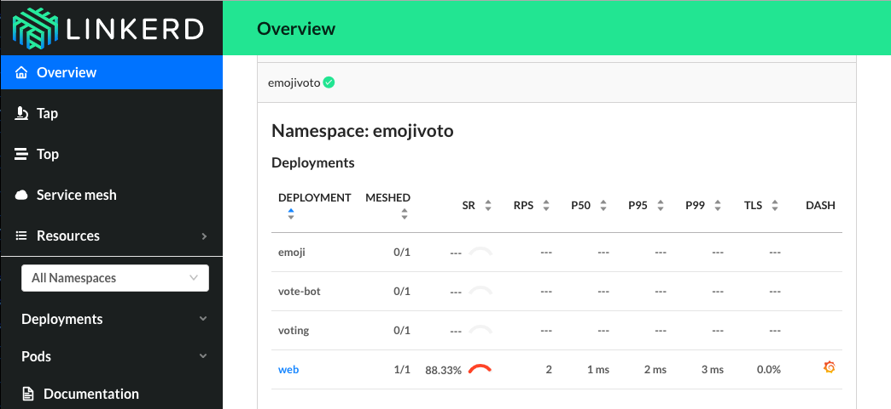
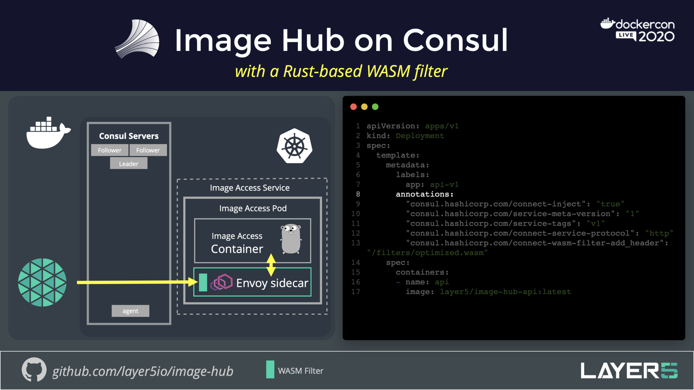
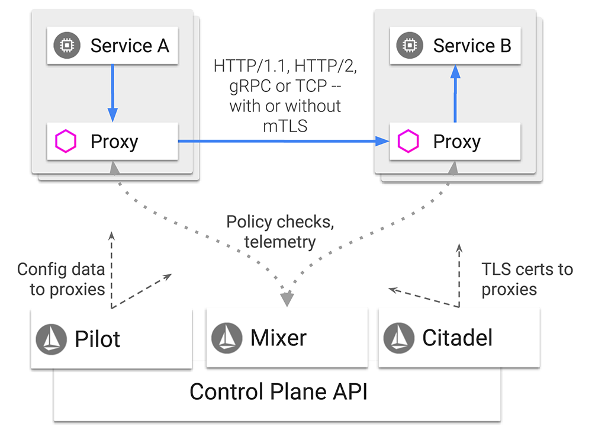
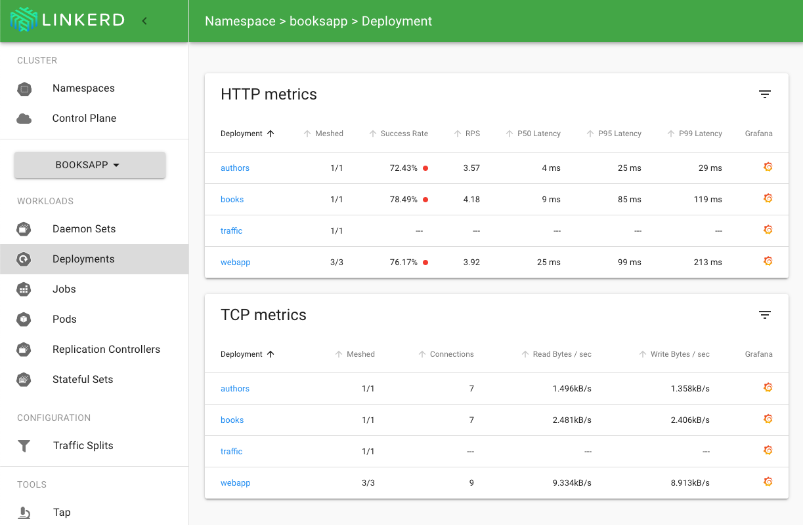
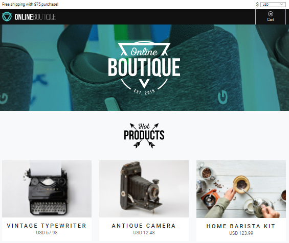

Meshery includes a few sample applications to help you explore cloud native infrastructure. Each is a collection of microservices for experimental purposes of learning about running workloads in Kubernetes clusters both on and off of cloud native infrastructure. When deploying a sample app onto your cloud native infrastructure, your sample application needs will need to be externaally exposed from the cluster, if you would like to access it externally. There are a myriad of ways to do this, specific to the infrastructure you are using.

A popular way of exposing your cluster is by using [Ingress](https://kubernetes.io/docs/concepts/services-networking/ingress/), an API object that defines rules which allow external access to services in a cluster. 

- [Set up Ingress](https://kubernetes.io/docs/concepts/services-networking/ingress/#the-ingress-resource)
- [Set up Ingress on Minikube](https://kubernetes.io/docs/tasks/access-application-cluster/ingress-minikube/)

## Deploy a sample app on Meshery

1. Go to the management page of any infrastructure and install any of its stable versions.

1. Click (+) on **Manage Sample Application Lifecycle**. You will now be able to see a dropdown menu with the available sample applications.

1. Click on the sample application you want to deploy. This might take up to a minute. You will be notified when the sample application has been deployed.

### BookInfo

Originally built by Istio, BookInfo is a sample application which on deployment displays information about a book, similar to a single catalog entry of an online book store. Displayed on the page is a description of the book, book details (ISBN, number of pages, and so on), and a few book reviews. The application comprises of four microservices:

   - **productpage**: The productpage microservice calls the details and reviews microservices to populate the page.
   - **details**: The details microservice contains book information.
   - **reviews**: The reviews microservice contains book reviews. It also calls the ratings microservice.
   - **ratings**: The ratings microservice contains book ranking information that accompanies a book review.

Once BookInfo is deployed, you can use Meshery to apply custom configurations to control traffic, inject latency, perform context-based routing, and so on. 

### [Emojivoto](https://github.com/BuoyantIO/emojivoto)

Emojivoto is a microservice application, originally built by Linkerd that allows users to vote for their favorite emoji, and tracks votes received on a leaderboard. The application is composed of three microservices:

   - **emojivoto-web**: Web frontend and REST API
   - **emojivoto-emoji-svc**: gRPC API for finding and listing emoji
   - **emojivoto-voting-svc**: gRPC API for voting and leaderboard

### ImageHub

Image Hub is a sample application for exploring WebAssembly modules used as Envoy filters. The application was originally written to run on Consul. However, it doesn't have any dependency on Consul and can be deployed on any infrastructure. These modules can be used to implement multi-tenancy or to implement per user rate limiting in your application’s endpoints, without messing with your application infrastructure. 

### [HTTPBin](https://httpbin.org)

HttpBin is a simple HTTP request and response service that responds to many kinds of http/https requests including the standard http request methods (or verbs) used by REST.

### [Linkerd Books](https://github.com/BuoyantIO/booksapp)

Linkerd Books is a sample Ruby based application. It is designed to demonstrate the various value propositions, including debugging, observability, and monitoring of your infrastructure. It can be used to scope out your mesh's efficiency and for debugging.

### [Online Boutique](https://github.com/GoogleCloudPlatform/microservices-demo)

Online Boutique is a sample cloud-native application, originally built by Google. It comprises of 10 microservices and can be used to showcase and work with Kubernetes, Istio, gRPC and OpenCensus. On deployment, it runs a web-based e-commerce demo application, an example of which can be seen below:

