Let's get familiar with mesheryctl system commands. The syntax of the mesheryctl commands goes as follows : `mesheryctl <Main_command> <Argument> <Flags>`

## Main_command : system
### start 
`mesheryctl system start` : This will initiate Meshery & automatically open it in your default web browser.

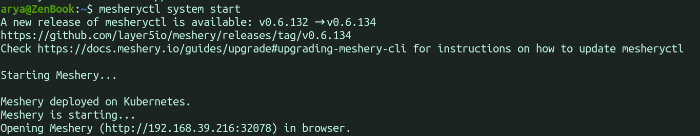

`mesheryctl system start --skip-browser` : It skips opening Meshery in your browser with the provided URL.

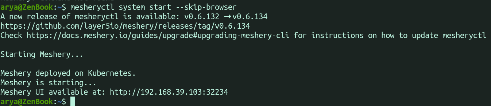

`mesheryctl system start --skip-update` : It is used when you want to skip updating Meshery if an update is available.

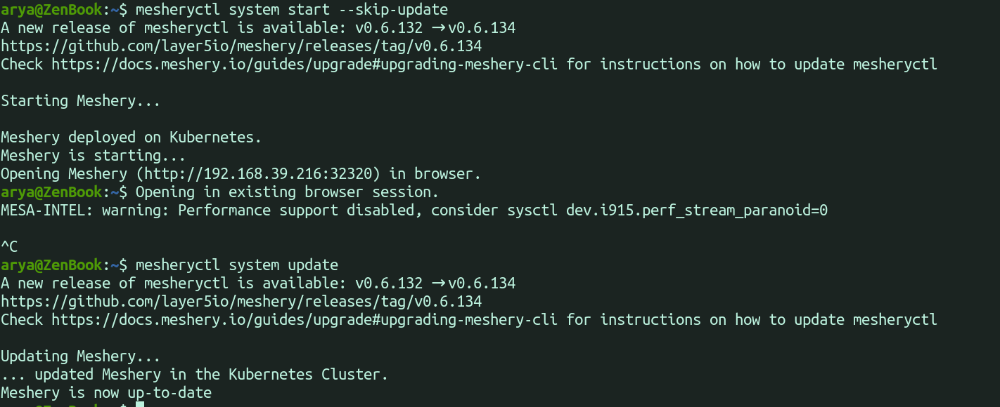

`mesheryctl system start --reset` : It resets your Meshery configuration file to its default configuration.

`mesheryctl system start --platform string` : It allows you specify a platform for deploying Meshery.

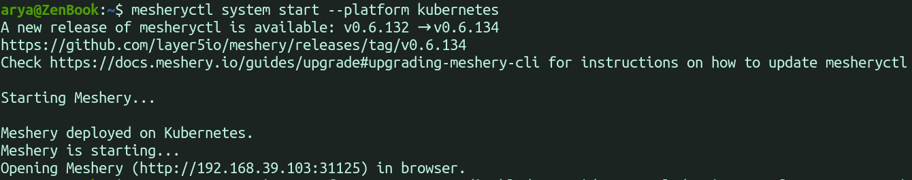

### stop 
`mesheryctl system stop` : It stops Meshery resources & delete its associated namespaces.

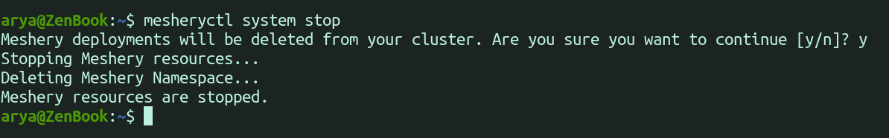

`mesheryctl system stop --reset` : It stops Meshery and resets the Meshery configuration file to its default configuration.

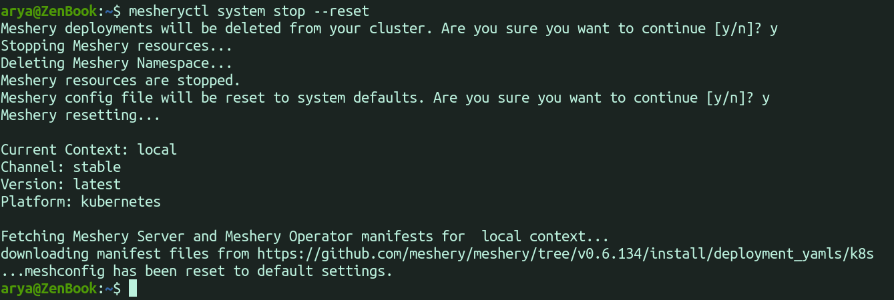

`mesheryctl system stop --keep-namespace` : It stops Meshery without deleting the associated namespaces.

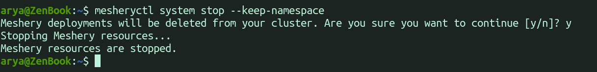

`mesheryctl system stop --force` : Force stops Meshery instead of gentle way. This is only used in emergency situations when `mesheryctl system stop` can't halt Meshery.

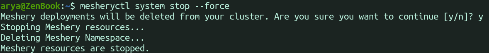

### update
`mesheryctl system update` : This updates Meshery itself, not the mesheryctl. Ensure Meshery is running when using this.

`mesheryctl system update --skip-reset` : Skips the check for a new manifest file.

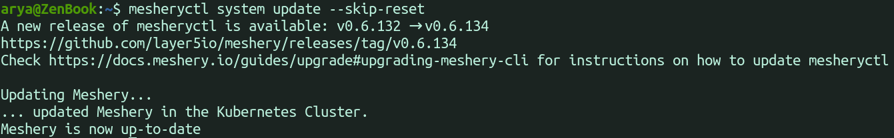

### reset
`mesheryctl system reset` : Resets Meshery to its default configuration.

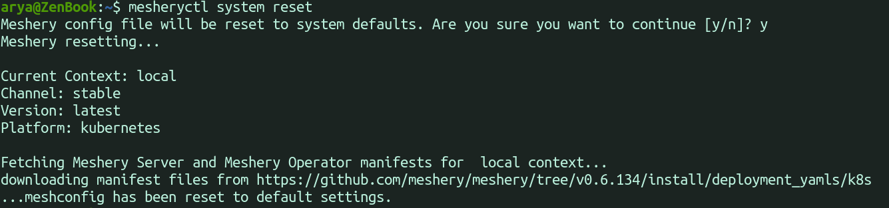

### restart 
`meshryctl system restart` : Stops Meshery and then starts it again. Opens the website in your default browser.

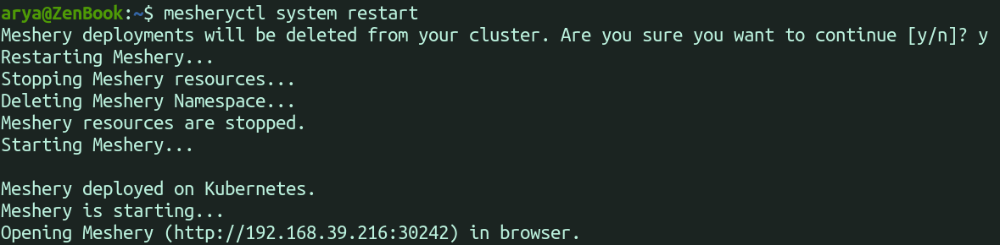

### status 
`mesheryctl system status` : Displays the status of Meshery components.

`mesheryctl system status --verbose` : Provides additional data along with Meshery and its component status.

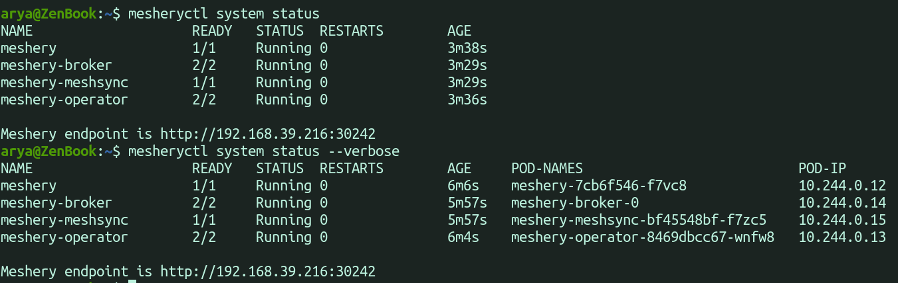

### dashboard
`mesheryctl system dashboard` : Opens the Meshery dashboard in your default browser.

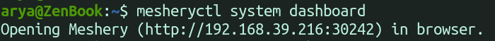

`mesheryctl system dashboard --skip-browser` : Provides the link to the dashboard, allowing you to open it in any browser.

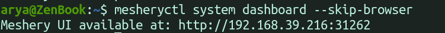

`mesheryctl system dashboard --port-forward` : If the current port is busy, it opens the dashboard on another port.

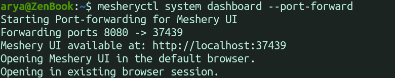

### login 
`mesheryctl system login` : Authenticates you with your selected provider.

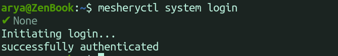

### check
`mesheryctl system check` : Performs checks for both pre & post mesh deployment scenarios on Meshery.

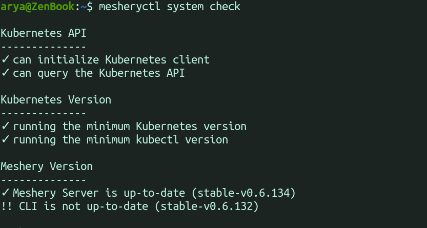

`mesheryctl system check --preflight` : Runs pre-deployment checks.

`mesheryctl system check --adapter` : Runs checks for a specific Mesh adapter.

`mesheryctl system check --adapters` : Runs checks for Meshery adapters

`mesheryctl system check --components` : Runs checks for Meshery components

`mesheryctl system check --operator` : Runs checks for Meshery Operator

## Main_command : system channel
### channel
`mesheryctl system channel set [stable|stable-version|edge|edge-version]` : Used to set the channel.

`mesheryctl system channel switch [stable|stable-version|edge|edge-version]` : Used to switch between channels.

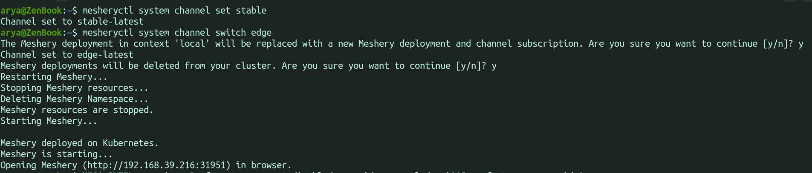

`mesheryctl system channel view --all` : Displays all available channels.

`mesheryctl system channel view` : Displays the current channel.

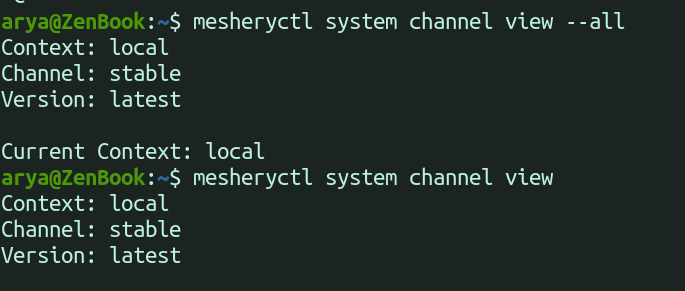

## Main_command : system context
### create 
`mesheryctl system context create 'context-name'` : Creates a new context with default parameters.

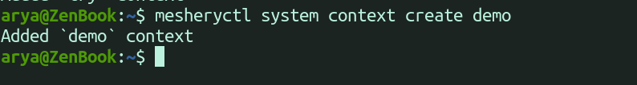

`mesheryctl system context create --component stringArray` : Specifies the component to be created in the context.

`mesheryctl system context create --platform string` : Specifies the platform.

`mesheryctl system context create --set` : Sets this  context as default context.

`mesheryctl system context create --url string` : Specifies the target URL.

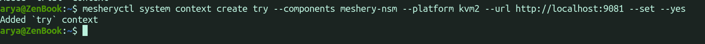

###  switch
`mesheryctl system context switch` : Easily switch between different contexts.

###  list
`mesheryctl system context list` : Lists all your available Meshery contexts.

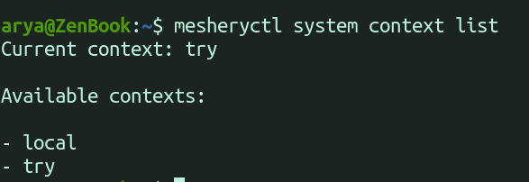

###  delete
`mesheryctl system context delete` : Delete context.

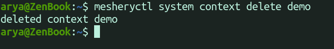

###  view
`mesheryctl system context view` : Display all your contexts with additional information.

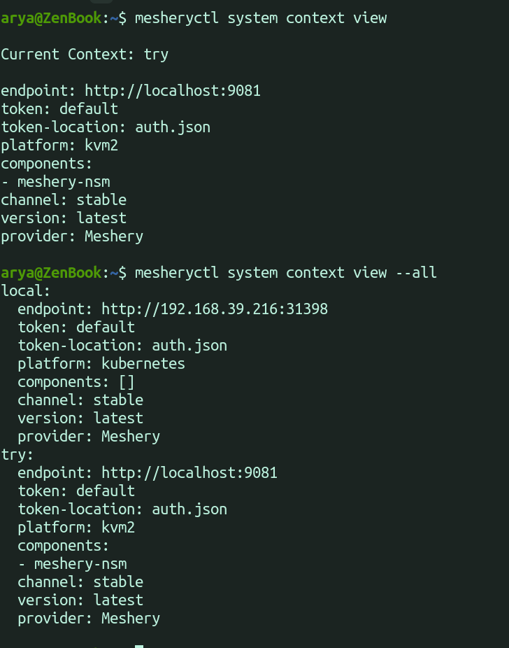

## Main_command : system provider
### switch
`mesheryctl system provider switch` : Changes your provider

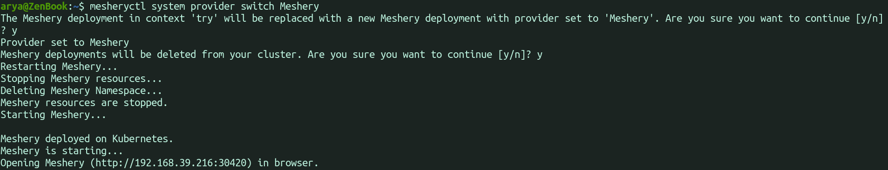

### list
`mesheryctl system provider list` : Lists all available providers

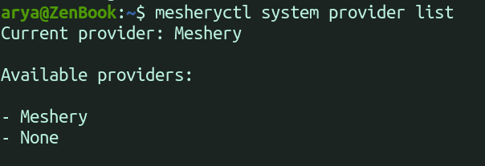

### set
`mesheryctl system provider set` : Set your provider

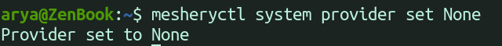

### view
`mesheryctl system provider view` : Lists your current context and provider

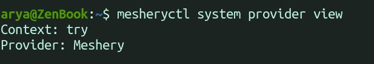

