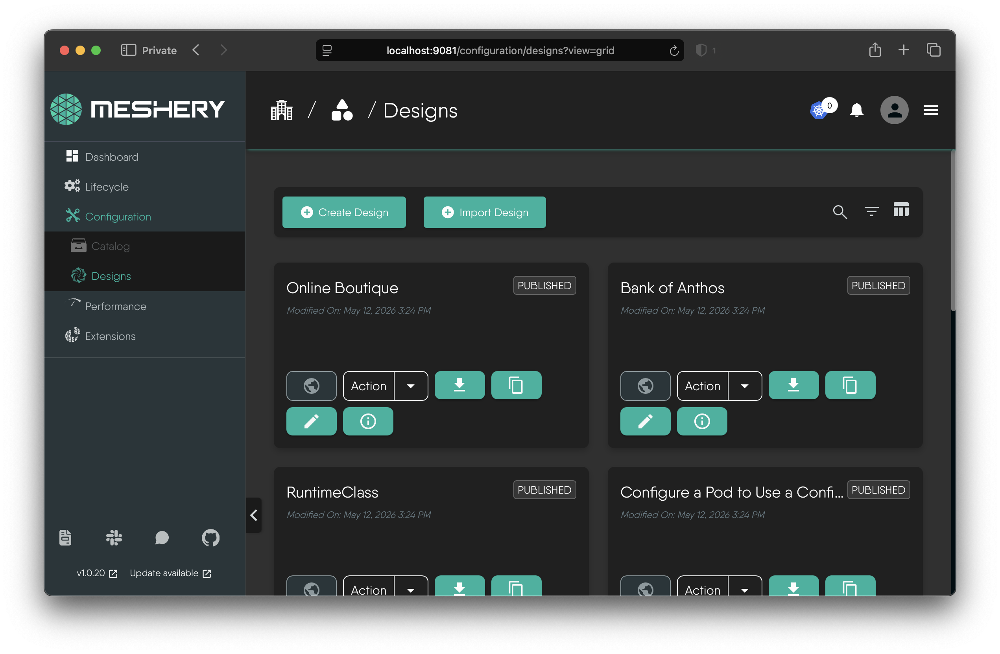
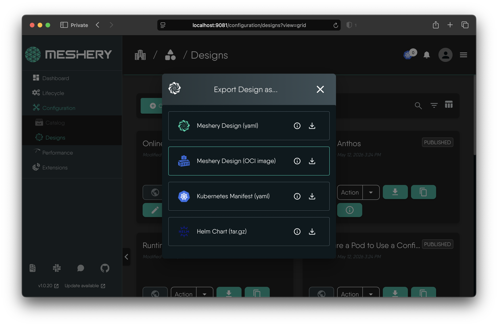
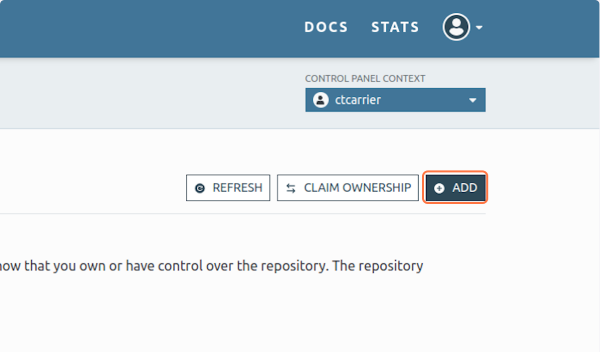
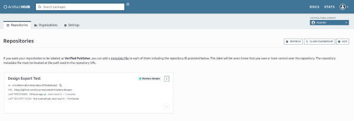

In this tutorial, we'll see how to export a design from Meshery, which we will use to populate an Artifact Hub repository.

## Prerequisites

1. Access to Meshery. [Install Meshery]() or access the [Meshery Playground](https://play.meshery.io).
2. An Artifact Hub repository.

## Steps

### 1. Navigate to the Designs page 
You can access it from the left-hand menu in Meshery. The URL will be:
   - Locally: [http://localhost:9081/configuration/designs?view=grid](http://localhost:9081/configuration/designs?view=grid)
   - Playground: [https://playground.meshery.io/configuration/designs?view=grid](https://playground.meshery.io/configuration/designs?view=grid)

  
{}
If you don't see your design, check your Organization and Workspace selections. Designs are scoped to a Workspace, so make sure you have the correct Workspace selected in the dropdown at the top of the page. If you don't have any designs in that Workspace, you can switch to another Workspace or create a new design in the current one.

If you don't have any designs, you can create one by following the [Create a Design tutorial]().
{}

### 2. Click to download your design
You can find the download button in the design's card in the grid view, or in the design's details page. This will download a `tar` archive containing your design and the metadata files to publish it to Artifact Hub.

### 3. Prepare your Artifact Hub repository
 You will need to have an Artifact Hub repository already created with Kind as Meshery Designs. See [Artifact Hub documentation](https://artifacthub.io/docs/topics/repositories/meshery-designs/) for more information on managing repositories.

### 4. Push Design to Artifact Hub repository

After exporting your design as a Meshery Design (OCI image), a `.tar` archive will be downloaded.
1. Extract the downloaded .tar archive.
2. Inside the extracted contents, locate the `.tar.gz` archive and extract it.
3. After extraction, you should find the following files: `artifacthub-pkg.yml` and `design.yml`.
4. Move these files into your prepared Artifact Hub repository.
5. Commit and push the changes to your repository.

### 5. Verify repository in Artifact Hub

Once the files are pushed to the Artifact Hub repo you will need to wait until Artifact Hub indexes it. You can verify the status of the repository in the Artifact Hub control panel.
 
