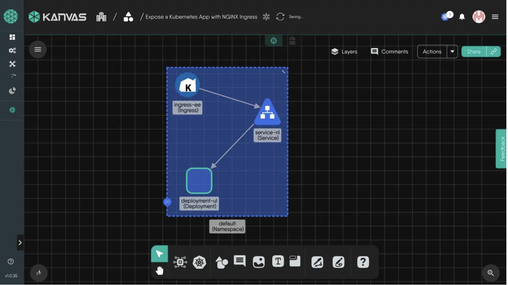
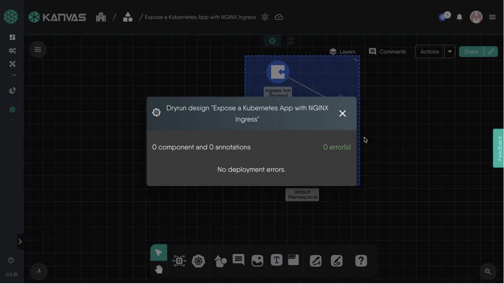

### Introduction

In this tutorial, you will learn how to expose a Kubernetes application to external traffic using an NGINX Ingress Controller with Meshery Playground.

Exposing applications to the outside world is a core task in Kubernetes administration. While there are multiple ways to expose an application (like NodePort or LoadBalancer), using an Ingress Controller like NGINX Ingress is the most common production approach. It allows you to route external HTTP/HTTPS traffic to internal services using host or path-based routing rules.

By using Kanvas, Meshery's collaborative visual designer, you will create a reusable design consisting of a Deployment, a Service, and an Ingress component, establish connections between them visually, and validate the design.

### Prerequisites

1. **Meshery Playground Access** - Sign up and log in to [Meshery Playground](https://playground.meshery.io) using your GitHub account.
2. **Basic Kubernetes Knowledge** - Familiarity with Deployments, Services, and Ingress resources is helpful but not required.

### Table of Contents

1. [Create a New Design in Kanvas](#1-create-a-new-design-in-kanvas)
2. [Add and Configure the Deployment Component](#2-add-and-configure-the-deployment-component)
3. [Add and Configure the Service Component](#3-add-and-configure-the-service-component)
4. [Add and Configure the Ingress Component](#4-add-and-configure-the-ingress-component)
5. [Connect the Components Visually](#5-connect-the-components-visually)
6. [Validate the Design](#6-validate-the-design)
7. [Dry Run the Design](#7-dry-run-the-design)
8. [Deploy the Design](#8-deploy-the-design)
9. [Undeploy the Design](#9-undeploy-the-design)

---

### 1. Create a New Design in Kanvas

1. Log into [Meshery Playground](https://playground.meshery.io) using the Meshery remote provider.
2. Click Kanvas in the left navigation sidebar.
3. Click on the design title at the top and rename it to: Expose a Kubernetes App with NGINX Ingress.

---

### 2. Add and Configure the Deployment Component

1. Click the Components icon in the bottom toolbar to open the search panel.
2. Search for Deployment and scroll to find the Deployment component with the Kubernetes icon.
3. Drag it onto the canvas.
4. Click on the Deployment component to open the details panel on the right.
5. Configure the container name, image (e.g., nginx:alpine), and container port (e.g., 80) under the component settings.

---

### 3. Add and Configure the Service Component

1. In the search box, type service.
2. Find the Service component with the network hierarchy icon and drag it onto the canvas.
3. Click on the Service component to open the details panel.
4. Configure the Service ports (e.g., port 80 and targetPort 80) to route traffic to the Deployment's container port.

---

### 4. Add and Configure the Ingress Component

1. In the search box, type ingress.
2. Find the Ingress component and drag it onto the canvas.
3. Click on the Ingress component to open the details panel.
4. Configure the Ingress rules, specifying the host (e.g., app.local), path (e.g., /), and backend service name and port pointing to the Service component.

---

### 5. Connect the Components Visually

1. Hover over the Ingress component until small connection dots appear on its edges.
2. Click and drag from a dot to the Service component.
3. Hover over the Service component and drag a connection to the Deployment component.

You should now see the traffic flow: Ingress to Service to Deployment.

---

### 6. Validate the Design

1. Click the Actions button in the top right of the canvas.
2. Click Validate from the dropdown.
3. A dialog will appear showing validation results. A successful design shows: No validation errors.

---

### 7. Dry Run the Design

1. Click Actions and select Dry Run.
2. This simulates a deployment without applying any changes to a cluster.
3. A successful dry run shows: No deployment errors.

---

### 8. Deploy the Design

1. Click Actions and select Deploy.
2. If you have a Kubernetes cluster connected to Meshery, the design will be deployed to it.

Note: Deploy requires a connected Kubernetes cluster. On Meshery Playground, Deploy is greyed out as no cluster is connected by default. To deploy, connect your own cluster via Meshery settings first.

---

### 9. Undeploy the Design

To remove the deployed resources from your cluster:

1. Click Actions and select Undeploy.
2. Confirm the action when prompted.
3. Meshery will remove the Ingress, Service, and Deployment resources from your cluster.

Note: Undeploy is only available after a successful deployment to a connected cluster.

---

### Conclusion

In this tutorial, you used Meshery Kanvas to visually design a Kubernetes traffic routing architecture. You placed a Deployment, Service, and Ingress component, connected them to represent the traffic flow, validated and dry-ran the design, and learned how to deploy and undeploy it to a connected cluster.

### Related Resources

- [Deploy AWS EC2 Instances with Meshery](/guides/tutorials/aws/deploy-aws-ec2-instances-with-meshery/)
- [Deploy Azure Resources with Meshery](/guides/tutorials/azure/deploy-azure-resources-with-meshery/)
- [Meshery Kanvas Documentation](https://docs.meshery.io/extensions/kanvas/)
