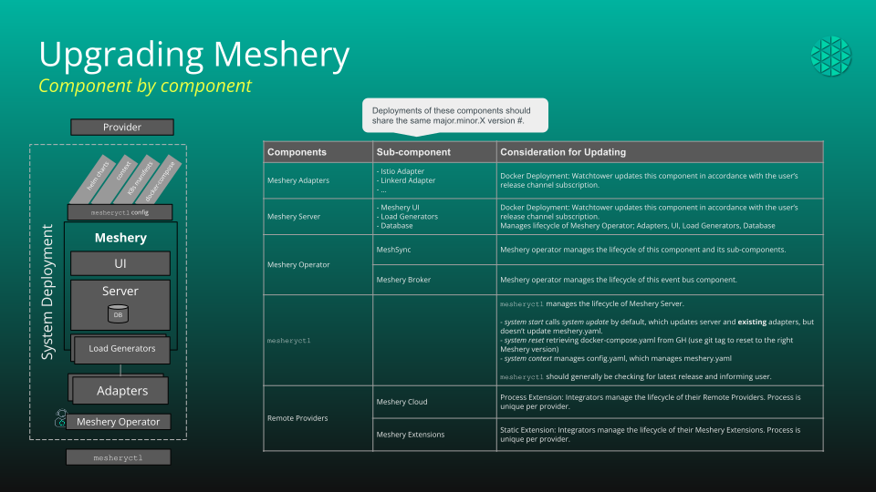

# Upgrade Guide

{}
This page explains how Meshery's components version and upgrade in relation to
one another. For the hands-on procedure, follow the
[Upgrading Meshery guide]().
{}

## Upgrading Meshery Server, Adapters, and UI

Various components of Meshery will need to be upgraded as new releases become available. Meshery is comprised of a number of components including a server, adapters, UI, and CLI. As an application, Meshery is a composition of different functional components.

 <i><small>Figure: Meshery components</small></i>

Some of the components must be upgraded simultaneously, while others may be upgraded independently. The following table depicts components, their versions, and deployment units (deployment groups).

### Versioning of Meshery Components

<table class="mesherycomponents">
    <tr>
        <th>Components</th>
        <th>Sub-component</th>
        <th>Considering or Updating</th>
    </tr>
    <tr>
        <td class="childcomponent">Meshery Adapters</td>
        <td>Any and All Adapters</td>
        <td>Docker Deployment: Watchtower updates this component in accordance with the user’s release channel subscription.</td>
    </tr>
    <tr>
        <td rowspan="3" class="childcomponent">Meshery Server</td>
        <td>Meshery UI</td>
        <td rowspan="3">Manages lifecycle of Meshery Operator; Adapters, UI, Load Generators, Database.  
Docker Deployment: Watchtower updates this component in accordance with the user’s release channel subscription.</td>
    </tr>
    <tr>
        <td>Load Generators</td>
    </tr>
    <tr>
        <td>Database</td>
    </tr>
    <tr>
        <td rowspan="2" class="childcomponent">Meshery Operator</td>
        <td>MeshSync</td>
        <td>Meshery Operator manages the lifecycle of this component and its sub-components.</td>
    </tr>
    <tr>
        <td>Meshery Broker</td>
        <td>Meshery Operator manages the lifecycle of this event bus component.</td>
    </tr>
    <tr>
        <td class="childcomponent">`mesheryctl`</td>
        <td></td>
        <td><code>mesheryctl</code> manages the lifecycle of Meshery Server.   
        <ul> 
            <li><code>system start</code> calls system update by default, which updates the server and existing adapters, but doesn’t update <code>meshery.yaml</code>. Unless the <code>skipUpdate</code> flag is used, operators are also updated here.</li>
            <li><code>system reset</code> retrieves <code>docker-compose.yaml</code> from GitHub (use a Git tag to reset to the right Meshery version).</li>
            <li><code>system restart</code> also updates operators, unless the <code>skipUpdate</code> flag is used.</li>
            <li><code>system update</code> updates operators in case of both Docker and Kubernetes deployments.</li>
            <li><code>system context</code> manages <code>config.yaml</code>, which manages <code>meshery.yaml</code>.</li>
            <li><code>mesheryctl</code> should generally check for the latest release and inform the user.</li>
        </ul>
        </td>
    </tr>
    <tr>
        <td rowspan="2" class="childcomponent"><a style="color:white;" href="">Remote Providers</a></td>
        <td>Meshery Cloud</td>
        <td>Process Extension: Integrators manage the lifecycle of their Remote Providers. The process is unique per provider.</td>
    </tr>
    <tr>
        <td>Meshery Extensions</td>
        <td>Static Extension: Integrators manage the lifecycle of their Meshery Extensions. The process is unique per provider.</td>
    </tr>
</table>

Sub-components deploy as a unit; however, they do not share the same version number.

## How Meshery Server manages Meshery Operator

Meshery Server owns the lifecycle of Meshery Operator on every managed
cluster. Understanding this relationship explains what upgrades automatically
and what you should — and should not — touch by hand.

**Installation.** When Meshery Server connects to a Kubernetes cluster (in
operator deployment mode), it installs the `meshery-operator` Helm chart from
[meshery.io/charts](https://meshery.io/charts) into the `meshery` namespace.
The chart version it requests **matches the Meshery Server release version** —
each Server release snapshots the operator chart (and the operator version
pinned inside it) as of that release.

**Upgrades.** Upgrading Meshery Server is what upgrades the Operator: on
(re)connection, the Server re-applies the operator chart at its own (new)
version. That `helm upgrade` triggers the chart's CRD update Job — a
pre-upgrade hook that server-side-applies the current `Broker` and `MeshSync`
CRD schemas (Helm alone never updates CRDs on upgrade) — and rolls the
Operator Deployment to the operator image pinned in the chart. The Operator
then reconciles MeshSync and the Broker.

**Reconciliation.** The Server periodically re-applies the operator chart if
the Operator is missing or unhealthy (`UpgradeIfInstalled`). Two practical
consequences:

- **Manual operator changes are temporary.** A hand-run
  `helm upgrade meshery-operator --version <x>` or an edited image tag on a
  Server-managed cluster will be reverted to the Server's pinned chart version
  by the next reconciliation. Standalone/manual operator installs are only
  durable on clusters that Meshery Server does not manage.
- **Operator versions are pinned, not floating.** The operator image is a
  fixed version per chart release (no `stable-latest` drift): an Operator pod
  restart never silently changes the operator version. Upgrades happen only
  when the chart content changes — that is, when you upgrade Meshery Server.

**CRDs persist.** The `brokers.meshery.io` and `meshsyncs.meshery.io` CRDs
(and your `Broker`/`MeshSync` objects) deliberately survive operator
uninstalls and Helm release deletion. Removing them — and with them every
custom resource of those types — is an explicit, manual step:
`kubectl delete crd brokers.meshery.io meshsyncs.meshery.io`.

You can toggle operator deployment per cluster in Meshery UI under
**Settings**, or avoid deploying the operator entirely by choosing MeshSync's
[embedded mode]()
for the connection. See
[Meshery Operator]() for
the architecture.

### Meshery Docker Deployments

In order to pull the latest images for Meshery Server, Adapters, and UI, execute the following command:

 <pre class="codeblock-pre">

 
mesheryctl system update

 </pre>

If you wish to update a running Meshery deployment with the images you just pulled, you'll also have to execute:

 <pre class="codeblock-pre">

 
mesheryctl system restart

 </pre>

### Meshery Kubernetes Deployments

Upgrade with Helm, pinning an explicit chart version and using the
upgrade-friendly probe values:

 <pre class="codeblock-pre">

 
helm upgrade meshery meshery/meshery --namespace meshery --version &lt;target-version&gt; -f values-upgrade.yaml --wait

 </pre>

The [Upgrading Meshery guide]()
covers the full procedure, verification steps, and rollback; the
[Operational Readiness Checklist]()
covers production upgrade strategy.

## Upgrading Meshery CLI

The Meshery command-line client, `mesheryctl`, is available in different package managers. Use the instructions relevant to your environment.

### Upgrading `mesheryctl` using Homebrew

To upgrade `mesheryctl`, execute the following command:

 <pre class="codeblock-pre">

 
brew upgrade mesheryctl

 </pre>

### Upgrading `mesheryctl` using Bash

Upgrade `mesheryctl` and run Meshery on Mac or Linux with this script:

 <pre class="codeblock-pre">
 

curl -L https://meshery.io/install | DEPLOY_MESHERY=false bash -

 </pre>

### Upgrading `mesheryctl` using Scoop

To upgrade `mesheryctl`, execute the following command:

 <pre class="codeblock-pre">
 

scoop update mesheryctl

 </pre>

