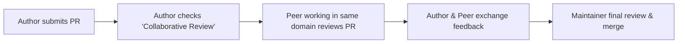

{}
Peer review is not an administrative hurdle or a maintainer-only responsibility. It is one of the most effective ways for contributors to learn the Meshery architecture, discover best practices, build relationships with peers, and improve the quality of their own code.
{}

## Philosophy: Learning and Camaraderie, Not a Chore

During the Meshery Development Meeting on September 23, the community addressed how to foster active peer review participation. A foundational takeaway was clear: **Peer review must never feel like a transactional tax or chore** (*"I have to review someone's PR before mine can be accepted"*). 

Instead, the review process in Meshery is centered on mutual growth:

* **Domain-Relevant Matching:** When you work on a Meshery component (e.g., Meshery UI, Server, CLI `mesheryctl`, MeshModels, or Documentation), reviewing PRs within the same area allows you to see how others solve similar problems and helps you apply those insights to your own pull requests.
* **Continuous Learning:** Reviewing other contributors' work teaches you about Meshery's conventions, design patterns, testing setups, and error codes.
* **Building Camaraderie:** Engaging in respectful, technical dialogue on PRs turns independent contributors into collaborative teammates.

---

## What Qualifies as a Meaningful Review?

A high-value review goes beyond commenting "+1" or "LGTM" (Looks Good To Me). When reviewing PRs in the Meshery ecosystem, strive to provide actionable, helpful feedback across four primary pillars:

### 1. Functional Testing & Verification
The best reviews verify that the code actually works:
* Check out the contributor's branch locally:
  ```bash
  gh pr checkout <PR_NUMBER>
  ```
* Build and test the change locally (e.g., `make server`, `make ui`, or `mesheryctl` commands).
* Test edge cases or scenarios that might not be covered by automated tests.
* Share screenshots or console output demonstrating that you tested the change.

### 2. Architectural & Code Quality Feedback
* **Design & Readability:** Is the logic clean, modular, and consistent with surrounding code?
* **Error Handling:** Does the code use Meshery's error handling conventions and error codes?
* **Performance & Safety:** Are there unnecessary allocations, potential race conditions, or unhandled null/undefined values?
* **Use GitHub's Suggestion Feature:** When suggesting changes, use Markdown suggestions to provide ready-to-commit diffs:
  ````markdown
  ```suggestion
  if err != nil {
      return errors.Wrap(err, "failed to initialize component")
  }
  ```
  ````

### 3. Contribution Hygiene & Compliance
Help your fellow contributors get their PRs merged faster by checking contribution requirements:
* **DCO Sign-off:** Verify that all commits include a Developer Certificate of Origin sign-off (`Signed-off-by: Name <email>`). Commits can be signed using `git commit -s`.
* **Descriptive Titles:** Ensure the PR title includes the subsystem prefix (e.g., `[UI]`, `[Server]`, `[Docs]`, `[mesheryctl]`).
* **Issue Linkage:** Confirm the PR references an open issue (e.g., `Fixes #12345`).
* **Tests & Documentation:** If a feature or bug fix was introduced, ensure accompanying tests or documentation updates were included.

### 4. Tone & Empathy
* Approach every review with kindness and respect.
* Frame critiques as questions or suggestions (e.g., *"What do you think about handling this edge case here?"* instead of *"This will crash"*).
* Praise great implementations and clever solutions.

---

## The Pair / Share Collaboration Model

To make peer review approachable and organic, Meshery embraces a **Pair / Share** model:



### How Pair / Share Works:
1. **Opting-In:** When opening a PR, contributors can check the **Collaborative Review** option in the pull request template to indicate they welcome feedback from peers.
2. **Peer Review Exchange:** Contributors working on adjacent components review each other's changes.
3. **5-Minute Meeting Highlights:** During the weekly Meshery Development Meetings, 5 minutes are set aside to celebrate peer collaborations:
   * Contributors are invited to share: *"I reviewed @peer's PR on component X, and it helped me understand how Y works, which helped me finish my own PR."*

---

## Evaluation of the "Review Ante" Concept

During community discussions, the concept of a **"Review Ante"** (requiring contributors to submit reviews before submitting PRs) was evaluated:

* **Findings:** Enforcing a mandatory quota or gate tends to create perverse incentives. It often leads to superficial reviews, rubber-stamping, and added friction for first-time or occasional contributors.
* **Community Consensus:** Rather than restrictive gates, Meshery favors **positive reinforcement and transparent visibility**:
  * Tracking PRs submitted vs. PRs reviewed.
  * Publicly recognizing top peer reviewers on community leaderboards.
  * Awarding recognition badges on community profiles (e.g., Layer5 Cloud profiles).

---

## Tracking Review Activity & Metrics

To celebrate review activity, Meshery tracks and highlights peer review contributions alongside code submissions:

### GitHub API Capabilities
Meshery leverages GitHub's standard APIs to aggregate review metrics without requiring intrusive custom infrastructure:

* **GraphQL API (User Review Metrics):**
  ```graphql
  query {
    user(login: "USERNAME") {
      contributionsCollection {
        totalPullRequestReviewContributions
        pullRequestReviewContributions(first: 10) {
          nodes {
            pullRequest {
              title
              repository {
                nameWithOwner
              }
            }
          }
        }
      }
    }
  }
  ```

* **REST API (PR Review Tracking):**
  ```http
  GET /repos/meshery/meshery/pulls/{pull_number}/reviews
  ```

### Visibility & Community Badges
Review metrics are integrated into community recognition systems:
* **Contributor Leaderboard:** Highlighting contributors who actively support peers through reviews.
* **Profile Badges:** Recognizing contributors who consistently provide thorough, constructive feedback.

---

## Next Steps for Contributors

Ready to get involved in reviews?
1. Visit the [Meshery Pull Requests](https://github.com/meshery/meshery/pulls) tab.
2. Filter for areas you are familiar with (e.g., `is:open is:pr label:area/ui` or `label:component/server`).
3. Pick a PR that has not yet been reviewed, test the changes, and leave helpful, constructive feedback!
