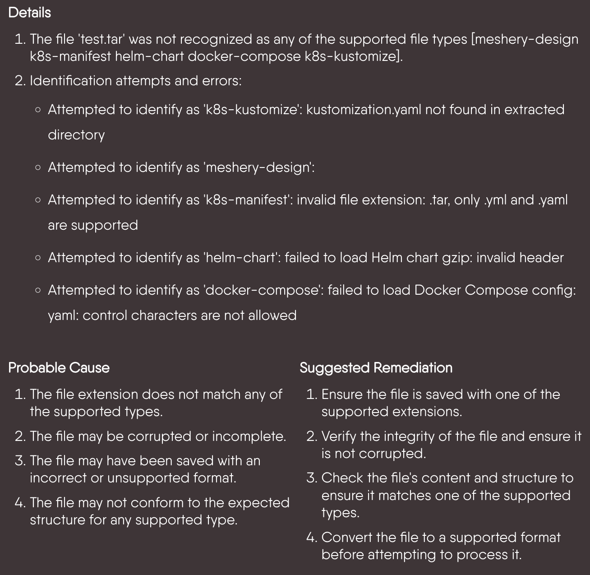
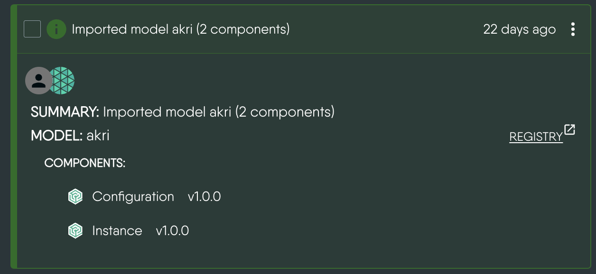
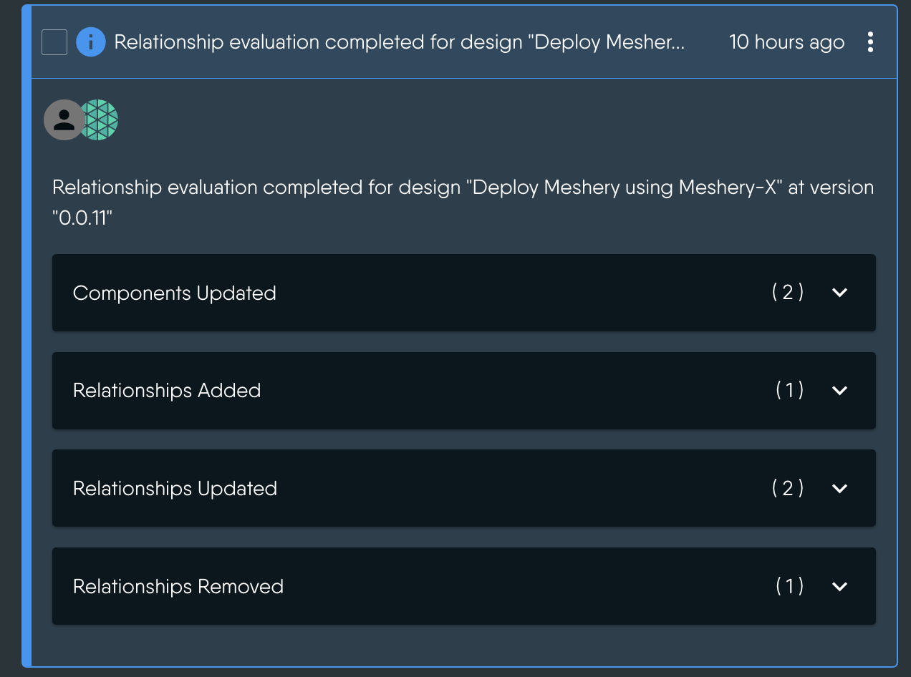
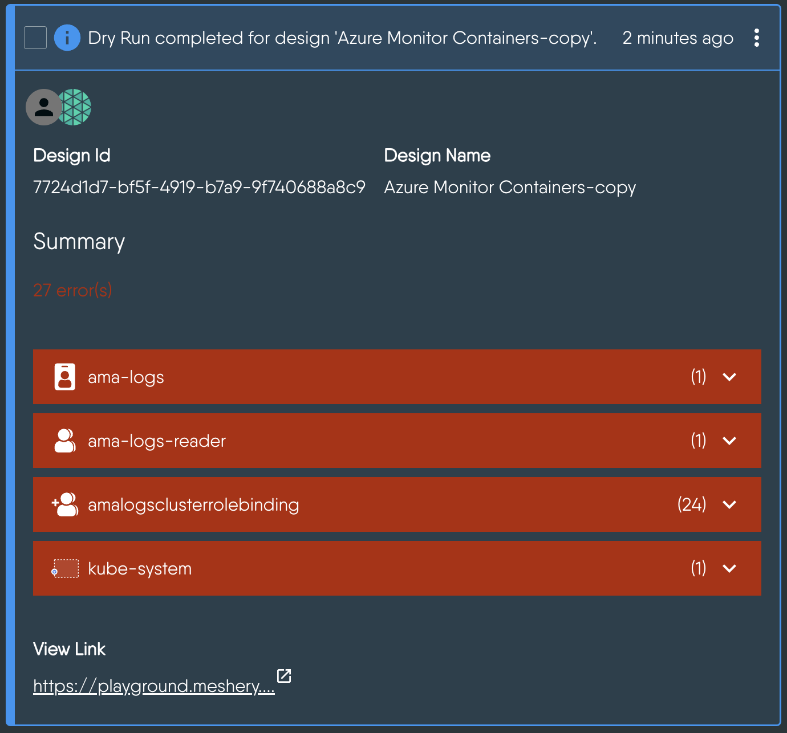

<div class="prereqs"><p><strong style="font-size: 20px;">Prerequisite Reading</strong></p>
  <ol><li><a href="">Contributing to Meshery UI</a></li></ol>
</div>

## Table of Contents

- [Table of Contents](#table-of-contents)
- [What is the Notification Center?](#what-is-the-notification-center)
  - [User-facing Features](#user-facing-features)
  - [How Events Reach the Client](#how-events-reach-the-client)
  - [State Management and Internal Details](#state-management-and-internal-details)
  - [Bulk Operations](#bulk-operations)
  - [Initiating a Bulk Operation](#initiating-a-bulk-operation)
- [Key Files and Directories](#key-files-and-directories)
  - [`NotificationCenter/` _(Root Directory)_](#notificationcenter-root-directory)
  - [`formatters/` _(NotificationCenter/formatters)_](#formatters-notificationcenterformatters)
  - [Components Outside the Directory](#components-outside-the-directory)
- [Metadata Formatter](#metadata-formatter)
  - [The Dynamic Formatter](#the-dynamic-formatter)
  - [The Metadata Specific Formatter](#the-metadata-specific-formatter)
  - [Reusability](#reusability)
- [How Notification Metadata is Rendered](#how-notification-metadata-is-rendered)
  - [Registering an Event Specific Formatter](#registering-an-event-specific-formatter)
- [Types of Event Specific Notification Formatters](#types-of-event-specific-notification-formatters)
  - [Common Formatter](#common-formatter)
  - [Error Formatter](#error-formatter)
  - [Model Registration Formatter](#model-registration-formatter)
  - [Relationship Evaluation Formatter](#relationship-evaluation-formatter)
    - [Key Components](#key-components)
    - [When to Use](#when-to-use)
    - [User Experience: Relationship Evaluation Notification](#user-experience-relationship-evaluation-notification)
  - [Dry Run and Schema Validation Formatters](#dry-run-and-schema-validation-formatters)
    - [Key Components](#key-components-1)
    - [When to Use](#when-to-use-1)
  - [Deployment Summary Formatter](#deployment-summary-formatter)
    - [Key Components](#key-components-2)
    - [When to Use](#when-to-use-2)
  - [MeshSync Events Formatter](#meshsync-events-formatter)
  - [Academy Events Formatter](#academy-events-formatter)
  - [PropertyFormatters and PropertyLinkFormatters](#propertyformatters-and-propertylinkformatters)
    - [Examples of Property Formatters](#examples-of-property-formatters)
    - [When to Use](#when-to-use-3)

<video style="width:min(100%,750px)" height="auto" autoplay muted loop>
  <source src="https://github.com/meshery/meshery/assets/65964225/345672de-3f61-4be0-b3c8-0e7480cc496c" type="video/mp4">
 Your browser does not support the video tag
</video>

## What is the Notification Center?

The Notification Center is a dedicated panel in Meshery’s UI that helps you monitor, understand, and respond to events across your system. It acts as a central place where you can see important updates related to your infrastructure, workloads, and Meshery’s internal operations.

> Want to understand how users interact with the Notification Center? [Learn more here](https://docs.meshery.io/guides/infrastructure-management/notification-management).

---

The `NotificationCenter` component of Meshery UI receives events over a Server-Sent Events (SSE) stream and implements robust filtering on top of them. Events are persisted in Meshery Server and state management on the client is done using Redux Toolkit and RTK Query.

### User-facing Features

- Robust filtering support inspired by GitHub's notification filtering style.
  - Search is also included.
- Proper hierarchical presentation of error details, including probable cause and suggested remediation.
- Support for notification status (notifications can be marked as read and unread)
  - _Future: Notifications can be acknowledged or resolved._
- Event-based notification via an SSE subscription (provided by Meshery Server and any upstream components or externally managed systems, like Kubernetes)
- Sharing of a notification to social platforms, and a direct link to the error code reference documentation when the event carries an error code.
- Infinite scroll for pagination.

### How Events Reach the Client

Real-time delivery is handled by a native [`EventSource`](https://developer.mozilla.org/en-US/docs/Web/API/EventSource) connection. This replaced the former GraphQL `subscribeEvents` subscription, so contributors should not expect to find Relay or GraphQL code in this path anymore.

The chain looks like this:

1. `NotificationCenterProvider` (`index.tsx`) spawns the `operationsCenterActor` state machine using `useActorRef`.
2. The machine spawns a subscription actor that calls `subscribeToEvents` from `ui/lib/eventsSubscription.ts`.
3. `subscribeToEvents` opens an `EventSource` against `GET /api/system/events/subscribe`. Because the stream is same-origin, the browser automatically carries the `meshery-provider` auth cookie.
4. Each frame arrives as `data: <event-json>` and is parsed into the raw event object. This is the same camelCase shape that the REST endpoint `/api/system/events` returns, so it is consumed as-is by the rest of the UI.
5. For every event received, the machine stores it in Redux (`pushEvent`), invalidates the relevant RTK Query cache tag, and raises a toast through `notify`.

Connection failures are handled inside `subscribeToEvents`. `EventSource` reconnects on its own while the connection is merely dropping, so an error is only surfaced to the caller once the browser permanently closes the stream. That notification is additionally delayed by a few seconds, which prevents a persistent failure (an expired session, for example) from turning caller-driven re-subscription into a request storm. The function returns a `{ dispose }` handle, and the state machine restarts the subscription actor when an error is finally reported.

All other operations — listing, filtering, marking read/unread, deleting, and configuration — go through REST endpoints under `/api/system/events` defined in `ui/rtk-query/notificationCenter.ts`.

### State Management and Internal Details

- The state on the client is managed using `Redux Toolkit` and `RTK Query`.
- Update and Delete operations are optimistically handled.
- Network requests are cached and invalidated when new events arrive or events are deleted/updated.
- Due to the need for infinite scroll and optimistic updates, events are stored globally in Redux (`ui/store/slices/events.ts`) using an entity adapter.

### Bulk Operations

Bulk operations in the Notification Center allow users to perform actions like deleting multiple notifications or changing the status of multiple notifications in a batch. This documentation outlines the key features and functionality of bulk operations, including the restriction of performing only one bulk operation at a time, the disabling of buttons during ongoing operations, and the display of a loading icon to indicate ongoing activity.

### Initiating a Bulk Operation

- Users select the notifications they want to include in the bulk operation. This is typically done by checking checkboxes next to each notification.
- After selecting notifications, users trigger the desired bulk operation (e.g., delete or change status) by clicking the corresponding action button.
- Once initiated, the bulk operation begins processing the selected notifications.

## Key Files and Directories

This section outlines the essential files and folders that you'll interact with when working on the Notification Center. Every file in this directory has a colocated `*.test.tsx` file; add or update tests alongside any change you make.

### `NotificationCenter/` _(Root Directory)_

**Path:** `ui/components/layout/NotificationCenter/`

- **index.tsx**: Contains the main context provider (`NotificationCenterProvider`), the drawer component, the severity chips, the bulk action bar, and the event list. It also spawns the `operationsCenterActor` that owns the SSE subscription.
- **metadata.tsx**: Defines `PropertyFormatters`, `LinkFormatters`, `PropertyLinkFormatters`, and the internal `EventTypeFormatters` registry. Contains the `FormattedMetadata` component which decides _how_ to format the metadata based on event type or specific properties, plus `FormattedLinkMetadata` for the links rendered in the header of an expanded notification.
- **notification.tsx**: Defines how an individual notification is rendered, including the summary row, the ellipsis menu (`Share`, `Error Docs`, metadata links, delete, change status), and the expanded detail view. Also exports `getErrorCodesFromEvent` and `canTruncateDescription`.
- **constants.tsx**: Defines `SEVERITY`, `STATUS`, `SEVERITY_STYLE`, the `EVENT_TYPE` catalog, and the `eventDetailFormatterKey` helper used to key event specific formatters.
- **filter.tsx**: Builds the filter schema (severity, status, action, author, category) consumed by the shared typing-filter field. The available actions and categories are fetched from `/api/system/events/types`.
- **notificationCenter.style.tsx** and **shared.style.tsx**: Styled components for the drawer, list, chips, and menus.

### `formatters/` _(NotificationCenter/formatters)_

This directory houses reusable formatter components dedicated to specific types of metadata or event types.

- **common.tsx**: Contains shared components like `TitleLink`, `DataToFileLink`, and `EmptyState`.
- **error.tsx**: Defines `ErrorMetadataFormatter` for displaying structured error details.
- **model_registration.tsx**: Contains formatters for model import/registration events (`ModelImportMessages`, `ModelImportedSection`).
- **pattern_dryrun.tsx**: Defines `DryRunResponse` and `SchemaValidationFormatter`, which delegate to the design lifecycle components.
- **relationship_evaluation.tsx**: Defines `RelationshipEvaluationEventFormatter`, responsible for rendering notifications related to the evaluation of relationships between components in a design.
- **meshsync_events.tsx**: Defines `MeshSyncPropertyFormatters` for connection and MeshSync deployment fields.
- **academy_events.tsx**: Defines `AcademyEventsFormatter` for quiz evaluation results.
- **RegistrantSummaryFormatter.tsx**: Formatter for registrant summary events. Currently present but not registered in `metadata.tsx`.

### Components Outside the Directory

Two dependencies live outside the Notification Center but are worth knowing about:

- `ui/components/data-formatter/` provides the generic structured-data renderer (`FormatStructuredData`) that the Notification Center uses as its fallback, along with the primitives formatters compose with (`SectionBody`, `KeyValue`, `ArrayFormatter`, `TextWithLinks`, `TitleLink` helpers, `reorderObjectProperties`). Changes there affect other parts of Meshery UI, so treat it as a shared library rather than Notification Center code.
- `ui/components/designs/lifecycle/` provides `DeploymentSummaryFormatter`, `FormatDryRunResponse`, and `ValidationResults`, which are reused by design-related notifications.

## Metadata Formatter

When the server sends an event, it follows a consistent schema that contains metadata intended for user presentation. This metadata typically includes fields such as `description`, `createdAt`, `userID`, `systemID`, `action`, `category`, and the resources involved.

In some cases, the metadata may also contain more detailed information—such as a traceback, a summary, or a complete error log—which is dynamically generated at runtime and encapsulated within the event.

Presenting this structured information in a clear and accessible way is essential, as it provides valuable insights into system behavior and ongoing operations.

To accomplish this task, we employ metadata formatters that transform structured data into visually appealing formats. There are currently two types of formatters in use:

1. **Metadata Specific Formatters:** These formatters are specifically designed for particular types of metadata, such as errors and dry run responses. Metadata Specific Formatters are implemented as React components that take the metadata as input and render it within the component.
2. **Dynamic Formatter:** Since metadata can vary significantly in structure, it is not practical to create a specific formatter for each kind. The dynamic formatter analyzes the schema's structure and applies custom-defined rules for formatting.

### The Dynamic Formatter

The dynamic formatter is `FormatStructuredData`, imported from `ui/components/data-formatter`. It walks the metadata recursively and picks a renderer based on the shape of each value:

- Text strings are rendered with `SectionBody`, which uses `TextWithLinks` to detect URLs in the string and replace them with link components.
- Arrays are rendered with `ArrayFormatter` as a bulletized list, recursing into each item.
- Object properties with string values are treated as key-value pairs and rendered with `KeyValue`.
- Nested objects get a section heading and are rendered recursively, with the heading size decreasing by depth.

`FormatStructuredData` accepts a `propertyFormatters` map. Whenever a property name matches a key in that map, the mapped function takes over rendering for that property, which is how the Notification Center injects its own formatters into an otherwise generic renderer.

### The Metadata Specific Formatter

Certain metadata, such as Design deployment summaries and Errors, hold high importance and have dedicated renderers. These dedicated renderers can still utilize the dynamic formatter to format specific parts of the response.

### Reusability

While this system was initially developed for our events and notification center, the components it comprises are highly reusable and can be employed in other contexts where dynamic formatting of structured data is required.

## How Notification Metadata is Rendered

When a notification event is received from the server, it includes a `metadata` field containing structured, event-specific information. The purpose of formatters is to present this data in a clean, readable, and user-friendly format inside the expanded view of each notification.

The core logic for rendering metadata is handled by the `FormattedMetadata` component in `metadata.tsx`, which follows this decision tree:

1. **Event-Specific Formatter Check**
   If a formatter is registered for the event's `action` and `category` combination (under `EventTypeFormatters`), that dedicated formatter is used and receives the whole `event`, giving it full control over how the metadata is displayed.

2. **Empty Metadata Check**
   If the event has no metadata, or the metadata is empty at all depths, `EmptyState` renders the event description on its own.

3. **Fallback to Property-Based Formatting**
   Otherwise, `FormattedMetadata` reorders the metadata into a stable display order, strips out properties that are rendered elsewhere (links, `id`, `kind`), and hands the result to `FormatStructuredData` along with:

   - `PropertyFormatters` – for structured or specialized visual formats.
   - `PropertyLinkFormatters` – consumed separately by the ellipsis menu in `notification.tsx` to render actionable links (e.g. file downloads, log views).

### Registering an Event Specific Formatter

Formatters are keyed by `eventDetailFormatterKey`, which produces a string in the form `` `${action}-${category}` ``. To add a new one:

1. Add an entry to `EVENT_TYPE` in `constants.tsx` with the event's `action` and `category`, matching what Meshery Server emits.
2. Create the formatter component under `formatters/`. It receives a single `event` prop.
3. Register it in the `EventTypeFormatters` map in `metadata.tsx` using `eventDetailFormatterKey(EVENT_TYPE.YOUR_EVENT)`.

## Types of Event Specific Notification Formatters

### Common Formatter

**Path:** `ui/components/layout/NotificationCenter/formatters/common.tsx`

The following reusable components standardize how notification links, empty states, and downloadable traces are displayed:

1. **TitleLink**: Renders a styled title with an external link icon. Any additional anchor attributes are forwarded, so `target="_self"` can be used for in-app navigation.
   Props:

   - `href` (required): URL of the link.
   - `children`: The link text.

2. **EmptyState**: Displays the event description when no specific metadata is available for an event.
   Props:

   - `event` (required): The event object; only `description` is read.

3. **DataToFileLink**: Converts event data into a downloadable `.txt` file.
   Props:
   - `data` (required): Can be a string or a JSON-serializable object.

### Error Formatter

The `ErrorMetadataFormatter` is used for formatting error-related notifications in the Meshery UI Notification Center. It structures error details, probable causes, and suggested remediations in a readable format. Each entry is rendered as Markdown, so bullets and inline formatting supplied by the server are preserved.

- **Details**: A comprehensive explanation of the error, often broken into multiple points or steps.
- **Probable Cause**: A list of potential reasons why the error occurred, helping the user understand the root cause.
- **Suggested Remediation**: Actionable steps or recommendations to resolve the issue.
- Inside the ellipse menu, the user can find the error code docs link for further explanation of the error. The code is extracted by `getErrorCodesFromEvent`, which looks at both `metadata.error` and errors nested inside `metadata.ModelDetails`.

**Props:**

- `metadata` (object): Contains error metadata fields, each an array of strings:
  - `LongDescription`: Provides details about the error.
  - `ProbableCause`: Lists possible reasons for the error.
  - `SuggestedRemediation`: Suggests solutions to fix the error.
- `event` (object, optional): Contains the notification event data. Only `description` is read.

**Path:** `ui/components/layout/NotificationCenter/formatters/error.tsx`

**Example:**

```tsx
<ErrorMetadataFormatter
  metadata={{
    LongDescription: ['An unexpected error occurred while deploying the design.'],
    ProbableCause: ['Misconfigured Kubernetes cluster.'],
    SuggestedRemediation: ['Check your kubeconfig file and retry deployment.'],
  }}
  event={{ description: 'Design deployment failed' }}
/>
```

<a href="../images/error-formatter.png"></a>

**When to Use:**

The `ErrorMetadataFormatter` is used when dealing with structured error events that follow a pattern (description, cause, remediation). A new formatter should be created only if the error metadata deviates significantly from the `ErrorMetadataFormatter` metadata structure.

### Model Registration Formatter

The `Model Registration Formatter` formats and displays model registration details, including components and relationships, in Meshery UI's Notification Center. It ensures structured representation of imported models and error handling during the import process. It also distinguishes between models and standalone entity files (`.yaml`, `.yml`, `.json`), labelling the heading accordingly and linking successful model imports to the registry.

**Path:** `ui/components/layout/NotificationCenter/formatters/model_registration.tsx`

**Components:**

1. **ModelImportedSection** _(exported)_: Displays the details of the imported model along with components, relationships, and any errors that occur.

   **Props:**

   - `modelDetails` (object): A map of model name to import details, each containing optional `Components`, `Relationships`, and `Errors` arrays.

2. **ModelImportMessages** _(exported)_: Renders the import summary line.

   **Props:**

   - `message` (node): The summary message supplied by the server.

3. **UnsuccessfulEntityWithError** _(internal)_: Used by `ModelImportedSection` to handle error cases during model import. It identifies the type and count of entities that failed to import and delegates the error body to `ErrorMetadataFormatter`.

   **Props:**

   - `modelName` (string): The name of the model or file being imported.
   - `error` (object): Contains `name`, `entityType`, and the nested `error` details.

<a href="../images/model-register-formatter.png"></a>

### Relationship Evaluation Formatter

The **Relationship Evaluation Formatter** is responsible for rendering notifications related to the evaluation of relationships between components in a design. It provides a detailed breakdown of changes in components and relationships, such as additions, updates, and removals, during the evaluation process.

**Path:** `ui/components/layout/NotificationCenter/formatters/relationship_evaluation.tsx`

#### Key Components

1. **RelationshipEvaluationEventFormatter**:
   The main formatter component that renders the event description and invokes the `RelationshipEvaluationTraceFormatter` to display detailed traces.

**Props:**

- `event` (object): Contains:
  - **description**: A description of the evaluation process.
  - **metadata.evaluationResponse** (or `metadata.evaluation_response`): The evaluation result, containing:
    - `actions` (Array): The list of changes produced by the evaluation.
    - `design` (Object): The evaluated design, used to resolve components and relationships by ID.

2. **RelationshipEvaluationTraceFormatter**:
   Takes `actions` and `design` and derives the displayed categories by filtering actions on their `op` field:

   - Components: `add_component`, `delete_component`, `update_component` / `update_component_configuration`
   - Relationships: `add_relationship`, `delete_relationship`, `update_relationship`

   Each category is rendered as a collapsible section that shows its item count and is hidden entirely when empty. Deletions read the component or relationship from the action payload itself, while additions and updates are resolved against the design.

<a href="../images/relationship-evaluation-formatter.png"></a>

#### When to Use

The **Relationship Evaluation Formatter** is specifically designed to handle notifications related to changes in components and their relationships during an evaluation process. Use this formatter in the following scenarios:

1. When a notification involves the evaluation of relationships between components in a design.
2. When you need to display categorized changes in components and relationships.
3. When the event metadata includes an `evaluationResponse` object containing the actions and the evaluated design.

#### User Experience: Relationship Evaluation Notification

1. **Evaluation Summary**:
   The notification starts with a summary of the evaluation process.
   Example:
   `"Relationship evaluation completed for design 'Deploy Meshery using Meshery-X' at version '0.0.11'"`
   This gives the user context about which design and version were evaluated.

2. **Detailed Changes**:
   The notification breaks down the changes into collapsible categories:

   - **Components**:
     - **Added**: New components introduced in the design.
     - **Updated**: Existing components that were modified.
     - **Deleted**: Components that were removed from the design.
   - **Relationships**:
     - **Added**: New relationships established between components.
     - **Updated**: Existing relationships that were modified.
     - **Deleted**: Relationships that were removed.

   If the evaluation produced no actions at all, an empty state is shown instead.

3. **Component Details**:
   For each component, the notification displays its icon, kind, name, and the model and version it belongs to.

4. **Relationship Details**:
   For each relationship, the notification displays its type, the source and target components involved, and the associated model and version.

### Dry Run and Schema Validation Formatters

The **Dry Run Formatter** is responsible for rendering notifications related to the dry run validation of a design. A dry run simulates the deployment or undeployment of a design to identify potential errors without actually applying the changes.

**Paths:**

- `ui/components/layout/NotificationCenter/formatters/pattern_dryrun.tsx` _(Notification Center entry points)_
- `ui/components/designs/lifecycle/DryRun.tsx` and `ui/components/designs/lifecycle/ValidateDesign.tsx` _(rendering)_

#### Key Components

1. **DryRunResponse**:
   The property formatter registered for the `dryRunResponse` metadata field. It normalizes the raw response and hands it to `FormatDryRunResponse`.

   **Props:**

   - `response`: The raw dry run response from the server.

2. **FormatDryRunResponse**:
   Renders the dry run validation results, including the total number of errors.

   **Props:**

   - **dryRunErrors** (array): An array of errors detected during the dry run. Each error includes:
     - `type`: The type of error (e.g., `RequestError`, `ComponentError`).
     - `fieldPath`: The specific field in the design where the error occurred.
     - `message`: A detailed error message.
   - **configurableComponentsCount** (number): The number of configurable components in the design.
   - **annotationComponentsCount** (number): The number of annotation components in the design.
   - **validationMachine** (object): The state machine handling the dry run validation process.
   - **currentComponentName** (string): The name of the component currently being validated.

3. **SchemaValidationFormatter**:
   The event specific formatter registered for design validation events. It reads `metadata.validationResult`, `metadata.design_name`, `metadata.total_components`, and `metadata.configurable_components`, totals the errors across services, and renders `ValidationResults`.

   **Props:**

   - `event` (object): The notification event.

<a href="../images/dry-run-formatter.png"></a>

#### When to Use

These formatters are used in the following scenarios:

1. When a notification involves the validation of a design through a dry run process.
2. When you need to display errors detected during the dry run.
3. When the event metadata includes details about configurable and annotation components.

### Deployment Summary Formatter

The **Deployment Summary Formatter** is responsible for rendering notifications related to the deployment or undeployment of components in a design.

**Path:** `ui/components/designs/lifecycle/DeploymentSummary.tsx`

#### Key Components

1. **DeploymentSummaryFormatter**:
   This component is used to display:
   - **Event Description**: A brief description of the deployment event.
   - **Errors**: Any errors encountered during the deployment process, rendered through `ErrorMetadataFormatter`.
   - **Component Details**: A list of components with their deployment status and metadata, flattened out of the per-context summary.
   - **Open In Operator**: A shortcut to the deployed design, shown only when the Meshery Operator is enabled and the action is not a registration.

**Props:**

- **event** (object): Contains:
  - **description**: A brief description of the deployment event.
  - **action**: The type of action performed (e.g., `deploy`, `undeploy`).
  - **severity**: The severity level of the event, used to colour the summary.
  - **metadata**:
    - **summary**: A detailed summary of the deployment process, including component details per context.
    - **error**: Any errors encountered during the deployment process.
    - **design_name**: The name of the design being deployed.
    - **design_id**: The ID of the design being deployed.

#### When to Use

The **Deployment Summary Formatter** should be used in the following scenarios:

1. **Deployment or Undeployment Events**:
   When the `event.action` is either `deploy` or `undeploy` and the `event.metadata` includes `design_name`.
2. When a notification involves the deployment or undeployment of a design.

### MeshSync Events Formatter

**Path:** `ui/components/layout/NotificationCenter/formatters/meshsync_events.tsx`

This module exports `MeshSyncPropertyFormatters`, a set of property formatters that are spread into `PropertyFormatters` in `metadata.tsx` rather than registered as an event specific formatter. It covers `connectionID`, `k8sContextID`, `k8sContextName`, `meshsyncDeploymentMode`, `operatorStatus`, and `brokerEndpoint`.

Connection-related fields are rendered as clickable chips that deep-link into the connections page with the value pre-filled as a search term. Field names are humanized by `humanizeFieldName`, which converts camelCase keys into title case (for example, `k8sContextName` becomes `K8s Context Name`).

### Academy Events Formatter

**Path:** `ui/components/layout/NotificationCenter/formatters/academy_events.tsx`

`AcademyEventsFormatter` renders quiz evaluation results from `metadata.result`, showing the quiz title, attempt time, score against the pass percentage, pass/fail outcome, and a per-question breakdown. It renders an inline message rather than throwing when the event payload is incomplete, which is a useful pattern to follow for formatters that depend on deeply nested metadata.

### PropertyFormatters and PropertyLinkFormatters

**Purpose:**
When an event does not match an entry in `EventTypeFormatters`, **PropertyFormatters** are used to format and render specific metadata fields in a structured and visually appealing way. **PropertyLinkFormatters** are handled separately: `notification.tsx` maps the event metadata through them to build the actionable links shown in the ellipsis menu.

#### Examples of Property Formatters

1. **trace**: Converts large trace data into a downloadable file link.
2. **ShortDescription**: Displays a short description of the event, unless the event carries an error or the description is short enough to be shown in full in the summary row.
3. **error**: Uses the `ErrorMetadataFormatter` to display structured error details.
4. **design**: Renders a link that opens the saved design.
5. **dryRunResponse**, **ModelImportMessage**, **ModelDetails**: Delegate to the dry run and model registration formatters.
6. **MeshSync fields**: Spread in from `MeshSyncPropertyFormatters`.

Examples of property link formatters include `doc` (documentation reference), `DownloadLink` (downloads a file through `/api/system/fileDownload`), and `ViewLink` (opens logs through `/api/system/fileView`).

#### When to Use

Use **PropertyFormatters** and **PropertyLinkFormatters** in the following scenarios:

1. When an event does not have a specific `EventTypeFormatter` defined.
2. When you need to render individual metadata fields in a structured and visually appealing way.
3. When the same field appears across several event types and should always look the same.
4. When metadata includes fields like trace data, short descriptions, or error details that require specialized formatting.

---