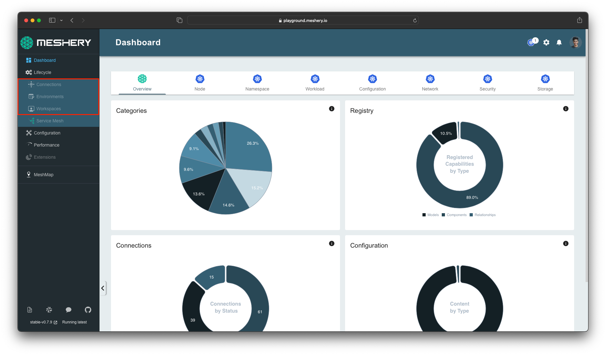

Meshery features an extensible authorization system that offers the ability to deliver fine-grained access control across its web-based user interface, [Meshery UI]().

## Authorization Keys

The extensible authorization system consists of a large set of keys. Each key uniquely represents a specific capability, for example, the ability to view a [Connection](), edit or delete a Connection. With the help of these keys, the system evaluates the permissions during runtime and renders the UI, helping to offer both a secure management system and a customizable user experience.

{}
The extensible authorization system is available to both Local and Remote Providers. Depending on your chosen [Remote Provider](), you may be offered features such as grouping keys, assigning them to user groups, or assigning them to user roles rather than just individual users.
{}

### Adding a New Permission Key

Permission keys are added via a two-repository workflow:

1. **Meshery Schemas**: The repository where keys are registered in a CSV spreadsheet and compiled into Go/TS constants.
2. **Meshery Server / UI**: The codebase that downloads these keys from the provider, maps them to CASL runtime abilities, and gates UI components.

---

### Step-by-Step Guide

Follow these steps to generate, register, sync, and wire up a new permission key. This guide uses the **Evaluate Relationships** key (added in [schemas PR #909](https://github.com/meshery/schemas/pull/909)) as a running example.

#### Phase 1: Define Key in `meshery/schemas`

##### Step 1: Generate a UUID v4
Generate a unique, lowercase UUID v4 for the new permission key:


##### Step 2: Add a Row to `permissions.csv`
Open the local CSV registry [`build/permissions.csv`](https://github.com/meshery/schemas/blob/master/build/permissions.csv) in your local `meshery/schemas` clone. **Copy an existing row** under the same category and modify it. Avoid creating sparse rows. Ensure the following core columns are set:
*   **Theme**: High-level keychain category (e.g. `Catalog Management`).
*   **Category**: Specific feature area (e.g. `Designs`).
*   **Function**: Permission name (e.g. `Evaluate Relationships`).
*   **Feature**: Description of the capability (e.g. `Evaluate relationships inside a design`).
*   **Key ID**: The generated UUID from Step 1 (e.g. `c7752be7-5c0f-465d-a8ba-5594acd08b93`).
*   **Local Provider**: Set to `TRUE` to seed the key for local development.

##### Step 3: Run the Generators
From the root of `meshery/schemas`, run the generator command:

This compiles the CSV registry into:
*   [`models/permissions/permissions.go`](https://github.com/meshery/schemas/blob/master/models/permissions/permissions.go) (Go constants in PascalCase, combining Theme + Function, e.g. `CatalogManagementEvaluateRelationships`).
*   [`typescript/permissions.ts`](https://github.com/meshery/schemas/blob/master/typescript/permissions.ts) (TypeScript definitions).

##### Step 4: Submit Pull Request in Schemas
Verify correctness and submit a PR to the schemas repository:


---

#### Phase 2: Spreadsheet Sync

##### Step 5: Wait for `keys.csv` Sync in `meshery/meshery`
The [`server/permissions/keys.csv`](https://github.com/meshery/meshery/blob/master/server/permissions/keys.csv) file (used to seed the Local Provider database) is updated automatically by the [`Import Keys`](https://github.com/meshery/meshery/blob/master/.github/workflows/generate_keys.yml) workflow, which downloads the Google Spreadsheet as a CSV every day. Keys with `Local Provider = TRUE` in the spreadsheet will be committed to `keys.csv` and seeded on Meshery Server startup via [`SeedKeys`](https://github.com/meshery/meshery/blob/master/server/models/keys_helper.go).

*Note: If you need the key immediately for local testing without waiting for the daily sync, temporarily copy the row directly into your local `server/permissions/keys.csv`.*

---

#### Phase 3: Wire Key in `meshery/meshery` (UI)

##### Step 6: Map UI Constants
Add the mapping to the `keys` object in [`ui/utils/permission_constants.ts`](https://github.com/meshery/meshery/blob/master/ui/utils/permission_constants.ts) (and mirror in [`docs/static/js/permission_constants.js`](https://github.com/meshery/meshery/blob/master/docs/static/js/permission_constants.js)):
{{< code code=`EVALUATE_RELATIONSHIPS: {
  subject: 'Evaluate Relationships',
  action: 'c7752be7-5c0f-465d-a8ba-5594acd08b93',
},` >}}
*   **subject**: Must **exactly** match the `Function` column in `permissions.csv` (case-sensitive).
*   **action**: The generated UUID.

##### Step 7: Gate the Component using `CAN`
Import the `CAN` utility and `keys` mapping, and use it to conditionally gate your component actions:
{{< code code=`import CAN from '@/utils/can';
import { keys } from '@/utils/permission_constants';

const canEvaluate = CAN(keys.EVALUATE_RELATIONSHIPS.action, keys.EVALUATE_RELATIONSHIPS.subject);

return (
  <Button disabled={!canEvaluate} onClick={handleEvaluate}>
    Evaluate Relationships
  </Button>
);` >}}

##### Step 8: Verify End-to-End
1. Run `make ui-lint` to verify typescript code guidelines.
2. Restart Meshery Server (or reset database settings) to seed the local provider with the new key.
3. Login and verify that the button gates correctly based on user roles.

---

## Reference: End-to-End Key Mapping

This example shows how the **Evaluate Relationships** key is wired across each layer of the application:

1. **Provider Manifest (API output)**:
{{< code code=`{
  "id": "c7752be7-5c0f-465d-a8ba-5594acd08b93",
  "function": "Evaluate Relationships",
  "category": "Catalog Management",
  "subcategory": "Designs"
}` >}}

2. **UI Constant Entry (`permission_constants.ts`)**:
{{< code code=`EVALUATE_RELATIONSHIPS: {
  subject: 'Evaluate Relationships',
  action: 'c7752be7-5c0f-465d-a8ba-5594acd08b93',
}` >}}

3. **CASL ability mapping (`ui/rtk-query/ability.tsx`)**:
{{< code code=`const abilities = data?.keys?.map((key) => ({
  action: key.id,
  subject: _.lowerCase(key.function), // CASL compares lowercased subject
}));` >}}

4. **React Component Gating (`ui/components/registry/MeshModelComponent.tsx`)**:


---

## Where Permission Keys Are Stored in the Browser

When testing permission keys locally, the main client-side caches are stored under **`sessionStorage`** and **Cookies** (not `localStorage`):

| Location | Key / object | Contents |
|----------|--------------|----------|
| **`Cookies`** | `token` | The session authorization token. Sent automatically with requests to authenticate the user and authorize access to org-specific permission keys. |
| **`Cookies`** | `meshery-provider` | The active provider (e.g., `Local` or `Layer5`). |
| **`sessionStorage`** | `keys` | JSON array of key objects from the provider (`id`, `function`, `category`, …). Written by [`setKeys`](https://github.com/meshery/meshery/blob/master/ui/store/slices/mesheryUi.ts) and read on startup by [`loadAbility`](https://github.com/meshery/meshery/blob/master/ui/pages/_app.tsx). |
| **`sessionStorage`** | `currentOrg` | Selected organization. Keys are fetched per org via `GET /api/identity/orgs/{orgId}/users/keys`. |
| **In-memory (CASL)** | `ability` in [`ui/utils/can.ts`](https://github.com/meshery/meshery/blob/master/ui/utils/can.ts) | Runtime rules: `{ action: key.id, subject: lowerCase(key.function) }`. Updated by [`ability.update(...)`](https://github.com/meshery/meshery/blob/master/ui/rtk-query/ability.tsx). |
| **Redux store** | `state.ui.keys` | Same array as `sessionStorage.keys`. |
| **RTK Query cache** | `getUserKeys` | Cached response for `/api/identity/orgs/{orgId}/users/keys`. |

On login, Meshery either reuses `sessionStorage.keys` or refetches from the provider, then updates CASL. The static map in [`permission_constants.ts`](https://github.com/meshery/meshery/blob/master/ui/utils/permission_constants.ts) is source code—not browser storage—but `CAN(...)` compares those constants against the CASL rules built from the stored provider keys.

Inspect keys in DevTools (**Application → Session Storage**):


You can also check cookies under DevTools (**Application → Storage → Cookies**).

---

## Troubleshooting Permissions

Use this checklist when a gated button does not appear, permissions look stale after a role change, or a newly added key does not work end-to-end.

##### 1. Confirm the provider returned the key
In DevTools **Network**, check the response for:
`GET /api/identity/orgs/{orgId}/users/keys`
Verify your UUID is in the `keys` array and that `function` matches the `subject` in `permission_constants.ts`.

##### 2. Clear stale browser cache
Meshery reuses `sessionStorage.keys` until the org changes or keys are refetched:


##### 3. Verify the UI constant map
In [`permission_constants.ts`](https://github.com/meshery/meshery/blob/master/ui/utils/permission_constants.ts):
*   `action` = key UUID (`id` from the API)
*   `subject` = key `function` from the API (exact match, including capitalization)

##### 4. Confirm CASL loaded the rules
*   **Redux DevTools**: check `state.ui.keys` for the expected UUID.
*   **Session Storage**: confirm `sessionStorage.keys` is populated.
*   **Loader**: [`LoadSessionGuard`](https://github.com/meshery/meshery/blob/master/ui/rtk-query/ability.tsx) must finish loading before `CAN(...)` returns meaningful results.

##### 5. Local Provider: confirm database seeding
The key must be in [`server/permissions/keys.csv`](https://github.com/meshery/meshery/blob/master/server/permissions/keys.csv) with **`Local Provider = TRUE`**. Restart Meshery Server (or reset the local DB) after the CSV updates.

##### 6. Remote Provider: confirm role assignment
Keys come from roles assigned in the Remote Provider admin UI. An empty API response usually means a role/keychain issue—not a missing `permission_constants.ts` entry alone.

##### 7. Verify browser cookies and session validity
Verify that the `token` cookie is set and not expired:
*   Open DevTools **Application** -> **Storage** -> **Cookies** and select the Meshery site URL.
*   Confirm that the `token` cookie is present. If it is missing or has expired, you will be redirected to the login page or receive a `401 Unauthorized` response when fetching keys.
*   Check that the `meshery-provider` cookie matches the intended provider (e.g., `Local` or `Layer5`).

##### Common symptoms

| Symptom | Likely cause |
|---------|----------------|
| Button never appears | User lacks the key; missing `permission_constants.ts` entry; or `CAN(...)` not wired |
| New key not visible after merge | Stale `sessionStorage.keys`; missing Local Provider seed row; or only schemas PR merged |
| Works in one org, not another | Keys are org-scoped—check `currentOrg` and refetch keys |
| API returns `401` or `403` when fetching keys | Expired or missing `token` cookie; verify browser cookie store |

---

## Authorization Framework

Meshery utilizes CASL (JS-based permission framework) to evaluate any given user's set of session keys against the built-in keyhooks populated through each individual Meshery UI page. This allows for granular control over the UI, empowering you to tailor your Meshery experience to your organization's needs by limiting access to specific features and functionalities based on the user's assigned keys.

### Introduction to CASL.js

[CASL.js](https://casl.js.org) is an isomorphic authorization JavaScript library which restricts what resources a given client is allowed to access. It's designed to be incrementally adoptable and can easily scale between a simple claim based and fully featured subject and attribute based authorization. It makes it easy to manage and share permissions/keys across UI components, API services, and database queries.

An example of how CASL evaluates permissions in the UI:
{{< code code=`<React.Fragment>
	{CAN(keys.DELETE_CONNECTION.action, keys.DELETE_CONNECTION.subject) && (
		<Button id="delete-connection">Delete<Button/>
	)}
</React.Fragment>` >}}

Once a user has logged in, the backend sends a response containing the permissions that the user has. Those permissions are used to create abilities on the frontend, and CASL is updated with those abilities. The UI maintains a constant file containing all allowed permissions (referred to as keys). With the help of these keys, the `CAN` function evaluates permissions at runtime and renders the UI accordingly.

{}
It's important to understand not all pages uses CASL authorization, means even if you are not assigned with any role within organization you might access preferences page and Meshery UI dashboard.
{}

## Authorization using Local Provider

Meshery's built-in identity provider, "Local" Provider, operates with a large set of predefined keys interspersed throughout Meshery UI and persisted in [Meshery Database](). These keys are used to evaluate the permissions of a given user and render the UI accordingly. The keys are grouped into three categories: `action`, `subject`, and `object`.


