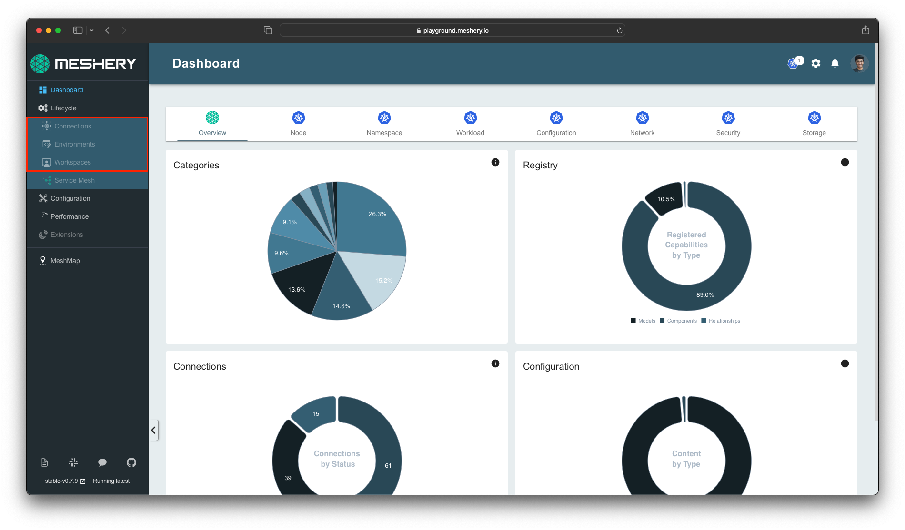

Meshery features an extensible authorization system that offers the ability to deliver fine-grained access control across its web-based user interface, [Meshery UI]().

## Authorization Keys

The extensible authorization system consists of a large set of keys. Each key uniquely represents a specific capability, for example, the ability to view, edit, or delete a [Connection](). With the help of these keys, the system evaluates permissions at runtime to render the UI, offering both a secure management system and a customizable user experience.

### Key Naming and Scoping Conventions

Permission keys in `@meshery/schemas` are generated dynamically using the following formula:
`PascalCase(Theme) + PascalCase(Function)`

*   **Theme (Domain Capability)**: Represents the high-level business domain/capability that governs the action (e.g. `Catalog Management`, `Lifecycle Management`).
*   **Function (Operation)**: Represents the specific operation being performed (e.g. `Unpublish Design`, `Evaluate Relationships`).

#### Domain Scoping vs. UI Layout

Keys are categorized by their **domain of authority** rather than the UI component or file path where they are used. 

For example, the component `MesheryPatternCard` (which resides in the designs/patterns directory) uses the key `CatalogManagementUnpublishDesign` because publishing/unpublishing a design is a **Catalog Management** action (making it public or private in the catalog), even though the card itself represents a pattern/design UI element.

{}
The extensible authorization system is available to both Local and Remote Providers. Depending on your chosen [Remote Provider](), you may be offered features such as grouping keys or assigning them to user groups or roles, rather than just individual users.
{}

### Adding a New Permission Key

Permission keys are defined and managed centrally via an automated Google Spreadsheet workflow. The spreadsheet serves as the authoritative source of truth, while `@meshery/schemas` compiles and publishes the generated Go and TypeScript artifacts consumed by downstream projects:

1. **Spreadsheet Registration**: Keys are registered in the central permissions spreadsheet.
2. **Meshery Schemas Automation**: A GitHub Actions workflow automatically imports the spreadsheet, updates `build/permissions.csv`, and compiles the definitions into Go and TypeScript libraries.
3. **Dynamic Consumption**: Downstream projects (`meshery/meshery` backend and React UI) consume the generated models and constants dynamically, removing the need for duplicate, hardcoded constants.

---

### Step-by-Step Guide

Follow these steps to generate, register, sync, and wire up a new permission key.

#### Phase 1: Define Key in Spreadsheet

##### Step 1: Generate a UUID v4
Generate a unique, lowercase UUID v4 for the new permission key:


##### Step 2: Add to the Permissions Spreadsheet
Add a new row to the authoritative **Permissions Spreadsheet**. Ensure the following columns are set:
*   **Theme**: The high-level category (e.g. `Catalog Management`).
*   **Category**: Specific feature area (e.g. `Designs`).
*   **Function**: Human-readable operation name (e.g. `Evaluate Relationships`). This value becomes `key.function` in the Provider API.
*   **Feature**: Feature description (e.g. `Evaluate relationships inside a design`).
*   **Key ID**: The generated UUID from Step 1.
*   **Local Provider**: Set to `TRUE` if this key should be seeded for the Local Provider database.

##### Step 3: Run the Schema Sync & Generation Workflow
Once added to the spreadsheet, the GitHub Actions workflow [`generate-artifacts-from-schemas.yml`](https://github.com/meshery/schemas/blob/master/.github/workflows/generate-artifacts-from-schemas.yml) in `meshery/schemas` runs automatically on a daily schedule (and can also be triggered manually) to sync the spreadsheet keys to the local [`build/permissions.csv`](https://github.com/meshery/schemas/blob/master/build/permissions.csv).

This workflow automatically executes the generators to produce:
*   Go constants: [`models/permissions/permissions.go`](https://github.com/meshery/schemas/blob/master/models/permissions/permissions.go)
*   TypeScript definitions: [`typescript/permissions.ts`](https://github.com/meshery/schemas/blob/master/typescript/permissions.ts)

These generated files are committed to the master branch and published as part of the `@meshery/schemas` package.

---

#### Phase 2: Backend Sync

##### Step 4: Wait for `keys.csv` Sync in Meshery
The local database seeds are populated via `server/permissions/keys.csv` in the `meshery/meshery` repository. This file is automatically kept in sync with the spreadsheet by the [`Import Keys`](https://github.com/meshery/meshery/blob/master/.github/workflows/generate_keys.yml) workflow, which runs daily. 

On startup, Meshery Server's [`SeedKeys`](https://github.com/meshery/meshery/blob/master/server/models/keys_helper.go) seeds these keys into the database.

---

#### Phase 3: Wire Key in the UI

##### Step 5: Direct Import from Schemas
Because Meshery UI depends on `@meshery/schemas`, you can gate new UI behavior by importing `Keys` directly from `@meshery/schemas/permissions`. There is no hand-maintained constant map to update: `ui/utils/permission_constants.ts` was removed once every call site had been migrated to the generated keys.

Simply import the `Keys` object directly from `@meshery/schemas/permissions` in your component:
{{< code code=`import { Keys } from '@meshery/schemas/permissions';` >}}

##### Step 6: Gate the Component
Prefer the `useHasPermission` hook from [Sistent](https://github.com/layer5io/sistent), which takes the whole key object:
{{< code code=`import { useHasPermission } from '@sistent/sistent';
import { Keys } from '@meshery/schemas/permissions';

const canEvaluate = useHasPermission(Keys.CatalogManagementEvaluateRelationships);

return (
  <Button disabled={!canEvaluate} onClick={handleEvaluate}>
    Evaluate Relationships
  </Button>
);` >}}

Sistent controls also accept the key directly as a `permissionKey` prop, which is the shortest form when the only effect is to disable the control:
{{< code code=`<Button permissionKey={Keys.CatalogManagementEvaluateRelationships} onClick={handleEvaluate}>
  Evaluate Relationships
</Button>` >}}

See [Gating spellings](#gating-spellings) for when to reach for the older `CAN(...)` utility instead.

##### Step 7: Verify End-to-End
1. Run `make ui-lint` to verify that there are no formatting or typescript errors.
2. Restart Meshery Server (or reset database settings) to seed the local provider with the new key.
3. Login and verify that your UI component gates correctly.

---

## Reference: End-to-End Key Mapping

This example shows how the **Evaluate Relationships** key is wired across each layer of the application:

1. **Provider API key object (excerpt from API output)**:
{{< code code=`{
  "id": "c7752be7-5c0f-465d-a8ba-5594acd08b93",
  "function": "Evaluate Relationships",
  "category": "Catalog Management",
  "subcategory": "Designs"
}` >}}

2. **TypeScript constant from `@meshery/schemas`**:
{{< code code=`export const Keys = {
  CatalogManagementEvaluateRelationships: {
    id: "c7752be7-5c0f-465d-a8ba-5594acd08b93",
    category: "Catalog Management",
    subcategory: "Designs",
    function: "Evaluate Relationships",
    description: "Evaluate relationships inside a design"
  }
}` >}}

3. **CASL rule built on login** - `id` becomes the rule's action, `function` its subject:
{{< code code=`{ action: "c7752be7-5c0f-465d-a8ba-5594acd08b93", subject: "evaluate relationships" }` >}}

4. **React Component Gating** (see [Gating spellings](#gating-spellings) for the other two forms):
{{< code code=`import { useHasPermission } from '@sistent/sistent';
import { Keys } from '@meshery/schemas/permissions';

const canEvaluate = useHasPermission(Keys.CatalogManagementEvaluateRelationships);
return canEvaluate ? <EvaluateRelationshipsButton /> : null;` >}}

---

## Where Permission Keys Are Stored in the Browser

When testing permission keys locally, the main client-side caches are stored under **`sessionStorage`** and **Cookies** (not `localStorage`):

| Location | Key / object | Contents |
|----------|--------------|----------|
| **`Cookies`** | `token` | The session authorization token. Sent automatically with requests to authenticate the user and authorize access to org-specific permission keys. |
| **`Cookies`** | `meshery-provider` | The active provider (e.g., `Local` or `Meshery`). |
| **`sessionStorage`** | `keys` | JSON array of key objects from the provider (`id`, `function`, `category`, …). Written by [`setKeys`](https://github.com/meshery/meshery/blob/master/ui/store/slices/mesheryUi.ts) and read on startup by [`loadAbility`](https://github.com/meshery/meshery/blob/master/ui/pages/_app.tsx). |
| **`sessionStorage`** | `currentOrg` | Selected organization. Keys are fetched per org via `GET /api/identity/orgs/{orgId}/users/keys`. |
| **In-memory (CASL)** | `ability` in [`ui/utils/can.ts`](https://github.com/meshery/meshery/blob/master/ui/utils/can.ts) | Runtime rules: `{ action: key.id, subject: lowerCase(key.function) }`. Updated by [`ability.update(...)`](https://github.com/meshery/meshery/blob/master/ui/rtk-query/ability.tsx). |
| **Redux store** | `state.ui.keys` | Same array as `sessionStorage.keys`. |
| **RTK Query cache** | `getUserKeys` | Cached response for `/api/identity/orgs/{orgId}/users/keys`. |

On login, Meshery either reuses `sessionStorage.keys` or refetches from the provider, then updates CASL. The [`Keys`](https://github.com/meshery/schemas/blob/master/typescript/permissions.ts) object is generated source code—not browser storage—but every gating spelling compares those constants against the CASL rules built from the stored provider keys.

Inspect keys in DevTools (**Application → Session Storage**):


You can also check cookies under DevTools (**Application → Storage → Cookies**).

---

## Troubleshooting Permissions

Use this checklist when a gated button does not appear, permissions look stale after a role change, or a newly added key does not work end-to-end.

##### 1. Confirm the provider returned the key
In DevTools **Network**, check the response for:
`GET /api/identity/orgs/{orgId}/users/keys`
Verify your UUID is in the `keys` array. The API's `function` is what CASL stores as the rule subject (lower-cased), so it must match the `function` on the `Keys` entry you are gating with.

##### 2. Clear stale browser cache
Meshery reuses `sessionStorage.keys` until the org changes or keys are refetched:


##### 3. Verify the generated key
In [`Keys`](https://github.com/meshery/schemas/blob/master/typescript/permissions.ts), published by `@meshery/schemas`:
*   `id` = the key UUID, matched against the CASL rule's action
*   `function` = the human-readable operation name, matched against the CASL rule's subject (capitalization differences are normalized by `_.lowerCase`)

If the key is missing from `Keys` altogether, it has not made it through the spreadsheet → schemas generation described above; re-run Phase 1 rather than declaring it locally.

##### 4. Confirm CASL loaded the rules
*   **Redux DevTools**: check `state.ui.keys` for the expected UUID.
*   **Session Storage**: confirm `sessionStorage.keys` is populated.
*   **Loader**: [`LoadSessionGuard`](https://github.com/meshery/meshery/blob/master/ui/rtk-query/ability.tsx) must finish loading before `CAN(...)` returns meaningful results.

##### 5. Local Provider: confirm database seeding
The key must be in [`server/permissions/keys.csv`](https://github.com/meshery/meshery/blob/master/server/permissions/keys.csv) with **`Local Provider = TRUE`**. Restart Meshery Server (or reset the local DB) after the CSV updates.

##### 6. Remote Provider: confirm role assignment
Keys come from roles assigned in the Remote Provider admin UI. An empty API response usually means a role/keychain issue—not a missing entry in the generated `Keys` alone.

##### 7. Verify browser cookies and session validity
Verify that the `token` cookie is set and not expired:
*   Open DevTools **Application** -> **Storage** -> **Cookies** and select the Meshery site URL.
*   Confirm that the `token` cookie is present. If it is missing or has expired, you will be redirected to the login page or receive a `401 Unauthorized` response when fetching keys.
*   Check that the `meshery-provider` cookie matches the intended provider (e.g., `Local` or `Meshery`).

##### Common symptoms

| Symptom | Likely cause |
|---------|----------------|
| Button never appears | User lacks the key; the key is missing from the generated `Keys`; or the gate is not wired |
| New key not visible after merge | Stale `sessionStorage.keys`; missing Local Provider seed row; or only schemas PR merged |
| Works in one org, not another | Keys are org-scoped—check `currentOrg` and refetch keys |
| API returns `401` or `403` when fetching keys | Expired or missing `token` cookie; verify browser cookie store |

---

## Authorization Framework

Meshery utilizes CASL (JS-based permission framework) to evaluate any given user's set of session keys against the built-in keyhooks populated through each individual Meshery UI page. This allows for granular control over the UI, empowering you to tailor your Meshery experience to your organization's needs by limiting access to specific features and functionalities based on the user's assigned keys.

### Introduction to CASL.js

[CASL.js](https://casl.js.org) is an isomorphic authorization JavaScript library which restricts what resources a given client is allowed to access. It's designed to be incrementally adoptable and can easily scale between a simple claim based and fully featured subject and attribute based authorization. It makes it easy to manage and share permissions/keys across UI components, API services, and database queries.

Upon user login, the provider returns the list of authorized permission keys. Those keys are used to build and update the CASL ability rules on the frontend, and each key is registered as a rule of `{ action: key.id, subject: lowerCase(key.function) }`. Every gate in Meshery UI is a query against that one ability instance.

### Gating spellings

Three spellings exist, and they are equivalent - all three end up calling the same CASL `ability`. Each takes a key from `@meshery/schemas/permissions`, whose entries carry `id`, `function`, `category`, `subcategory` and `description`.

1.  **`useHasPermission` hook** - the usual spelling, and the one to reach for in new code. Pass the whole key object; the hook resolves `id` and `function` for you.
{{< code code=`import { useHasPermission } from '@sistent/sistent';
import { Keys } from '@meshery/schemas/permissions';

const canDelete = useHasPermission(Keys.LifecycleManagementDeleteAConnection);

return canDelete ? <Button id="delete-connection">Delete</Button> : null;` >}}

2.  **`permissionKey` prop** - Sistent controls gate themselves. By default the control renders disabled behind a shield icon whose tooltip names the missing key; pass `permissionAction="hide"` to render nothing instead.
{{< code code=`import { Keys } from '@meshery/schemas/permissions';

<Button id="delete-connection" permissionKey={Keys.LifecycleManagementDeleteAConnection}>
  Delete
</Button>` >}}

3.  **`CAN(...)` utility** - the original spelling, still used where a hook cannot be called (outside a component, or inside a callback). It takes the two fields separately rather than the key object.
{{< code code=`import CAN from '@/utils/can';
import { Keys } from '@meshery/schemas/permissions';

const key = Keys.LifecycleManagementDeleteAConnection;
const canDelete = CAN(key.id, key.function);` >}}

### Access gating and control gating

CASL gates Meshery UI at two levels, and they are not the same thing:

*   **Access gating** replaces a page's whole content with the permission-denied page when your session lacks the key that page requires.
*   **Control gating** renders the page, and hides or disables only the individual affordances within it - a button, a link, a menu item - that you lack the key for.

Every content-bearing page in Meshery UI except the landing page (`/`) is access-gated; that one exception is described below. Where the page owns RTK Query hooks, pass `skip` on the same flag so a denied session issues no request at all.

{}
The **Meshery UI dashboard** (`/`) is control-gated only. It renders for an organization member holding no keys at all, with the links they cannot follow disabled in place, rather than replacing itself with the permission-denied page.

This is by design, not an oversight: `/` is where Meshery lands you after login, so access-gating it would strand a newly invited member on an error screen before anyone has assigned them a role. Every other content-bearing page - including the design configurator and the user preferences page - is access-gated.
{}

Access gating is a presentation control, not an enforcement boundary. Meshery Server authenticates every request, and authorization is decided by the configured [Remote Provider]() and enforced per handler on the server. An ungated page therefore never implies an ungated API.

## Authorization using Local Provider

Meshery's built-in identity provider, "Local" Provider, operates with a large set of predefined keys interspersed throughout Meshery UI and persisted in [Meshery Database](). These keys are used to evaluate the permissions of a given user and render the UI accordingly. Each persisted key carries an `id`, a `function` (the operation it permits), and a `category`/`subcategory` pair that places it in a domain - the same shape the Remote Provider returns, so the UI gates identically under either provider.


