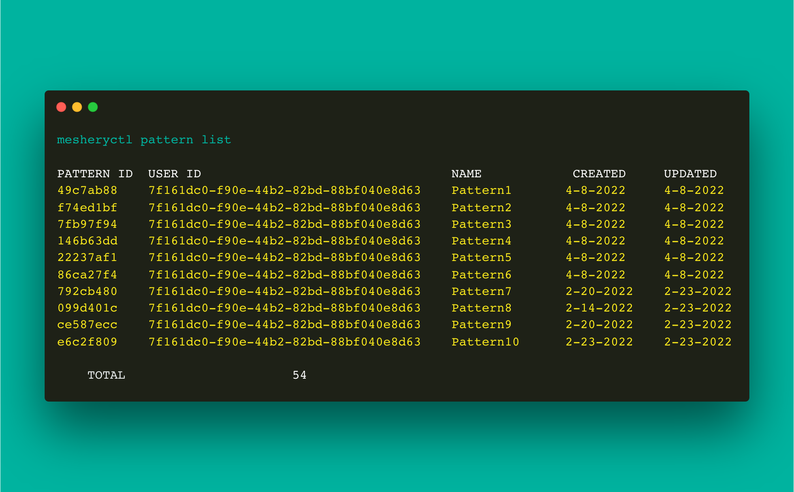

# mesheryctl design list

List designs

## Synopsis

Display list of all available designs.

<pre class='codeblock-pre'>

<code class='clipboardjs'>mesheryctl design list [flags]</code>

</pre> 

## Examples

Display a list of all available designs
<pre class='codeblock-pre'>

<code class='clipboardjs'>mesheryctl design list</code>

</pre> 

Display a list of all available designs with verbose output
<pre class='codeblock-pre'>

<code class='clipboardjs'>mesheryctl design list --verbose</code>

</pre> 

Display a list of all available designs with specified page number (10 designs per page by default)
<pre class='codeblock-pre'>

<code class='clipboardjs'>mesheryctl design list --page [pange-number]</code>

</pre> 

Display a list of all available designs with custom page size (10 designs per page by default)
<pre class='codeblock-pre'>

<code class='clipboardjs'>mesheryctl design list --pagesize [page-size]</code>

</pre> 

Display only the count of all available designs
<pre class='codeblock-pre'>

<code class='clipboardjs'>mesheryctl design list --count</code>

</pre> 

## Options

<pre class='codeblock-pre'>

  -c, --count          (optional) Display count only
  -h, --help           help for list
  -p, --page int       (optional) List next set of designs with --page (default 1)
      --pagesize int   (optional) Number of designs to be displayed per page (default 10)
  -v, --verbose        (optional) Display full length owner identifiers and detailed timestamps

</pre>

## Options inherited from parent commands

<pre class='codeblock-pre'>

      --config string   path to config file (default "/home/runner/.meshery/config.yaml")
  -t, --token string    Path to token file default from current context

</pre>

## Screenshots

Usage of mesheryctl design list

## See Also

Go back to [command reference index](), if you want to add content manually to the CLI documentation, please refer to the [instruction]() for guidance.
