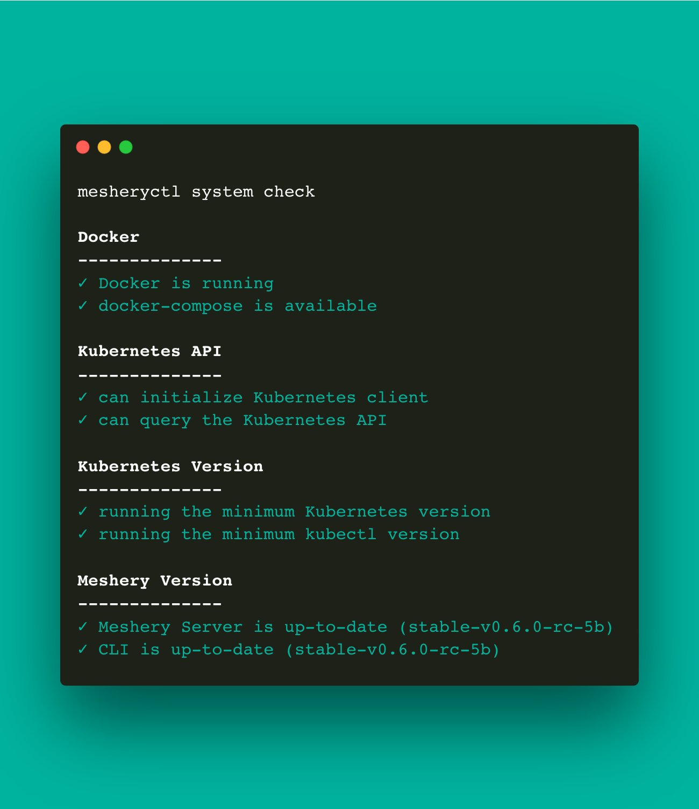

# mesheryctl system check

Pre-deployment and post-deployment healthchecks for Meshery

## Synopsis

Verify environment pre/post-deployment of Meshery.

<pre class='codeblock-pre'>

mesheryctl system check [flags]

</pre> 

## Examples

Run all system checks for both pre and post-deployment scenarios
<pre class='codeblock-pre'>

mesheryctl system check

</pre> 

Run pre-deployment checks (Docker and Kubernetes)
<pre class='codeblock-pre'>

mesheryctl system check --preflight

</pre> 

Run pre-deployment checks (Docker and Kubernetes)
<pre class='codeblock-pre'>

mesheryctl system check --pre

</pre> 

Run checks for all Meshery adapters
<pre class='codeblock-pre'>

mesheryctl system check --adapters

</pre> 

Run checks on a specific Meshery adapter
<pre class='codeblock-pre'>

mesheryctl system check --adapter meshery-istio:10000

</pre> 

<pre class='codeblock-pre'>

mesheryctl system check --adapter meshery-istio

</pre> 

Verify the health of Meshery Operator's deployment with MeshSync and Broker
<pre class='codeblock-pre'>

mesheryctl system check --operator

</pre> 

## Options

<pre class='codeblock-pre'>

      --adapter string   Check status of specified meshery adapter
      --adapters         Check status of meshery adapters
      --components       Check status of Meshery components
  -h, --help             help for check
      --operator         Verify the health of Meshery Operator's deployment with MeshSync and Broker
      --pre              Verify environment readiness to deploy Meshery
      --preflight        Verify environment readiness to deploy Meshery

</pre>

## Options inherited from parent commands

<pre class='codeblock-pre'>

      --config string    path to config file (default "/home/runner/.meshery/config.yaml")
  -c, --context string   (optional) temporarily change the current context.
  -v, --verbose          verbose output
  -y, --yes              (optional) assume yes for user interactive prompts.

</pre>

## Screenshots

Usage of mesheryctl system check

## See Also

Go back to [command reference index](), if you want to add content manually to the CLI documentation, please refer to the [instruction]() for guidance.
