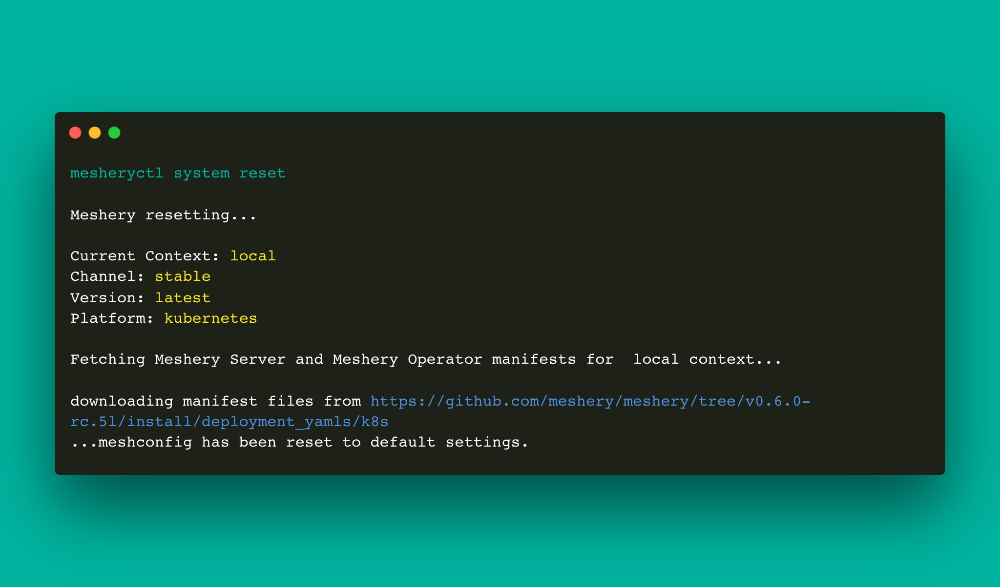

# mesheryctl system reset

Reset Meshery's configuration

## Synopsis

Reset Meshery to it's default configuration.
	
<pre class='codeblock-pre'>

mesheryctl system reset [flags]

</pre> 

## Examples

Resets meshery.yaml file with a copy from Meshery repo
<pre class='codeblock-pre'>

mesheryctl system reset

</pre> 

## Options

<pre class='codeblock-pre'>

  -h, --help   help for reset

</pre>

## Options inherited from parent commands

<pre class='codeblock-pre'>

      --config string    path to config file (default "/home/runner/.meshery/config.yaml")
  -c, --context string   (optional) temporarily change the current context.
  -v, --verbose          verbose output
  -y, --yes              (optional) assume yes for user interactive prompts.

</pre>

## Screenshots

Usage of mesheryctl system reset

## See Also

Go back to [command reference index](), if you want to add content manually to the CLI documentation, please refer to the [instruction]() for guidance.
