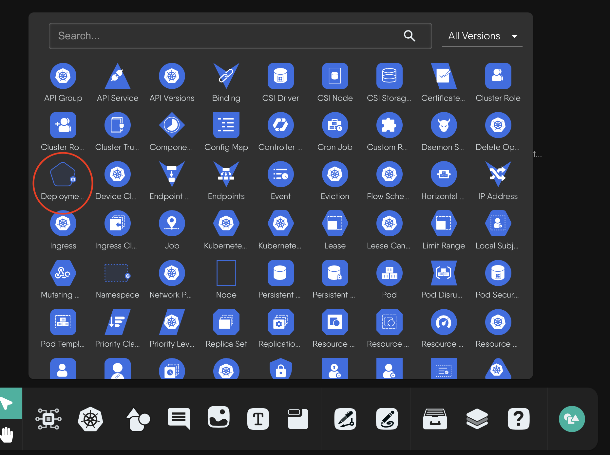

## Component Shape Guide

As a best practice, users are encouraged to select an existing or create acustom shape for their components to best visually signify the function of their component.

Currently, the circle is used as the default shape for new components. However, if users or contributors have alternative shapes they believe better suit a particular component, they are encouraged to create new custom components.

<!-- Tool not ready for use

using the Shape Builder extension at [https://shapes.meshery.io](https://shapes.meshery.io).

-->

Although the usage of the components is divided into categories, some shapes serve as a universal representation of particular components.

Below are all the shapes with their current usage in a general context.


 


Here's how the Deployment component appears in different contexts:

 

Deployment component with its distinctive rounded-rectangle shape and badge

 

Deployment icon in the component selection panel

 

Deployment component as seen in the cluster resource overview
