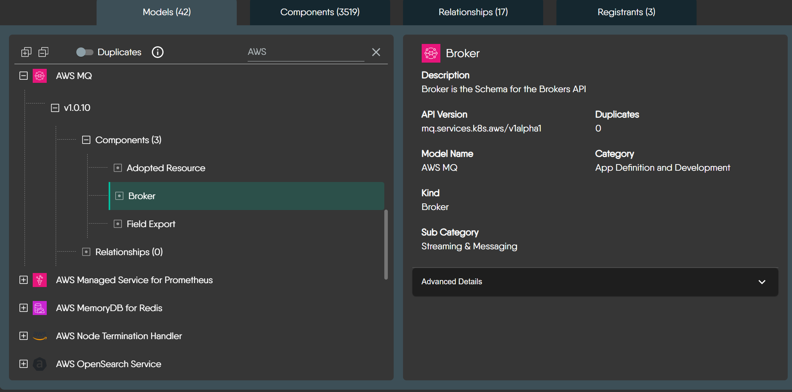

Ever wondered what the different icons and shapes in Meshery represent? Whether you're looking at a dashboard, a settings page, or a design, you'll encounter a rich library of visual elements. This guide is here to help you understand what they mean.

The [components](https://docs.meshery.io/concepts/logical/components) in Meshery fall into two fundamental categories, distinguished by whether they can be orchestrated (managed) by Meshery during deployment:

- **Semantic Components (Orchestratable):** These represent actual infrastructure resources that Meshery can understand and manage during deployment. Examples include Kubernetes resources (like Pods and Services), databases, and other infrastructure components. Meshery will actively manage their lifecycle during deployment.

- **Non-semantic Components (Annotation):** These are visual elements used for documentation and organization, such as text boxes, arrows, shapes, and comments. Meshery ignores these during deployment as they don't represent actual infrastructure.



## Semantic Components

These components represent real infrastructure that Meshery can manage. They can be either built-in (like Kubernetes components) or custom components that you [create](https://docs.meshery.io/guides/configuration-management/creating-models).

### Kubernetes Components

While Kubernetes components are commonly used, they follow the same principles as all other semantic components. They have a default distinct visual style to help you instantly recognize them:

- **Uniform Color Scheme:** Kubernetes component icons typically use a **distinctive blue background** as a standard identifier.
- **Standardized Icon Structure:** The fundamental structure is consistent: an outer container shape with the blue background, encompassing a unique inner white symbol.
- **Meaningful Inner Symbols:** The white symbol inside each icon is the crucial unique identifier for that specific Kubernetes Kind, often inspired by the core function of the resource.

### Integrated Technologies

Meshery supports various technologies (like AWS, Prometheus, Istio, KEDA, etc.) with their official icons. These components have the same orchestratable capabilities as Kubernetes components.



## Non-semantic Components

These components help you document and organize your designs without affecting the actual infrastructure. They include:

- Text boxes and comments for documentation
- Shapes and containers for visual grouping
- Lines and arrows for showing relationships
- Labels and tags for organization

While these components are ignored during deployment, they support the same visual customization options as semantic components.



## Foundational Elements

In addition to the rich library of predefined icons, Meshery also provides a core set of foundational geometric shapes. These are not tied to any specific technology but are intended for representing abstract concepts or for simple annotations within your designs where a specific component icon doesn't apply.

<strong>Foundational Geometric Shapes</strong>

 
These are the quintessential building blocks for many diagrams – your circles, squares, triangles, and basic polygons. They offer simple, clean, and universally understood forms for a wide range of uses.



<strong>Common Representational & Symbolic Shapes</strong>

 
This group includes shapes that, by common convention, often evoke a more specific symbolic meaning, like using a "Barrel" for data storage or an "Actor" for a user role. Leveraging these established visual metaphors can make your custom diagrams more intuitive.



<strong>Specialized & Decorative Geometric Shapes</strong>

 
When your diagrams require a more distinct visual style or an element for emphasis, this collection offers a variety of options, from complex polygons to stylized forms like "Crescent," "Star," or "XWing." These shapes are less commonly used in Meshery and have no universally accepted meaning.



## Component Visuals in Different Contexts

To see how this works in practice, let's take the Kubernetes `Deployment` component as an example. Its appearance adapts to different views in the Meshery UI:

1.The full component shape as it appears in a design:

2.The simplified icon as it appears in a component selection panel:

3.The icon as seen in a cluster resource overview:

