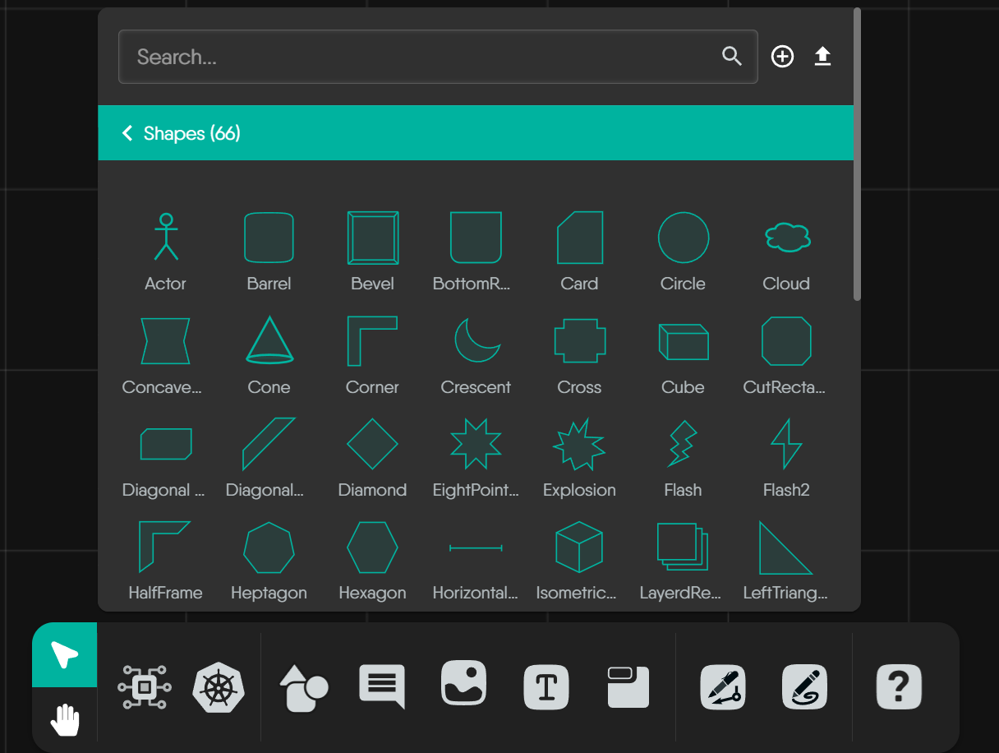
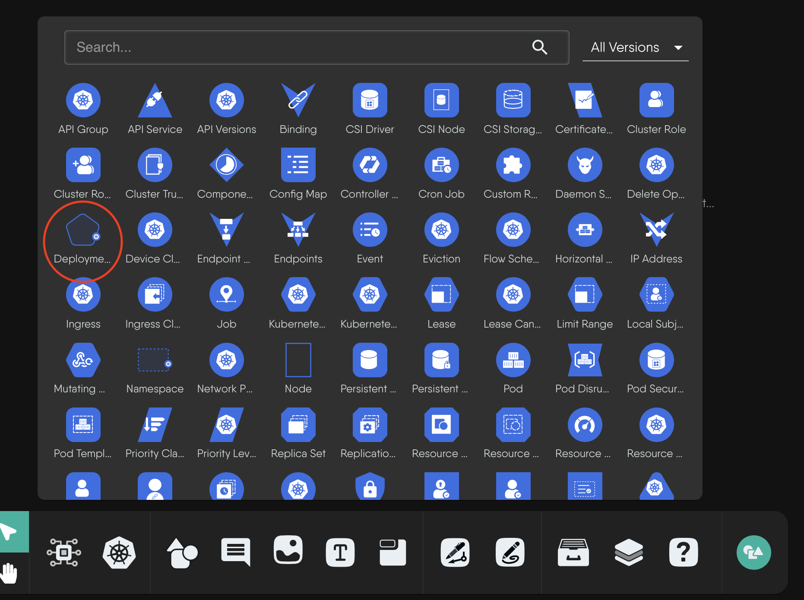

Ever wondered what the different icons and shapes in Meshery represent? Whether you're looking at a dashboard, a settings page, or a design, you'll encounter a rich library of visual elements. This guide is here to help you understand what they mean.

The visual elements in Meshery generally fall into two categories:
- **System-Defined Icons:** These have predefined meanings to represent specific Kubernetes resources or integrated technologies.
- **Foundational Elements:** A small set of basic shapes for representing abstract concepts.

## System-Defined Icons

This is the most common type of visual you'll see. Meshery uses a consistent system of icons to represent specific, functional components. Understanding these will help you accurately interpret your systems.

### Kubernetes Components

Icons for Kubernetes resources have a distinct and consistent visual style to help you instantly recognize them. This system is built on a few key principles:

- **Uniform Color Scheme:** Kubernetes component icons typically use a **distinctive blue background** as a standard identifier.
- **Standardized Icon Structure:** The fundamental structure is consistent: an outer container shape with the blue background, encompassing a unique inner white symbol.
- **Meaningful Inner Symbols:** The white symbol inside each icon is the crucial unique identifier for that specific Kubernetes Kind, often inspired by the core function of the resource.

### Integrated Technologies
Meshery uses the widely recognized, official icons of its many integrated services and technologies (like AWS, Prometheus, Istio, etc.). This leverages familiar branding for easy identification. When you see an icon for a specific cloud service or tool, you are seeing a system-defined representation of that functional unit.



## Foundational Elements

In addition to the rich library of predefined icons, Meshery also provides a core set of foundational geometric shapes. These are not tied to any specific technology but are intended for representing abstract concepts or for simple annotations within your designs where a specific component icon doesn't apply.

<strong>Foundational Geometric Shapes</strong>

 
These are the quintessential building blocks for many diagrams – your circles, squares, triangles, and basic polygons. They offer simple, clean, and universally understood forms for a wide range of uses.



<strong>Common Representational & Symbolic Shapes</strong>

 
This group includes shapes that, by common convention, often evoke a more specific symbolic meaning, like using a "Barrel" for data storage or an "Actor" for a user role. Leveraging these established visual metaphors can make your custom diagrams more intuitive.



<strong>Specialized & Decorative Geometric Shapes</strong>

 
When your diagrams require a more distinct visual style or an element for emphasis, this collection offers a variety of options, from complex polygons to stylized forms like "Crescent," "Star," or "XWing." These shapes are less commonly used in Kanvas and have no universally accepted meaning.



## Component Visuals in Different Contexts

To see how this works in practice, let's take the Kubernetes `Deployment` component as an example. Its appearance adapts to different views in the Meshery UI:

1.The full component shape as it appears in a design:

2.The simplified icon as it appears in a component selection panel:

3.The icon as seen in a cluster resource overview:

