### Introduction:
This tutorial shows how to deploy Dapr in a Kubernetes cluster using Meshery Playground. You'll deploy a Python app for message generation and a Node app for consumption and persistence, following the classic Hello World example with Dapr. Let's dive in and explore the architecture diagram that illustrates this setup.
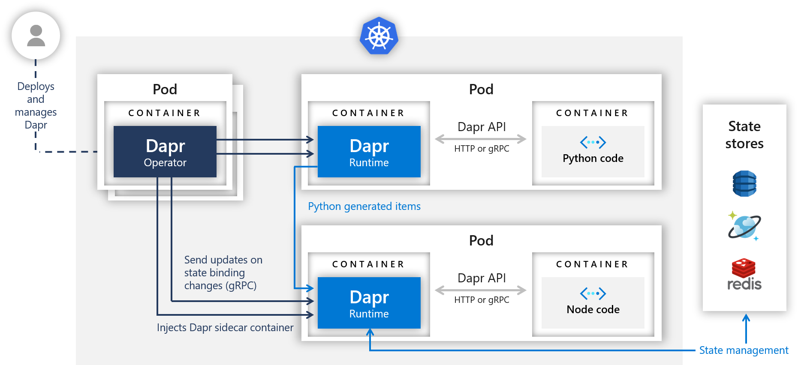

### Prerequisites:
Basic understanding of containerization, Kubernetes concepts, and basic knowledge of Dapr.
Access to the Meshery Playground. If you don't have an account, sign up at [Meshery Playground](https://meshery.layer5.io/).

### Lab Scenario:
You'll be deploying `Hello Kuberentes` applications with the help of `Meshery Playground', which has a Python app that generates messages and a Node app that consumes and persists them.

### Learning Objective:
Upon completing this tutorial, you will:
 - Deploy Hello Kubernetes with Dapr using Meshery Playground.
- Implement a Python app for message generation and a Node app for consumption and persistence with Dapr.
- Explore Dapr's features for service invocation, state management, and application observability in Kubernetes.

### Steps:

#### Access Meshery Playground
 - Using your credentials, log in to the [Meshery Playground] (https://meshery.layer5.io/). You should be at the dashboard upon successful login. To close the _Where do you want to start?_ popup (if required), press **X**.
-   Click **Explore** in the Cloud Native Playground tile to navigate to _MeshMap_.

> **_NOTE:_** MeshMap is still in beta.

#### Step 1: Install Dapr on your meshery playground. 

- Refer to the Meshery Playground documentation for instructions on importing Helm charts: [Meshery Playground Helm Docs](https://docs.layer5.io/meshmap/getting-started/starting-helm/)
- 
  Specific to Dapr, To import Dapr, use the direct download link: [Dapr Helm Chart] (https://artifacthub.io/packages/helm/dapr/dapr?modal=install).


#### Step 2: Create and configure a Reddis state store.

Dapr can use a number of different state stores (Redis, CosmosDB, DynamoDB, Cassandra, etc.) to persist and retrieve the state. This demo will use Redis.
1. Follow [these steps](https://docs.dapr.io/getting-started/tutorials/configure-state-pubsub/#step-1-create-a-redis-store) to create a Redis store.
2. Once your store is created, add the keys to the'redis.yaml` file in the `deploy` directory.
**Note:** The'redis.yaml'` file provided in this quickstart will work securely out-of-the-box with Redis installed with `helm install bitnami/redis`. If you have your own Redis setup, replace the'redisHostt` value with your own Redis master address and the redisPassword with your own secret. You can learn more here: https://docs.dapr.io/operations/components/component-secrets/.
3. Apply the'redis.yaml` file and observe that your state store was successfully configured!
4. Here is the'redis.yaml'  that you can refer to:
```\yaml
apiVersion: dapr.io/v1alpha1
kind: Component
metadata:
  name: statestore
spec:
  type: state.redis
  version: v1
  metadata:
  # These settings will work out of the box if you use `helm install
  # bitnami/redis`.  If you have your own setup, please replace it.
  # `redis-master:6379` with your own Redis master address, and the
# Redis password with your own Secret's name. For more information,
  # see https://docs.dapr.io/operations/components/component-secrets .
  - name: redisHost
    value: redis-master:6379
  - name: redisPassword
    secretKeyRef:
      name: redis
      key: redis-password
auth:
  secretStore: kubernetes
```

5. To import the designs into Meshery, click the upward arrow symbol (import icon) in the left sidebar.
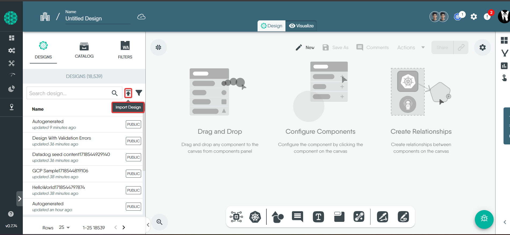
6. In the modal that appears:
- In the "Design File Name" field, enter a name for your design (e.g., `Hello kubernetes-main`).
   - Select `Kubernetes Manifest` from the "Design Type" drop-down menu.
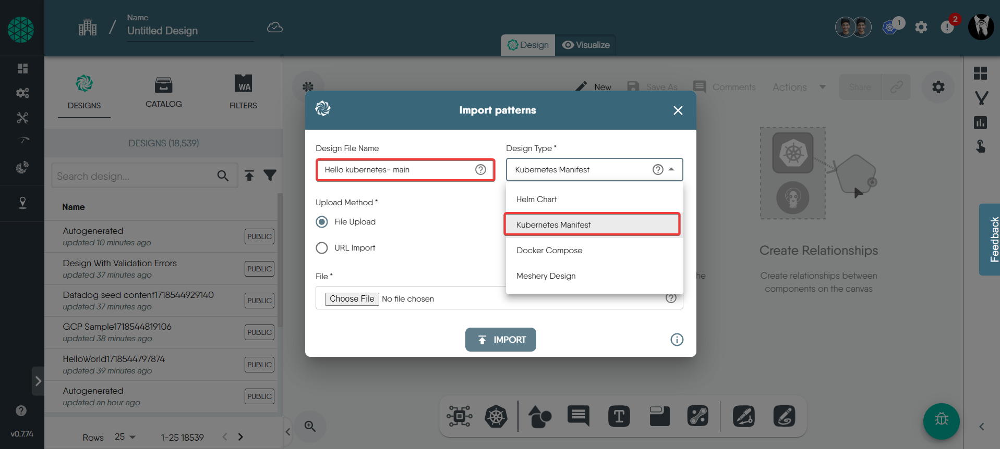
7. Choose `File Upload` for the upload method, and select [this file](https://github.com/dapr/quickstarts/blob/master/tutorials/hello-kubernetes/deploy/redis.yaml) you just downloaded. Then, click on `Import`.
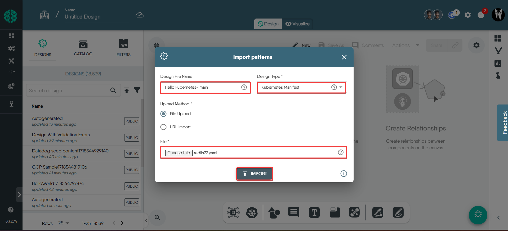
8. Under the "Designs" tab, you will see that we have successfully imported the `Hello kubernetes -main` design.
- To continue, click on `actions` on the left side of the canvas and then `deploy`.
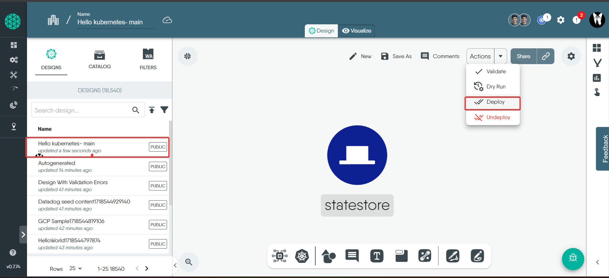
   - Select your environment. To know more about this, refer to [docs](https://docs.meshery.io/concepts/logical/environments).
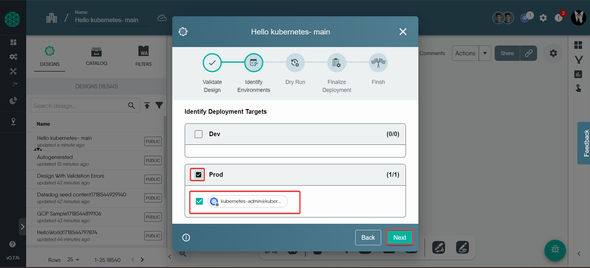
9. On the canvas, click `Deploy`.
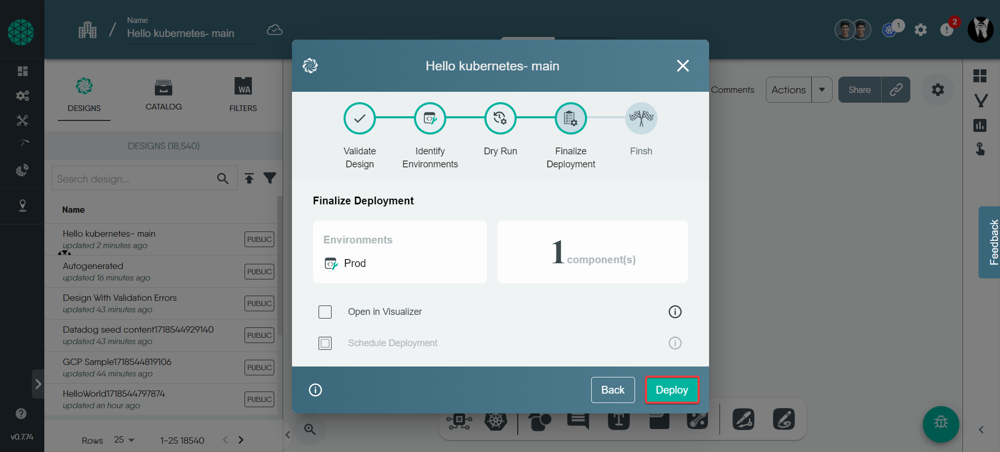
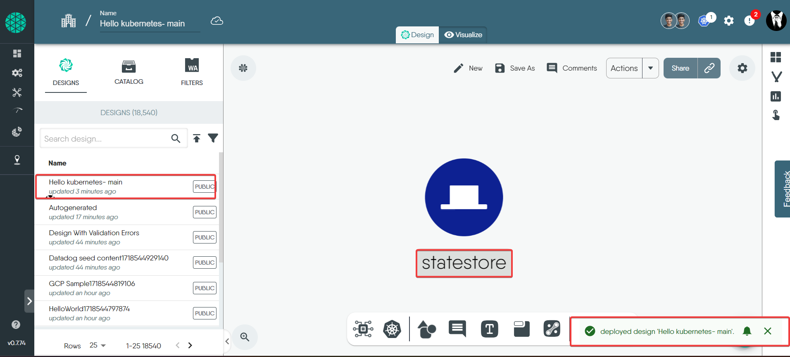

      

  

#### Step 3: Deploy the Node.js app with the Dapr sidecar.

In this step, we will deploy the Node.js app to Kubernetes. The Dapr control plane will automatically inject the Dapr sidecar into the pod. If you take a look at the `node.yaml` file, you will see how Dapr is enabled for that deployment:
```\yaml
kind: Service
apiVersion: v1
metadata:
  name: nodeapp
  labels:
    app: node
spec:
  selector:
    app: node
  ports:
  - protocol: TCP
    port: 80
    targetPort: 3000
  type: LoadBalancer

---
apiVersion: apps/v1
kind: Deployment
metadata:
  name: nodeapp
  labels:
    app: node
spec:
  replicas: 1
  selector:
    matchLabels:
      app: node
  template:
    metadata:
      labels:
        app: node
      annotations:
        dapr.io/enabled: "true"
        dapr.io/app-id: "nodeapp"
        dapr.io/app-port: "3000"
        dapr.io/enable-api-logging: "true"
    spec:
      containers:
      - name: node
        image: ghcr.io/dapr/samples/hello-k8s-node:latest
        env:
        - name: APP_PORT
          value: "3000"
        ports:
        - containerPort: 3000
        imagePullPolicy: Always
```
`dapr.io/enabled: true` - this tells the Dapr control plane to inject a sidecar into this deployment.

`dapr.io/app-id: nodeapp` - this assigns a unique id or name to the Dapr application, so it can be sent messages to and communicated with by other Dapr apps.

`dapr.io/enable-api-logging: "true"` - this is added to node.yaml file by default to see the API logs.

1. Import the [nodeapp] file (https://github.com/dapr/quickstarts/blob/master/tutorials/hello-kubernetes/deploy/node.yaml) into the Meshery playground.
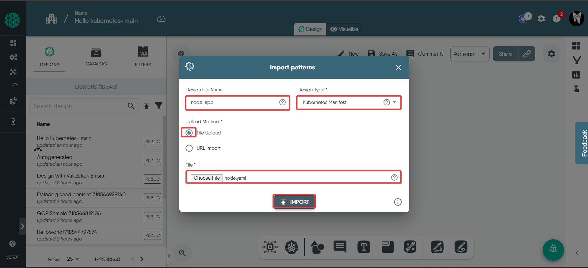

2. `Drag and drop` the nodeapp design to `Hello kubernetes-main`, so that merging designs happen properly.
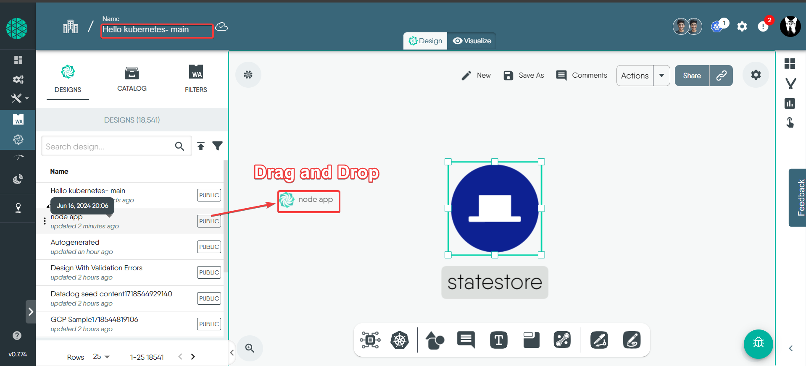

3. Click on `Merge` to merge the designs.
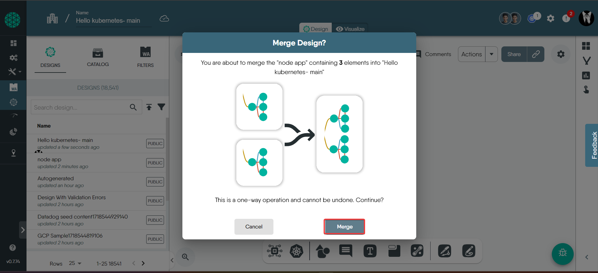
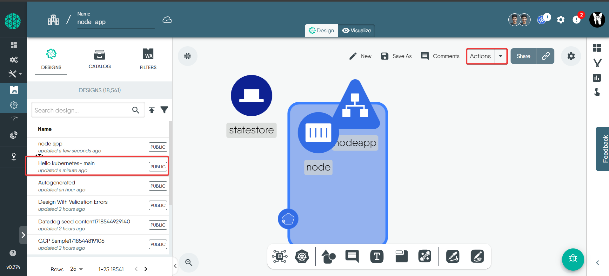


### Step 4: Deploy the Python app using the Dapr sidecar. 

Next, take a quick look at the Python app, which has kubernetes manifest as:
```\yaml
apiVersion: apps/v1
kind: Deployment
metadata:
  name: pythonapp
  labels:
    app: python
spec:
  replicas: 1
  selector:
    matchLabels:
      app: python
  template:
    metadata:
      labels:
        app: python
      annotations:
        dapr.io/enabled: "true"
        dapr.io/app-id: "pythonapp"
        dapr.io/enable-api-logging: "true"
    spec:
      containers:
- name: python
        image: ghcr.io/dapr/samples/hello-k8s-python:latest
```

At a quick glance, this is a basic Python app that posts JSON messages to `localhost:3500`, which is the default listening port for Dapr. You can invoke the Node.js application's `neworder` endpoint by posting to `v1.0/invoke/nodeapp/method/neworder`. The message contains some data, including an order ID that increments once per second:

```python
n = 0
while True:
    n += 1
    message = {"data": {"orderId": n}}

    try:
        response = requests.post(dapr_url, json=message)
    except Exception as e:
        print(e)

    time.sleep(1)
```
1. Import the [pythonapp](https://github.com/dapr/quickstarts/blob/master/tutorials/hello-kubernetes/deploy/python.yaml) into the Meshery playground.
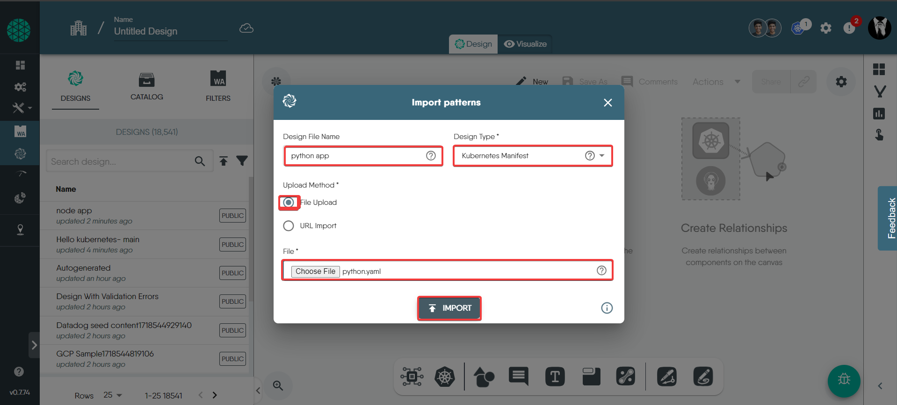

2. `Drag and drop` the Python app design to `Hello kubernetes-main` so that the designs are merged properly.
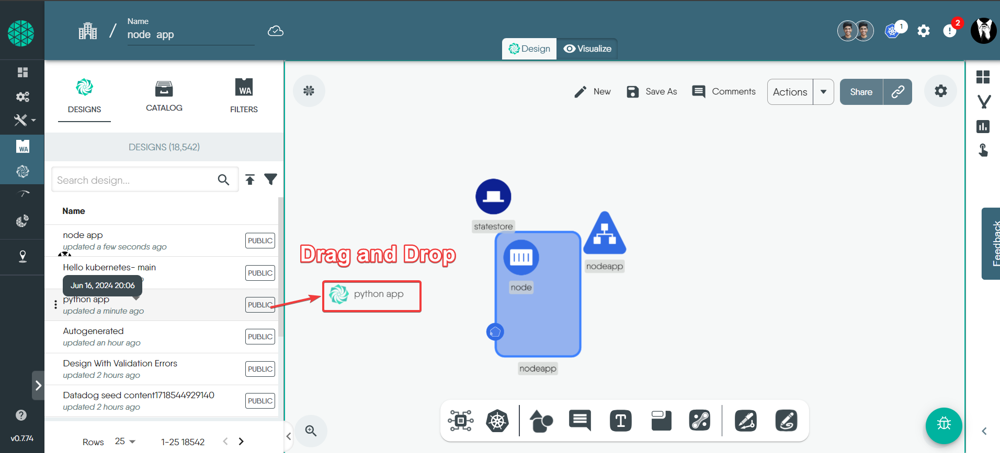

3. Click on `Merge` to merge the designs.
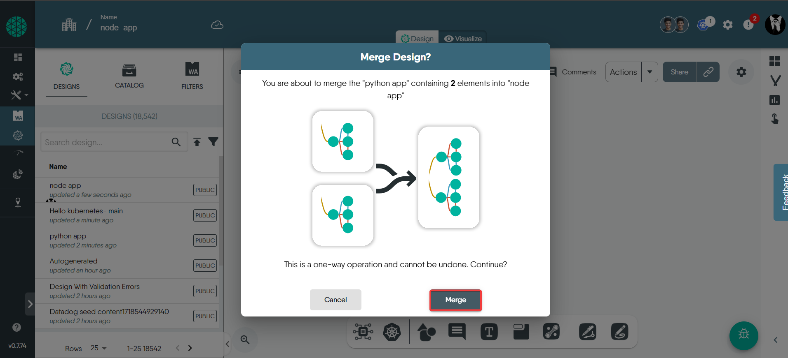
     
4. After successfully importing all designs into Meshery, click on `actions` on the left side, then click `deploy` to continue.
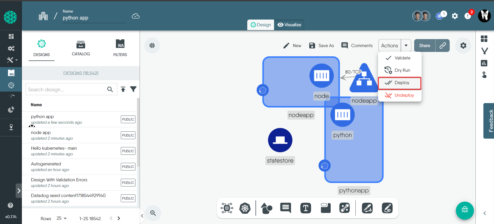

5. Select your environment.
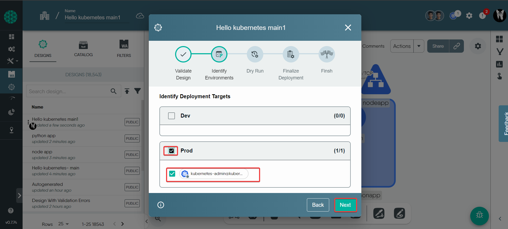

6. Click on `Deploy` at the final stage so that `Hello kubernetes-main` is successfully deployed.
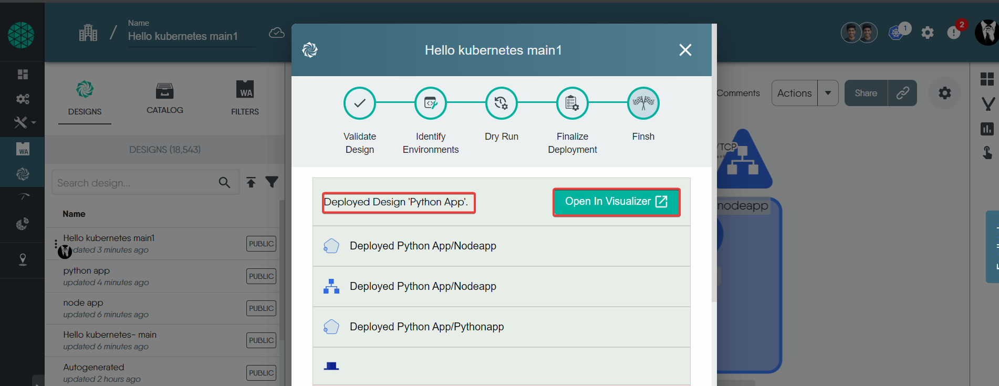

#### Step5: Vizualizing the `Hello kubernetes wit dapr`

To view the resources deployed, we will use the **Visualize** section of the _MeshMap_. A view is created with the necessary filters to show the relevant resources.

1. Click **Visualize** to begin.
2. Give the view a name (rename).
3. Click the filter icon.
4. Choose appropriate filters to limited displayed resources in the view. For example, here we want to display deployment,Service,dapr component,pods  etc. 
Additionally, we will also add a label filter, i.e., `tutorial=Hello kubernetes-main1` in this case. This should show a filtered view with only your resources. 
similar to the screenshot below:

### Viewing deployment and service information

To load the component details to the right, select the stateful set from _View_. Ensure the _Details_ tab is selected.

Now, select one of the services to display the service details.
- u can always `exec` into pod to verify configurations and extract logs .

#### Step 6 - Observe API call logs by using  meshery interative terminal 

u can always `exec` into pod to verify configurations and extract logs.

Now that the Node.js and Python applications are deployed, watch messages come through:

Get the logs of the Node.js app:

<!-- TODO(artursouza): Add "Successfully persisted state for Order ID: X" once the new image is published.

<!-- STEP
expected_stdout_lines:
  - "Got a new order! Order ID: 11"
  - "Successfully persisted state for Order ID: 11"
expected_stderr_lines:
output_match_mode: substring
match_order: none
name: Read nodeapp logs
tags:
  - normal-run
-->

```bash
kubectl logs --selector=app=node -c node --tail=-1
```

<!-- END_STEP -->

If all went well, you should see logs like this:

```
Got a new order! Order ID: 1
Successfully persisted state for Order ID: 1
Got a new order! Order ID: 2
Successfully persisted state for Order ID: 2
Got a new order! Order ID: 3
Successfully persisted state for Order ID: 3
```
#### Step 7 - Confirm successful persistence using meshery interctive terminal 

Call the Node.js app's order endpoint to get the latest order. Grab the external IP address that you saved before and, append "/order" and perform a GET request against it (enter it into your browser, use Postman, or curl it!):

```
curl $NODE_APP/order
{"orderID":"42"}
```

You should see the latest JSON in response!


####  Step 8-Deleting the Deployment

To delete the deployment, use the **Undeploy** option from the _Design_ view.


   
   

