### Introduction

Meshery is a powerful tool for managing and operating service meshes. One of its key features is the ability to import Helm charts, which simplifies the deployment and management of Kubernetes applications. This tutorial will guide you through the process of importing your first Helm chart into Meshery.

### Prerequisites

- Basic understanding of kubernetes and Helm.
- Access to the _Meshery Playground_. If you don't have an account, sign up at [Meshery Playground](https://play.meshery.io/).

### Lab Scenario: Importing Dapr Helm Chart into Meshery Playground

In this lab, we will walk through the process of importing the Dapr Helm chart into Meshery Playground. Dapr (Distributed Application Runtime) is a portable, event-driven runtime that makes it easy for developers to build resilient, stateless, and stateful microservices. By leveraging Meshery Playground, you will experience a hands-on approach to deploying and managing the Dapr Helm chart within a live Kubernetes environment.
For more information on Dapr, visit the [Dapr Documentation](https://docs.dapr.io/concepts/?_gl=1*1v6gt5w*_ga*MTc2MjAwNzU0OC4xNzE1NjA5MTE0*_ga_60C6Q1ETC1*MTcxNjM2MTUyOC4zLjAuMTcxNjM2MTUyOC4wLjAuMA..)

### Objective

Learn to efficiently import, configure, and deploy Helm charts within Meshery Playground, enhancing your understanding of managing Kubernetes applications using Helm.

### Steps

#### Access Meshery Playground

- Log in to the [Meshery Playground](https://meshery.layer5.io/) using your credentials. On successful login, you should be at the dashboard. Press the **X** on the _Where do you want to start?_ popup to close it (if required).
- Click **Explore** in the Cloud Native Playground tile to navigate to _MeshMap_.

> **_NOTE:_** MeshMap is still in beta.

#### Choosing Correct Dapr Helm charts

- Navigate to the Dapr Helm charts repository on GitHub or any other trusted source. Here is the one of the source from which you can pick [helm charts](https://github.com/jangocheng/dapr-helm-charts/tree/master).
  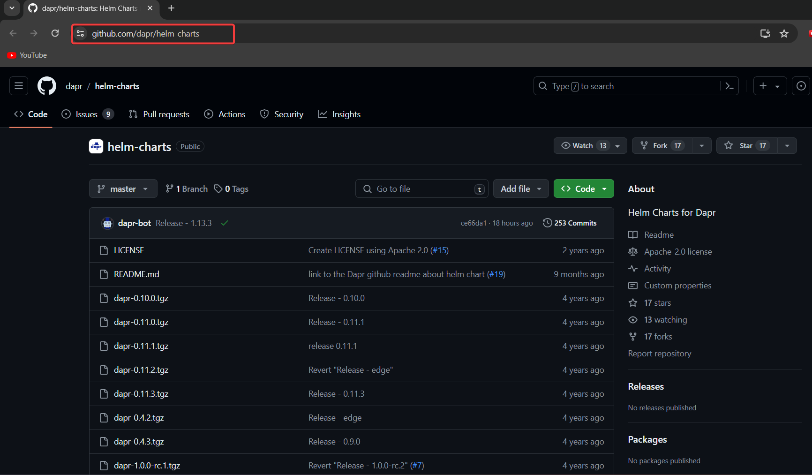
- Ensure you select the appropriate chart version compatible with your Kubernetes cluster and Dapr runtime.
  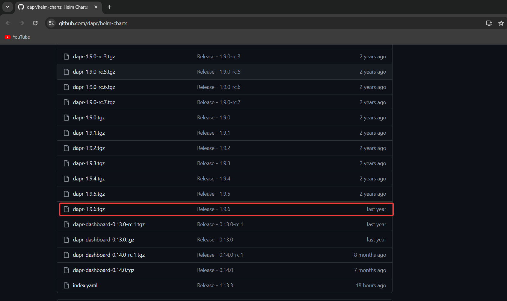
- Copy the repository URL for later use in Meshery.
  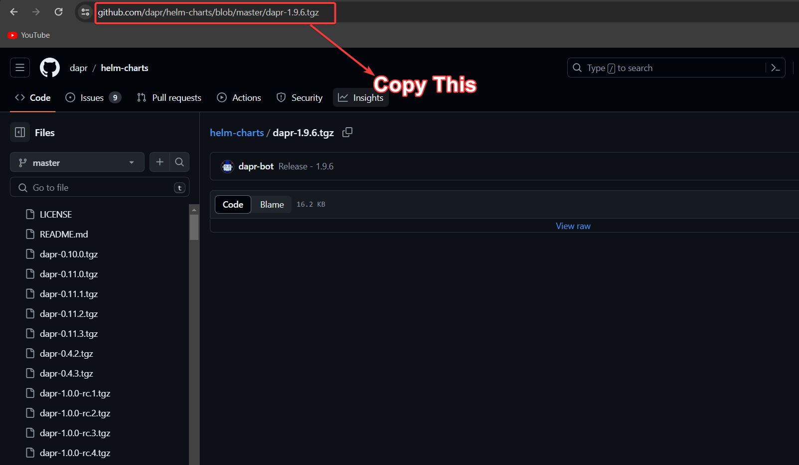

#### Converting GitHub Links to GitHub Raw Links as Meshmery compatible

When importing Helm Charts into MeshMap, it's essential to have GitHub raw links. Here's how you can convert regular GitHub links to GitHub raw links effortlessly:

1. **Understand GitHub Raw Links Format**:
   - GitHub raw links follow this format: `https://raw.githubusercontent.com/username/repository/branch/path/to/file.yaml`. They provide direct access to the raw 
     content of files on GitHub.

2. **Copy GitHub Link**:
   - After selecting the Helm chart on GitHub, copy the URL link of the file you need.

3. **Use Git-Rawify Tool**:
   - Access the [Git-Rawify tool](https://git-rawify.vercel.app/#convert).
   - Paste the copied GitHub link into the provided input field.
     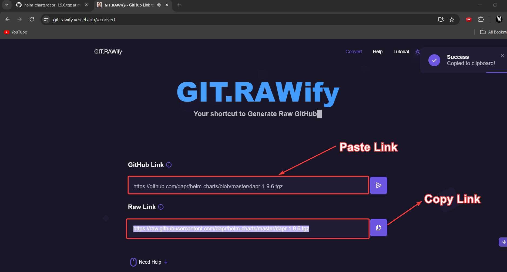

4. **Convert to GitHub Raw Link**:
   - The tool automatically converts the GitHub link to a GitHub raw link.
   - Copy the generated GitHub raw link.

By following these simple steps and utilizing the Git-Rawify tool, you can seamlessly convert GitHub links to GitHub raw links, ensuring compatibility with MeshMap and other platforms requiring raw links for file access.

#### Importing DAPR Helm Chart to MeshMap
- Now you can open Meshery playground.
- On the Right side ,Click on that Down arrow Symbol to import designs into meshery.
  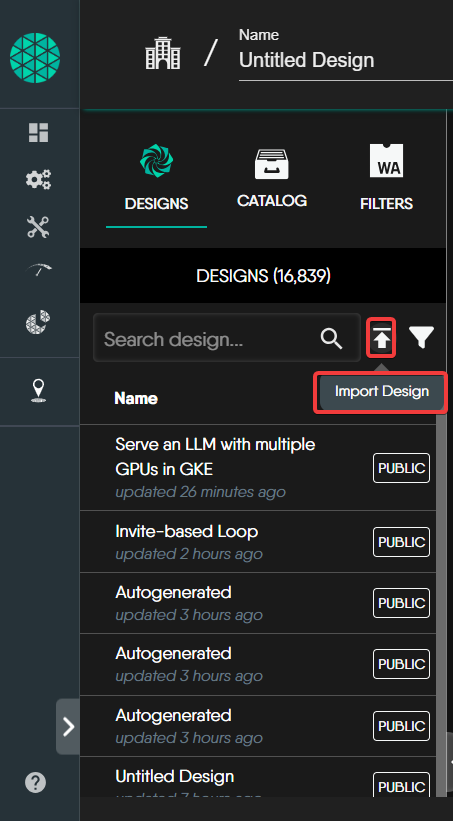
- After Click that , name This design as DAPR Helm design.
  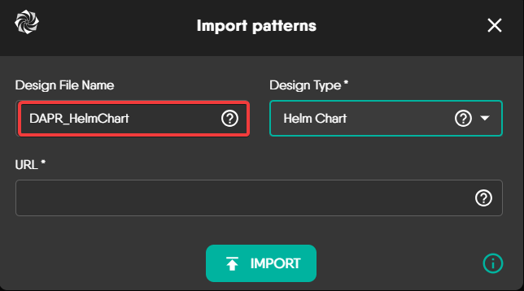
- At the dropdown in the left side select as helm chart
  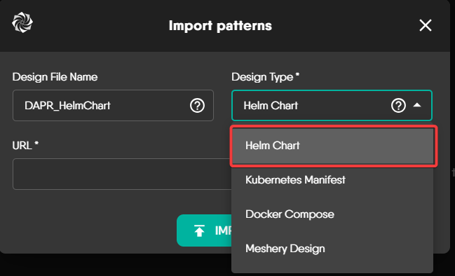
- In the url section , paste the existing github raw url lin kwhich is of helm charts.
  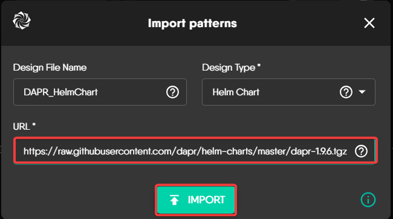
- Click on Import to import the helm chart.
- waiting for some time to load the helm into meshery.
  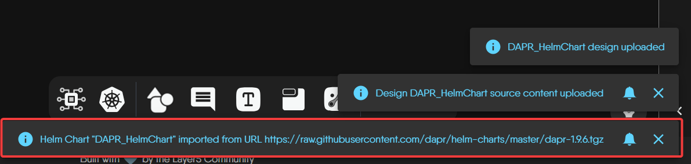
- Succesfully DAPR helm chart is imported into meshery .
  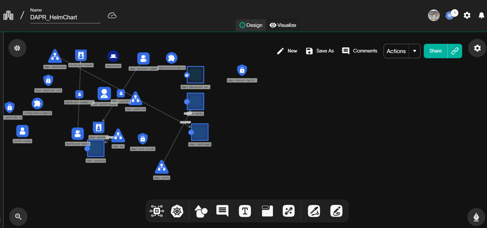
  

### Deploy/Undeploy Dapr Helm Chart in Meshery
1. Import the Dapr Helm Chart into Meshery.
2. Once the import is completed, click on "Validate" on the left. If no errors are found, proceed to deploy.
   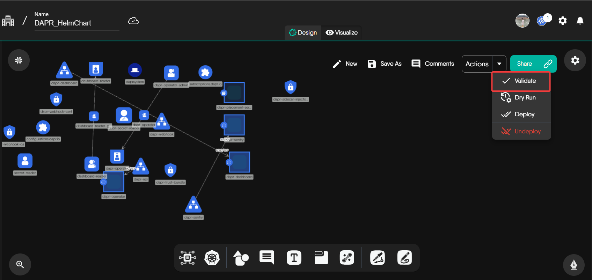
   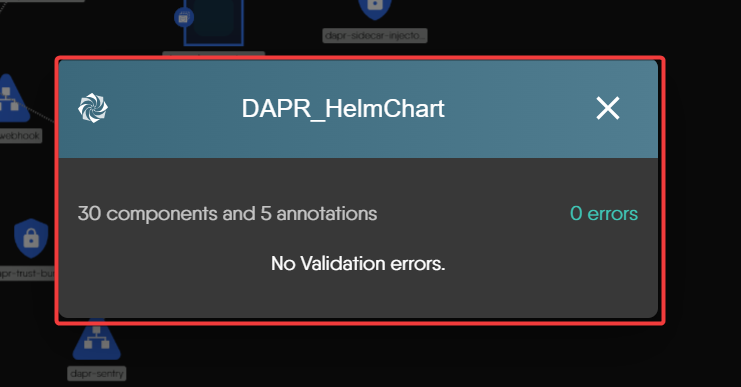
4. After validating the helm chart with no errors, proceed to deployment with your preferred environment.
   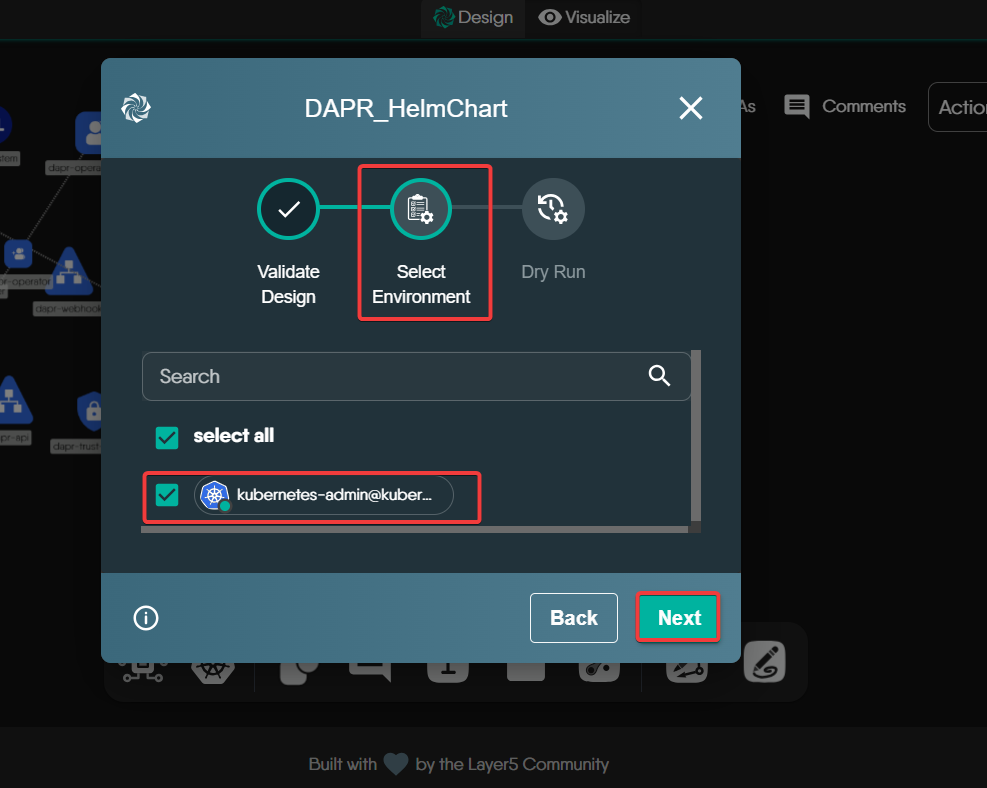
5. Click on "Deploy".
   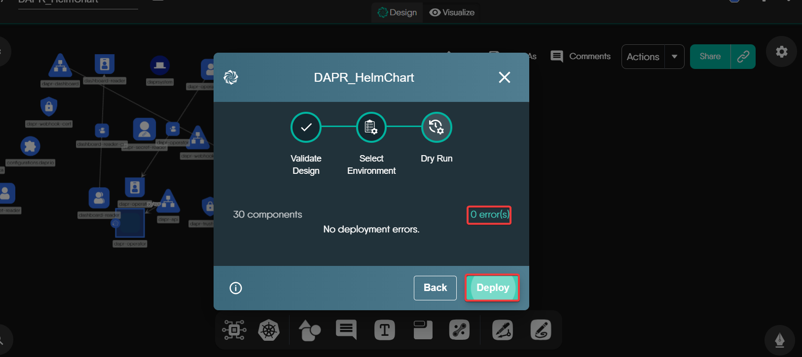

  

  

