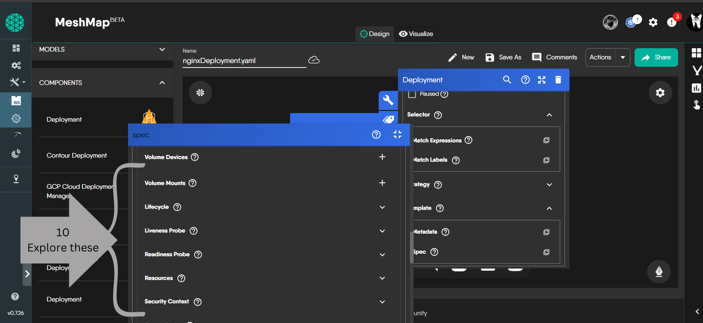

## Introduction
In this tutorial, we will delve into the world of Kubernetes Deployments, a key resource for managing and scaling containerized applications. Utilizing Meshery Playground, an interactive live cluster environment, we'll conduct hands-on labs to gain practical experience in deploying and managing applications using Kubernetes Deployments.

### Prerequisites
- Basic understanding of Kubernetes concepts.
- Meshery Playground access. If you don't have an account, sign up at [Meshery Playground](https://meshery.layer5.io/play).


#### creating a standalone deployment
 Here is the deployment.yaml we are going use for this tutorial 

 ``` yaml
 apiVersion: apps/v1
kind: Deployment
metadata:
  name: nginx-deployment
  labels:
    app: nginx
spec:
  replicas: 3
  selector:
    matchLabels:
      app: nginx
  template:
    metadata:
      labels:
        app: nginx
    spec:
      containers:
      - name: nginx
        image: nginx:latest
        ports:
        - containerPort: 80
```


   1. In the MeshMap screen, rename the design from _Untitled Design_ to a name of choice. This helps in identifying the design later easily.
   2. Click **Components** tab.
   
   3. Search for **deployment** in the list of components and choose only kubenetes deployment with the bellow symbol .
   

   4. Scroll down, _select and drag_ the **deployment** component from the search results to the design canvas on the right.
   5. After successfully drop the **deployment** component into canvas ,double click on deployment to enter configurations.
   6. Rename the **deployment** to **nginxdeployment**  or any desired name .
   

### Setting minimum no of replicas for autohealing capability

   7. In the Spec section , U  will have an option to define **replicas**, fill that with ur desired number of replicas and  for this tutorial we can use three replicas as the base minimum .
  

   8. Scroll down for **selector** section , click on it for two options and  as per the above **deployment.yaml** file  , fill the      **matchlabels** section  as per the  requirements .
  
   9. Scroll to down last until u find **template** section , click on it and select the spec option .
  

   10. In this Spec section , scroll down untill find containers section .
   11. Click **+** to add a container.
   12. Next, fill out some of the required container specifications. Start by entering the container image, we will use _nginx:latest_ for this exercise.
   
   13. Give the container a name and explore the other options too .


   14. after filling out containers section , scroll down untill u get ports section .
   15. Click **+** to add a port .
   .png)
   16. Fill the ports as per requirement and also  choose protocol type like TCP ,STCP etc

   17. Explore Spec ,there are many options to include like voulumes ,volume mounts ,resources etc.
   

   18. After this all operation , go back to starting where we have defiend deployment name , replicas etc ,there u will three options of symbols at left side , click on 2nd symbol where labels and annotations are defined .
   
   19. Click on the labels section and fill it with key and value as app and nginx respectively .
   .png)
   18. after this u can see a golden layer is present behind deployment .


### validating and deploying the deployment
   19. After this whole process , click on validate button to have an validation of errors before deployment.
   

   **Note** - Before clicking on deploy ,ensure that u are connected to kubernetes cluster and there are no errors displayed .
   20. Click on deploy .
  
   21. After your depolyed your resource ,automatically a nofication will be appeared at left side of screen .

   22. Congrats,here u have your first deployemnt deployed in meshery playground.

  

