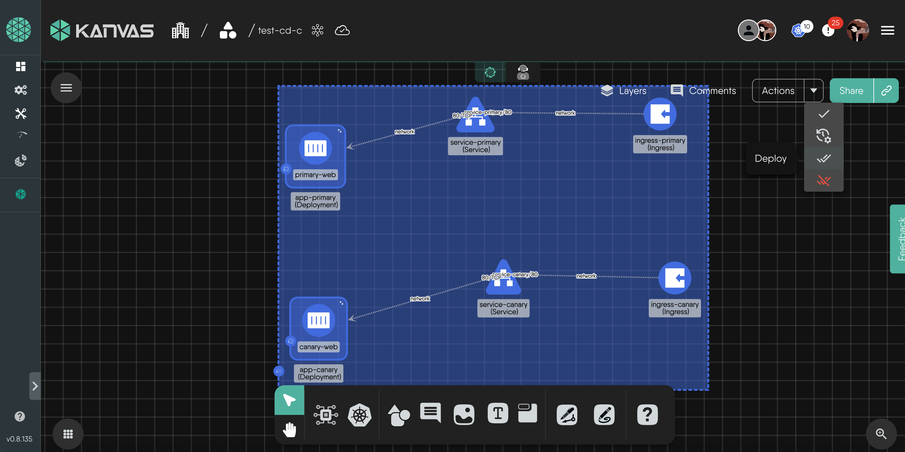
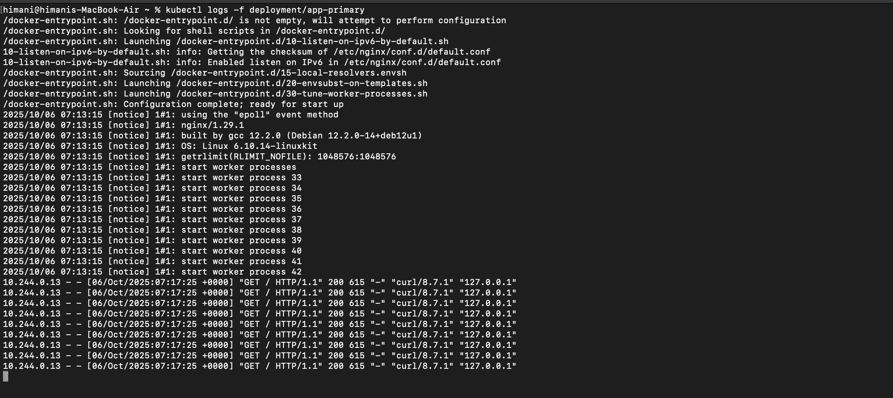

### Introduction

In canary deployments, a new version of an application is introduced to a small portion of users first, reducing risk by limiting exposure to potential bugs. Meshery Playground provides an interactive Kubernetes sandbox to design and deploy such scenarios. In this tutorial, we use Meshery’s [Kanvas](https://playground.meshery.io/extension/meshmap/) interface to deploy two versions of a sample app and configure an NGINX Ingress that splits traffic between them (a “canary” release). We’ll configure the Ingress so that, for example, 90% of requests go to the stable version and 10% to the new version. Meshery Playground makes this hands-on learning easy and fun!

> **_NOTE:_** If this is your first time working with Meshery Playground, consider starting with the [Exploring Kubernetes Pods with Meshery Playground](https://docs.meshery.io/guides/tutorials/kubernetes-pods) tutorial first.


### Prerequisites

- Basic knowledge of Kubernetes (pods, deployments, services) and networking concepts.
- Access to the _Meshery Playground_. If you don't have an account, sign up at [Meshery Playground](https://playground.meshery.io/).
- Basic familiarity with Meshery Kanvas: if you haven’t used it before, see the Getting Started with Kanvas or [Exploring Kubernetes Pods with Meshery Playground](https://docs.meshery.io/guides/tutorials/kubernetes-pods) tutorial first. Kanvas lets you visually create and connect resources without writing YAML.


### Lab Scenario

We will simulate a canary release by deploying a simple web service in two versions: primary (stable) and canary (new). Both versions will be fronted by an NGINX Ingress using the same hostname. The Ingress will be annotated to route a fraction of traffic (e.g. 50%) to the canary version and the rest to the primary version.


### Objective

Learn how to create, manage, and explore _Canary Deployment_.

### Steps

#### Access Meshery Playground

- Log in to the [Meshery Playground](https://playground.meshery.io) using your credentials.  
- On successful login, you should be at the dashboard. Close the **Where do you want to start?** popup (if required).  
- Click **Kanvas** from the left menu to navigate to the [_Kanvas_ design](https://kanvas.new/extension/meshmap) page.
  

> **_NOTE:_** Kanvas is still in beta.

#### Create the Primary (Stable) Deployment

1. In the Kanvas Design mode, from the floating dock below, click the **Kubernetes** icon and search for Deployment. Drag a Deployment onto the canvas and give it a descriptive Name (e.g. `app-primary`). Namespace default is fine.
2. The Configuration modal will open. In the modal, set the **Replicas** to 1. Under **Selector** and click **MatchLabels**. Set a _matchLabel_ pair. Here we have set `app:primary`.
3. Next, expand **Template** and open **Metadata** configuration modal. On the _metadata_ modal, click **+ Add Item** under **Labels** and set the label to the same key-value pair as in the previous step. Here it is `app:primary`.
4. While still under **Template** and click **Spec** to load the _spec_ configuration modal. Then scroll down and click **+ Add Item** under **Containers**. This will create a container, **Containers 1**.
5. Expand **Containers-1** and fill in the mandatory details such as _Image_ and _Name_. For this deployment we set:
- **Image**: `nginx:latest`
- **Name**: `primary-web`. 
- **Port->Ports 1->Container Port**: `80`
Label the deployment.
    

6. Click on an empty area in the canvas to close the configuration modals. The canvas now has the primary _Deployment_.

    

#### Add a Service for the Primary Deployment

1. From the Kubernetes icon, drag a **Service** component onto the canvas and name it (e.g. `service-primary`).
2. In the Service’s configuration modal, find **Ports**, click on **+ Add Item** option under it and expand **Ports 1**, set **Port** to 80 and **TargetPort** to 80.
3. Under Selector, enter the same label used by the deployment: `app:primary`. Also, Give a Label to the Service.
4. Exit the panel. Our `service-primary` Service should be connected to the Deployment. If it's not, you can drag a Network arrow from the Service to the Deployment. This ensures traffic to the service is routed to the pods. 
5. Our primary app design is now finished and it should look similar to the screenshot below.

    

#### Create the Canary Deployment

1. Still in Design mode, drag another Deployment onto the canvas. Rename it `app-canary`.
2. Configure it similarly: set **Replicas** to 1. Under Selector, MatchLabels, use a different label, `app:canary`, and apply the same label under **Template** > **Metadata** > **Labels**.
3. Under **Template > Spec**, add a container: click **+ Add Item** under Containers, expand **Containers 1** set Image to the same image (`nginx:latest`), Name to `canary-web` and Container Port to `80`. (You could also pick a different Image version if desired.)
4. Label the Deployment with `app:canary`.
5. Click on an empty area in the canvas to close the configuration modals. The canvas now also has canary _Deployment_ along with primary deployment and service.

    

#### Add a Service for the Canary Deployment

1. Drag a new Service onto the canvas, rename it (e.g. `service-canary`).
2. In its configuration modal: Under **Ports** > **Ports 1**, set **Port** to 80 and **TargetPort** to 80. Under **Selector**, use the canary pod’s label `app:canary`. Give a Label to the Service.
3. Close the modal. Connect `service-canary` to the canary Deployment with a Network arrow.

Now you should have a design similar to this screenshot,
    


#### Create the Ingress for the Primary Service

1. In the Kanvas design canvas, click the Kubernetes icon and select Ingress to add a new Ingress component.
2. Rename the ingress component. Click the Ingress component on the canvas and choose Configure to open its modal.
    

3. Set **Ingress Class Name** to `nginx`. Under **Rules**, click **+ Add Item** to reveal **Rules 1**, click on it to open **Rules 1** config modal. Set Host to your application’s domain (for example, `example.com`). This must exactly match the host you will test.
    

Still inside the Rules 1 config modal, expand **Http** and **Paths**, Under **Path 1** config modal, set:
- **Path**: `/`
- **Path Type**: `Prefix`

While still under **Paths 1**, Expand **Backend** > **Service**, enter the exact name of your primary Service (for this example it is `service-primary`) and set **Port** to `80`.
    

4. We will also attach a label to our Ingress component. The same as the Service and Deployment, `app:primary`. Leave Metadata Annotations empty. The stable Ingress handles 100% of traffic by default.

At this point, you have an Ingress pointing to your primary service on the given host and path. The host is the same name we will use for the canary Ingress.
    

**Deploy the design, before continuing.**

#### Create the Ingress for the Canary Service

1. Add another Ingress component in the canvas (click Kubernetes → Ingress again).
2. Click the new Ingress and select Configure. Set Ingress Class Name to `nginx` (same as before).
3. Under Rules, set the Host to the same domain as the primary Ingress (here, `example.com`). Still inside the Rules 1 config modal, expand **Http** and **Paths**, Under **Path 1** config modal, set:
- **Path**: `/`
- **Path Type**: `Prefix`

While still under **Paths 1**, Expand **Backend** > **Service**, enter the exact name of your canary Service (for this example it is `service-canary`) and set **Port** to `80`.
4. Attach label `app:canary`. 
5. Under Metadata Annotations, add the following entries to enable canary routing:
```
nginx.ingress.kubernetes.io/canary: true
nginx.ingress.kubernetes.io/canary-weight: 10
```
(Use the weight you want; here we use 10 for 10% of traffic.)

    


The canary: "true" annotation marks this Ingress as the canary, and canary-weight sets the percentage of traffic routed to it.

Click outside the modal.

Create a Network link between the ingress components and their respective services.
    


> **_NOTE:_** Ingress objects won’t work by themselves. You must have an Ingress Controller running in your cluster (e.g., an NGINX Ingress Controller). If you don’t, install it before continuing.

For this tutorial, I have used:

```
kubectl apply -f https://raw.githubusercontent.com/kubernetes/ingress-nginx/main/deploy/static/provider/kind/deploy.yaml
```
> **_NOTE:_** This command installs the NGINX Ingress Controller specifically for kind (Kubernetes in Docker).
If you are using a different Kubernetes environment (such as Minikube, cloud-managed clusters, or bare metal), you should follow the official installation instructions for your platform.

#### Deploy Again

Ensure there are no errors before deploying. To deploy, click the **Actions** tab in the pop-up modal and then click **Deploy**.

You should see a few alerts on the bottom right about the deployment.


#### Test the Traffic Split

To test traffic splitting, send multiple requests using the Ingress host and count how many go to each version. First, route ingress traffic to your local machine. For example, run:

```
kubectl port-forward -n ingress-nginx svc/ingress-nginx-controller 8080:80
```

This forwards port 80 of the NGINX Ingress controller to http://localhost:8080. Then, in another terminal, use a loop of curl commands with the proper Host header. For instance:

```
for i in {1..10}; do
  curl -s -H "Host: example.com" http://localhost:8080/ > /dev/null
done
```

Each request hits the Ingress as if it were sent to example.com. 

Next, determine which version handled each request. 

One way is to watch the logs: run `kubectl logs -f deployment/app-primary` in one terminal and `kubectl logs -f deployment/app-canary` in another while issuing requests. You should see roughly nine times as many log entries on the primary pod as on the canary pod, reflecting the 90/10 split.
    
    

Using our 10% canary, you should see around 90% of requests served by app-primary and 10% by app-canary. This demonstrates the traffic shifting: stable handles the majority of traffic while the canary gets its configured share.

Next: Once satisfied, you could adjust the canary-weight up or down (or promote the canary to 100%) by editing the annotations on the canary Ingress on Meshery Playground’s Kanvas to flip traffic weights or roll back changes if needed.

Congratulations! You have successfully completed this exercise.

[Design for this tutorial](https://cloud.layer5.io/catalog/content/catalog/tutorial-canary-deployment-with-meshery-616567e0-937b-46a3-8748-cdaa69f4be7f?source=%257B%2522userid%2522%253A%2522337a7dd1-2d26-48d6-bb28-26922e16d30d%2522%257D)