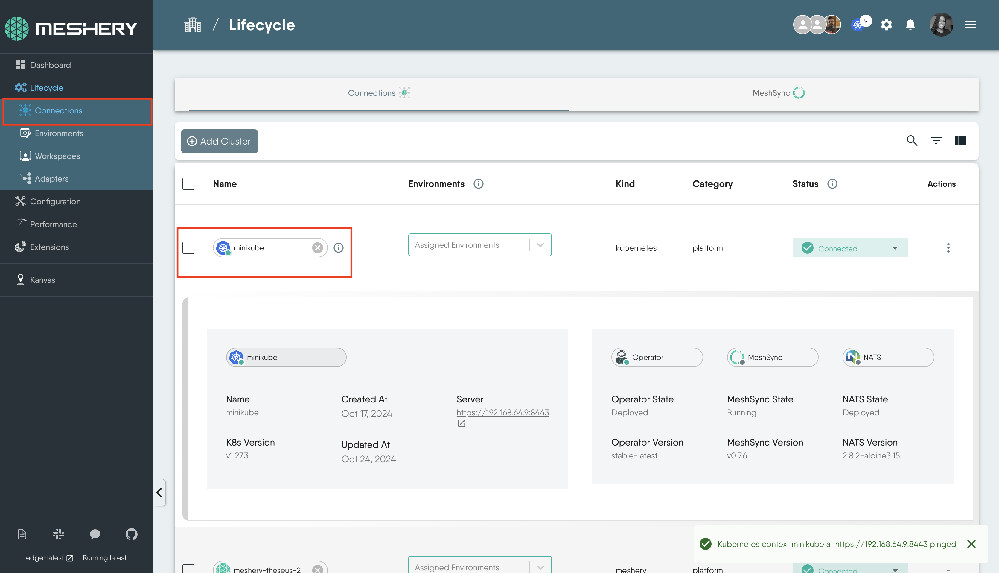
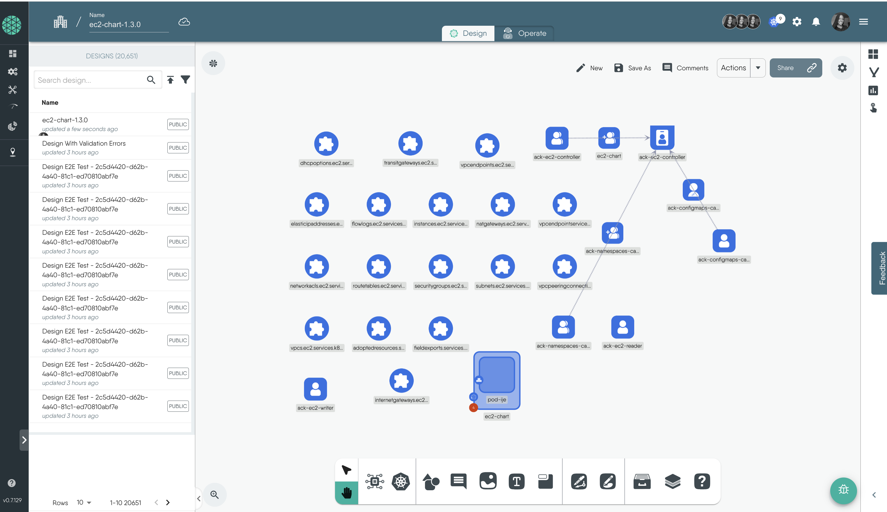
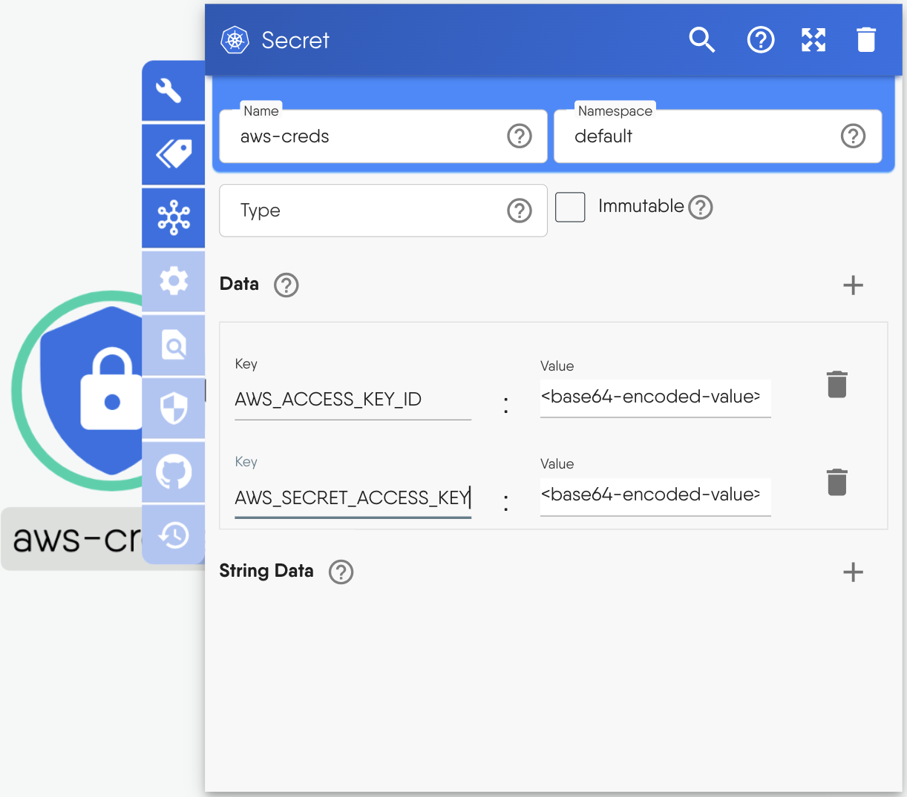
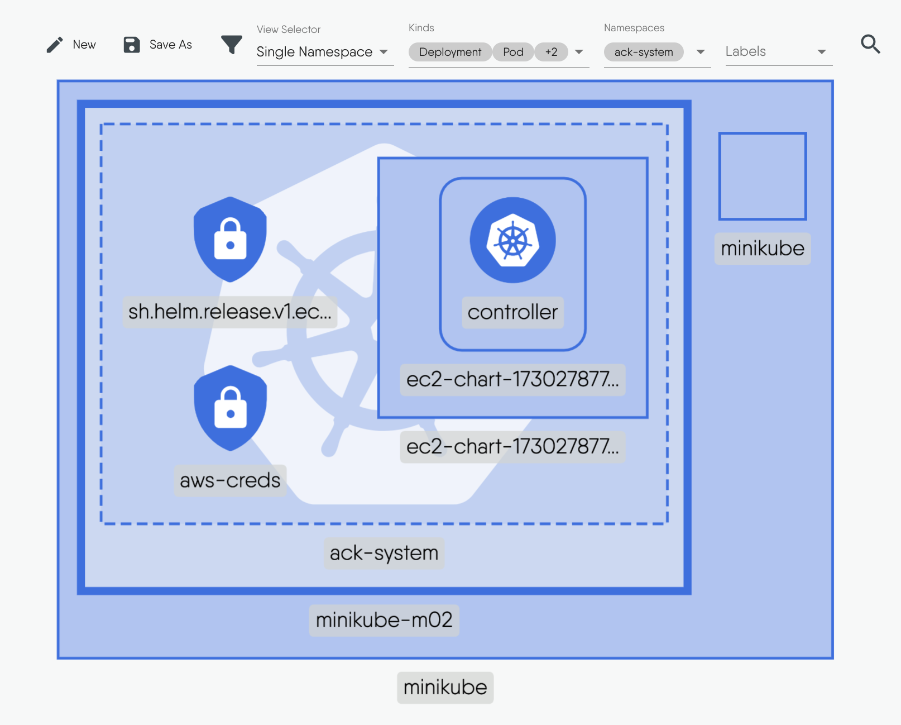

### Introduction

Meshery is a powerful multi-cloud management platform that enables you to configure, deploy, and manage AWS resources, such as EC2 instances. In order to manage AWS resources, Meshery uses [AWS Controllers for Kubernetes (ACK)](https://aws.amazon.com/blogs/containers/aws-controllers-for-kubernetes-ack/). ACK facilitates the bridge between Kubernetes and AWS services, enabling Meshery to manage AWS resources and Meshery enabling you to benefit from the enhanced experience that Meshery and its extensions offer.

Meshery has a number of extensions, adapters, and plugins. In this tutorial, we will use the [Kanvas]({{site.baseurl}}/extensions/kanvas) extension to provide an intuitive, visual experience for configuring and deploying an AWS EC2 instance. Among other aspects, Kanvas provides an alternative to command-line tools like `kubectl` by offering infrastructure as design. Once you connect your Kubernetes cluster to Meshery, you can configure, deploy, and manage AWS resources directly from the Kanvas interface, making deployments more intuitive and collaborative 

In this guide, you’ll explore how to deploy AWS resources, including setup and architecture details. This guide also covers how to access pre-configured designs from [Meshery Catalog](https://meshery.io/catalog) and demonstrates how to visualize deployed resources using Kanvas' operator mode, offering a comprehensive understanding of AWS resource management.

### Prerequisites

1. [Self Hosted Meshery Installation](https://docs.meshery.io/installation).
1. **AWS Account**: An active AWS account is required for accessing AWS resources.
1. **Kubernetes Cluster**: A running Kubernetes cluster, such as Minikube or EKS.

### Table of Contents

- [Introduction](#introduction)
- [Prerequisites](#prerequisites)
- [Table of Contents](#table-of-contents)
- [Overview of Deployment Steps](#overview-of-deployment-steps)
- [1. Connect your Kubernetes Cluster to Meshery](#1-connect-your-kubernetes-cluster-to-meshery)
- [2. Configure and Deploy the EC2 Controller](#2-configure-and-deploy-the-ec2-controller)
  - [Configure the AWS Secret](#configure-the-aws-secret)
  - [Configure the EC2 Controller Pod to Use the Secret](#configure-the-ec2-controller-pod-to-use-the-secret)
  - [Deploy EC2 Controller Design](#deploy-ec2-controller-design)
- [3. Deploy the VPC Workflow](#3-deploy-the-vpc-workflow)
- [4. Deploy EC2 Instance](#4-deploy-ec2-instance)
- [Conclusion](#conclusion)

### Overview of Deployment Steps

**1. Integrate Your Kubernetes Cluster with Meshery**

Begin by connecting your Kubernetes cluster to Meshery, establishing the foundation for interaction with AWS resources via ACK.

**2. Set Up Essential AWS Resources**

Use Meshery to deploy foundational resources such as VPCs, subnets, and other networking components necessary for your EC2 instance within AWS.

**3. Verify and Monitor Deployment**

Once deployment is complete, verify the EC2 instances via the AWS Management Console or Meshery’s visualization mode, where you’ll gain an interactive view of your deployed resources.

### 1. Connect your Kubernetes Cluster to Meshery

To begin, connect your Kubernetes cluster to Meshery. This guide uses `minikube`, which supports two deployment options for Meshery:

- **In-Cluster Deployment**: Deploys Meshery within the Kubernetes cluster using Helm inside the meshery namespace.

- **Out-of-Cluster Deployment**: Runs Meshery in Docker containers, allowing external connectivity to the Minikube cluster.

For this guide, the `in-cluster deployment` method is used.  Follow this [setup guide for Meshery on Minikube](/installation/kubernetes/minikube) to deploy Meshery in-cluster. After the deployment, open the Meshery UI at `localhost:9081` to verify that the cluster is listed. Click on the cluster name to ping and confirm connectivity.

### 2. Configure and Deploy the EC2 Controller

In this section, you will set up the EC2 controller and configure it to connect to your AWS account. This process involves creating a Kubernetes secret that contains your AWS access keys and configuring the controller pod to consume this secret. While these configurations are already included in our designs, the steps will be demonstrated for clarity.

1. **Clone the EC2 Controller Design**: Start by [cloning the EC2 controller design](https://cloud.layer5.io/catalog/content/catalog/ec2-controller-design-28a7fad9-c7ef-440a-a8f0-7614e072b866) from the catalog. To do this, click on **Clone** on the catalog page. Once cloned, open the design in the playground, and you will see it displayed on the Kanvas.

    

2. **Set the Deployment Namespace**: This design has been configured to be deployed in the `ack-system` namespace.

This EC2 controller design includes:

 -  **The EC2 Controller Pod**: This runs the main EC2 controller. This pod is responsible for managing the lifecycle of EC2 instances and their associated resources.
 -  **Custom Resource Definitions (CRDs)**: These CRDs define the desired state of various AWS resources, such as VPCs, subnets, NAT gateways, and other networking components.By utilizing these CRDs, the EC2 controller can interact with the AWS API to create, update, and manage these resources.
 -  **Service Account**: The service account associated with the controller pod has the necessary IAM permissions. These permissions allow the controller to perform essential functions, such as creating and managing AWS resources.
 - **AWS Credentials secret**: The AWS credentials secret stores your AWS access keys and secret access keys securely. This secret is essential for authenticating the AWS controller with your AWS account.

#### Configure the AWS Secret

To connect the EC2 controller to AWS, create a Kubernetes secret containing your AWS credentials.

1. Double-click the Secret component to open its configuration.

1. Under **Data**, add the base 64 encoded values of your AWS keys.
    - **AWS_ACCESS_KEY_ID**: `<base64-encoded-key>`
    - **AWS_SECRET_ACCESS_KEY**: `<base64-encoded-secret>`

    Encode your AWS key and secret with a [base64 encoder](https://www.base64encode.org/), then enter them in the configuration.

    

#### Configure the EC2 Controller Pod to Use the Secret

While this step is already handled in the design, but it's worth clarifying how the controller pod connects to the secret through environment variables.

1. Double-click the EC2 controller pod to open its configuration tab.

1. In the **Containers** section, scroll to **env** and click the **+** to add two environment variables:

    - **AWS_ACCESS_KEY_ID**: For the name, put in `AWS_ACCESS_KEY_ID`, click on the `secret Key Ref` dropdown and put in the **key** as `AWS_ACCESS_KEY_ID` and the secret resource **name** as `aws_creds`.
    - **AWS_SECRET_ACCESS_KEY**: Set the `AWS_SECRET_ACCESS_KEY` similarly, using the same secret key reference.

#### Deploy EC2 Controller Design

After configuring your design, the next step is deployment. To learn more about deploying your designs in Meshery, see [Deploying Meshery Designs](https://cloud.layer5.io/academy/learning-paths/mastering-meshery/introduction-to-meshery?chapter=deploying-meshery-designs). To deploy the resources, follow these steps:

1. Click the **Actions** button at the top of the Kanvas and click **Deploy**.

1. Once the deployment is complete, click **Open in Visualizer** to switch to Operator mode and see a pre-filtered view of your just deployed resources in the cluster. Alternatively, you can click *Operate* at the top of the Kanvas to enter Operater mode.

    

To get the filtered view shown above, click the filter icon and adjust the following settings:

  - For `view Selector` select `single namespace`
  - For `Kinds` select `Deployment, Pod, secret`
  - For `namspace` select `ack-system`

### 3. Deploy the VPC Workflow

This step involves deploying all the necessary resources to create the VPC and other networking components for the EC2 instance. The resources included in this network toplology include:

- 1 VPC
- 1 Internet Gateway
- 1 NAT Gateway
- 1 Elastic IP
- 2 Route Tables (Public and Private)
- 2 Subnets (1 Public, 1 Private)
- 1 Security Group

1. Start by [cloning the design](https://cloud.layer5.io/catalog/content/catalog/vpc-workflow-design-50cac19e-209c-4acf-b91c-4784281db033) from the catalog.

2. Once cloned, open the design in the playground, and you will see it displayed on the Kanvas.

3. You can adjust CIDR blocks, region, and other parameters as needed through the configuration tab. This design is configured to be deployed in the `us-east-1` region.

4. Click the **Actions** button to deploy.

5. After deployment, verify the setup in your AWS Management Console.

### 4. Deploy EC2 Instance

With the VPC and networking resources set up, deploy the EC2 instances within the VPC using the following steps.

1. [Clone the EC2 instances design](https://cloud.layer5.io/catalog/content/catalog/ec2-instances-design-a344f109-2d92-41da-8644-3bc285c3ca9e) from the catalog.

2. Open the design on the Playground and deploy the instances.

3. Navigate to the AWS Management Console to confirm the instances' successful deployment.

### Conclusion

This guide covered the steps to deploy and manage EC2 instances using Meshery. It demonstrated how to leverage pre-configured catalog designs, configure and deploy resources, set up the controller and necessary secrets, configure VPC networking resources, and ultimately deploy the EC2 instances. It also showed how to visualize Kubernetes resources using Kanvas's operator mode. This process highlights the ease of managing AWS resources visually through Meshery’s Kanvas interface, eliminating the need for CLI commands.
