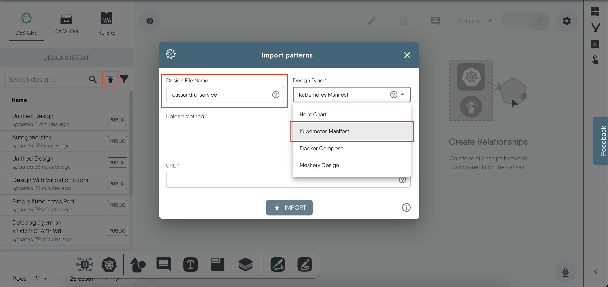
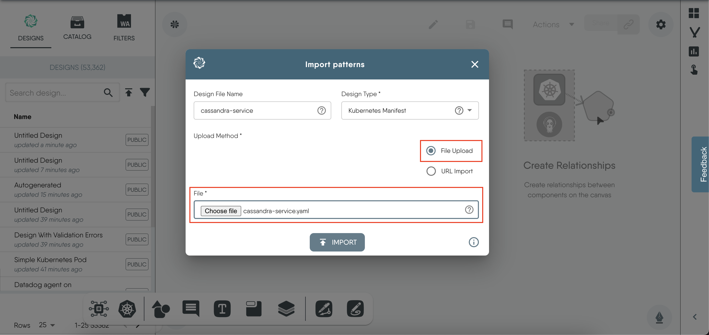
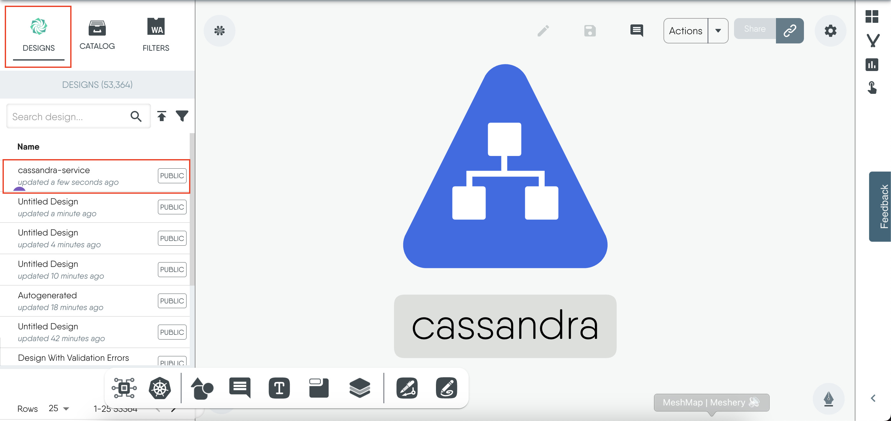
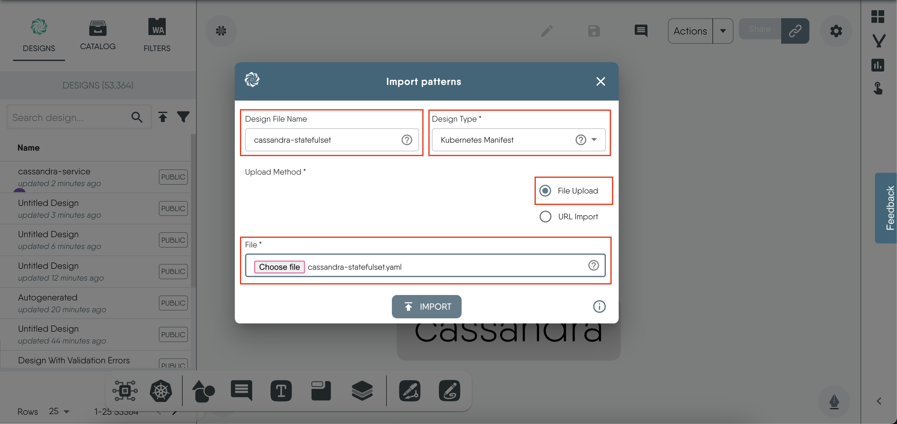
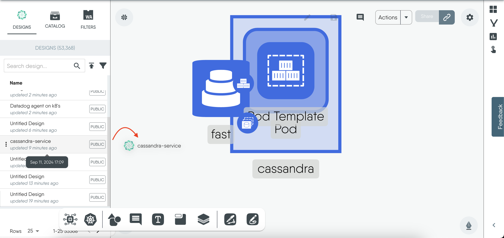
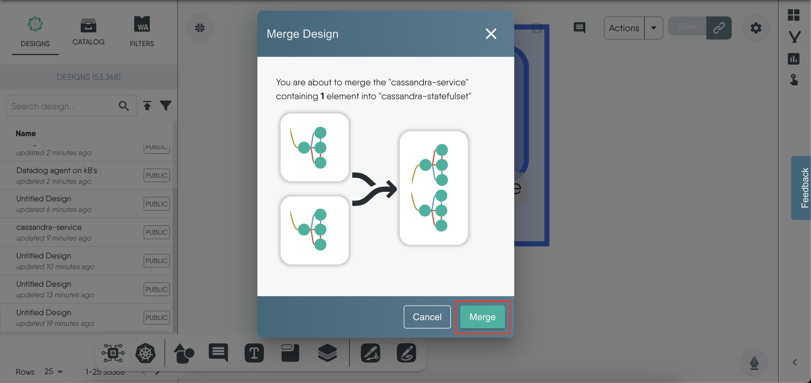
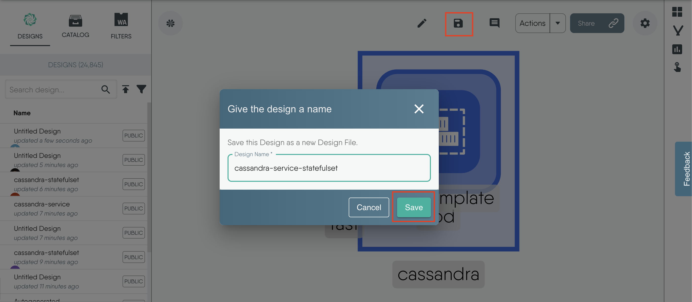
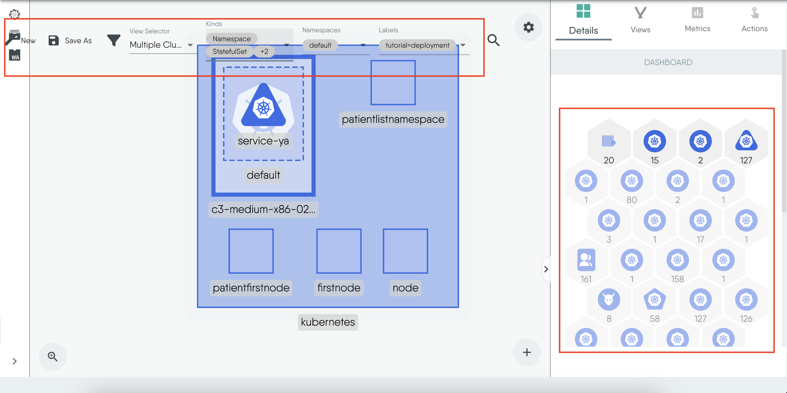
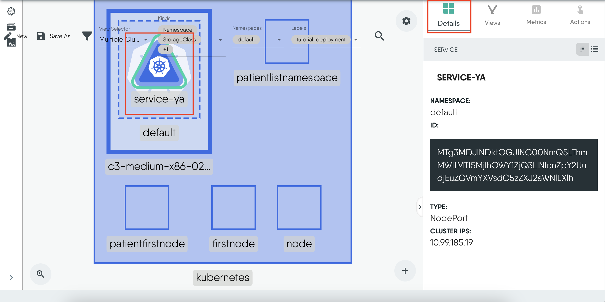

### Introduction

In this tutorial, we will learn how to deploy a **Apache Cassandra with a StatefulSet** using Meshery Playground. Meshery Playground is an interactive and collaborative live cluster environment that simplifies the deployment process and enhances user experience by providing visual tools for managing Kubernetes resources.

> **NOTE:** If this is your first time working with Meshery Playground, consider starting with the [Exploring Kubernetes Pods with Meshery Playground](https://docs.meshery.io/guides/tutorials/kubernetes-pods) tutorial first.

### Prerequisites

- Basic understanding of Kubernetes concepts.
- Access to the _Meshery Playground_. If you don't have an account, sign up at [Meshery Playground](https://play.meshery.io/).

### Lab Scenario

- Import the Apache Service and Apache StatefulSet manifest files into Meshery Playground.

- Create a Cassandra ring using the visual tools provided by Meshery.

- Deploy these resources on the playground.

In this lab, you will import the Service and StatefulSet manifest files into Meshery Playground. You will visualize these Kubernetes resources and Cassandra Ring using the visual tools provided by Meshery. Finally, you will deploy these resources on the Playground.

### Objective

Learn how to import manifest files, visualize Kubernetes resources, create new resource components, and deploy the application using Meshery Playground.

### Steps

#### Download the Kubernetes Configuration Files

Go ahead and download these yaml files [cassandra-service.yaml](https://kubernetes.io/examples/application/cassandra/cassandra-service.yaml) and [cassandra-statefulset.yaml](https://kubernetes.io/examples/application/cassandra/cassandra-statefulset.yaml)

These YAML files contain the Cassandra Service and Cassandra StatefulSet manifests

#### Access Meshery Playground

1. Log in to the [Meshery Playground](https://meshery.layer5.io/) using your credentials. On successful login, you should be at the dashboard. Press the **X** on the _Where do you want to start?_ popup to close it (if required).

2. Click **Explore** in the Cloud Native Playground tile to navigate to _MeshMap_

#### Import the Files to Meshery Playground

1. In the left sidebar, click on the upward arrow symbol(import icon) to import the designs into Meshery.

2. In the modal that appears:
   - Enter a name for your design in the "Design File Name" field (e.g.`cassandra-service`).

   - Select `Kubernetes Manifest` from the "Design Type" dropdown menu.

        

   - Choose `File Upload` for the upload method, and select the file you just downloaded.

   - Then, click on `Import`

        

3. Under the "Designs" tab, you will see that we have successfully imported the `cassandra-service` design.

   When you click on the names of the designs on the `Designs` tab, you can see the visual representations of the various Kubernetes resources and their relationships on the canvas.

    

4. Now, follow the same steps to import the `cassandra-statefulset` file.

    

#### Merging the Designs

Next, we will combine the Service and StatefulSet designs into a single design file. By merging these designs, we can manage and deploy both resources together.

To merge the Service deployment design with the StatefulSet deployment design:

1. Click and drag the `cassandra-service` design from the left panel and drop it onto the design canvas of the `cassandra-statefulset`.

    

2. This action will open a merge modal asking if you want to merge the design, Click on `Merge`.

    

3. Click on `Save As` and enter `cassandra-service-statefulset` as the new file name.

    

#### Visualizing the Deployed Resources

To view the resources deployed we will use the Visualize section of the _MeshMap_. In this section, you can apply filters to display the specific resources you want to see.

1. Move to the Visualize tab.
2. Click the filter icon and choose the appropriate filters

    - For "Kinds" select `StatefulSet`, `Service` and `StorageClass`
    - For the "label" select `dev=tutorial`

3. You can also use the icons on the right sidebar to filter the resources.

    After selecting your filters, you should see a view displaying only your relevant resources, as shown in the image below.

    

#### Resource Details

You can click on any resource to view more details about it in the "Details" section on the right sidebar.

**Deployment**

#### Deleting Resources

To delete the resources, use the `Undeploy` option from the Action dropdown in the _Design_ tab.

#### Conclusion

Congratulations! You’ve successfully completed the tutorial on deploying Apache Cassandra on Kubernetes using StatefulSets in Meshery Playground. This hands-on experience should have given you valuable insights into managing Cassandra instances with persistent storage, automatic discovery, and seamless scalability. You also explored how Kubernetes' StatefulSet feature ensures robust application state management and high availability in Meshery Playground.