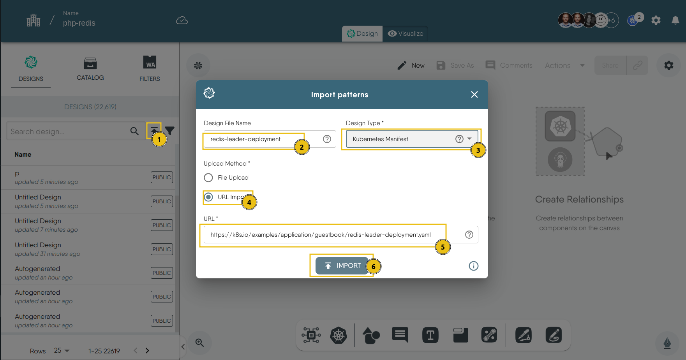

### Introduction

In this tutorial, we will learn how to deploy a **PHP Guestbook application with Redis** using Meshery Playground. Meshery Playground is an interactive and collaborative live cluster environment that simplifies the deployment process and enhances user experience by providing visual tools for managing Kubernetes resources.

> **NOTE:** If this is your first time working with Meshery Playground, consider starting with the [Exploring Kubernetes Pods with Meshery Playground](https://docs.meshery.io/guides/tutorials/kubernetes-pods) tutorial first.

### Prerequisites
- Basic understanding of Kubernetes concepts.
- Meshery Playground access. If you don't have an account, sign up at [Meshery Playground](https://meshery.layer5.io/play).

### Lab Scenario
- Import the PHP and Redis manifest files into Meshery Playground.
- Deploy these resources on the playground.
    - Start up a Redis leader.
    - Start up two Redis followers.
    - Start up the guestbook frontend.
- Expose and view the Frontend Service.


### Objective
Learn how to import manifest files, visualize Kubernetes resources, create new resource components, and deploy the application using Meshery Playground.


### Steps

#### Download the Kubernetes Configuration Files

To get started we will need some yaml files that will contain the configurations for the pods and services that will run on Meshery. You can download them to see what the look like.
1. [redis-leader-deployment.yaml](https://k8s.io/examples/application/guestbook/redis-leader-deployment.yaml)
2. [redis-leader-service.yaml](https://k8s.io/examples/application/guestbook/redis-leader-service.yaml)
3. [redis-follower-deployment.yaml](https://k8s.io/examples/application/guestbook/redis-follower-deployment.yaml)
4. [redis-follower-service.yaml](https://k8s.io/examples/application/guestbook/redis-follower-service.yaml)
5. [frontend-deployment.yaml](https://k8s.io/examples/application/guestbook/frontend-deployment.yaml)
6. [frontend-service.yaml](https://k8s.io/examples/application/guestbook/frontend-service.yaml)

These YAML files contain the Service definitions and Deployment configurations for the PHP app with Redis.

#### Accessing Meshery Playground

1. Log in to the [Meshery Playground](https://meshery.layer5.io/) using your credentials. On successful login, you should be at the dashboard. Press the **X** on the _Where do you want to start?_ popup to close it (if required).

2. Click **Explore** in the Cloud Native Playground tile to navigate to _MeshMap_


#### Import the Files to Meshery Playground

1. In the left sidebar, click on the upward arrow symbol(import icon) to import the designs into Meshery.

2. In the modal that appears:
   - Enter a name for your design in the "Design File Name" field (e.g.`redis-leader-deployment`).

   - Select `Kubernetes Manifest` from the "Design Type" dropdown menu.

   - Choose `URL Import` for the upload method, and input the URL.

   - Then, click on `Import`

        

3. 

4. Now, follow the same steps to import the rest of the files.

\```bash
# Deploying a sample microservices application
mesheryctl pattern apply -f https://raw.githubusercontent.com/example/microservices-app-deployment.yaml
\```

#### 3. **Scaling Deployments:**
  - Explore how to scale individual components of the microservices application by adjusting the replicas in the Deployment configuration.

\```bash
kubectl scale deployment <deployment-name> --replicas=3
\```

#### 4. **Updating Deployments:**
   - Learn how to update the microservices application by rolling out changes to the Deployment.

\```bash
kubectl set image deployment/<deployment-name> <container-name>=new-image:tag
\```

#### 5. **Rollback Deployments:**
   - Understand the process of rolling back changes in case of issues or errors during an update.

\```bash
kubectl rollout undo deployment/<deployment-name>
\```

#### 6. **Monitoring and Troubleshooting Deployments:**
  - Utilize Meshery Playground to monitor the status of Deployments and troubleshoot common issues.

#### 7. **Clean-Up:**
  - Delete the Deployments and associated resources after completing the lab.

\```bash
mesheryctl pattern delete -f https://raw.githubusercontent.com/example/microservices-app-deployment.yaml
\```

#### 8. **Saving and Sharing:**
   - Save your scenario in Meshery Playground for future reference.
  - Share your Deployment scenarios with the Meshery community for collaborative learning.

### Conclusion
Congratulations! You've successfully completed the lab on exploring Kubernetes Deployments using Meshery Playground. This hands-on experience has equipped you with practical knowledge on deploying, scaling, updating, and monitoring applications in a Kubernetes environment. Continue exploring more scenarios in the Meshery Playground to enhance your skills in container orchestration.

