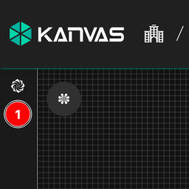
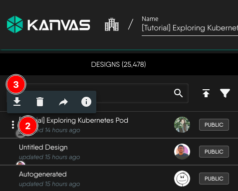
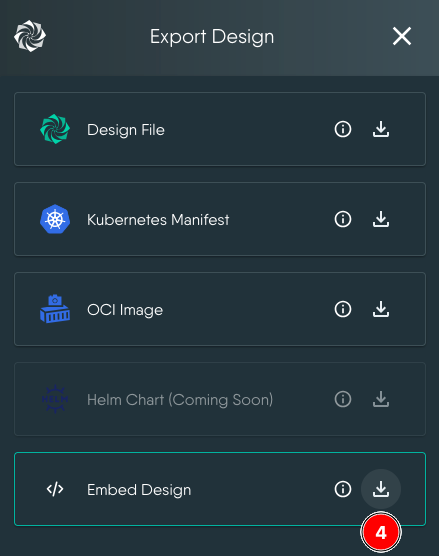
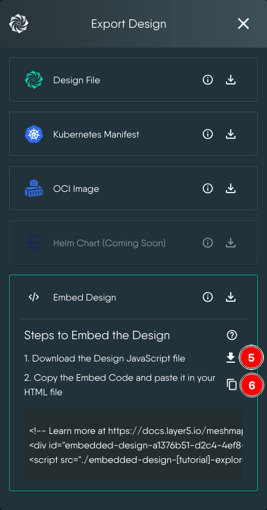
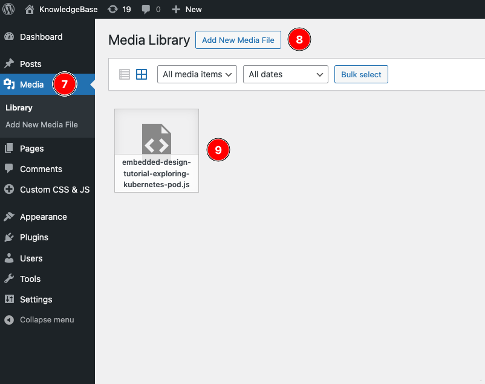
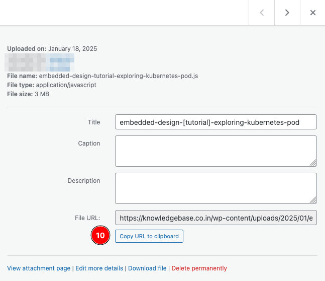
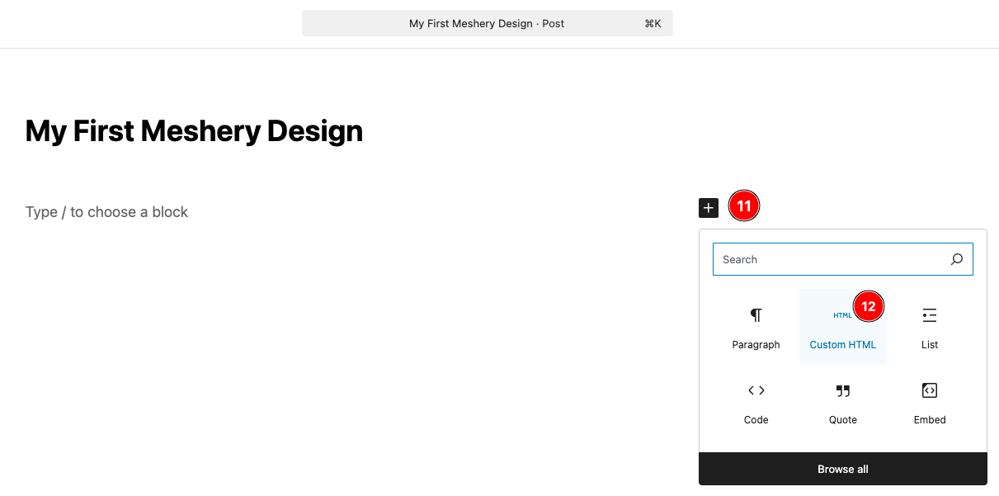
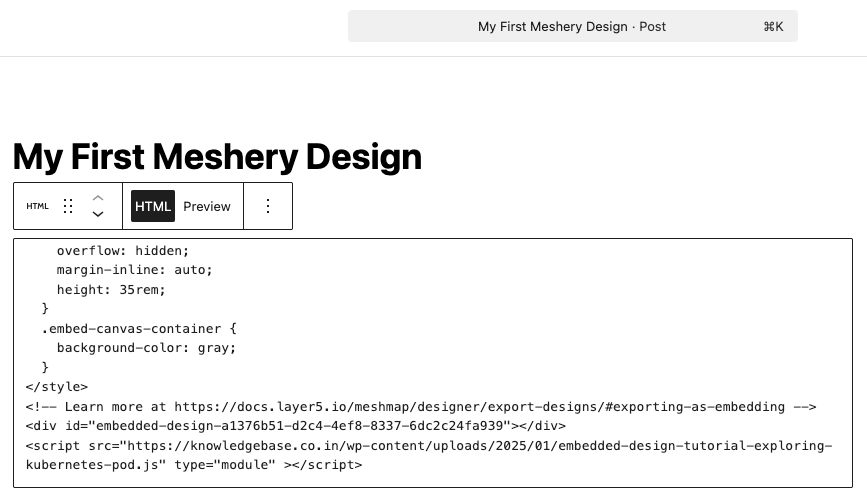
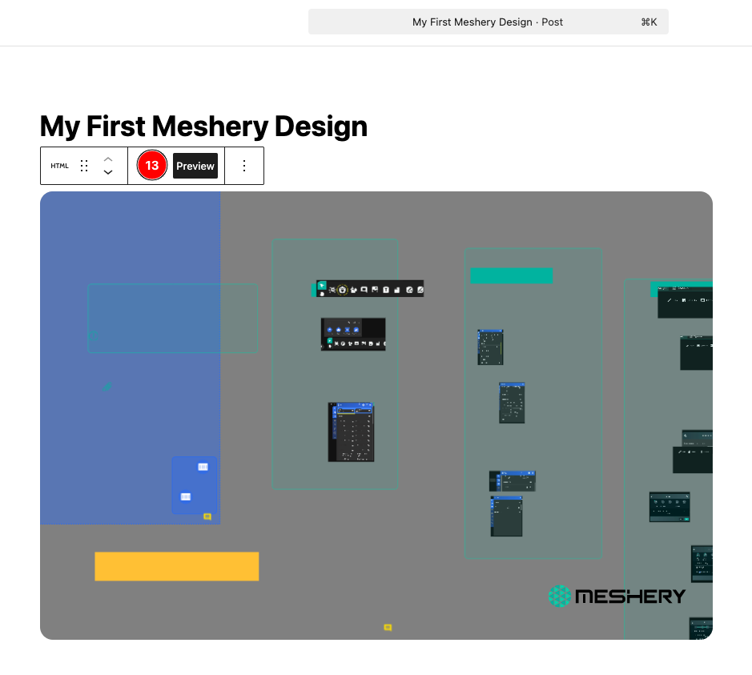

### Introduction

In this tutorial, we will learn how to embed a **Meshery Design** in a WordPress post using the **Embed** option in **Kanvas**.

This tutorial assumes that you have created a design or have an existing one. If not, you can use one of the numerous public designs available in **Kanvas** for this tutorial.

1. Expand the **Designs** menu on the left.
   
   

2. Click the **Quick actions** button to the left of the design (inverted ellipsis) and select **Export Design**.
   
   

3. Click the download icon next to **Embed Design** from the list.
   
   

4. This will show the `js` file to download and the HTML code snipped to copy.
   
   

5. Now, head over to WordPress and begin by uploading the `js` file to it. Ideally you will upload it to Media.
   
   

6. Next, click on the uploaded file in WordPress and copy the File URL. You will need this later.
   
   

7. Open the WordPress post where you want to embed the design in edit mode and add a _Custom HTML_ block.

   

8. Paste the following CSS code as it is, followed by the **Embed Code** copied from **Kanvas**. Update the script source value to the URL copied from WordPress.  
   ```
   <style>
     .embed-design-container {
       width: 100%;
       border-radius: 1rem;
       margin: 1rem;
       overflow: hidden;
       margin-inline: auto;
       height: 35rem;
     }
     .embed-canvas-container {
       background-color: gray;
     }
   </style>
   ```
    The final _Custom HTML_ should look something like this:
    ```
    <style>
     .embed-design-container {
       width: 100%;
       border-radius: 1rem;
       margin: 1rem;
       overflow: hidden;
       margin-inline: auto;
       height: 35rem;
     }
     .embed-canvas-container {
       background-color: gray;
    }
    </style>
    <!-- Learn more at https://docs.layer5.io/meshmap/designer/export-designs/#exporting-as-embedding -->
    <div id="embedded-design-a1376b51-d2c4-4ef8-8337-6dc2c24fa939"></div>
    <script src="https://yourwordpressdomain/wp-content/uploads/2025/01/embedded-design-tutorial-exploring-kubernetes-pod.js" type="module" ></script>
    ```
   

9. Click **Preview** to validate that the design is rendered.
   
   

10. Publish the WordPress post and share.

