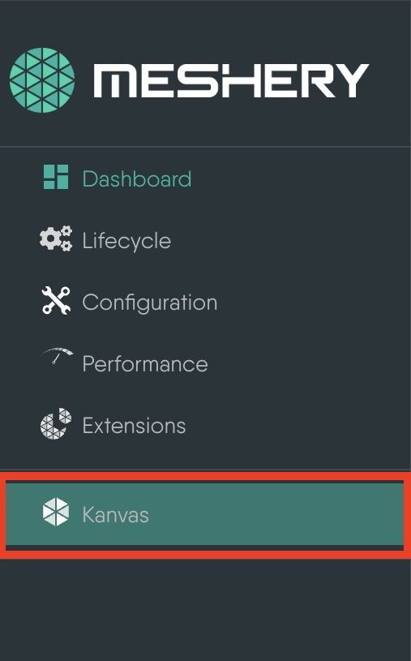
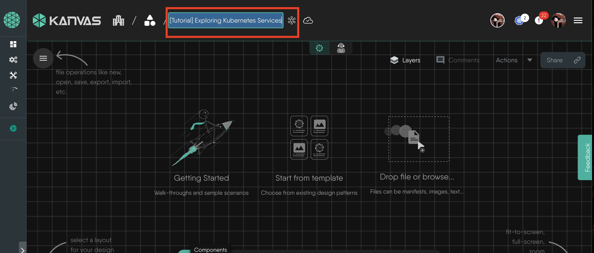
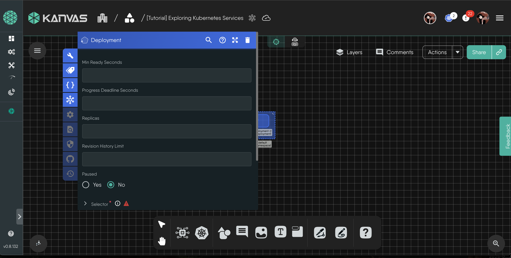
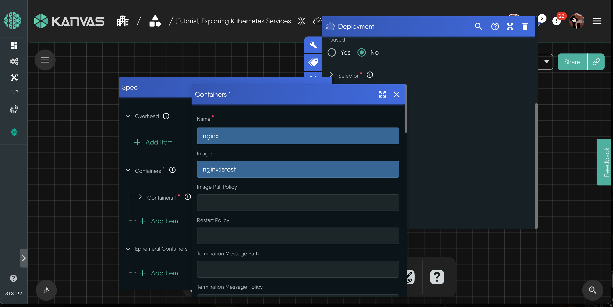
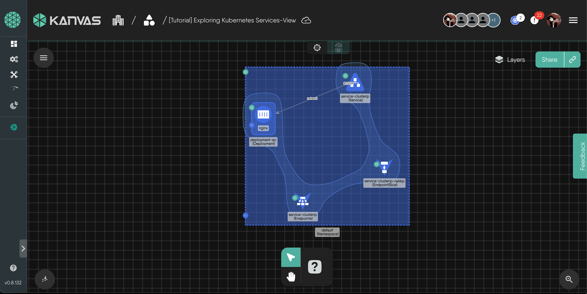

### Introduction

In this tutorial, we'll learn the fundamentals of Kubernetes **Services**, the resources responsible for exposing applications inside and outside the cluster. Using Meshery Playground, an interactive live cluster environment, we'll perform hands-on labs to gain practical experience with **ClusterIP, NodePort, and LoadBalancer** service types, without writing any YAML.

> **_NOTE:_** If this your first time working with Meshery Playground, consider starting with the [Exploring Kubernetes Pods with Meshery Playground](https://docs.meshery.io/guides/tutorials/kubernetes-pods) tutorial first.

### Prerequisites

- Basic understanding of containerization and Kubernetes concepts.
- Access to the _Meshery Playground_. If you don't have an account, sign up at [Meshery Playground](https://play.meshery.io/).

### Lab Scenario

Deploy a simple NGINX application as a Deployment and expose it ClusterIP Kubernetes Service types:  
- ClusterIP – The default service type, exposes a stable virtual IP for access only inside the cluster. 
In the next tutorials we will explore NodePort and LoadBalancer Service.
- NodePort – Exposes the Service on each node’s IP at a static port, enabling external access via `<NodeIP>:<NodePort>`
- LoadBalancer –  provisions an external load balancer with a public IP for the Service
kubernetes.io. 

### Objective

Learn how to create, manage, and explore ClusterIP _Kubernetes Services_ to expose applications within the context of a microservices architecture.

### Steps

#### Access Meshery Playground
- Log in to the [Meshery Playground](https://play.meshery.io) using your credentials.  
- On successful login, you should be at the dashboard. Close the **Where do you want to start?** popup (if required).  
- Click **Kanvas** from the left menu to navigate to the [_Kanvas_ design](https://kanvas.new/extension/meshmap) page.
  <!-- {: height="50%" } -->
  

> **_NOTE:_** Kanvas is still in beta.

#### Create a Deployment

1. In the _Kanvas Design_ page, start by renaming the design to a name of your choice for easier identification later.
    

2. From the floating dock below, click the **Kubernetes** icon and then click **Deployment** from the list. This will create the _Deployment_ component on the design canvas. 
    

3. Click or Drag the _Deployment_ component onto the canvas and the **Configure** tab automatically opens.
    
    
4. Change the **Name** of the deployment and the **Namespace** if required. For this demonstration, we will leave them as they are and deploy this to the _default_ namespace.
    
5. Set **Replicas** to `2`. Under **Selector** and **MatchLabels**, Set a _matchLabel_ pair. Here we have set `app:9988110`.
6. Under **Template → Metadata → Labels**, add the same label `app:9988110`. 
  

7. While still under **Template** and click **Spec** to load the _spec_ configuration modal. Then scroll down and click **+ Add Item** next to **Containers**. This will create a container **Containers 1**, click on it and add:  
- **Image**: `nginx:latest`  
- **Name**: `nginx`  
  

8. Click outside to close the modal. The deployment is now ready and it will look similiar to this:
  

9. Validate and Deploy the design: Click Validate (top toolbar), ensure no errors, then click Deploy. Wait for the deployment to complete (notifications appear on the bottom right).

#### You have now deployed an NGINX Deployment with 2 pods running in the cluster.

---

#### Add a ClusterIP Service

1. From **Components**, search for **Service** and drag it to the canvas, Rename the service, here I will go with `service-clusterip`. Click on the service component to open its config modal. 
  

2. In the service configuration modal:  
- Set **Type** to `ClusterIP`.  
- Click on  **+ Add Item**  under Ports to add a port called **Ports 1**. Click om it and add: 
  - **Port**: `80`  
  - **TargetPort**: `80`  
- Also add the same key value pair as before under **Selector**: `app: 9988110`
   
- We will also add the same label as the deployment for easier identification in Operate Mode.

4. Connect the Service to the Deployment: Click over the service component until green dots appear, click the arrow and select network. Drag to the deployment. This creates a Network link.  
  

From the Actions Tab, Undeploy the deployment first and then, validate and dry-run the new design, resolve any errors that may arise. Now, deploy the design. A pop up in the bottom right will confirm that the design is successfully configured.
  

Switch to Operate mode, explore the Service details. select the service-clusterip resource to see its details. Notice the ClusterIP listed under Addresses and that no external IP or NodePort is assigned. This confirms that a ClusterIP service provides an internal IP reachable only within the cluster.
  

This Service has a ClusterIP (10.98.146.20) and a selector (app=9988110). Any Pod with that label automatically becomes part of the Service’s backend. This label-to-Pod binding is how ClusterIP Service internally connect traffic to workloads.
  

---
