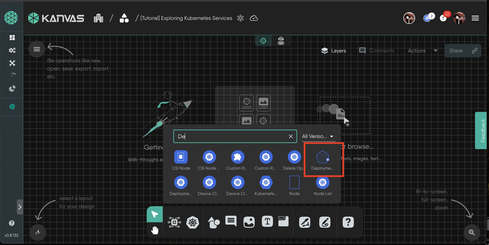
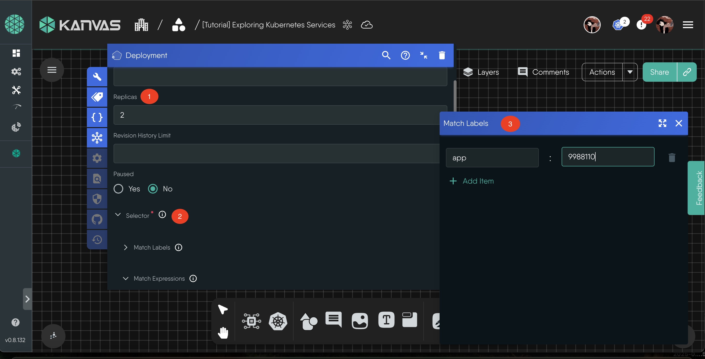
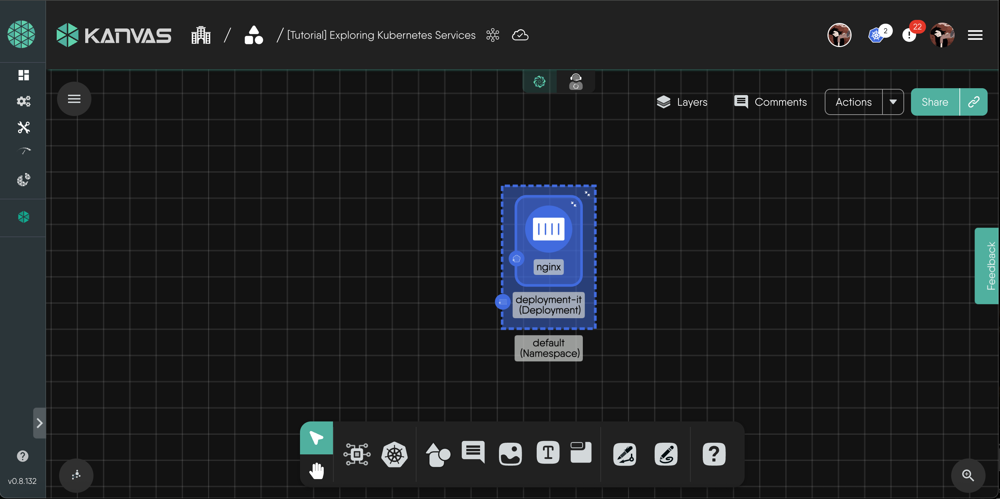
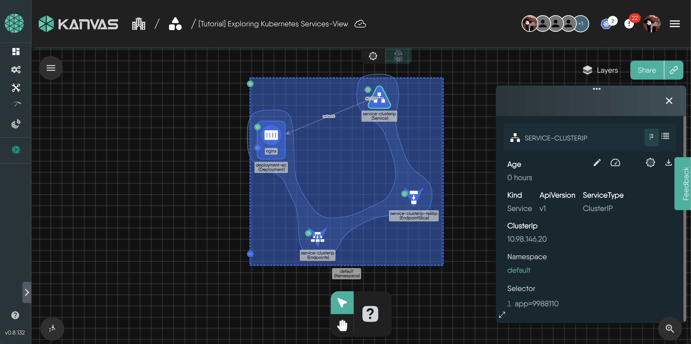
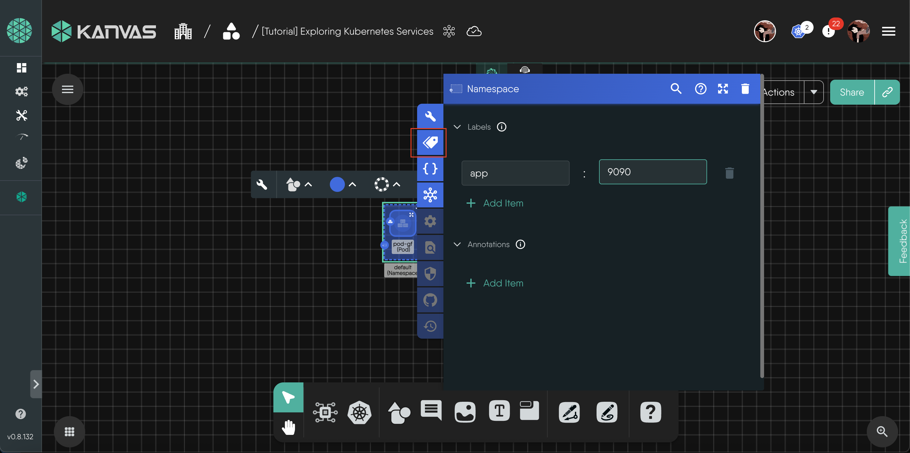
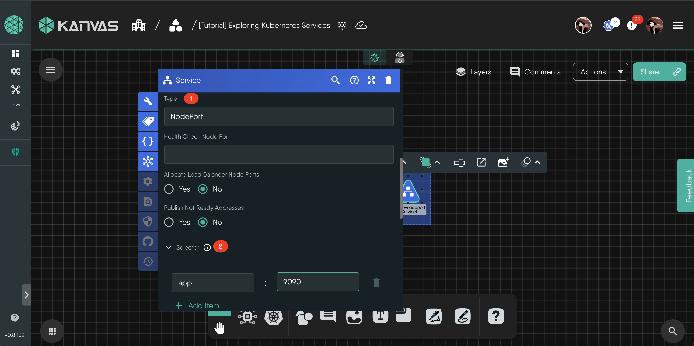
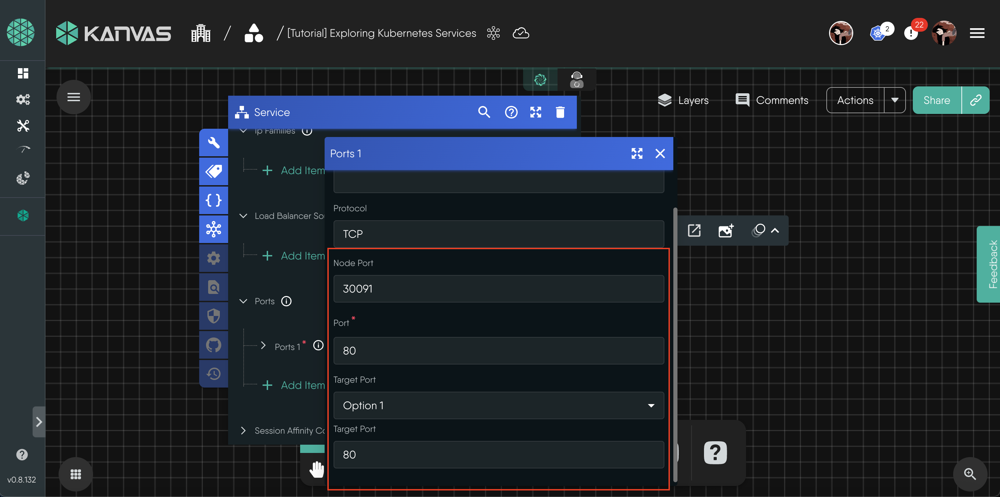
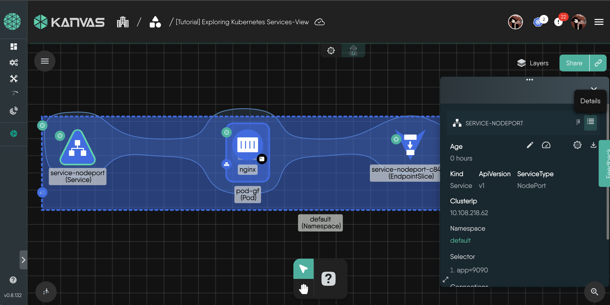
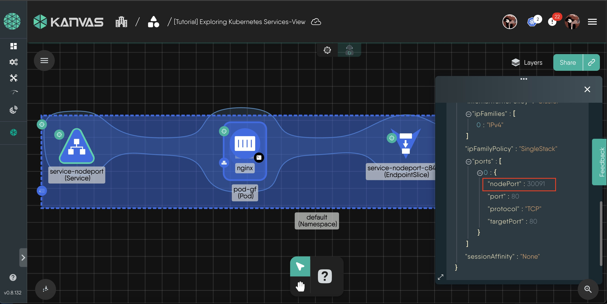
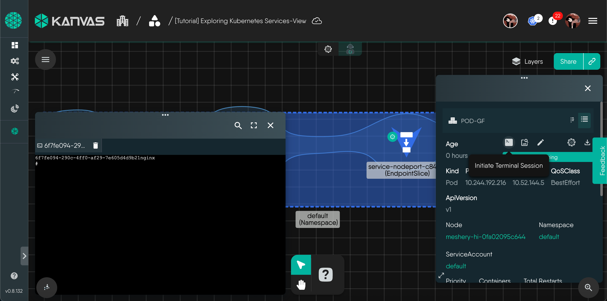

### Introduction

In this tutorial, we'll learn to implement Kubernetes **Services**, the resources responsible for exposing applications inside and outside the cluster. Using Meshery Playground, an interactive live cluster environment, we'll perform hands-on labs to gain practical experience with the **ClusterIP** and **NodePort** service type, without writing any YAML. Subsequent tutorials will cover **LoadBalancer**.

> **_NOTE:_** If this is your first time working with Meshery Playground, consider starting with the [Exploring Kubernetes Pods with Meshery Playground](https://docs.meshery.io/guides/tutorials/kubernetes-pods) tutorial first.

### Prerequisites

- Basic understanding of containerization and Kubernetes concepts.
- Access to the _Meshery Playground_. If you don't have an account, sign up at [Meshery Playground](https://play.meshery.io/).

### Lab Scenario

Deploy a simple NGINX application or a simple NGINX Pod and expose it using ClusterIP, NodePort, and LoadBalancer services. Each service will route traffic to the NGINX pods via a common label selector. We’ll inspect the service details in Operator mode to confirm their types and behavior.

### Objective

Learn how to create, manage, and explore _Kubernetes Services_ to expose applications within the context of a microservices architecture.

### Steps

#### Access Meshery Playground
- Log in to the [Meshery Playground](https://play.meshery.io) using your credentials.  
- On successful login, you should be at the dashboard. Close the **Where do you want to start?** popup (if required).  
- Click **Kanvas** from the left menu to navigate to the [_Kanvas_ design](https://kanvas.new/extension/meshmap) page.
  

> **_NOTE:_** Kanvas is still in beta.

#### Create a Deployment

1. In the _Kanvas Design_ page, start by renaming the design to a name of your choice for easier identification later.
    

2. From the floating dock below, click the **Kubernetes** icon and then click **Deployment** from the list. This will create the _Deployment_ component on the design canvas. 
    

3. Click or Drag the _Deployment_ component onto the canvas and the **Configure** tab automatically opens.
    
    
4. Change the **Name** of the deployment and the **Namespace** if required. For this demonstration, we will leave them as they are and deploy this to the _default_ namespace.
    
5. Set **Replicas** to `2`. Under **Selector** and **MatchLabels**, Set a _matchLabel_ pair. Here we have set `app:9988110`.
6. Under **Template → Metadata → Labels**, add the same label `app:9988110`. 
  

7. While still under **Template** and click **Spec** to load the _spec_ configuration modal. Then scroll down and click **+ Add Item** next to **Containers**. This will create a container **Containers 1**, click on it and add:  
- **Image**: `nginx:latest`  
- **Name**: `nginx`  
  

8. Click outside to close the modal. The deployment is now ready and it will look similar to this:
  

9. Validate and Deploy the design: Click Validate (top toolbar), ensure no errors, then click Deploy. Wait for the deployment to complete (notifications appear on the bottom right).

#### You have now deployed an NGINX Deployment with 2 pods running in the cluster.

---

#### Add a ClusterIP Service

1. From **Components**, search for **Service** and drag it to the canvas, Rename the service, here I will go with `service-clusterip`. Click on the service component to open its config modal. 
  

2. In the service configuration modal:  
- Set **Type** to `ClusterIP`.  
- Click on  **+ Add Item**  under Ports to add a port called **Ports 1**. Click on it and add: 
  - **Port**: `80`  
  - **TargetPort**: `80` (These match the container port that nginx serves on.)
- Also add the same key value pair as before under **Selector**: `app: 9988110`
   
- We will also add the same label as the deployment for easier identification in Operator Mode.

3. Connect the Service to the Deployment: Click over the service component until green dots appear, click the arrow and select network. Drag to the deployment. This creates a Network link.  
  

From the Actions Tab, Undeploy the deployment first and then, validate and dry-run the new design, resolve any errors that may arise. Now, deploy the design. A pop up in the bottom right will confirm that the design is successfully configured.
  

Switch to Operator mode, explore the Service details. select the service-clusterip resource to see its details. Notice the ClusterIP listed under Addresses and that no external IP or NodePort is assigned. This confirms that a ClusterIP service provides an internal IP reachable only within the cluster.
  

This Service has a ClusterIP (10.98.146.20) and a selector (app=9988110). Any Pod with that label automatically becomes part of the Service’s backend. This label-to-Pod binding is how a ClusterIP Service internally routes traffic to its backing workloads.
  

---

#### Add a NodePort Service
 
To allow external access, we’ll use a NodePort service. For simplicity purposes, I will switch from using deployment to Pod for our next Service. 

1. Back in Design mode, we will drag a Pod from the dock onto the canvas. Scroll down within the Pod configuration modal to the Containers section. Click **+** to add a container. Expand **Containers-1**. Next, fill out some of the required container specifications. Start by entering the container image, we will use _nginx:latest_ for this exercise. Give the container a name and a unique label(This unique label will be used by the service selector.). 
  

2. Now, drag a Service component onto the canvas and rename it to `service-nodeport`.

3. Under the config modal, Set **Type** to `NodePort` and the same selector as the Pod label, so that our service is connected with our Pod.
  

4. Click on **+ Add Item** under Ports to reveal **Ports-1**, expand **Ports-1** and add: 
- **Port**: `80`  
- **TargetPort**: `80`  
- **NodePort**: `30091` (or leave blank to auto-assign). 
  

7. Create a **Network** link to the Deployment, by dragging a Network arrow from service-nodeport to nginx-deployment. *change this*

Validate and deploy from the Action tab at the top right.

> **_NOTE:_** Always undeploy your previous designs before deploying a new one.

Now switch to Operator mode, click on any component to view details(like type or selector) about the Service or the Pod.
  

Note that this service is mapped NodePort and is accessible on the **Node’s IP address**.

Expand the details section and you will see a NodePort value (30091), this means the service is exposed on each Node’s IP at port 30091. You can access the NGINX app externally via http://<NodeIP>:30091.
  

The Operator mode also provides a interactive terminal, click on the Pod to reveal the initiate terminal session option.
  
 
 you can test things inside.

The response indicates that the NodePort is reachable from the pod.

---

#### Add a LoadBalancer Service

Finally, we’ll create a LoadBalancer service. In a real cloud environment, this would provision an external load balancer. In Meshery Playground, you will see how the service object is defined, even though a real cloud IP isn’t provided.

1. In Design mode, add another Pod to the canvas (as before). Add a container with Name nginx, Image nginx:latest, and add label `app: 8080`.
2. Drag a Service component onto the canvas, rename it `service-loadbalancer`. 
3. In the service’s Configure panel, set **Type** to `LoadBalancer`. Under Selector, add app: `app: 8080`
4. Under Ports, click **+ Add Item**. Expand Ports 1 and set port: `80`, TargetPort: `80`. 
- **Port**: `80`  
- **TargetPort**: `80`  

5. Close the panel. 
  

Connect the service to the Pod by dragging a Network arrow from `service-loadbalancer` to the Pod.

6. Validate and Deploy (undeploy the old design first).  

In Operate mode, observe the LoadBalancer service. In a real Kubernetes environment, a LoadBalancer provides an **external IP address**. 

---

### Cleaning Up

To remove all the resources you created in this tutorial: in Design mode, go to Actions → Undeploy and confirm. This will delete the Deployments/Pods and Services from the cluster.

--- 

### Conclusion

Congratulations! You've successfully completed the lab on exploring Kubernetes Services with Meshery Playground. You created and deployed a sample application, then exposed it with different Service types (ClusterIP, NodePort, LoadBalancer). This exercise should give you a strong understanding of how Kubernetes networking primitives are represented in Meshery and how to smoothly operate the UI.  

Continue exploring more scenarios in the Meshery Kanvas to enhance your skills.

---
