## Introduction

In this tutorial, we will work with Kubernetes ConfigMaps and Secrets. _ConfigMaps_ are used to manage configuration data, while _Secrets_ are used for sensitive information such as passwords. Using Meshery Playground, an interactive live cluster environment, we'll perform hands-on exercises to gain practical knowledge into working with these Kubernetes objects.

> **_NOTE:_** If this your fist time working with Meshery Playground start with the [Kubernetes Pods with Meshery](./kubernetes-pods.md).

## Prerequisites

- Basic understanding of containerization and Kubernetes concepts.
- Access to the _Meshery Playground_. If you don't have an account, sign up at [Meshery Playground](https://play.meshery.io/).

## Lab Scenario

 - Start with an existing design of a simple MySQL pod. 
 - Add a _ConfigMap_ to set the database name to be created on MySQL pod deployment.
 - Use a _Secert_ to set the MySQL root password.

## Objective

Learn how to create and manage _Kubernetes ConfigMaps and Secrets_ within the context of a microservices architecture.

## Steps

### Access Meshery Playground

- Log in to the [Meshery Playground](http://playground.meshery.io/) using your credentials. On successful login, you should be at the dashboard. Press the **X** on the _Where do you want to start?_ popup to close it (if required).
- Click **Kanvas** in the navigation menu to navigate to _Kanvas_.

> **_NOTE:_** Kanvas is still in beta.

### Clone the starter design

For this tutorial we will start with an existing design and later add _ConfigMap_ and _Secret_ components to it. The design is a simple MySQL pod.

Select the **Catalog** tab and search for the word _'tutorial'_ (1). Click on the **[Tutorial] Simple MySQL Pod** (2) design and when prompted click **Clone** (3).

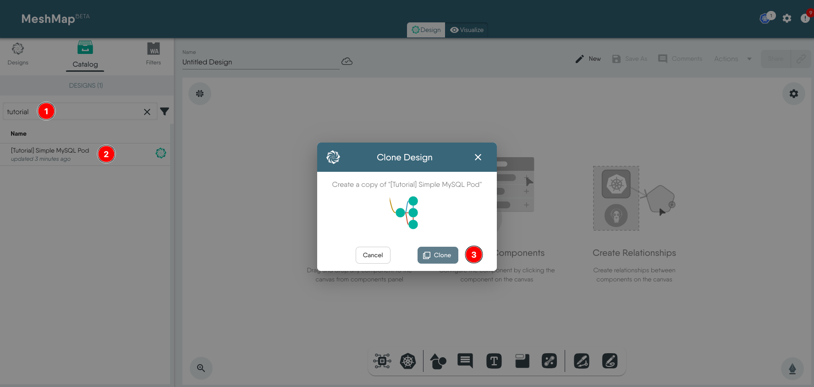

Label the pod with a unique key-value pair for easier filtering later. For example, _user:johndoe_. Use the same key-value pair fot labelling all the other resources. The tutorial uses _environment:tutorial_, do not use the same.

### Create and configure a ConfigMap

Click Kubernetes from the dock and select Config Map from the list. This will put the ConfigMap component on the canvas.  

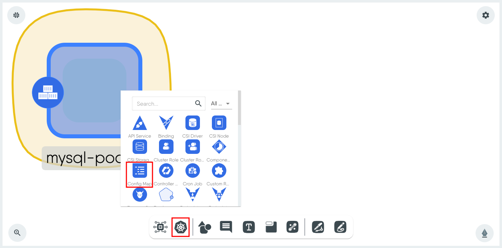

Click the _ConfigMap_ component to load the configuration window.

 1. Change the **Name** if required. (Using a unique name helps with easier identification later)
 2. Click **+** next to Data and set the ConfigMap data as a key value pair. In this example, the _Key_ is **CREATEDB** and the _Value_ is **myDB**.

    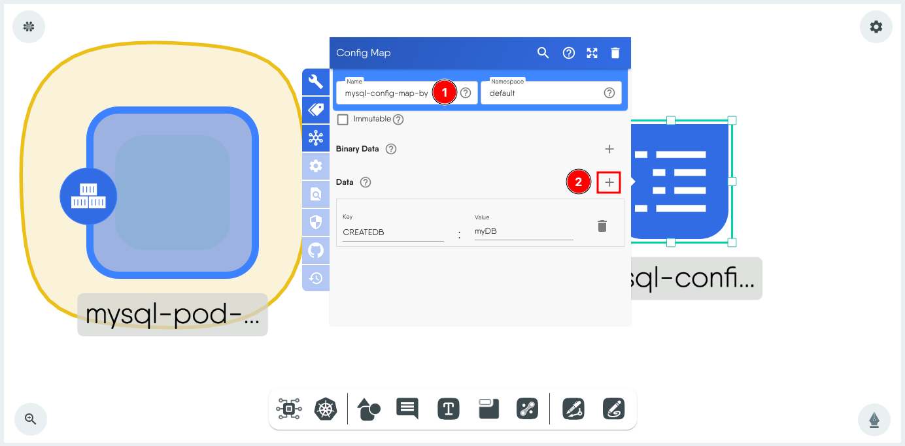

 3. Click on the **label**.
 4. Set a label for easier filtering later during Visualization.

    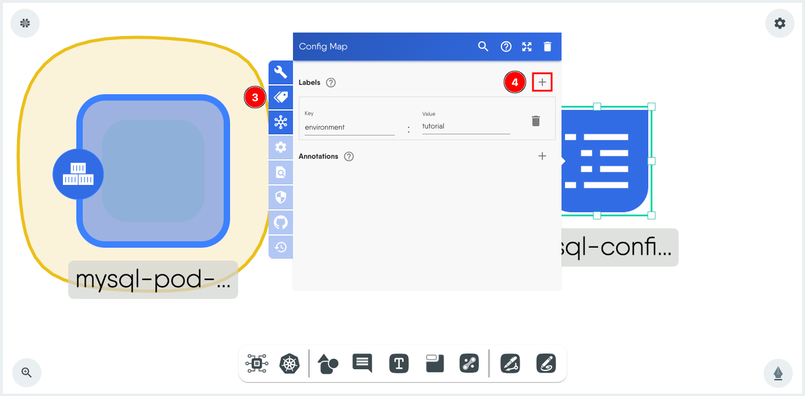

 5. Click outside the window to close it. 

Make a note of the ConfigMap component _name_ and _key_ for use later.

### Create and configure a Secret

 Before you proceed, choose a password and convert it into base64 format. Use an online tool to do so. For this example the password is **strongpassword** and the base64 of it is **c3Ryb25ncGFzc3dvcmQ=**

Click Kubernetes from the dock and select Secret from the list. This will put the Secret component on the canvas.  

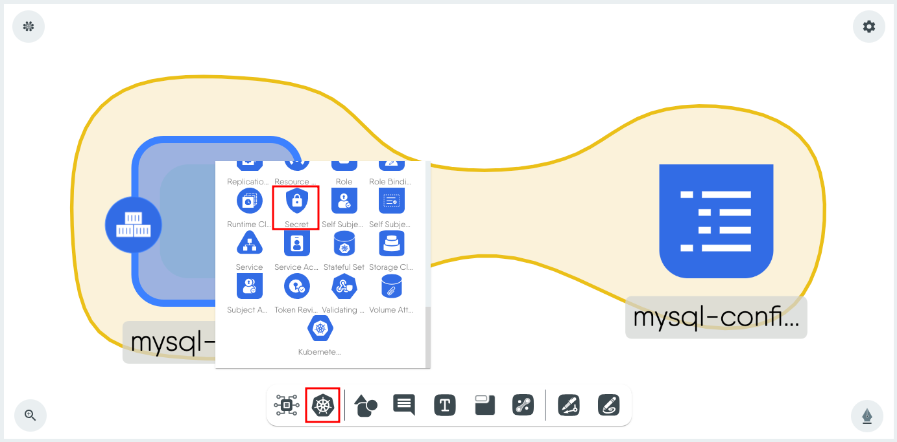

Click on the _Secret_ component to load the configuration window.

 1. Set a _name_.
 2. Set _Type_ as **Opaque**.
 3. Click **+** next to _Data_ and add the secret as a key value pair. For this tutorial, the _Key_ is **SUPERSECRETPASSWORD** and the _Value_ is **c3Ryb25ncGFzc3dvcmQ=**.

    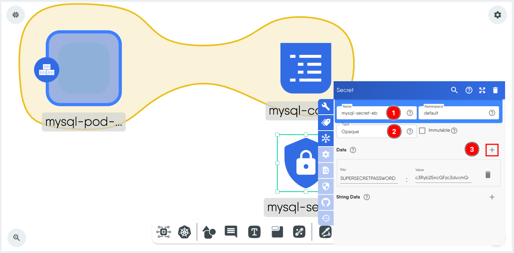

 4. Click **Labels**.
 5. Set the same label as used earlier in the ConfigMap.
 6. Click outside the window to close it.

    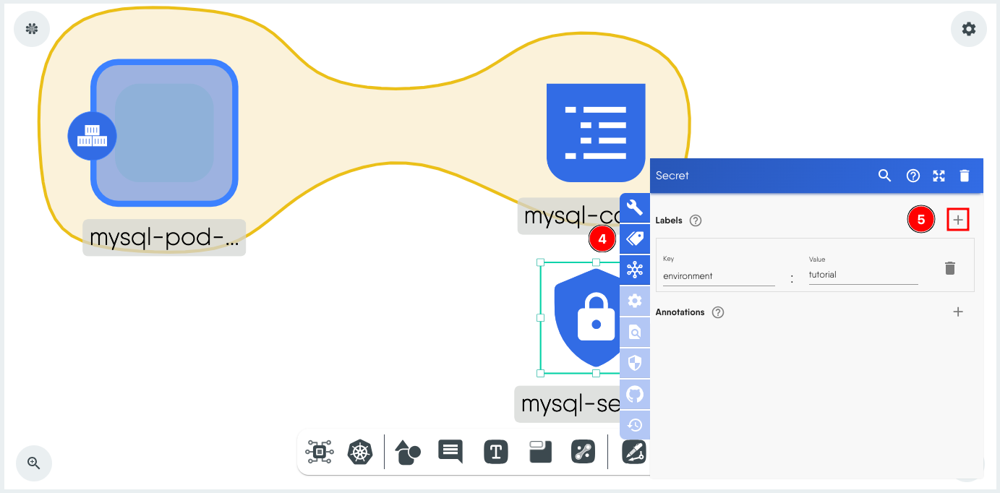

### Configure the Pod to use the ConfigMap and Secret

Click on the _Pod_ component to load its configuration window. We will set the Secret first and then the ConfigMap. 

 1. Scroll down to _Container_ and expand _Containers-0_.

    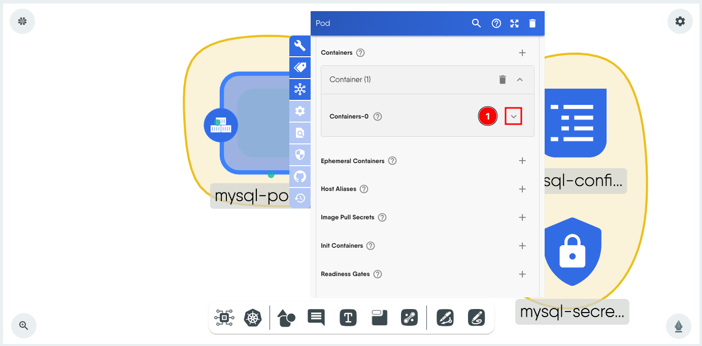

 2. Scroll down to _Env_. An existing environment variable for the MySQL root password is already set. We will modify this to retrieve the password from the Secret.
 3. Expand _Env-0_ and delete the contents of _Value_.
 4. Expand _Value From_, expand _Secret Key Ref_ and set the _Key_ to the name of the key in the Secret and the _Name_ to the name of the Secret which in this example is **SUPERSECRETPASSWORD** and **mysql-secret-eb**.

    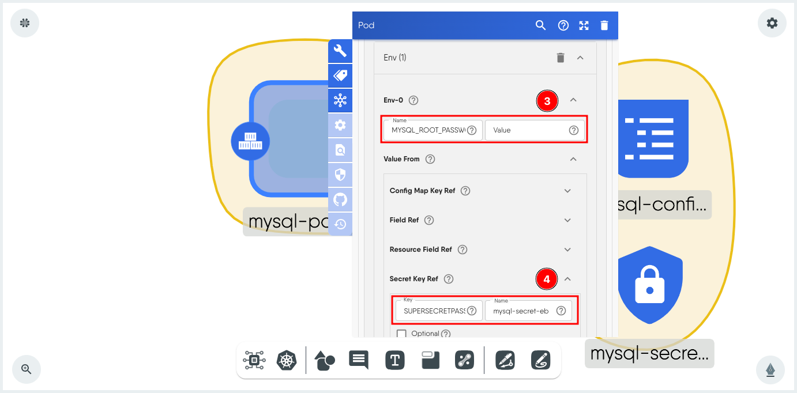

 5. Next, click **+** next to Env to add a second environment variable. 

    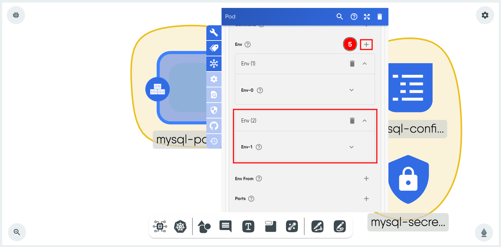

 6. Expand _Env-1_ and set _Name_ to **MYSQL_DATABASE**.
 7. Expand _Value From_, expand _Secret Key Ref_ and set the _Key_ to the name of the key in the ConfigMap and the _Name_ to the name of the ConfigMap which in this example is **CREATEDB** and **mysql-config-map-by**.

    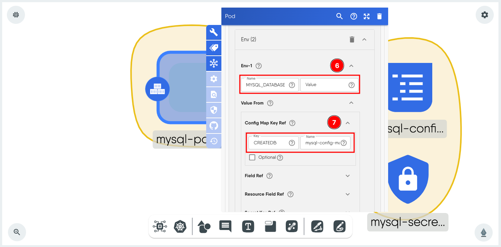

### Validate and Deploy the Design

Click **Actions** and then Select **Validate** to ensure there are no errors. Then, select the **Deploy** tab on the same window and click **Deploy**.

### Verify the Secret and the ConfigMap

Move to the Visualize tab.

Filter to show the resources pod, configmap and secret and use the lables set earlier to display only your resources. In this example, that is _environment:tutorials_.

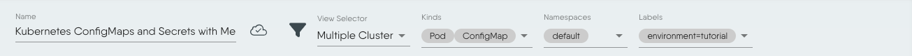

Select the Pod (1) and then choose Actions (2) to the right. Click Open Interactive Terminal (3) to open the terminal to the container.

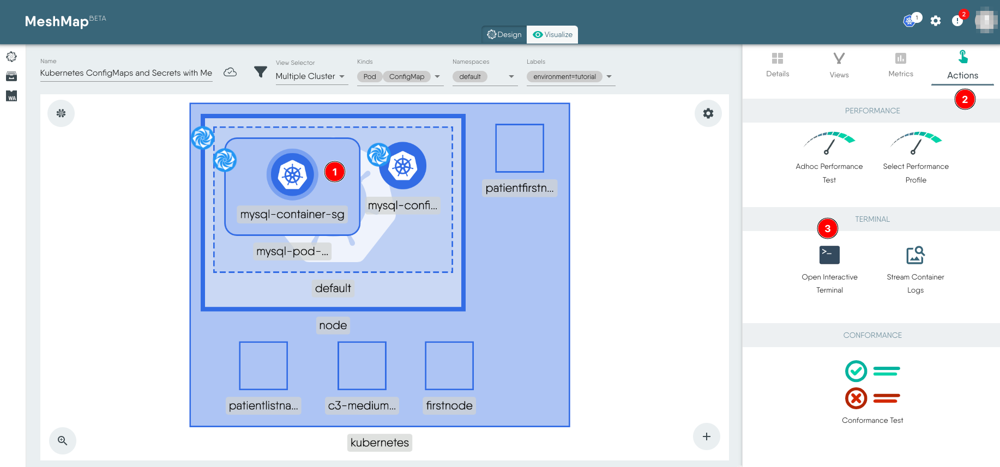

Run the following command in the terminal to verify that you are able to use the MySQL root password set as secret to login to MySQL. When prompted enter the root password (in plain text), i.e. _strongpassword_ for this tutorial.

`mysql -uroot -p` 

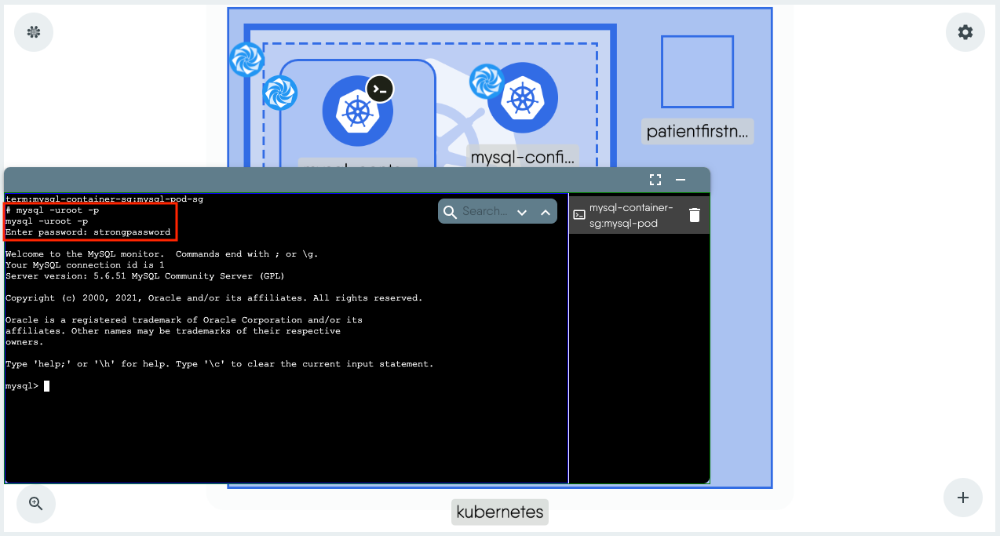

Run the following MySQL command to verify that the database set as a ConfigMap was indeed created.

`show databases;`

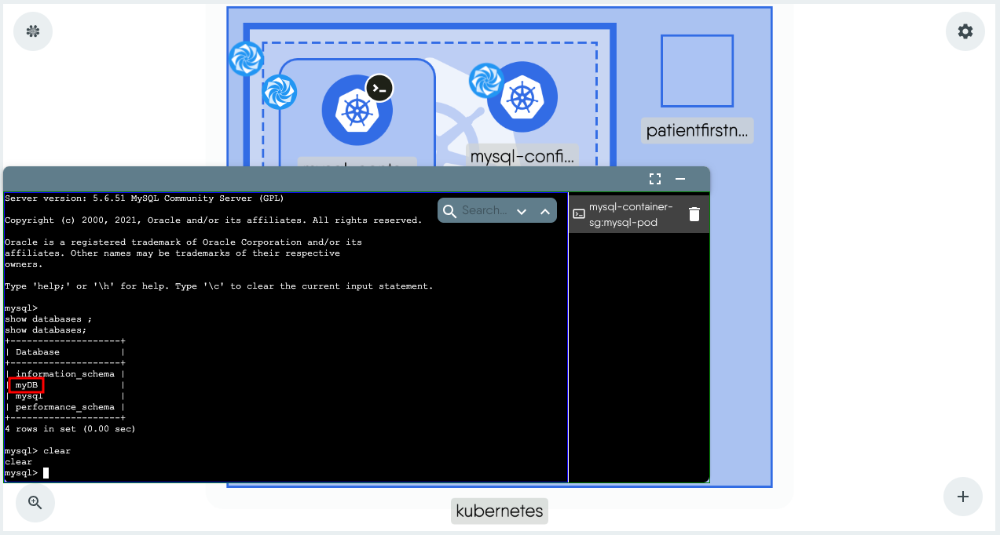

### Deleting the resources

To delete the resources, use the **Undeploy** option from the _Design_ view.

## Conclusion
Congratulations! You've successfully completed a tutorial on Kubernetes ConfigMaps and Secrets using the Meshery Playground. This hands-on experience should have equipped you with practical knowledge on managing configuration data and sensitive information in Kubernetes. Continue exploring more such scenarios in the Meshery Playground to enhance your skills.
