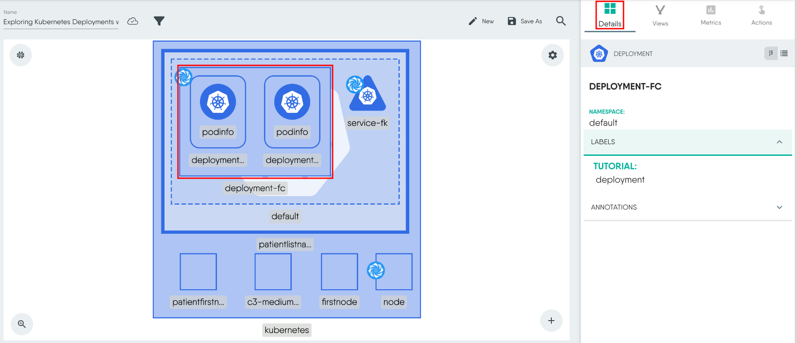

### Introduction

In this tutorial, we'll learn about Kubernetes **Deployments**. Using Meshery Playground, an interactive live Kubernetes environment, we'll perform hands-on labs to gain practical experience in deploying, managing, and understanding Deployments. We will also learn how to expose this deployment using a Kubernetes **Service**.

> **_NOTE:_** If this your first time working with Meshery Playground, consider starting with the [Exploring Kubernetes Pods with Meshery Playground](https://docs.meshery.io/guides/tutorials/kubernetes-pods) tutorial first.

### Prerequisites

- Basic understanding of containerization and Kubernetes concepts.
- Access to the _Meshery Playground_. If you don't have an account, sign up at [Meshery Playground](https://play.meshery.io/).

### Lab Scenario

Deploy a sample app in a Kubernetes cluster using _Deployments_. Additionally, expose the deployment through a _Service_. (Coming Soon!)

### Objective

Learn how to create, manage, and explore _Kubernetes Deployments and Services_ within the context of a microservices architecture.

### Steps

#### Access Meshery Playground

- Log in to the [Meshery Playground](https://meshery.layer5.io/) using your credentials. On successful login, you should be at the dashboard. Press the **X** on the _Where do you want to start?_ popup to close it (if required).
- Click **Explore** in the Cloud Native Playground tile to navigate to _MeshMap_.

> **_NOTE:_** MeshMap is still in beta.

#### Create a Deployment

Use the following deployment YAML as an example to map the fields that must be set for a successful validation and deployment.
```
apiVersion: apps/v1
kind: Deployment
metadata:
  name: deployment-fc
  labels:
    tutorial: deployment
spec:
  replicas: 2
  selector:
    matchLabels:
      tutorial: deployment
  template:
    metadata:
      name: podinfo
      labels:
        tutorial: deployment
    spec:
      containers:
      - name: podinfo
        image: ghcr.io/stefanprodan/podinfo:latest
```

1. In the MeshMap page, start a new design by clicking **New** and then rename the design to a name of your choice for easier identification later.
2. From the floating dock, click **Kubernetes** and select **Deployment** from the list. This should create the deployment component on the design canvas. 
    
3. Click the component to load the configuration modal.
4. Change the Name of the deployment and the Namespace if required.
5. A deployment consits of replicas. Set a value for Replicas. If nothing is set, the default is 1. For this example we will set it to 2.
    
6. Expand Selector, click Match Labels and set a matchLabel pair.
    
7. Next, expand Template and click Metadata to load the pod's metadata.
8. Set a name for the pods and importantly set the Labels. Click **+** next to Labels to set one. For this example, the name is podinfo and the label is `tutorial:deployment`. Close the metadata modal.
    
8. Next, click on Spec under Template to load the pod specification modal.
5. Scroll down to **Containers** and then click **+** to define the container specs. Expand **Containers-0** to set the values.
    
6. Fill in the mandatory details such as _Image_ and _Name_. For this example the following image has been used `ghcr.io/stefanprodan/podinfo:latest`. You may use any other image of your choice.
    


#### Validating and deploying the Deployment

Let's validate the design before deploying it.

To do this, click **Actions** and then **Validate** from the top menu.


This should show a pop-up with details such as the number of components, annotations and errors (if any).

Ensure there are no errors before deploying. If there are errors, ensure that you have set _.spec.selector.matchLabels_ and _.spec.template.metadata.labels_ and they are same.

To deploy, click **Actions** and then **Deploy** to load the deployment workflow.


The Validate Design step should already be error free. Click **Next**.


Click **Next** again in the Select Environment step.


Finally, click **Deploy** in the Dry Run step. 


If there are errors in the dry run step, resolve them and restart the deployment process.

You should see a few alerts on the bottom right about the deployment.

#### Visualizing the Deployment

To view the resources deployed we will use the **Visualize** section of the _MeshMap_. A view is created with necessary filters to show the relevant resources.

1.  Click **Visualize** to begin.
2.  Give the view a name (rename).
3.  Click the filter icon.
4.  Choose appropriate filters to limited displayed resources in the view. For example, here we want to displays deployments, pods and services. Additionally, we will also add a label filter i.e. `tutorial=deployment` in this case. This should show a filtered view with only your resources something similar to the screenshot below:


#### Viewing Deployment and Pod information

Select the deployment from the _View_ to load the deployment details to the right. Ensure the _Details_ tab is selected.


Now, select one of the pods in the deployment to display the pod details. 


#### Deleting the Deployment

To delete the deployment, use the **Undeploy** option from the _Design_ view.


### Conclusion

Congratulations! You've successfully completed the lab on Exploring Kubernetes Deployments using Meshery Playground. 

Continue exploring more scenarios in the Meshery Playground to enhance your skills.

