### Introduction

In this tutorial, we'll learn about Kubernetes **Deployments**. Using Meshery Playground, an interactive live environment, we'll perform hands-on exercises to gain practical experience in deploying, managing, and understanding a Kubernetes _Deployment_ without writing any YAML.

> **_NOTE:_** If this your first time working with Meshery Playground, consider starting with the [Exploring Kubernetes Pods with Meshery Playground](https://docs.meshery.io/guides/tutorials/kubernetes-pods) tutorial first.

### Prerequisites

- Basic understanding of containerization and Kubernetes concepts.
- Access to the _Meshery Playground_. If you don't have an account, sign up at [Meshery Playground](https://play.meshery.io/).

### Lab Scenario

Launch a sample app in a Kubernetes cluster using _Deployments_. 

### Objective

Learn how to create, manage, and explore _Kubernetes Deployments_ within the context of a microservices architecture.

### Steps

#### Access Meshery Playground

- Log in to the [Meshery Playground](https://playground.meshery.io) using your credentials. On successful login, you should be at the dashboard. Press the **X** on the _Where do you want to start?_ popup to close it (if required).
- Click **Kanvas** from the left menu to navigate to the _Kanvas_ design page.

  

> **_NOTE:_** Kanvas is still in beta.

#### Create a Deployment

1. In the _Kanvas Design_ page, start by renaming the design to a name of your choice for easier identification later.
    
2. From the floating dock below, click the **Kubernetes** icon and then click **Deployment** from the list. This will create the _Deployment_ component on the design canvas. 
    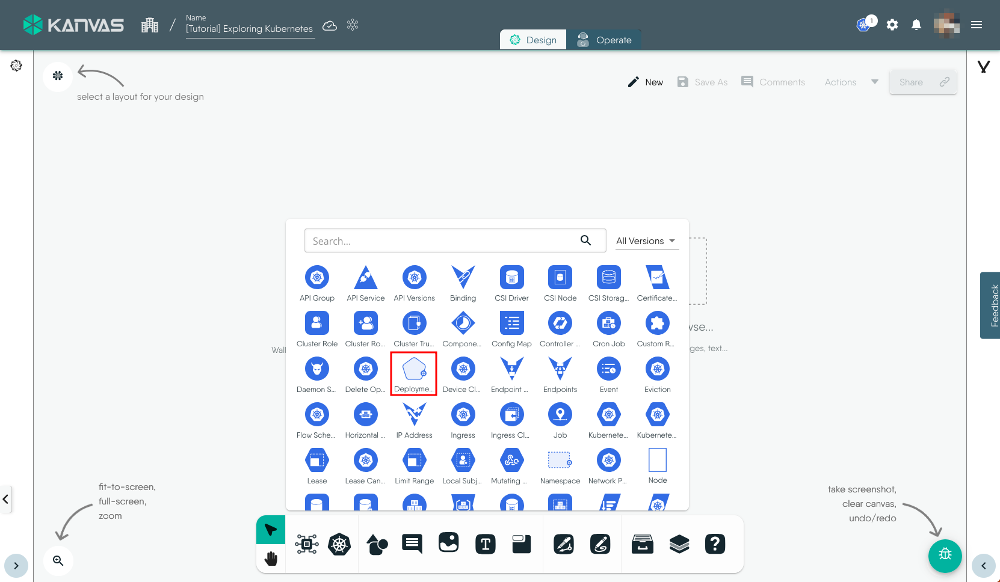
3. Click once to select the _Deployment_ component and choose **Configure**.
    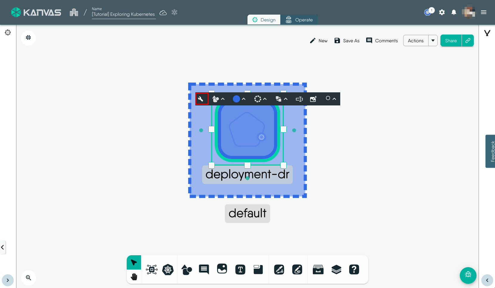
4. Change the **Name** of the deployment and the **Namespace** if required. For this demonstration, we will leave them as they are and deploy this to the _default_ namespace.
5. A deployment consists of replicas. We must set a value for **Replicas**. If nothing is set, the default is 1. For this example we will set it to **2**. We must also set the _Selector_ property. To do this, expand **Selector** and click **MatchLabels**. Set a _matchLabel_ pair. Here we have set `tutorial:deployment`.
    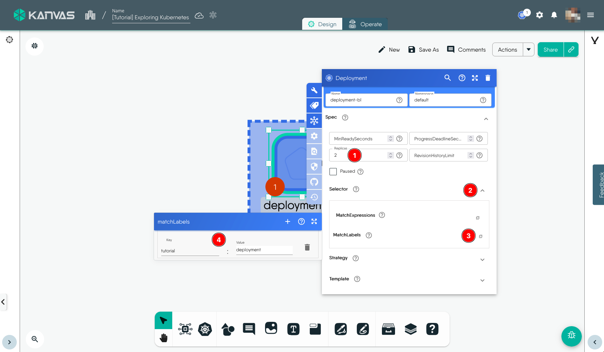
6. Next, expand **Templates** and open **Metadata** configuration modal. On the _metadata_ modal, click **+** next to **Labels** and set the label to the same key-value pair as in the previous step. Here it is `tutorial:deployment`.
    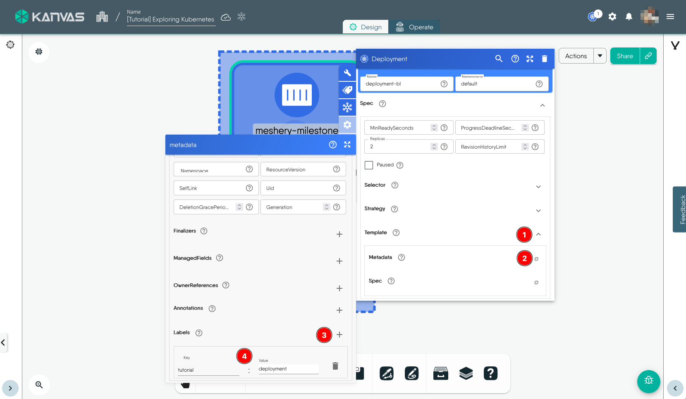
7. While still under **Template** and click **Spec** to load the _spec_ configuration modal. Then scroll down and click **+** next to **Containers**. This will create a container.
    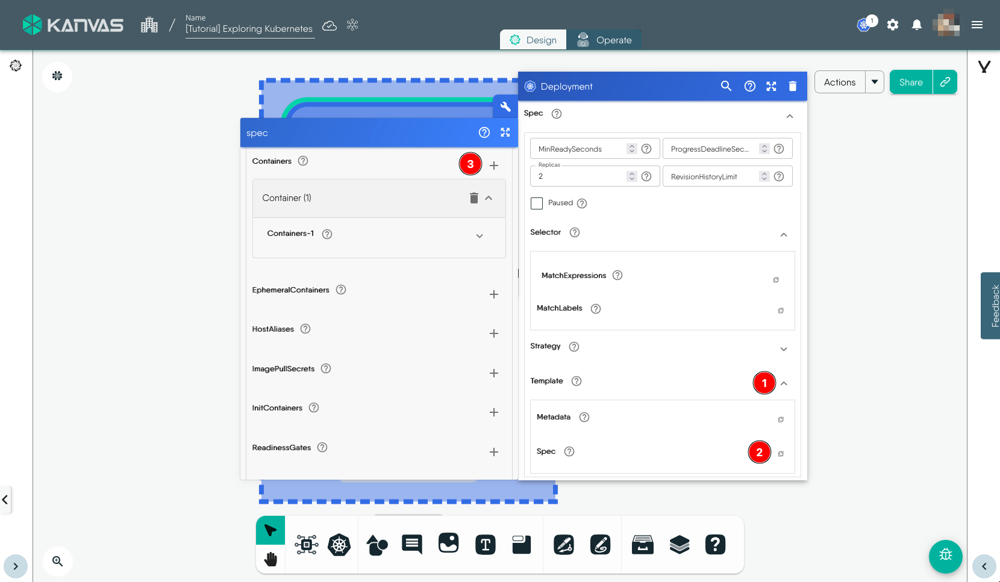
8. Expand **Containers-1** and fill in the mandatory details such as _Image_ and _Name_. For this example we set the **Image** to `meshery/meshery-milestone:latest` and **Name** to `meshery-milestone`. 
    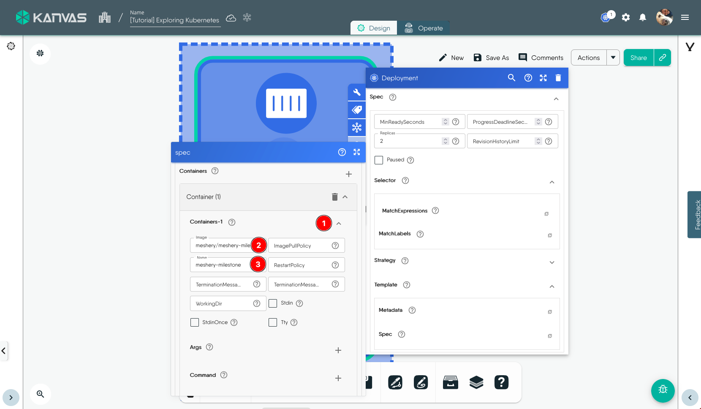
9. Click on an empty area in the canvas to close the configuration modals. This completes designing the _Deployment_ and should looks similar to the screenshot below.
    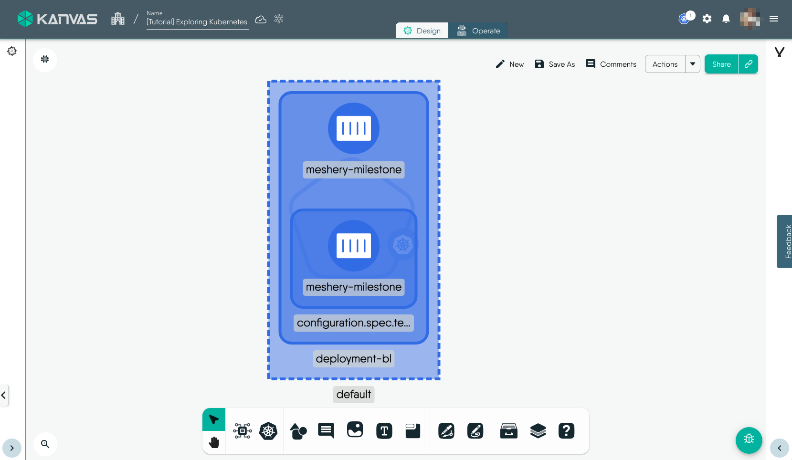

#### Validating and deploying the Deployment

In the next set of steps we will validate the design and deploying it.

1. To validate the design, click **Actions** and then **Validate** from the top menu.
    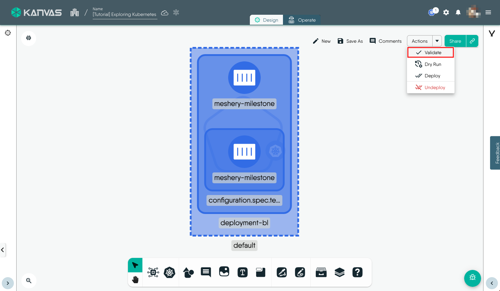

    This should show a pop-up with details such as the number of components, annotations and validation errors (if any). Ensure there are no errors before deploying. If there are errors, fix them before moving forward.

2. To deploy, click **Actions** and then **Deploy** to load the deployment workflow. The first step is design validation which should already be marked as done. Click **Next**.
    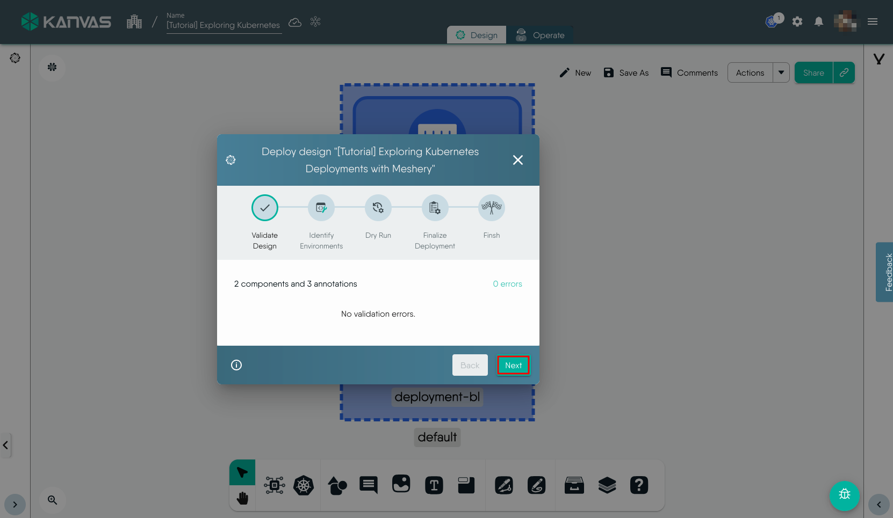

3. In the following step, select the _Deployment Targets_ where you want to deploy this. When done click **Next**.
    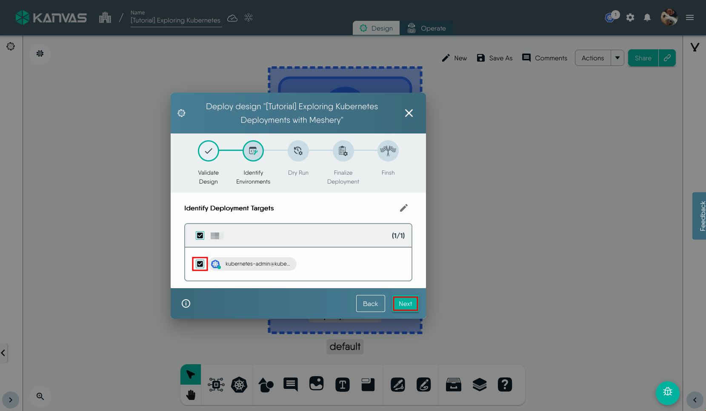

4. In the third step, a _Dry Run_ is performed. Fix any errors displayed here.
    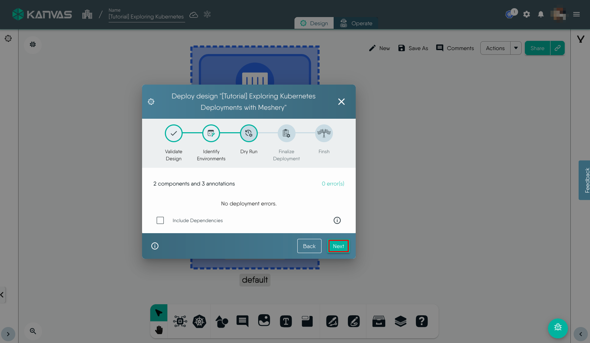

5. Finally, click **Deploy** in the next step. You may choose to open the design in _Operate_ mode after this step to explore the resources by checking the **Open in Operator** checkbox.
    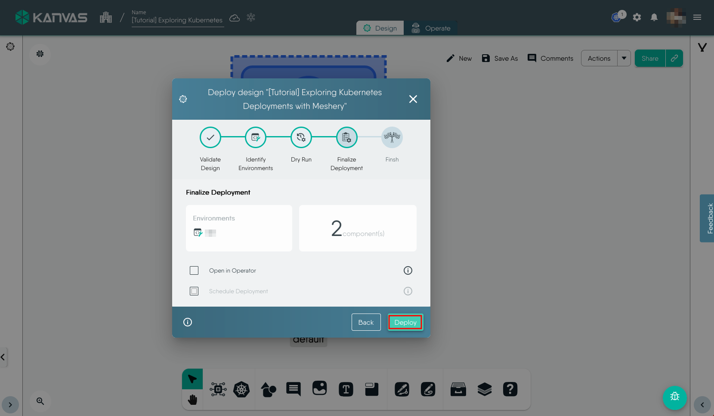

6. Click **Finish** to close the workflow. 
    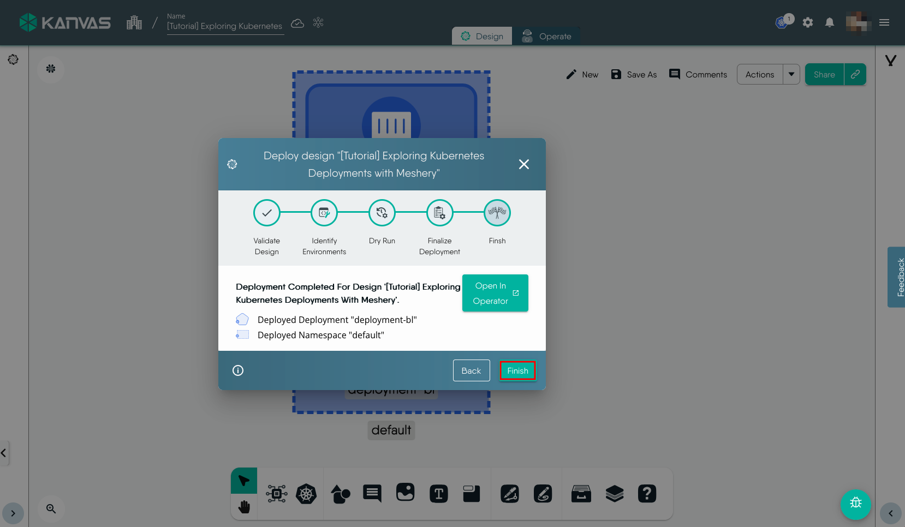

You should see a few alerts on the bottom right about the deployment.

#### Viewing and Operating the Deployment

To view and perform operations on the resources deployed, i.e. the _Deployment_ in this exmaple, we will use the **Operate** functionality of _Kanvas_. You can open the design in _Operate_ mode during the _Deploy_ workflow or later by click the **Operate** tab. It will load the deployed resources in _Operate_ view similar to the screenshot below.
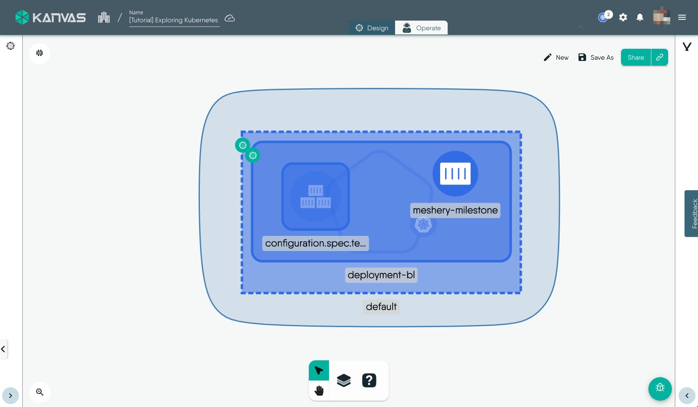

You can click on any of the resources to view various details and actions applicable to them. For example, click on the _Deployment_ i.e. `deployment-bl` in this case (shown with a green border in the image below), to view deployment details such as _Age_, _Kind_, _Pods_, _Replicas_, _Namespace_ etc. 
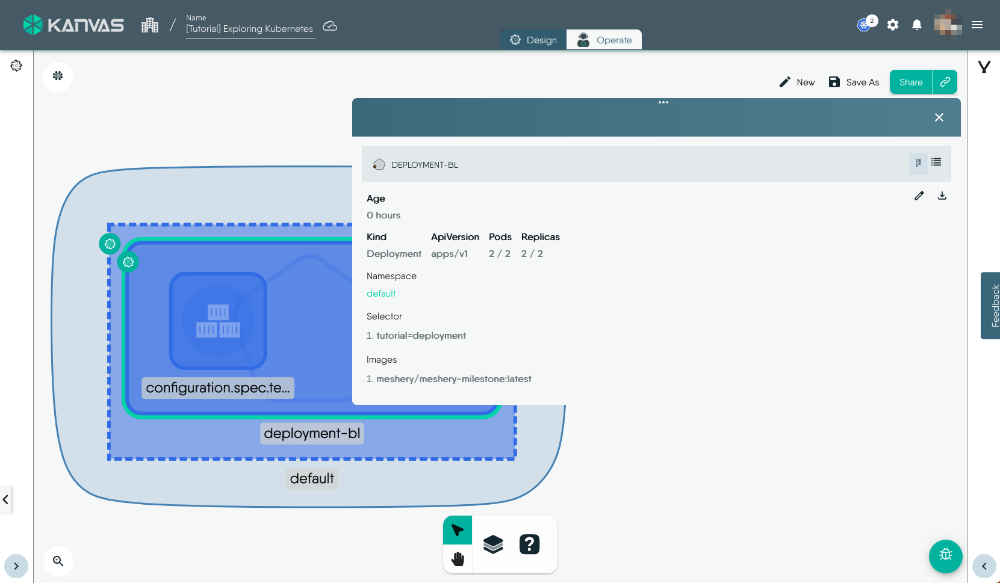

Take some time to explore other resources such as _Pod_, _Container_ etc.

#### Deleting the Deployment

To delete the deployment, click **Actions** and select **Undeploy**.
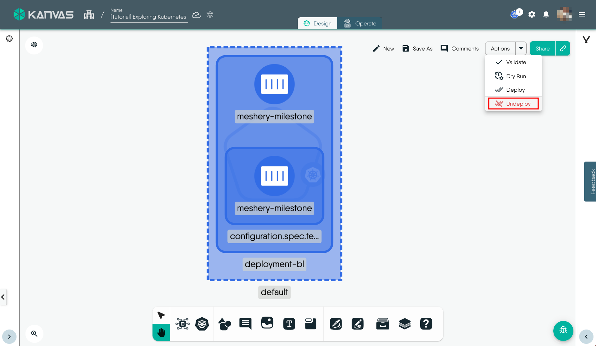

Follow the _Undeploy_ workflow (similar to the _Deploy_ workflow) and click **Undeploy** in the Finalize Deployment step.
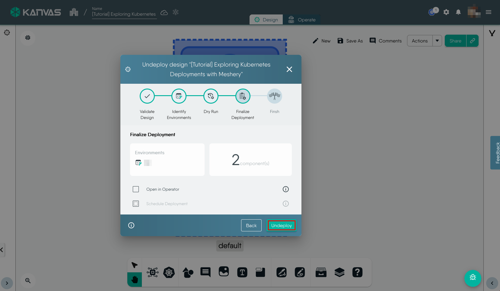

### Conclusion

Congratulations! You've successfully completed the lab on Exploring Kubernetes Deployments with Meshery Playground. 

Continue exploring more scenarios in the Meshery Playground to enhance your skills.

