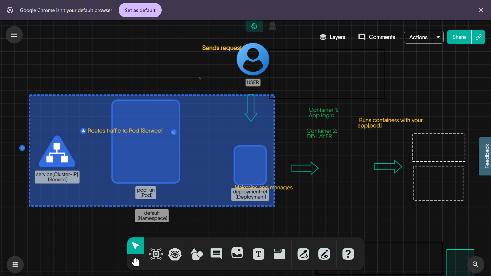

## Introduction

In this tutorial, we will explore the exact journey a request takes inside a Kubernetes cluster from the moment a user hits "Enter" in their browser, to the moment a response is sent back. We will understand **fundamental data path** of a request - from the user to the container, using a **diagram built in Meshery Kanvas**.

> **_Note:_** This tutorial is completely visual and beginner-friendly. No YAML or CLI is required.

---

## Prerequisites

- Basic understanding of Kubernetes objects (Service, Pod, Container)
- Access to the _Meshery Playground_. If you don't have an account, sign up at [Meshery Playground](https://play.meshery.io/).

---

## Lab Scenario

We will explore a **simple application architecture** in Kubernetes.
- A **User** sending a request  
- A **Service (ClusterIP)** routing the request  
- A **Deployment** managing a **Pod**  
- The **Pod** running **two containers**: one for logic and one for database interactions  

This is a real-world pattern used in microservices and backend systems.

---

## Objective

To visually understand how this flow works and how all the kubernetes components come together using Meshery Kanvas. To learn how traffic is routed and why this flow matters when debugging or designing.

---

## Step-by-Step Walkthrough in Meshery Kanvas

### Step 1: Accessing the Visual Guide Design

- Start by opening the prebuilt design from here:
  `Launch Design in Kanvas` (https://kanvas.new/extension/meshmap?mode=design&design=629b6039-ebb3-4bd8-9b1b-19184fade225)
- This will take you directly into Meshery Kanvas, where a complete visual layout of the Kubernetes request flow is ready for you to explore. We are going to understand what’s happening in this architecture.
 - If it looks a bit overwhelming at first, zoom in/out or drag around the canvas to get comfortable with the layout.

---

### Step 2: Understand the Components

Let’s click on each element in the design and see what it’s made of:

#### 1. User

- This isn't a Kubernetes object, but it's been included to show where the request begins, like someone opening the app in a browser or making an API call. 

#### 2. Service (ClusterIP)

- This is the entry point into the cluster.
- It forwards traffic to the Pods. Click on it and we you will see its type (like ClusterIP or NodePort) and the selector that helps it find the right Pods.
- A **Kubernetes Service** acts like a load balancer inside the cluster.

#### 3. Deployment

- It handles the app's lifecycle — scaling, rolling updates, and keeping replicas alive. It also ensures **self-healing** (restarts crashed Pods).
- It manages the number of Pods you want running and acts as a layer of abstraction so you never interact with Pods directly.
- Click it to check out the replica count and labels. These labels are crucial because they are how the Deployment matches with Pods.

#### 4. Pod

- Pods are where the app lives, the actual workloads. 
- Each Pod has one or more containers. Even if you're running a single container app, it still runs inside a Pod.

#### 5. Containers (Inside the Pod)

- Container 1: **Application Logic** – the app’s backend or frontend code.
- Container 2: **DB Layer** – a simple service handling persistence, cache, or a local DB.
- This is super helpful if you are trying to understand how traffic flows into your app or how containers talk to each other inside the Pod.

---

### Step 3: Why This Flow Matters

- **Understanding this request path helps with:**
  - Debugging: Why am I not getting a response?
  - Scaling: Which component needs more replicas?
  - Designing: Where should I add logs?

---

### Step 4: Operate This Flow

- You can use **Meshery Kanvas → Operate Mode** to interact with real Kubernetes clusters.
- Try swapping containers, or changing replicas.
- You don’t need YAML to understand complex app flows anymore. That’s the power of Meshery.

---

### Diagram Screenshot

> Note: You can design this yourself using the components in Meshery Kanvas.

---

## Conclusion

Congratulations! You have now visually understood one of the most common flows in Kubernetes: how a request reaches your app and how each component plays its part.
Understanding this **foundation flow** is the stepping stone for deeper learning — like Ingress Controllers, HorizontalPodAutoscalers, and service meshes. Continue exploring more scenarios in the Meshery Playground to enhance your skills.

