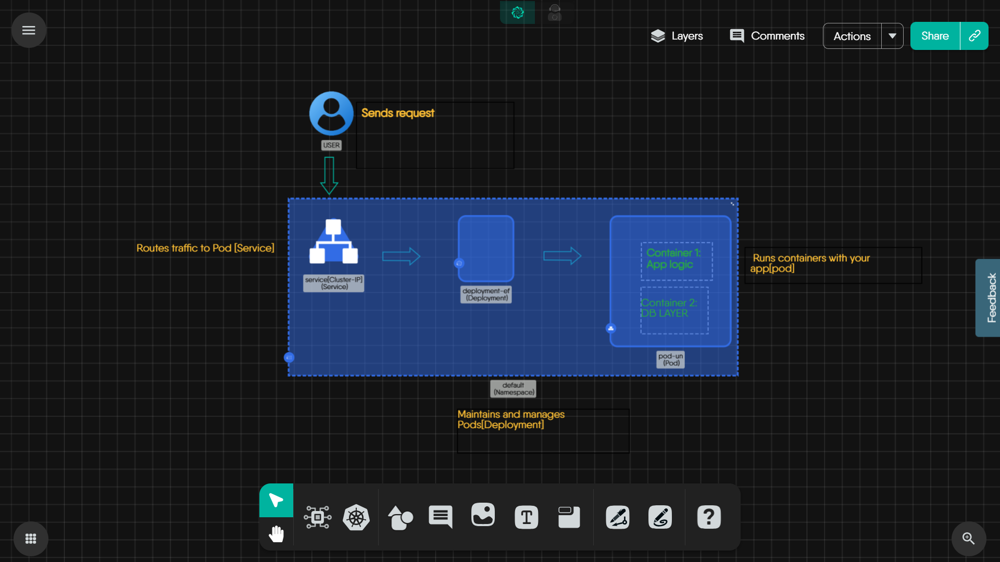

# Kubernetes Request Flow – A Visual Guide

Kubernetes can be intimidating, especially when trying to understand how a user request is processed inside a cluster. This tutorial will walk you through the **fundamental data path** of a request - from the user to the container, using a **diagram built in Meshery Kanvas**.

This is perfect for beginners and contributors who want to build strong foundational mental models for working with microservices in Kubernetes.

---

## Prerequisites

- Basic understanding of Kubernetes objects (Service, Pod, Container)
- Basic familiarity with Meshery and Kanvas 
- Access to Meshery Playground (create an account if you don’t have one)

---

## Lab Scenario

You'll explore a **simple application architecture** in Kubernetes that includes:

- A **User** sending a request  
- A **Service (ClusterIP)** routing the request  
- A **Deployment** managing a **Pod**  
- The **Pod** running **two containers**: one for logic and one for database interactions  

This is a real-world pattern used in microservices and backend systems.

---

## Objective

To visually understand how a basic user request flows through Kubernetes using Meshery's design system, and learn how each component plays a role in traffic control.

---

## Step-by-Step Walkthrough in Meshery Kanvas

### Step 1: Open Meshery Kanvas

- Go to the Meshery Playground dashboard.
- Navigate to **Kanvas** from the left-hand menu.
- Load or recreate the diagram titled: `Kubernetes Request Flow`   
  (You can also use the diagram shared in this tutorial for reference.)
---

### Step 2: Understand the Components

#### 1. User

- The entry point. Think of this as someone hitting an API or opening the app in a browser.

#### 2. Service (ClusterIP)

- A **Kubernetes Service** acts like a load balancer inside the cluster.
- It routes requests to the **Pods** selected via labels.

#### 3. Deployment

- It manages the number of Pods you want running.
- Also ensures **self-healing** (restarts crashed Pods).
- Acts as a layer of abstraction so you never interact with Pods directly.

#### 4. Pod

- Pods are the actual workloads. Each Pod has one or more containers.
- Even if you're running a single container app, it still runs inside a Pod.

#### 5. Containers (Inside the Pod)

- Container 1: **Application Logic** – the app’s backend or frontend code.
- Container 2: **DB Layer** – a simple service handling persistence, cache, or a local DB.

---

### Step 3: Why This Flow Matters

- **Understanding this request path helps with:**
  - Debugging: Why am I not getting a response?
  - Scaling: Which component needs more replicas?
  - Designing: Where should I add logs?

---

### Step 4: Operate This Flow

- You can use **Meshery Kanvas → Operate Mode** to interact with real Kubernetes clusters.
- Try swapping containers, or changing replicas.
- You don’t need YAML to understand complex app flows anymore. That’s the power of Meshery.

---

### Diagram Screenshot

> Note: You can design this yourself using the components in Meshery Kanvas.

---

## Conclusion

You’ve now visually understood one of the most common flows in Kubernetes: how a request reaches your app and how each component plays its part.

Understanding this **foundation flow** is the stepping stone for deeper learning — like Ingress Controllers, HorizontalPodAutoscalers, and service meshes.

