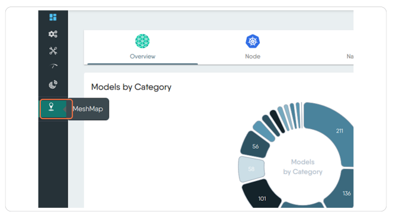
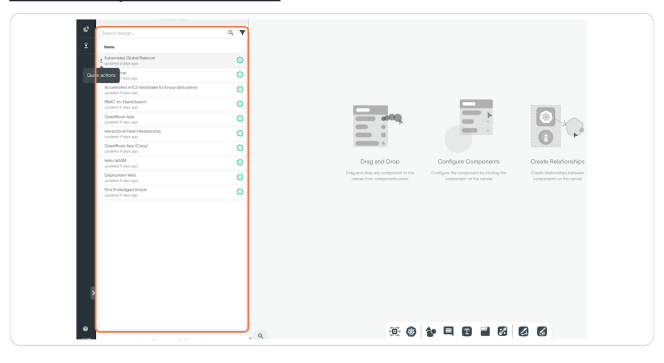
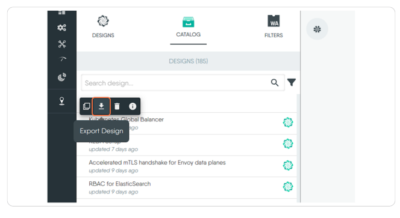
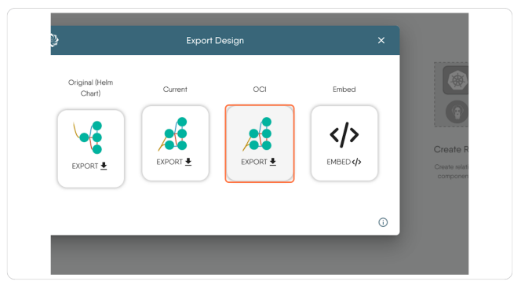

## Introduction

In this tutorial, we'll see how to export a Design from Meshery which we will use to populate an ArtifactHub repository.

## Prerequisites

- Access to the _Meshery Playground_. If you don't have an account, sign up at [Meshery Playground](https://playground.meshery.io/).

## Steps

### 1. Click on MeshMap

### 2. Find the Design in the Side Panel

### 3. Click on Export Design

### 4. Click on EXPORT under OCI

### Prepare your ArtifactHub repo
You will need to have an ArtifactHub repository already created with `Kind` as `Meshery Designs`. See [ArtifactHub documentation](https://artifacthub.io/docs/topics/repositories/meshery-designs/) for more information on managing repositories.

### Push Design to ArtifactHub repository
At this point you should have downloaded your design as a `tar` archive. This archive contains a second archive which holds the metadata files to publish to your ArtifactHub repository. Expand the first `tar` archive and locate the resulting files. Expand the second archive you find there and you will have a folder containing two files: `artifacthub-pkg.yml` and `design.yml`. Move these files to your prepared ArtifactHub repository and push it upstream.

### Verify Repository in ArtifactHub
Once the files are pushed to the ArtifactHub repo you will need to wait until ArtifactHub indexes it. You can verify the status of the repository in the ArtifactHub control panel.