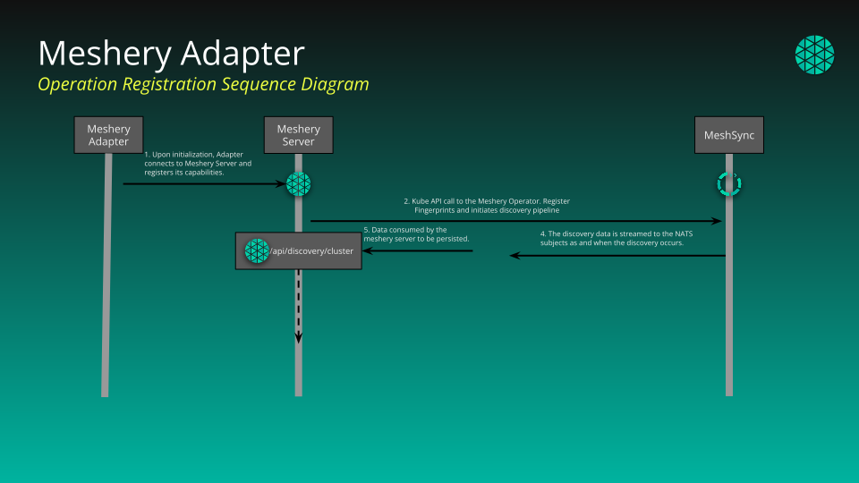
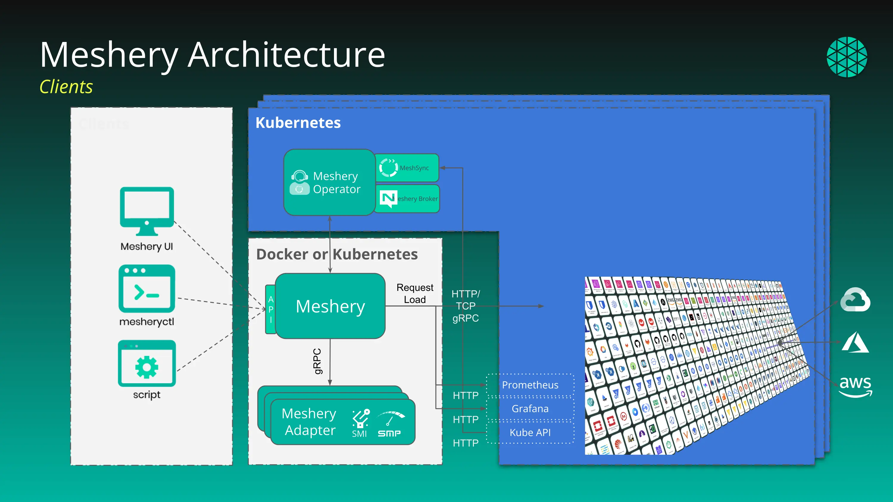
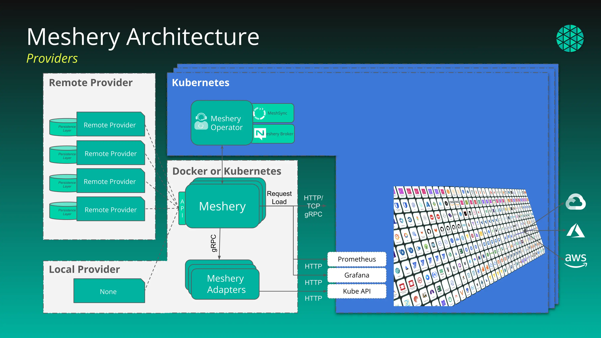
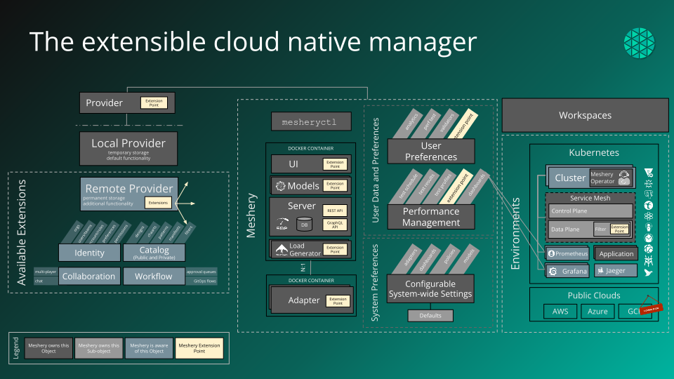
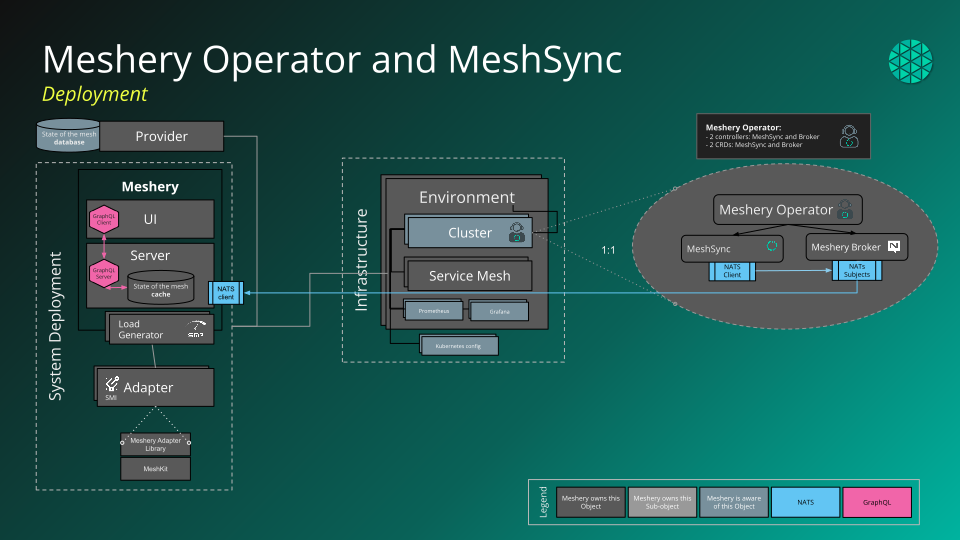
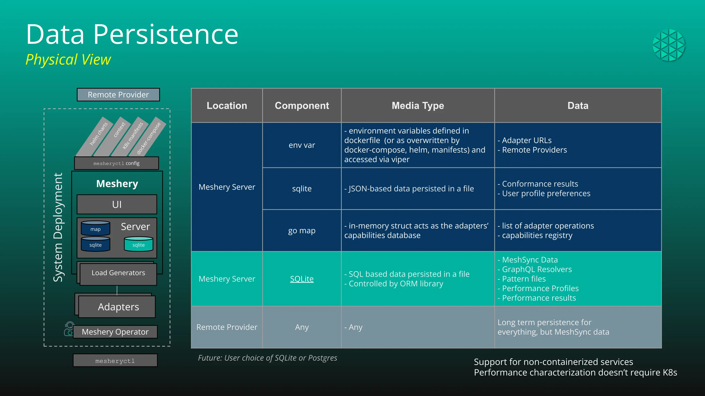
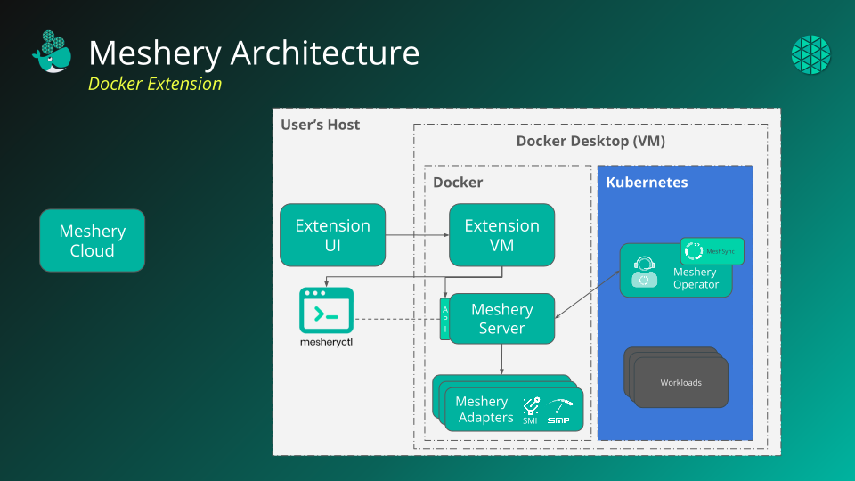

# Architecture

> Overview of different individual components of Meshery architecture and how they interact as a system.

Source: /pr-preview/pr-21670/concepts/architecture/

## Components, their Purpose, and Languages

Meshery and its components are written using the following languages and technologies.

| Components                                                           | Languages and Technologies                                                        |
| :------------------------------------------------------------------- | :-------------------------------------------------------------------------------- |
| Meshery Server                                                       | Golang, gRPC, GraphQL, [SMP](https://smp-spec.io)                                 |
|   [Meshery Database](/pr-preview/pr-21670/concepts/architecture/database/)                | Golang, SQLite                                                                   |
| Meshery UI                                                           | ReactJS, NextJS, BillboardJS                                                      |
| Meshery Provider UI                                                  | ReactJS, NextJS                                                                   |
| [Meshery Operator](/pr-preview/pr-21670/concepts/architecture/operator/)                  | Golang                                                                            |
|   [MeshSync](/pr-preview/pr-21670/concepts/architecture/meshsync/)                        | Golang                                                                            |
|   [Broker](/pr-preview/pr-21670/concepts/architecture/broker/)                            | Golang, NATS                                                                      |
| [Meshery CLI](#meshery-cli)                                          | Golang                                                                            |
| --- [Extensions](/pr-preview/pr-21670/extensions/) ---                                    |                                                                                   |
| [Meshery Adapters](/pr-preview/pr-21670/concepts/architecture/adapters/)                  | Golang, gRPC, [CloudEvents](https://cloudevents.io/)                              |
| [Meshery Remote Providers](/pr-preview/pr-21670/reference/extensibility/providers/)                 | _any_ - must adhere to Meshery [Extension Points](/pr-preview/pr-21670/reference/extensibility/) |
| [Envoy WASM Filters](https://github.com/meshery-extensions/wasm-filters)     | Rust and C++                                                                      |

## Deployments

Meshery deploys as a set of containers. Meshery's containers can be deployed to either Docker or Kubernetes. Meshery components connect to one another via gRPC requests. Meshery Server stores the location of the other components and connects with those components as needed. Typically, a connection from Meshery Server to Meshery Adapters is initiated from a client request (usually either `mesheryctl` or Meshery UI) to gather information from the Adapter or invoke an Adapter's operation.

Deploying a [Design](/pr-preview/pr-21670/concepts/logical/designs/) is one such request. Meshery Server resolves each component of the Design to the registrant of its model and, on that basis, either applies the component itself or delegates it to an Adapter - so a single deployment can involve both. See [**Deployment Engine**](/pr-preview/pr-21670/concepts/architecture/deployment-engine/).

### Adapters

In Meshery v0.6.0, Adapters will register with Meshery Server over HTTP POST. If Meshery Server is not available, Meshery Adapters will backoff and retry to connect to Meshery Server perpetually.

_Figure: Meshery deploys inside or outside of a Kubernetes cluster_

#### Adapters and Capabilities Registry

Each Meshery Adapter delivers its own unique specific functionality. As such, at time of deployment, the Meshery Adapter will register its cloud native infrastructure-specific capabilities (its operations) with Meshery Server's capability registry.

_Figure: Meshery Adapter Operation Registration_

### Clients

Meshery's REST API may be consumed by any number of clients. Clients need to present valid JWT token.

_Figure: Clients use Meshery's [REST API](/pr-preview/pr-21670/reference/extensibility/api/#rest), [GraphQL API](/pr-preview/pr-21670/reference/extensibility/api/#graphql), or a combination of both._

### Providers

As a point of extensibility, Meshery supports two types of [providers](/pr-preview/pr-21670/reference/extensibility/providers/): _Local_ and _Remote_.

<figure>
  <figcaption>Figure: Meshery Provider architecture</figcaption>
</figure>

## Object Model

This diagram outlines logical constructs within Meshery and their relationships.

<figure>
  <figcaption>Figure: Meshery Object Model</figcaption>
</figure>

## Meshery Operator and MeshSync

Meshery Operator is the multi-cluster Kubernetes operator that manages MeshSync and Meshery Broker.

<figure>
  <figcaption>Figure: Meshery Operator and MeshSync</figcaption>
</figure>

See the [**Operator**](/pr-preview/pr-21670/concepts/architecture/operator/) section for more information on the function of an operator and [**MeshSync**](/pr-preview/pr-21670/concepts/architecture/meshsync/) section for more information on the function of meshsync.

## Database

Meshery Server's database is responsible for collecting and centralizing the state of all elements under management, including infrastructure, application, and Meshery's own components. Meshery's database, while persisted to file, is treated as a cache.

<figure>
  <figcaption>Figure: Meshery Docker Extension</figcaption>
</figure>

_See the [**Database**](/pr-preview/pr-21670/concepts/architecture/database/) section for more information on the function of the database._

## Meshery Docker Extension

Meshery's Docker extension provides a simple and flexible way to design and operate cloud native infrastructure on top of Kubernetes using Docker containers. The architecture of this extension is designed to be modular and extensible, with each component serving a specific purpose within the overall deployment process.

<figure>
  <figcaption>Figure: Meshery Docker Extension</figcaption>
</figure>

## Meshery CLI

The Command Line Interface ( also known as [mesheryctl](/pr-preview/pr-21670/guides/mesheryctl/working-with-mesheryctl/) ) that is used to manage Meshery. Use `mesheryctl` to both manage the lifecycle of Meshery itself and to access and invoke any of Meshery's application and cloud native management functions.

### **Statefulness in Meshery components**

Some components within Meshery's architecture are concerned with persisting data while others are only
concerned with a long-lived configuration, while others have no state at all.

| Components        | Persistence  | Description                                                           |
| :---------------- | :----------- | :-------------------------------------------------------------------- |
| [mesheryctl](/pr-preview/pr-21670/guides/mesheryctl/working-with-mesheryctl/)        | stateless    | command line interface that has a configuration file                  |
| [Meshery Adapters](/pr-preview/pr-21670/concepts/architecture/adapters/)  | stateless    | interface with cloud native infrastructure on a transactional basis                |
| Meshery Server    | caches state | application cache is stored in `$HOME/.meshery/` folder               |
| [Meshery Providers](/pr-preview/pr-21670/reference/extensibility/providers/) | stateful     | location of persistent user preferences, environment, tests and so on |
| [Meshery Operator](/pr-preview/pr-21670/concepts/architecture/operator/)  | stateless    | operator of Meshery custom controllers, notably MeshSync              |
| [MeshSync](/pr-preview/pr-21670/concepts/architecture/meshsync/)          | stateless    | Kubernetes custom controller, continuously running discovery          |

### **Network Ports**

Meshery uses the following list of network ports to interface with its various components:

<table class="table table-striped">
  <thead>
    <tr>
      <th style="text-align: left; padding: 10px; border-bottom: 2px solid #ccc;">Component</th>
      <th style="text-align: center; padding: 10px; border-bottom: 2px solid #ccc;">Port</th>
      <th style="text-align: left; padding: 10px; border-bottom: 2px solid #ccc;">Purpose</th>
    </tr>
  </thead>
  <tbody>
    <tr style="border-bottom: 1px solid #eee;">
      <td style="padding: 10px;">Meshery Server</td>
      <td style="text-align: center; padding: 10px;">9081/tcp</td>
      <td style="padding: 10px;">UI, REST, and GraphQL APIs</td>
    </tr>
    <tr style="border-bottom: 1px solid #eee;">
      <td style="padding: 10px;">Meshery Server</td>
      <td style="text-align: center; padding: 10px;">80/tcp</td>
      <td style="padding: 10px;">WebSocket</td>
    </tr>
    <tr style="border-bottom: 1px solid #eee;">
      <td style="padding: 10px;"><a href="/pr-preview/pr-21670/concepts/architecture/broker/">Meshery Broker</a></td>
      <td style="text-align: center; padding: 10px;">4222/tcp</td>
      <td style="padding: 10px;">Client communication with Meshery Server</td>
    </tr>
    <tr style="border-bottom: 1px solid #eee;">
      <td style="padding: 10px;"><a href="/pr-preview/pr-21670/concepts/architecture/broker/">Meshery Broker</a></td>
      <td style="text-align: center; padding: 10px;">8222/tcp</td>
      <td style="padding: 10px;">HTTP management port for monitoring Meshery Broker. Available as of Meshery v0.5.0</td>
    </tr>
    <tr style="border-bottom: 1px solid #eee;">
      <td style="padding: 10px;"><a href="/pr-preview/pr-21670/concepts/architecture/broker/">Meshery Broker</a></td>
      <td style="text-align: center; padding: 10px;">6222/tcp</td>
      <td style="padding: 10px;">Routing port for Broker clustering. Unused as of Meshery v0.6.0-rc-2</td>
    </tr>
    <tr style="border-bottom: 1px solid #eee;">
      <td style="padding: 10px;"><a href="/pr-preview/pr-21670/concepts/architecture/broker/">Meshery Broker</a></td>
      <td style="text-align: center; padding: 10px;">7422/tcp</td>
      <td style="padding: 10px;">Incoming/outgoing leaf node connections. Unused as of Meshery v0.6.0-rc-2</td>
    </tr>
    <tr style="border-bottom: 1px solid #eee;">
      <td style="padding: 10px;"><a href="/pr-preview/pr-21670/concepts/architecture/broker/">Meshery Broker</a></td>
      <td style="text-align: center; padding: 10px;">7522/tcp</td>
      <td style="padding: 10px;">Gateway to gateway communication. Unused as of Meshery v0.6.0-rc-2</td>
    </tr>
    <tr style="border-bottom: 1px solid #eee;">
      <td style="padding: 10px;"><a href="/pr-preview/pr-21670/concepts/architecture/broker/">Meshery Broker</a></td>
      <td style="text-align: center; padding: 10px;">7777/tcp</td>
      <td style="padding: 10px;">Used for Prometheus NATS Exporter. Unused as of Meshery v0.6.0-rc-2</td>
    </tr>
    <tr style="border-bottom: 1px solid #eee;">
      <td style="padding: 10px;"><a href="/pr-preview/pr-21670/reference/extensibility/providers/">Meshery Remote Providers</a></td>
      <td style="text-align: center; padding: 10px;">443/tcp</td>
      <td style="padding: 10px;">e.g. Meshery Cloud</td>
    </tr>
    <tr style="border-bottom: 1px solid #eee;">
      <td style="padding: 10px;"><a href="/pr-preview/pr-21670/guides/performance-management/managing-performance/">Meshery Perf</a></td>
      <td style="text-align: center; padding: 10px;">10013/gRPC</td>
      <td style="padding: 10px;">Performance Management</td>
    </tr><tr style="border-bottom: 1px solid #eee;">
      <td style="padding: 10px;">
        
        <a href="/pr-preview/pr-21670/extensions/adapters/traefik-mesh/" style="text-decoration: none;">Meshery Adapter for Traefik Mesh</a>
      </td>
      <td style="text-align: center; padding: 10px;">10006/gRPC/gRPC</td>
      <td style="padding: 10px;">Communication with Meshery Server</td>
    </tr><tr style="border-bottom: 1px solid #eee;">
      <td style="padding: 10px;">
        
        <a href="/pr-preview/pr-21670/extensions/adapters/nginx-sm/" style="text-decoration: none;">Meshery Adapter for NGINX Service Mesh</a>
      </td>
      <td style="text-align: center; padding: 10px;">10010/gRPC/gRPC</td>
      <td style="padding: 10px;">Communication with Meshery Server</td>
    </tr><tr style="border-bottom: 1px solid #eee;">
      <td style="padding: 10px;">
        
        <a href="/pr-preview/pr-21670/extensions/adapters/nsm/" style="text-decoration: none;">Meshery Adapter for Network Service Mesh</a>
      </td>
      <td style="text-align: center; padding: 10px;">10004/gRPC/gRPC</td>
      <td style="padding: 10px;">Communication with Meshery Server</td>
    </tr><tr style="border-bottom: 1px solid #eee;">
      <td style="padding: 10px;">
        
        <a href="/pr-preview/pr-21670/extensions/adapters/linkerd/" style="text-decoration: none;">Meshery Adapter for Linkerd</a>
      </td>
      <td style="text-align: center; padding: 10px;">10001/gRPC/gRPC</td>
      <td style="padding: 10px;">Communication with Meshery Server</td>
    </tr><tr style="border-bottom: 1px solid #eee;">
      <td style="padding: 10px;">
        
        <a href="/pr-preview/pr-21670/extensions/adapters/kuma/" style="text-decoration: none;">Meshery Adapter for Kuma</a>
      </td>
      <td style="text-align: center; padding: 10px;">10007/gRPC/gRPC</td>
      <td style="padding: 10px;">Communication with Meshery Server</td>
    </tr><tr style="border-bottom: 1px solid #eee;">
      <td style="padding: 10px;">
        
        <a href="/pr-preview/pr-21670/extensions/adapters/istio/" style="text-decoration: none;">Meshery Adapter for Istio</a>
      </td>
      <td style="text-align: center; padding: 10px;">10000/gRPC/gRPC</td>
      <td style="padding: 10px;">Communication with Meshery Server</td>
    </tr><tr style="border-bottom: 1px solid #eee;">
      <td style="padding: 10px;">
        
        <a href="/pr-preview/pr-21670/extensions/adapters/consul/" style="text-decoration: none;">Meshery Adapter for Consul</a>
      </td>
      <td style="text-align: center; padding: 10px;">10002/gRPC/gRPC</td>
      <td style="padding: 10px;">Communication with Meshery Server</td>
    </tr><tr style="border-bottom: 1px solid #eee;">
      <td style="padding: 10px;">
        
        <a href="/pr-preview/pr-21670/extensions/adapters/cilium/" style="text-decoration: none;">Meshery Adapter for Cilium Service Mesh</a>
      </td>
      <td style="text-align: center; padding: 10px;">10012/gRPC/gRPC</td>
      <td style="padding: 10px;">Communication with Meshery Server</td>
    </tr><tr style="border-bottom: 1px solid #eee;">
      <td style="padding: 10px;">
        
        <a href="/pr-preview/pr-21670/extensions/adapters/app-mesh/" style="text-decoration: none;">Meshery Adapter for App Mesh</a>
      </td>
      <td style="text-align: center; padding: 10px;">10005/gRPC/gRPC</td>
      <td style="padding: 10px;">Communication with Meshery Server</td>
    </tr><tr style="border-bottom: 1px solid #eee;">
      <td style="padding: 10px;">
        
        <a href="/pr-preview/pr-21670/extensions/adapters/tanzu-sm/" style="text-decoration: none;">Meshery Adapter for Tanzu Service Mesh</a>
      </td>
      <td style="text-align: center; padding: 10px;">10011/gRPC/gRPC</td>
      <td style="padding: 10px;">Communication with Meshery Server</td>
    </tr></tbody>
</table>

See the [**Adapters**](/pr-preview/pr-21670/concepts/architecture/adapters/) section for more information on the function of an adapter.

### **Meshery Connections and their Actions**

| Connection Type | **Connect mesheryctl** | **Connect Meshery UI** | **Disconnect** | **Ad hoc Connectivity Test** | **Ongoing Connectivity Test** | **Synthetic Check** | **Deploy mesheryctl** | **Undeploy mesheryctl** | **Deploy Meshery UI** | **Undeploy Meshery UI** |
|---|---|---|---|---|---|---|---|---|---|---|
| Kubernetes clusters | `system start` | Upload kubeconfig | Click "X" on chip | On click of connection chip | Yes, via MeshSync | No | No | No | No | No |
| Grafana Servers | No | Enter IP/hostname into Meshery UI | Click "X" on chip | On click of connection chip | No | No | No | No | No | No |
| Prometheus Servers | No | Enter IP/hostname into Meshery UI | Click "X" on chip | On click of connection chip | Yes, when metrics are configured in a dashboard | Yes | No | No | No | No |
| [Meshery Adapters](/pr-preview/pr-21670/concepts/architecture/adapters/) | `system check` | Server to Adapter on every UI refresh | Click "X on" chip | Server to Adapter every click on adapter chip in UI | Server to Adapter every 10 seconds | - | Yes, as listed in meshconfig contexts | Yes, as listed in meshconfig contexts | Toggle switch needed | Toggle switch needed |
| [Meshery Operator](/pr-preview/pr-21670/concepts/architecture/operator/) | `system check` | Upon upload of kubeconfig | No | On click of connection chip in UI to Server to Kubernetes to Meshery Operator | No | - | `system start` | `system stop` | Upon upload of kubeconfig & Toggle of switch | Toggle of switch |
| [MeshSync](/pr-preview/pr-21670/concepts/architecture/meshsync/) | `system check` | follows the lifecycle of Meshery Operator | No | On click of connection chip in UI to Server to Kubernetes to Meshery Operator to MeshSync | Managed by Meshery Operator | On click of connection chip | follows the lifecycle of Meshery Operator | follows the lifecycle of Meshery Operator | follows the lifecycle of Meshery Operator | follows the lifecycle of Meshery Operator |
| [Broker](/pr-preview/pr-21670/concepts/architecture/broker/) | `system check` | follows the lifecycle of Meshery Operator | No | On click of connection chip in UI to Server to Brokers exposed service port | NATS Topic Subscription | On click of connection chip | follows the lifecycle of Meshery Operator | follows the lifecycle of Meshery Operator | follows the lifecycle of Meshery Operator | follows the lifecycle of Meshery Operator |

 

Please also see the [Troubleshooting Toolkit](https://docs.google.com/document/d/1q-aayRqx3QKIk2soTaTTTH-jmHcVXHwNYFsYkFawaME/edit#heading=h.ngupcd4j1pfm) and the [Meshery v0.7.0: Connection States (Kubnernetes) Design Review](https://discuss.meshery.io/t/meshery-v0-7-0-connection-states-kubnernetes-design-review/958)

## Architectural Concepts
