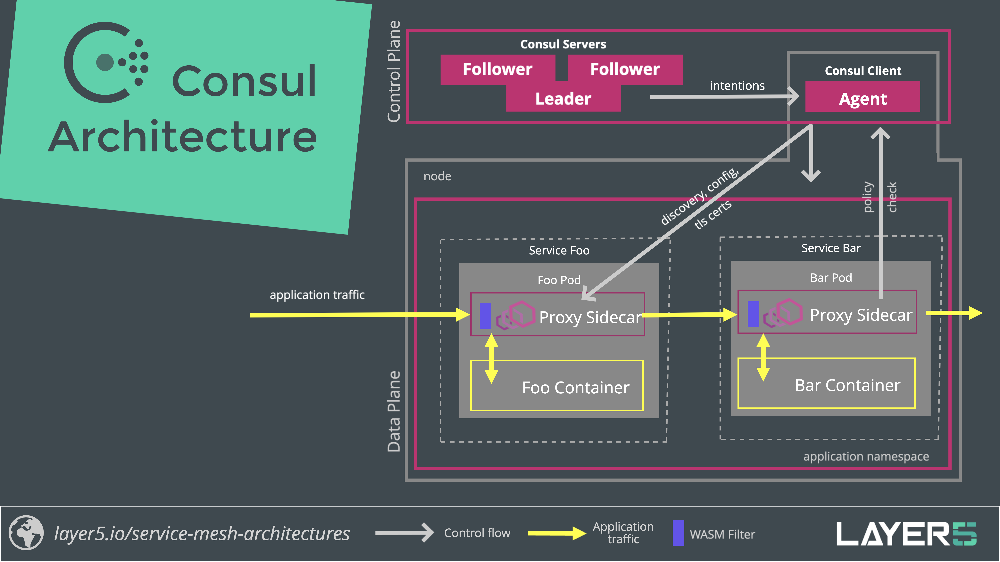

# Meshery Adapter for Consul

Source: /pr-preview/pr-21670/extensions/adapters/consul/

### Features

1. Lifecycle management of Consul
1. Lifecycle management of sample applications
1. Performance management of Consul and it workloads
   - Prometheus and Grafana integration
1. Configuration management and best practices of Consul
1. Custom configuration

### Sample Applications

Meshery supports the deployment of a variety of sample applications on Meshery Adapter for Consul. Use Meshery to deploy any of these sample applications.

- httpbin
  - Httpbin is a simple HTTP request and response service.
- Bookinfo
  - The sample BookInfo application displays information about a book, similar to a single catalog entry of an online book store.
- Image Hub
  - Image Hub is a sample application written to run on Consul for exploring WebAssembly modules used as Envoy filters.

### Performance management of Consul and it workloads

#### Prometheus and Grafana integration

The Meshery Adapter for Consul will connect to Meshery Adapter for Consul's Prometheus and Grafana instances running in the control plane (typically found in a separate namespace) or other instances to which Meshery has network reachability.

### Architecture

### Suggested Topics

- Examine [Meshery's architecture](/pr-preview/pr-21670/concepts/architecture/) and how adapters fit in as a component.
- Learn more about [Meshery Adapters](/pr-preview/pr-21670/concepts/architecture/adapters/).
